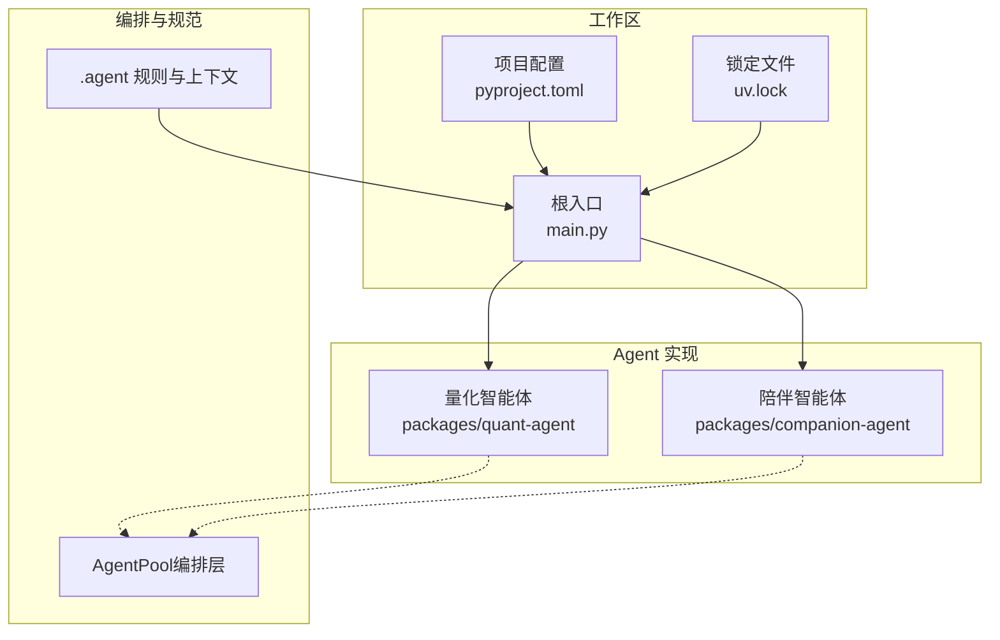
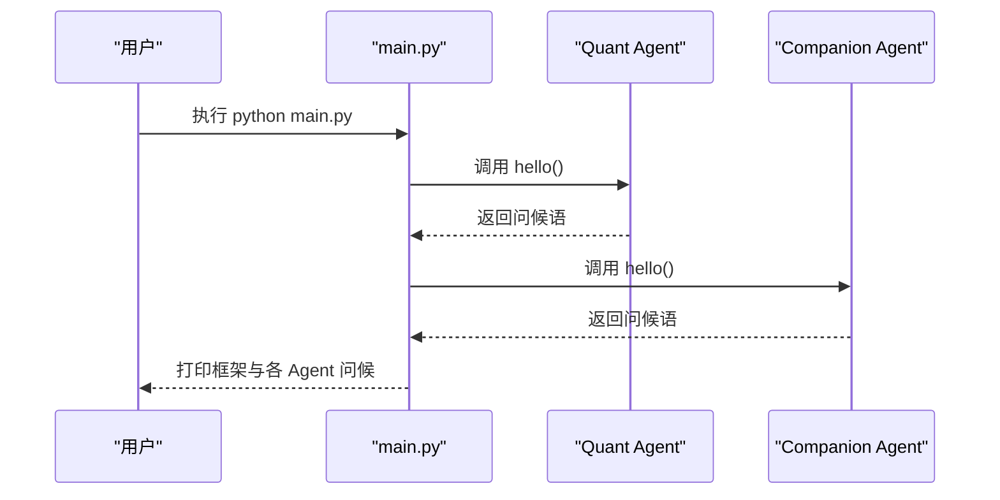
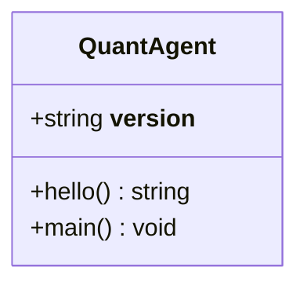
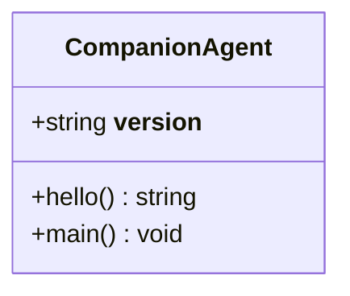
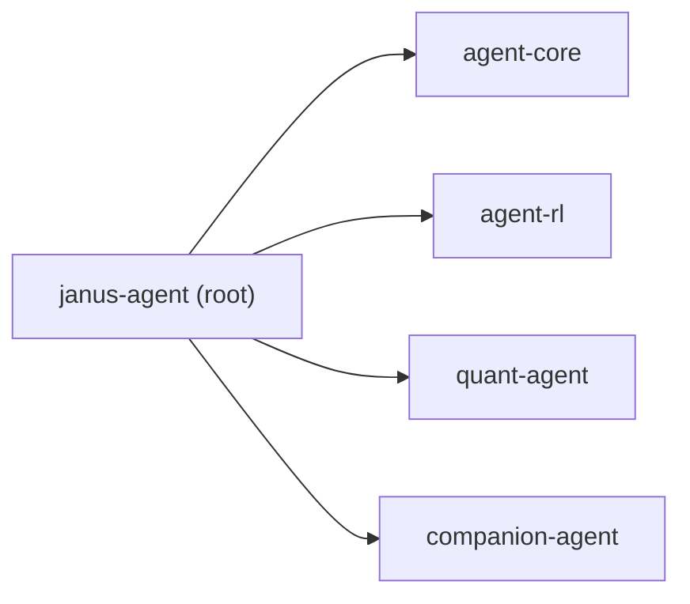

# Agentic 量化交易调研

<cite>
**本文引用的文件**   
- [main.py](file://main.py)
- [pyproject.toml](file://pyproject.toml)
- [uv.lock](file://uv.lock)
- [AGENT.md](file://.agent/AGENT.md)
- [project.md](file://.agent/context/project.md)
- [quant-agent README.md](file://packages/quant-agent/README.md)
- [companion-agent README.md](file://packages/companion-agent/README.md)
- [quant-agent __init__.py](file://packages/quant-agent/src/quant_agent/__init__.py)
- [companion-agent __init__.py](file://packages/companion-agent/src/companion_agent/__init__.py)
- [Agentic量化交易调研.md](file://docs/survey/Agentic量化交易/Agentic量化交易调研.md)
</cite>

## 目录
1. [引言](#引言)
2. [项目结构](#项目结构)
3. [核心组件](#核心组件)
4. [架构总览](#架构总览)
5. [详细组件分析](#详细组件分析)
6. [依赖关系分析](#依赖关系分析)
7. [性能与可靠性考量](#性能与可靠性考量)
8. [故障排查指南](#故障排查指南)
9. [结论](#结论)
10. [附录](#附录)

## 引言
本调研聚焦“智能体驱动的量化交易（Agentic Quantitative Trading）”，结合仓库内现有工程骨架与外部代表性开源项目、学术成果与中文社区解读，提炼其核心主张、架构范式与工程实践，并给出对 JanusAgent 中 quant-agent 的落地启示。内容遵循“背景 → 时间线 → 核心主张/结构 → 验证来源链接”的固定模板，确保事实可追溯。

## 项目结构
JanusAgent 采用 UV Workspace 组织四个子包：agent-core、agent-rl、quant-agent、companion-agent；根入口 main.py 负责编排两个 Agent 的启动与输出。AgentPool 作为统一编排层，桥接 ACP、AG-UI、MCP、OpenCode 等协议，使不同 Agent 可通过统一接口暴露能力。

图示来源
- [main.py:1-13](file://main.py#L1-L13)
- [pyproject.toml:1-30](file://pyproject.toml#L1-L30)
- [uv.lock:2158-2195](file://uv.lock#L2158-L2195)
- [project.md:52-93](file://.agent/context/project.md#L52-L93)

章节来源
- [main.py:1-13](file://main.py#L1-L13)
- [pyproject.toml:1-30](file://pyproject.toml#L1-L30)
- [uv.lock:2158-2195](file://uv.lock#L2158-L2195)
- [.agent/AGENT.md:1-142](file://.agent/AGENT.md#L1-L142)
- [.agent/context/project.md:52-137](file://.agent/context/project.md#L52-L137)

## 核心组件
- 根入口 main.py：打印框架标识并调用各 Agent 的 hello 方法，完成最小化编排。
- quant-agent：面向数据驱动的投资决策，提供市场数据、策略定义与回测框架。
- companion-agent：面向自然、共情的对话体验，提供对话管理、记忆存储与多轮交互能力。
- AgentPool：统一编排层，支持 YAML 配置、多协议接入、结构化输出与技能命令。

章节来源
- [main.py:1-13](file://main.py#L1-L13)
- [quant-agent README.md:1-16](file://packages/quant-agent/README.md#L1-L16)
- [companion-agent README.md:1-16](file://packages/companion-agent/README.md#L1-L16)
- [.agent/context/project.md:77-93](file://.agent/context/project.md#L77-L93)

## 架构总览
从运行期看，main.py 作为进程入口，分别导入并调用 quant-agent 与 companion-agent 的 hello 函数；在更完整的形态下，两者通过 AgentPool 进行任务编排与协议适配。

图示来源
- [main.py:1-13](file://main.py#L1-L13)
- [quant-agent __init__.py:1-15](file://packages/quant-agent/src/quant_agent/__init__.py#L1-L15)
- [companion-agent __init__.py:1-15](file://packages/companion-agent/src/companion_agent/__init__.py#L1-L15)

## 详细组件分析

### 量化智能体（quant-agent）
- 定位：理性之面，面向市场数据、策略与回测。
- 入口：__init__.py 暴露 hello/main，便于被 main.py 直接调用。
- 开发方式：按 README 指引使用 uv sync 安装依赖并通过 uv run 运行。

图示来源
- [quant-agent __init__.py:1-15](file://packages/quant-agent/src/quant_agent/__init__.py#L1-L15)
- [quant-agent README.md:1-16](file://packages/quant-agent/README.md#L1-L16)

章节来源
- [quant-agent README.md:1-16](file://packages/quant-agent/README.md#L1-L16)
- [quant-agent __init__.py:1-15](file://packages/quant-agent/src/quant_agent/__init__.py#L1-L15)

### 陪伴智能体（companion-agent）
- 定位：感性之面，面向对话、记忆与共情。
- 入口：__init__.py 暴露 hello/main，便于被 main.py 直接调用。
- 开发方式：按 README 指引使用 uv sync 安装依赖并通过 uv run 运行。

图示来源
- [companion-agent __init__.py:1-15](file://packages/companion-agent/src/companion_agent/__init__.py#L1-L15)
- [companion-agent README.md:1-16](file://packages/companion-agent/README.md#L1-L16)

章节来源
- [companion-agent README.md:1-16](file://packages/companion-agent/README.md#L1-L16)
- [companion-agent __init__.py:1-15](file://packages/companion-agent/src/companion_agent/__init__.py#L1-L15)

### 编排层（AgentPool）
- 职责：YAML 配置异构 AI Agent，桥接 ACP/AG-UI/MCP/OpenCode，支持多 Agent 协作、结构化输出与技能命令。
- 设计要点：协议无关、YAML 优先、流式 TTS 支持。

章节来源
- [.agent/context/project.md:77-93](file://.agent/context/project.md#L77-L93)

### 外部生态与工程范式（Agentic 量化交易调研）
本节基于仓库内调研文档，总结代表性项目与工程范式，并映射到 quant-agent 的改进方向。

- 代表性项目
  - TradingAgents：以“交易公司”为隐喻的多智能体研究框架，强调角色分工与结构化辩论。
  - Vibe-Trading：个人交易智能体与研究工作台，主打自然语言驱动、Swarm 团队、影子账户与安全护栏。
  - QUANTSKILLS：开放量化 Skill/Agent 社区，强调可检索、可安装、可验证的标准化资产与三级验证等级。

- 工程范式（Harness Engineering for Quants）
  - 核心命题：Agent = 模型 + Harness；可靠性由 Harness 构建。
  - 11 个原语：指令层、上下文交付与管理、工具接口、执行环境、持久状态、编排、子 Agent、技能与程序、验证与可观测性、Harness 演化。
  - 六大失败模式与修复：前视偏差、长会话溢出、重复造轮子、静默工具失败、子 Agent 不一致、未经验证的完成。

- 对 quant-agent 的启示
  - 角色与辩论范式：借鉴 TradingAgents 的分析→多空辩论→交易→风控终审分层。
  - 记忆回灌：仿照决策日志与反思沉淀，形成“越用越好”的经验闭环。
  - Skill 化与可验证：引入 SKILL.md/AGENTS.md 与三级验证，强制无未来函数检查。
  - 安全护栏：mandate + kill switch + 审计台账作为自主下单前置约束。
  - 数据接地与工具优先：所有事实性判断必须来自工具/数据源。

章节来源
- [Agentic量化交易调研.md:1-305](file://docs/survey/Agentic量化交易/Agentic量化交易调研.md#L1-L305)

## 依赖关系分析
- 工作区成员：agent-core、agent-rl、quant-agent、companion-agent。
- 根项目依赖：上述四个包均以 workspace 形式声明并解析。
- 锁定文件：uv.lock 记录了各包的 editable 来源与版本信息。

图示来源
- [pyproject.toml:1-30](file://pyproject.toml#L1-L30)
- [uv.lock:2158-2195](file://uv.lock#L2158-L2195)

章节来源
- [pyproject.toml:1-30](file://pyproject.toml#L1-L30)
- [uv.lock:2158-2195](file://uv.lock#L2158-L2195)

## 性能与可靠性考量
- 非确定性：LLM 采样导致结果不可字节级复现，回测数字不可作为策略承诺。
- 数据时效与前视偏差：实时数据变化与未来函数是首要工程风险，需通过工具接口与校验门禁规避。
- 安全边界前置：mandate、kill switch、审计台账与只读默认，将“自主交易”关进可控笼子。
- 可验证与防作弊：无未来函数检查、AST 纯度门禁、断网测试、随机对照，直击过拟合与选择偏差。

[本节为通用指导，不直接分析具体文件]

## 故障排查指南
- 运行入口问题：确认 main.py 能正确导入 quant-agent 与 companion-agent，且各自 __init__.py 暴露了 hello 函数。
- 依赖解析问题：检查 pyproject.toml 的 workspace members 与 uv.lock 是否一致，必要时重新 uv sync。
- 协议与编排：若启用 AgentPool，核对 YAML 配置与协议绑定是否正确，关注结构化输出与技能命令注册。

章节来源
- [main.py:1-13](file://main.py#L1-L13)
- [quant-agent __init__.py:1-15](file://packages/quant-agent/src/quant_agent/__init__.py#L1-L15)
- [companion-agent __init__.py:1-15](file://packages/companion-agent/src/companion_agent/__init__.py#L1-L15)
- [pyproject.toml:14-17](file://pyproject.toml#L14-L17)
- [uv.lock:2158-2195](file://uv.lock#L2158-L2195)

## 结论
本调研表明，Agentic 量化交易的核心在于“以 Agent 为中心的工程化体系”：通过角色分解、记忆与反思、工具优先与强验证，把“自然语言意图 → 可执行策略 → 回测验证 → 风险管控”全链路自动化。对 JanusAgent 的 quant-agent，建议优先补齐 Harness 层的 11 原语能力，并以 QUANTSKILLS 的验证等级与 TradingAgents/Vibe-Trading 的安全护栏为参照，逐步完善因子库、回测协议、审计与可观测性。

[本节为总结性内容，不直接分析具体文件]

## 附录
- 术语说明
  - Harness Engineering：围绕 Agent 的运行环境与约束体系，强调“错误工程化修复”。
  - Mandate/Kill Switch/Audit Ledger：交易授权、急停与审计台账，构成安全三件套。
  - Look-ahead Bias：未来函数偏差，回测中最常见的系统性错误之一。

[本节为概念补充，不直接分析具体文件]