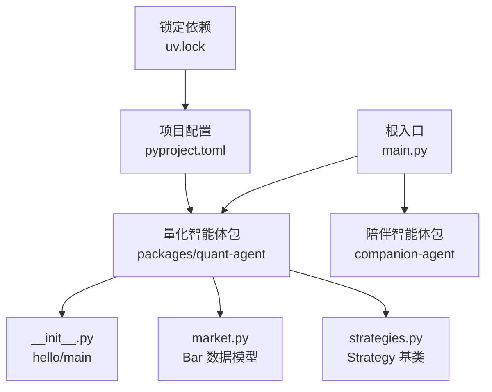
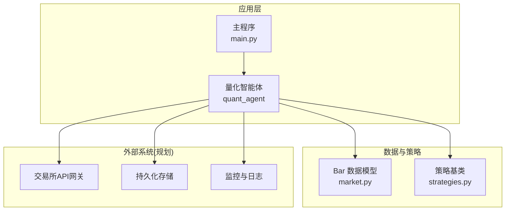
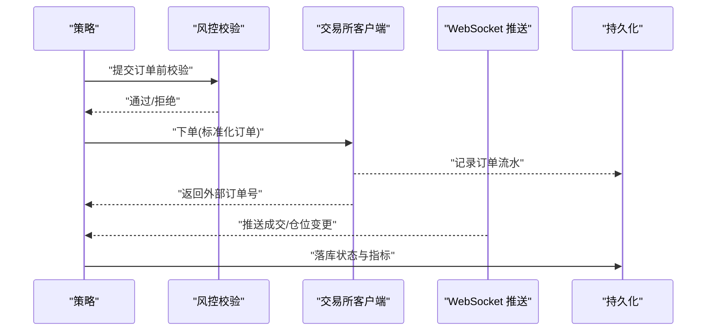
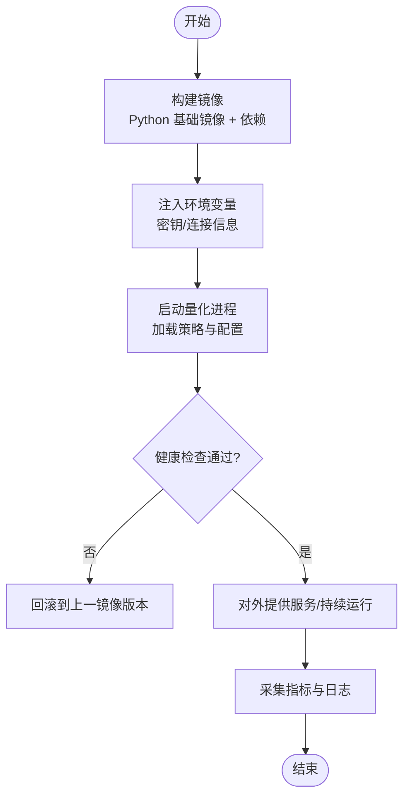
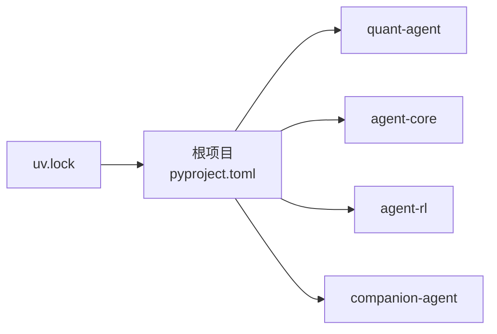

# 集成与部署

<cite>
**本文引用的文件**   
- [main.py](file://main.py)
- [pyproject.toml](file://pyproject.toml)
- [uv.lock](file://uv.lock)
- [packages/quant-agent/README.md](file://packages/quant-agent/README.md)
- [packages/quant-agent/src/quant_agent/__init__.py](file://packages/quant-agent/src/quant_agent/__init__.py)
- [packages/quant-agent/src/quant_agent/market.py](file://packages/quant-agent/src/quant_agent/market.py)
- [packages/quant-agent/src/quant_agent/strategies.py](file://packages/quant-agent/src/quant_agent/strategies.py)
</cite>

## 目录
1. [简介](#简介)
2. [项目结构](#项目结构)
3. [核心组件](#核心组件)
4. [架构总览](#架构总览)
5. [详细组件分析](#详细组件分析)
6. [依赖分析](#依赖分析)
7. [性能考虑](#性能考虑)
8. [故障排除指南](#故障排除指南)
9. [结论](#结论)
10. [附录](#附录)

## 简介
本指南面向量化交易智能体的集成与部署，聚焦以下目标：
- 外部交易平台 API 集成方式（认证、下单、状态同步）
- 配置文件结构（数据源、策略参数、风控规则）
- Docker 容器化部署（镜像构建、环境变量、服务编排）
- 生产监控与日志收集（关键指标、异常告警）
- 版本管理与更新流程（策略升级、数据迁移注意事项）
- 故障排除与常见问题

说明：当前仓库处于早期阶段，量化模块提供市场数据结构与策略骨架，尚未包含实盘交易与外部平台对接实现。因此，本节与后续章节在“现有代码”基础上给出可落地的集成与部署方案建议，并明确标注哪些为“建议实践”，以便在后续迭代中逐步落地。

## 项目结构
仓库采用多包工作区组织，根入口 main.py 聚合各子包能力；量化相关逻辑位于 packages/quant-agent。

图示来源
- [main.py:1-13](file://main.py#L1-L13)
- [packages/quant-agent/src/quant_agent/__init__.py:1-15](file://packages/quant-agent/src/quant_agent/__init__.py#L1-L15)
- [packages/quant-agent/src/quant_agent/market.py:1-16](file://packages/quant-agent/src/quant_agent/market.py#L1-L16)
- [packages/quant-agent/src/quant_agent/strategies.py:1-13](file://packages/quant-agent/src/quant_agent/strategies.py#L1-L13)
- [pyproject.toml:1-30](file://pyproject.toml#L1-L30)
- [uv.lock:4370-4384](file://uv.lock#L4370-L4384)

章节来源
- [main.py:1-13](file://main.py#L1-L13)
- [pyproject.toml:1-30](file://pyproject.toml#L1-L30)
- [packages/quant-agent/README.md:1-16](file://packages/quant-agent/README.md#L1-L16)

## 核心组件
- 量化智能体入口与版本信息：定义 hello 与 main，便于独立运行与诊断。
- 市场数据模型 Bar：统一 K 线/Bar 字段，作为策略输入的基础结构。
- 策略抽象 Strategy：定义 run 接口，供具体策略继承实现。

章节来源
- [packages/quant-agent/src/quant_agent/__init__.py:1-15](file://packages/quant-agent/src/quant_agent/__init__.py#L1-L15)
- [packages/quant-agent/src/quant_agent/market.py:1-16](file://packages/quant-agent/src/quant_agent/market.py#L1-L16)
- [packages/quant-agent/src/quant_agent/strategies.py:1-13](file://packages/quant-agent/src/quant_agent/strategies.py#L1-L13)

## 架构总览
从现有代码看，系统由“根入口 + 量化子包”构成。未来扩展方向包括：
- 接入外部交易所 API（行情订阅、订单提交、持仓与成交回报）
- 策略执行引擎（信号生成、风控校验、订单路由）
- 配置中心与环境变量管理
- 容器化与服务编排（Docker Compose/Kubernetes）
- 监控与日志（指标采集、结构化日志、告警）

图示来源
- [main.py:1-13](file://main.py#L1-L13)
- [packages/quant-agent/src/quant_agent/__init__.py:1-15](file://packages/quant-agent/src/quant_agent/__init__.py#L1-L15)
- [packages/quant-agent/src/quant_agent/market.py:1-16](file://packages/quant-agent/src/quant_agent/market.py#L1-L16)
- [packages/quant-agent/src/quant_agent/strategies.py:1-13](file://packages/quant-agent/src/quant_agent/strategies.py#L1-L13)

## 详细组件分析

### 量化智能体入口
- 职责：打印问候语、暴露命令行入口，便于本地调试与容器内启动。
- 关键点：版本号与 hello 输出可用于健康检查与版本识别。

章节来源
- [packages/quant-agent/src/quant_agent/__init__.py:1-15](file://packages/quant-agent/src/quant_agent/__init__.py#L1-L15)
- [main.py:1-13](file://main.py#L1-L13)

### 市场数据模型 Bar
- 字段：symbol、timestamp、open、high、low、close、volume。
- 用途：作为策略输入的统一时间序列单元，便于回测与在线处理。

章节来源
- [packages/quant-agent/src/quant_agent/market.py:1-16](file://packages/quant-agent/src/quant_agent/market.py#L1-L16)

### 策略基类 Strategy
- 方法：run 抽象方法，要求子类实现具体交易逻辑。
- 扩展点：可在 run 中调用行情、风控、下单等子系统。

章节来源
- [packages/quant-agent/src/quant_agent/strategies.py:1-13](file://packages/quant-agent/src/quant_agent/strategies.py#L1-L13)

### 外部交易平台 API 集成（建议实践）
说明：当前仓库未包含交易所客户端实现。以下为推荐架构与步骤，便于后续开发落地。

- 认证机制
  - 使用环境变量注入 API Key/Secret，避免硬编码。
  - 支持签名算法（如 HMAC-SHA256），按交易所规范构造请求头与签名字符串。
  - Token 刷新与重试：对短期令牌实现自动续期与幂等重试。

- 订单提交
  - 标准化订单对象（方向、数量、价格类型、止损止盈、滑点容忍）。
  - 前置风控：资金占用、单笔/日累计限额、涨跌停限制、频率限制。
  - 幂等与去重：基于外部订单号或内部流水号保证重复提交安全。

- 状态同步
  - 推送与轮询结合：优先使用 WebSocket 推送成交/仓位变化，辅以 REST 拉取兜底。
  - 事件驱动：将成交、撤单、部分成交等事件写入事件总线，供策略与风控消费。
  - 一致性保障：本地状态与交易所状态定期比对，发现漂移时触发修复流程。

图示来源
- [packages/quant-agent/src/quant_agent/strategies.py:1-13](file://packages/quant-agent/src/quant_agent/strategies.py#L1-L13)
- [packages/quant-agent/src/quant_agent/market.py:1-16](file://packages/quant-agent/src/quant_agent/market.py#L1-L16)

### 配置文件结构（建议实践）
说明：当前仓库未提供专用配置文件。建议采用“环境变量 + 可选 YAML/JSON 配置”的组合方式，敏感项一律走环境变量。

- 数据源配置
  - 交易所连接：host、port、scheme、api_key、api_secret、token_refresh_interval。
  - 行情源：REST/WebSocket 地址、鉴权、限流策略。
  - 数据库：连接字符串、池大小、超时、SSL。

- 策略参数
  - 策略名、周期、标的列表、入场/出场阈值、仓位控制、回撤保护。
  - 回测开关、模拟盘开关、实盘开关（互斥）。

- 风控规则
  - 单笔最大金额、日最大亏损、最大持仓、最大并发订单数、熔断阈值。
  - 黑名单标的、时段限制、波动率过滤。

- 运行时配置
  - 日志级别、采样率、是否开启结构化日志。
  - 监控上报间隔、指标命名空间。

章节来源
- [pyproject.toml:1-30](file://pyproject.toml#L1-L30)
- [uv.lock:4370-4384](file://uv.lock#L4370-L4384)

### Docker 容器化部署（建议实践）
说明：仓库未提供 Dockerfile 与编排文件。以下为通用方案，可按需落地。

- 镜像构建
  - 基础镜像：选择官方 Python 镜像，固定小版本。
  - 依赖安装：使用 uv/pip 安装 pyproject 指定依赖，缓存层优化。
  - 非 root 用户运行，最小权限原则。

- 环境变量配置
  - 所有密钥与敏感信息通过环境变量注入。
  - 提供 .env.example 模板，区分 dev/staging/prod。

- 服务编排
  - 使用 docker-compose 编排量化进程、数据库、消息队列、监控组件。
  - 健康检查：基于 quant_agent.hello 或新增 /health 端点。
  - 资源限制：CPU/内存上限、重启策略。

### 生产监控与日志收集（建议实践）
- 关键指标
  - 业务：订单成功率、延迟分布、成交转化率、持仓盈亏、回撤。
  - 系统：CPU/内存/磁盘/网络、JVM/Python GC、线程池利用率。
  - 外部：交易所 API 错误码分布、限流次数、重连次数。

- 日志策略
  - 结构化 JSON 日志，包含 trace_id、strategy_id、order_id、risk_result。
  - 分级输出：INFO/WARN/ERROR，敏感字段脱敏。
  - 集中采集：Filebeat/Fluent Bit -> Kafka/ES/云日志服务。

- 告警规则
  - 错误率突增、订单失败率超阈、长时间无心跳、资金异常变动。
  - 通知渠道：企业微信/钉钉/邮件/短信，分级响应。

### 版本管理与更新流程（建议实践）
- 版本标识
  - 语义化版本（主.次.修订），在 __init__.py 中维护版本号。
  - 发布标签与制品归档，保留回滚快照。

- 灰度与回滚
  - 蓝绿/金丝雀发布，先小流量验证策略与风控。
  - 一键回滚：切换镜像版本，恢复旧配置与数据。

- 数据迁移
  - 增量迁移脚本，幂等执行，失败自动回滚。
  - 兼容新旧 schema，双写过渡期后切读。

章节来源
- [packages/quant-agent/src/quant_agent/__init__.py:1-15](file://packages/quant-agent/src/quant_agent/__init__.py#L1-L15)

## 依赖分析
- 工作区成员：pyproject.toml 声明 workspace members 指向 packages/*。
- 顶层依赖：quant-agent、agent-core、agent-rl、companion-agent。
- 运行时依赖：uv.lock 中包含 python-dotenv、python-json-logger 等，表明项目具备环境变量加载与结构化日志能力。

图示来源
- [pyproject.toml:1-30](file://pyproject.toml#L1-L30)
- [uv.lock:4370-4384](file://uv.lock#L4370-L4384)

章节来源
- [pyproject.toml:1-30](file://pyproject.toml#L1-L30)
- [uv.lock:4370-4384](file://uv.lock#L4370-L4384)

## 性能考虑
- 数据模型轻量：Bar 使用 dataclass，序列化开销低，适合高频场景。
- 策略执行：建议异步 I/O 与事件驱动，减少阻塞；对热点路径做批处理与缓存。
- 外部 API：连接复用、指数退避重试、批量请求合并。
- 资源隔离：容器级 CPU/内存限制，避免争抢导致抖动。

## 故障排除指南
- 启动失败
  - 检查环境变量是否缺失（API Key、数据库连接等）。
  - 确认依赖已安装且版本匹配（uv.lock 锁定）。
- 策略不生效
  - 确认策略类正确继承 Strategy 并实现 run。
  - 检查配置加载顺序与默认值覆盖。
- 下单失败
  - 核对签名与时间戳，关注限流与白名单。
  - 查看风控拦截原因（额度、频率、黑名单）。
- 状态不同步
  - 对比本地与交易所订单状态，定位推送丢失或网络抖动。
  - 增加补偿任务，定时拉取并修正差异。

章节来源
- [packages/quant-agent/src/quant_agent/strategies.py:1-13](file://packages/quant-agent/src/quant_agent/strategies.py#L1-L13)
- [packages/quant-agent/src/quant_agent/market.py:1-16](file://packages/quant-agent/src/quant_agent/market.py#L1-L16)
- [uv.lock:4370-4384](file://uv.lock#L4370-L4384)

## 结论
当前仓库提供了量化智能体的基础骨架与数据模型，具备向实盘集成的良好起点。建议在后续迭代中优先补齐：
- 交易所客户端与事件总线
- 配置中心与环境变量治理
- 容器化与编排
- 监控与日志体系
- 版本管理与灰度发布流程

## 附录
- 快速运行
  - 参考 quant-agent README 中的开发与运行说明，使用 uv 工具链进行依赖管理与运行。

章节来源
- [packages/quant-agent/README.md:1-16](file://packages/quant-agent/README.md#L1-L16)