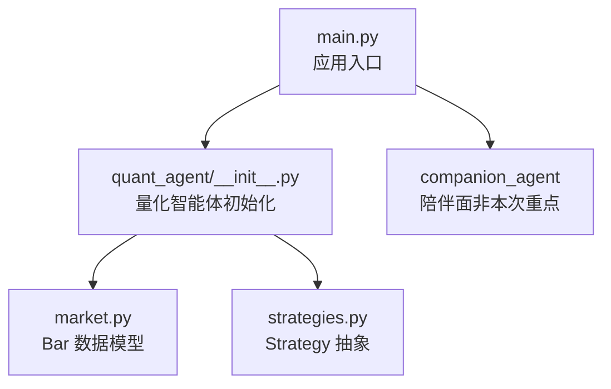
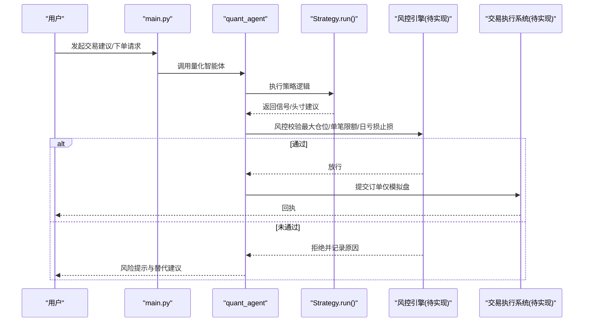
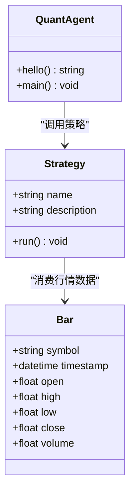

# 风险管理系统

<cite>
**本文引用的文件**   
- [main.py](file://main.py)
- [quant_agent/__init__.py](file://packages/quant-agent/src/quant_agent/__init__.py)
- [market.py](file://packages/quant-agent/src/quant_agent/market.py)
- [strategies.py](file://packages/quant-agent/src/quant_agent/strategies.py)
- [README.md](file://packages/quant-agent/README.md)
- [roadmap.html](file://docs/plans/roadmap.html)
- [todolist.html](file://docs/plans/todolist.html)
- [coding.md](file://.agent/rules/coding.md)
</cite>

## 目录
1. [引言](#引言)
2. [项目结构](#项目结构)
3. [核心组件](#核心组件)
4. [架构总览](#架构总览)
5. [详细组件分析](#详细组件分析)
6. [依赖关系分析](#依赖关系分析)
7. [性能考虑](#性能考虑)
8. [故障排查指南](#故障排查指南)
9. [结论](#结论)
10. [附录](#附录)

## 引言
本技术文档面向“风险管理系统”的规划与实现，覆盖风险控制规则配置与管理、仓位控制算法（凯利公式、波动率调整、风险平价）、实时监控模块、风险报告生成机制、与交易执行系统的集成方式，以及风险参数的动态调整与优化建议。当前代码库处于早期阶段，已具备量化智能体的基础骨架（市场数据模型、策略基类、入口程序），风险管理能力将在后续迭代中逐步落地。

## 项目结构
仓库采用多包组织，量化相关能力集中在 quant-agent 包内；主入口 main.py 聚合多个子包并启动应用。当前与风险管理直接相关的代码包括：
- 市场数据模型 Bar（用于构建行情输入）
- 策略抽象 Strategy（为风控与策略扩展提供接口）
- 入口程序 main.py（组合各子包能力）

图表来源
- [main.py:1-13](file://main.py#L1-L13)
- [quant_agent/__init__.py:1-15](file://packages/quant-agent/src/quant_agent/__init__.py#L1-L15)
- [market.py:1-16](file://packages/quant-agent/src/quant_agent/market.py#L1-L16)
- [strategies.py:1-13](file://packages/quant-agent/src/quant_agent/strategies.py#L1-L13)

章节来源
- [main.py:1-13](file://main.py#L1-L13)
- [quant_agent/__init__.py:1-15](file://packages/quant-agent/src/quant_agent/__init__.py#L1-L15)
- [market.py:1-16](file://packages/quant-agent/src/quant_agent/market.py#L1-L16)
- [strategies.py:1-13](file://packages/quant-agent/src/quant_agent/strategies.py#L1-L13)
- [README.md:1-16](file://packages/quant-agent/README.md#L1-L16)

## 核心组件
- 市场数据模型 Bar：定义单根 K 线的基本字段（标的、时间、开高低收、成交量），是后续风险指标计算的基础输入。
- 策略抽象 Strategy：提供统一的 run 接口，便于在策略执行前后嵌入风控检查点。
- 应用入口 main.py：负责加载与协调各子包能力，未来可扩展为编排“查行情 → 分析 → 回测 → 建议 → 风控拦截”的流程。

章节来源
- [market.py:1-16](file://packages/quant-agent/src/quant_agent/market.py#L1-L16)
- [strategies.py:1-13](file://packages/quant-agent/src/quant_agent/strategies.py#L1-L13)
- [main.py:1-13](file://main.py#L1-L13)

## 架构总览
下图展示从“策略/风控”到“执行”的高层流程，结合路线图中的“风险红线 hook”要求，强调在下单前进行风控拦截与模拟盘声明。

图表来源
- [main.py:1-13](file://main.py#L1-L13)
- [quant_agent/__init__.py:1-15](file://packages/quant-agent/src/quant_agent/__init__.py#L1-L15)
- [strategies.py:1-13](file://packages/quant-agent/src/quant_agent/strategies.py#L1-L13)
- [roadmap.html:378-385](file://docs/plans/roadmap.html#L378-L385)
- [todolist.html:222-226](file://docs/plans/todolist.html#L222-L226)

## 详细组件分析

### 风险控制规则配置与管理
- 目标
  - 最大仓位限制：基于账户净值或可用资金的比例上限，防止过度集中。
  - 单笔交易限额：对单次下单规模设置阈值，避免异常大额冲击。
  - 日亏损止损：按日累计亏损达到阈值时触发降仓或停止新增风险敞口。
- 配置要点
  - 参数来源：配置文件/环境变量/画像（用户风险偏好）。
  - 生效范围：全局/品种/策略维度可分层控制。
  - 变更审计：所有参数修改需留痕并可回溯。
- 实施建议
  - 将风控规则封装为独立服务，策略在执行前统一调用。
  - 支持热更新与灰度发布，确保生产环境稳定。

章节来源
- [roadmap.html:378-385](file://docs/plans/roadmap.html#L378-L385)
- [todolist.html:222-226](file://docs/plans/todolist.html#L222-L226)

### 仓位控制算法
- 凯利公式
  - 用途：根据胜率与赔率估算最优下注比例，作为仓位上限参考。
  - 注意：历史估计偏差与滑点会放大尾部风险，需做平滑与截断。
- 波动率调整
  - 思路：以波动率为分母缩放仓位，高波动降低仓位，低波动适度提升。
  - 实现：使用滚动窗口标准差或已实现波动率，结合流动性约束。
- 风险平价
  - 思想：使各资产/因子对组合风险的贡献相等，降低单一风险源主导。
  - 步骤：估计协方差矩阵 → 求解风险贡献权重 → 映射到头寸。
- 工程化要点
  - 数值稳定性：协方差矩阵正则化、极端值处理。
  - 实时性：增量更新统计量，避免全量重算。
  - 回测验证：在不同市场 regime 下评估稳健性。

[本节为通用方法论说明，不直接分析具体源码文件]

### 实时监控模块
- 持仓监控
  - 指标：名义敞口、净敞口、杠杆倍数、集中度、VaR/CVaR。
  - 频率：逐笔/逐分钟级刷新，关键指标告警。
- 市场风险预警
  - 触发条件：价格跳空、波动率骤升、相关性突变、流动性枯竭。
  - 动作：降级策略、收紧风控、提示人工介入。
- 流动性风险评估
  - 指标：买卖价差、深度、成交占比、冲击成本估算。
  - 联动：当流动性不足时自动下调仓位上限。

[本节为通用方法论说明，不直接分析具体源码文件]

### 风险报告生成机制
- 风险敞口分析
  - 内容：按资产/策略/因子维度的敞口分布与变化趋势。
- 压力测试
  - 场景：历史极端事件、假设型冲击（利率、汇率、商品价格）。
  - 输出：损失分布、尾部指标、资本缓冲需求。
- 情景分析
  - 方法：多因子情景叠加、蒙特卡洛抽样、路径依赖检验。
  - 交付：可视化报表与摘要，供投委会审阅。

[本节为通用方法论说明，不直接分析具体源码文件]

### 与交易执行系统的集成
- 订单拦截
  - 位置：策略输出后、下单前，由风控引擎统一校验。
  - 规则：最大仓位、单笔限额、日亏损止损、黑名单/白名单。
- 自动平仓逻辑
  - 触发：触及止损线、流动性恶化、合规限制。
  - 执行：分批减仓、对冲替代、暂停新开仓。
- 安全边界
  - 强制模拟盘：在未完成验收前禁止接入实盘。
  - 双人复核：重大参数变更与紧急干预需审批。

章节来源
- [roadmap.html:378-385](file://docs/plans/roadmap.html#L378-L385)
- [todolist.html:222-226](file://docs/plans/todolist.html#L222-L226)

### 风险参数的动态调整与优化建议
- 动态调整
  - 依据：波动率、流动性、回撤、夏普比率等指标反馈。
  - 机制：在线学习/贝叶斯更新，定期再校准。
- 优化建议
  - 参数搜索：网格/贝叶斯优化，结合回测与样本外检验。
  - 鲁棒性：对参数扰动进行敏感性分析，选择稳健区间。
  - 治理：版本化管理、A/B 对比、上线前回归测试。

[本节为通用方法论说明，不直接分析具体源码文件]

## 依赖关系分析
当前量化智能体模块之间耦合度较低，便于扩展风控与执行子系统。

图表来源
- [market.py:1-16](file://packages/quant-agent/src/quant_agent/market.py#L1-L16)
- [strategies.py:1-13](file://packages/quant-agent/src/quant_agent/strategies.py#L1-L13)
- [quant_agent/__init__.py:1-15](file://packages/quant-agent/src/quant_agent/__init__.py#L1-L15)

章节来源
- [market.py:1-16](file://packages/quant-agent/src/quant_agent/market.py#L1-L16)
- [strategies.py:1-13](file://packages/quant-agent/src/quant_agent/strategies.py#L1-L13)
- [quant_agent/__init__.py:1-15](file://packages/quant-agent/src/quant_agent/__init__.py#L1-L15)

## 性能考虑
- 数据流
  - 使用增量统计与滑动窗口，避免全量重算。
  - 批量计算与向量化操作，减少 Python 循环开销。
- 并发与异步
  - 行情订阅与风控计算解耦，采用消息队列或事件总线。
- 存储与缓存
  - 热点指标入内存缓存，持久化落盘异步化。
- 资源控制
  - 限流与背压，防止突发流量导致雪崩。

[本节为通用方法论说明，不直接分析具体源码文件]

## 故障排查指南
- 常见问题定位
  - 策略未实现：Strategy.run 抛出未实现异常，需补充具体策略逻辑。
  - 数据缺失：Bar 字段不完整导致指标计算失败，需校验输入。
  - 风控拦截：确认是否命中最大仓位/单笔限额/日亏损止损。
- 日志与观测
  - 关键节点埋点：策略信号、风控决策、下单回执。
  - 指标看板：延迟、错误率、拦截率、回撤曲线。
- 恢复策略
  - 快速回滚：参数与策略版本管理。
  - 降级模式：关闭高风险策略，保留基础监控。

章节来源
- [strategies.py:1-13](file://packages/quant-agent/src/quant_agent/strategies.py#L1-L13)
- [coding.md:60-65](file://.agent/rules/coding.md#L60-L65)

## 结论
当前仓库提供了量化智能体的基础骨架，为风险管理能力的扩展奠定了良好基础。下一步应优先落地风控规则与拦截机制，完善监控与报告体系，并在严格的安全边界内推进与执行系统的集成。通过参数动态调整与持续优化，逐步构建稳健的风险管理体系。

[本节为总结性内容，不直接分析具体源码文件]

## 附录
- 开发规范
  - 类型注解、错误处理、文档字符串风格遵循团队约定，有助于提高可维护性与可读性。
- 路线图与安全红线
  - 明确“仅模拟盘”原则，先完成分析与回测闭环，再考虑执行集成。

章节来源
- [coding.md:1-65](file://.agent/rules/coding.md#L1-L65)
- [roadmap.html:378-385](file://docs/plans/roadmap.html#L378-L385)
- [todolist.html:222-226](file://docs/plans/todolist.html#L222-L226)