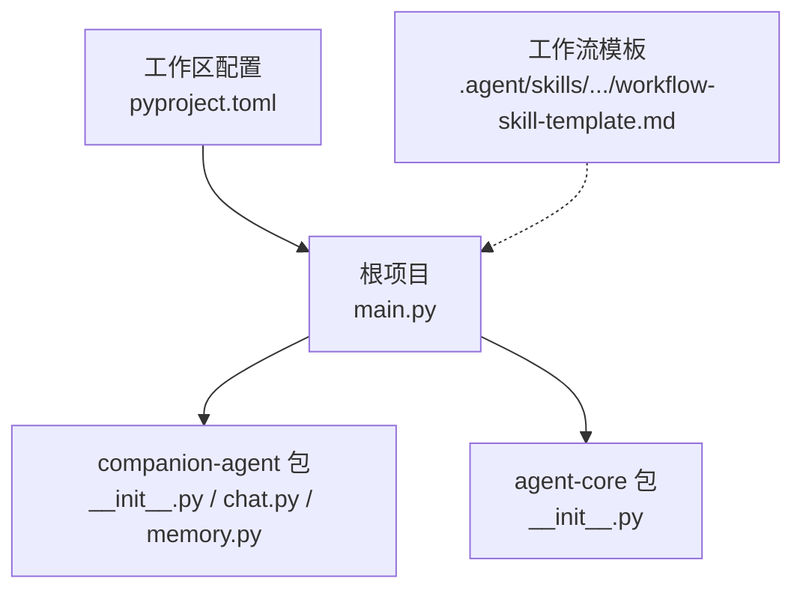
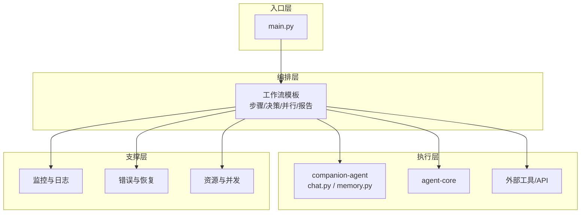
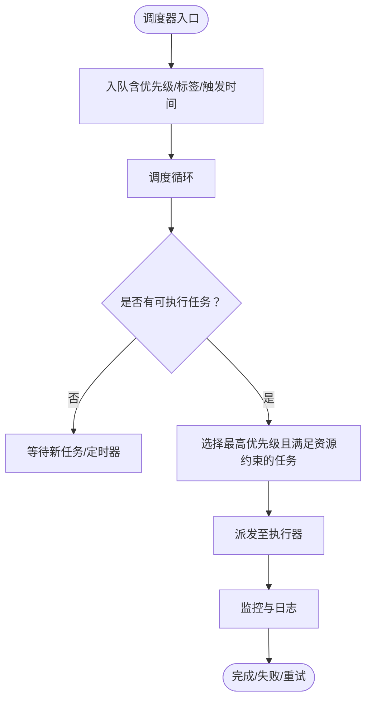
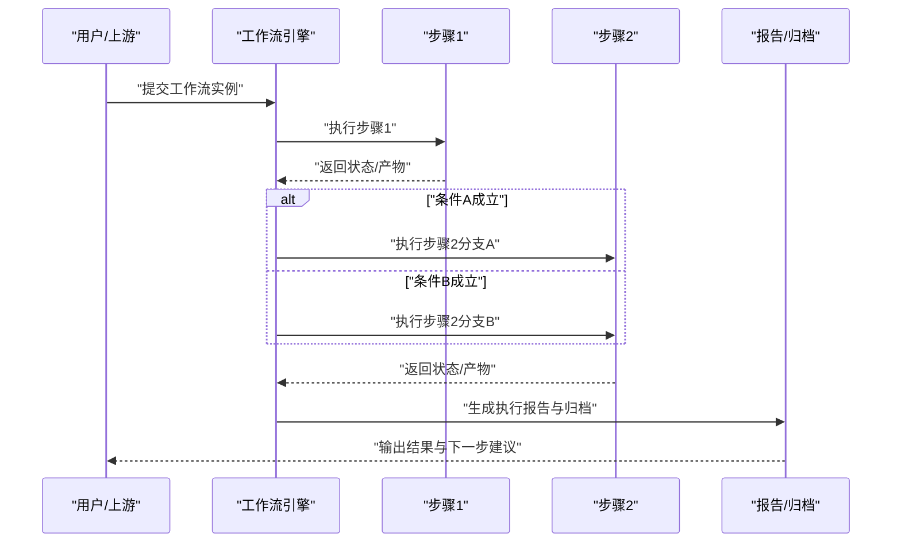
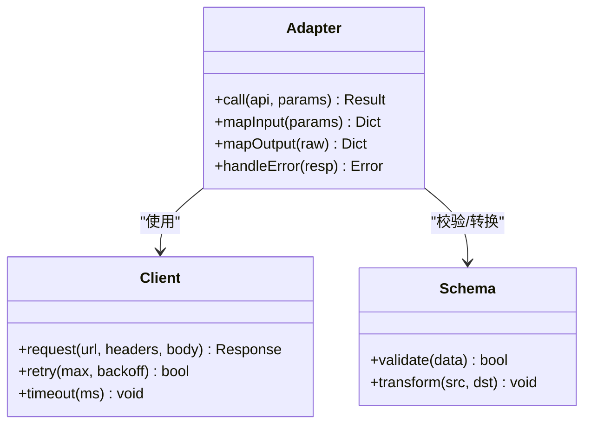
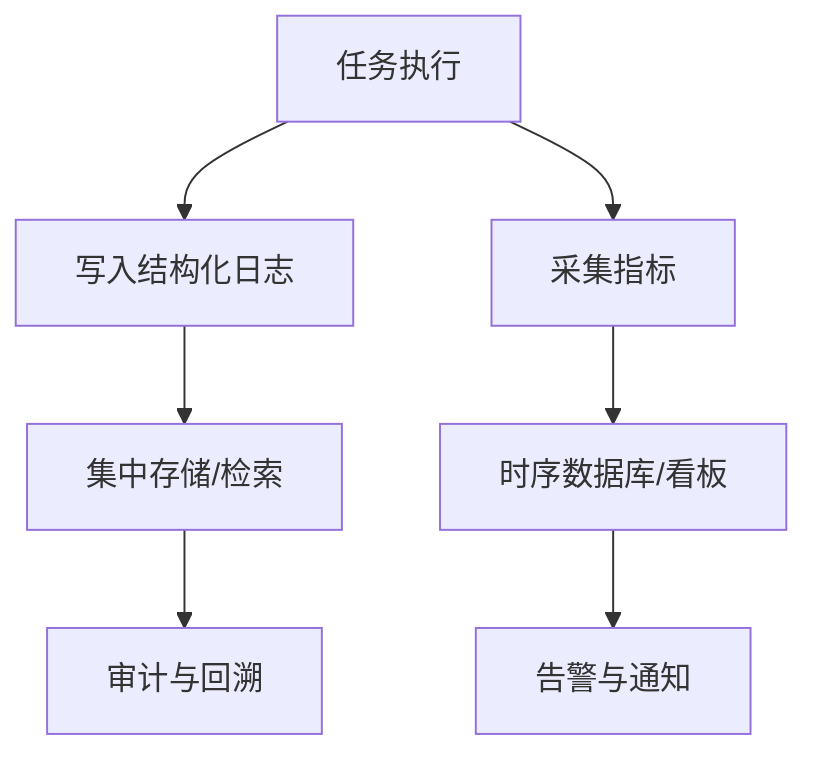
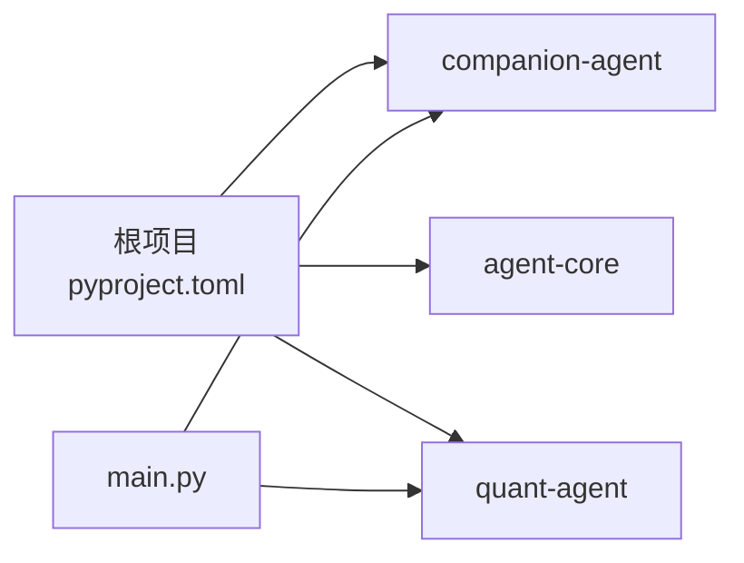

# 任务自动化

<cite>
**本文引用的文件**   
- [main.py](file://main.py)
- [pyproject.toml](file://pyproject.toml)
- [__init__.py（companion-agent）](file://packages/companion-agent/src/companion_agent/__init__.py)
- [chat.py（companion-agent）](file://packages/companion-agent/src/companion_agent/chat.py)
- [memory.py（companion-agent）](file://packages/companion-agent/src/companion_agent/memory.py)
- [__init__.py（agent-core）](file://packages/agent-core/src/agent_core/__init__.py)
- [workflow-skill-template.md](file://.agent/skills/create-skill-file/templates/workflow-skill-template.md)
</cite>

## 目录
1. [简介](#简介)
2. [项目结构](#项目结构)
3. [核心组件](#核心组件)
4. [架构总览](#架构总览)
5. [详细组件分析](#详细组件分析)
6. [依赖分析](#依赖分析)
7. [性能考虑](#性能考虑)
8. [故障排查指南](#故障排查指南)
9. [结论](#结论)
10. [附录](#附录)

## 简介
本技术文档面向“陪伴助手的任务自动化系统”，围绕以下目标展开：
- 任务调度器：任务优先级管理、资源分配与执行时机控制
- 工作流编排引擎：任务依赖解析、条件分支处理与异常恢复机制
- 外部工具集成框架：API调用封装、参数映射与结果处理
- 监控与日志：任务执行监控与日志记录设计
- 可靠性与性能：失败重试、超时处理与性能调优策略

本项目采用多包工作区组织，主入口聚合多个子包能力。当前仓库中已包含工作流模板与技能规范，可作为任务编排与执行的参考蓝图；同时提供 companion-agent 与 agent-core 等基础模块的入口与示例能力。

## 项目结构
仓库为 uv 工作区，根项目通过 pyproject.toml 声明成员包与依赖关系，main.py 作为统一入口加载并调用各子包能力。

图示来源
- [main.py:1-13](file://main.py#L1-L13)
- [pyproject.toml:1-30](file://pyproject.toml#L1-L30)
- [__init__.py（companion-agent）:1-15](file://packages/companion-agent/src/companion_agent/__init__.py#L1-L15)
- [workflow-skill-template.md:66-150](file://.agent/skills/create-skill-file/templates/workflow-skill-template.md#L66-L150)

章节来源
- [main.py:1-13](file://main.py#L1-L13)
- [pyproject.toml:1-30](file://pyproject.toml#L1-L30)

## 核心组件
- 统一入口 main.py：初始化并打印各子包的问候信息，体现多包聚合方式。
- companion-agent 包：提供情感陪伴智能体的基础能力入口，包含 hello/main 方法与对话、记忆等扩展点。
- agent-core 包：提供核心能力的最小可运行入口。
- 工作流模板：定义步骤化流程、校验、成功/失败路径、并行执行与报告输出等最佳实践，可作为任务编排与执行规范的参考。

章节来源
- [main.py:1-13](file://main.py#L1-L13)
- [__init__.py（companion-agent）:1-15](file://packages/companion-agent/src/companion_agent/__init__.py#L1-L15)
- [__init__.py（agent-core）:1-3](file://packages/agent-core/src/agent_core/__init__.py#L1-L3)
- [workflow-skill-template.md:66-150](file://.agent/skills/create-skill-file/templates/workflow-skill-template.md#L66-L150)

## 架构总览
从现有代码与工作流模板出发，可将“任务自动化系统”抽象为如下分层：
- 入口层：统一入口负责装配与启动
- 编排层：基于工作流模板定义的步骤、决策点与并行段进行编排
- 执行层：具体任务由子包或外部工具实现
- 支撑层：监控与日志、错误与恢复、资源与并发控制

图示来源
- [main.py:1-13](file://main.py#L1-L13)
- [workflow-skill-template.md:66-150](file://.agent/skills/create-skill-file/templates/workflow-skill-template.md#L66-L150)

## 详细组件分析

### 任务调度器（设计与建议）
说明：当前仓库未直接提供调度器源码，但可基于工作流模板与多包结构设计调度器。以下为推荐方案，便于后续落地。

- 任务优先级管理
  - 使用带权重的任务队列，支持动态调整优先级
  - 按业务域划分队列，避免高优先级任务饥饿低优先级任务
- 资源分配
  - 为不同任务类型绑定资源标签（CPU/GPU/IO），调度器根据可用资源选择合适执行器
  - 限制并发度，防止资源争用
- 执行时机控制
  - 支持立即执行、延迟执行与定时触发
  - 结合工作流中的“准备阶段”与“验证阶段”控制进入执行的条件

[本节为概念性设计，不直接分析具体源文件]

### 工作流编排引擎（设计与建议）
说明：仓库提供了完整的工作流模板，定义了步骤、校验、决策点、并行执行与报告输出，可作为编排引擎的实现蓝图。

- 任务依赖解析
  - 将模板中的 Step N 抽象为节点，边表示依赖关系
  - 构建有向无环图（DAG），用于拓扑排序与并行度计算
- 条件分支处理
  - 在“决策点”处评估条件表达式，选择不同分支
  - 分支间共享上下文，确保状态一致性
- 异常恢复机制
  - 每个步骤定义 On Success/On Failure 路径
  - 支持重试、回滚与降级策略，保证幂等性与可观测性

图示来源
- [workflow-skill-template.md:66-150](file://.agent/skills/create-skill-file/templates/workflow-skill-template.md#L66-L150)

章节来源
- [workflow-skill-template.md:66-150](file://.agent/skills/create-skill-file/templates/workflow-skill-template.md#L66-L150)

### 外部工具集成框架（设计与建议）
说明：为实现 API 调用封装、参数映射与结果处理，建议引入统一的适配器层。

- API 调用封装
  - 统一客户端抽象，屏蔽底层 HTTP/gRPC/SDK 差异
  - 内置重试、退避、熔断与超时控制
- 参数映射
  - 定义输入/输出 Schema，自动进行字段映射与类型转换
  - 支持默认值、必填校验与敏感字段脱敏
- 结果处理
  - 标准化响应体，提取数据、错误码与元信息
  - 对非结构化结果进行解析与缓存

[本节为概念性设计，不直接分析具体源文件]

### 监控与日志（设计与建议）
说明：工作流模板中包含监控与日志的最佳实践，建议据此实现结构化日志与指标上报。

- 结构化日志
  - 统一格式：时间戳、步骤名、状态、消息
  - 关键事件：开始、结束、警告、错误、重试、回滚
- 指标上报
  - 任务耗时、成功率、失败原因分布、重试次数
  - 资源使用率与并发度
- 可视化与告警
  - 基于日志与指标构建看板
  - 设置阈值告警（如失败率、超时率）

图示来源
- [workflow-skill-template.md:270-287](file://.agent/skills/create-skill-file/templates/workflow-skill-template.md#L270-L287)

章节来源
- [workflow-skill-template.md:270-287](file://.agent/skills/create-skill-file/templates/workflow-skill-template.md#L270-L287)

### 可靠性与性能（设计与建议）
- 失败重试
  - 指数退避+抖动，区分可重试与不可重试错误
  - 最大重试次数与死信队列兜底
- 超时处理
  - 分级超时：连接、读、写、整体
  - 超时后快速失败与资源回收
- 性能调优
  - 并行度与批大小调优
  - 缓存热点数据与结果
  - 减少序列化/反序列化开销

[本节为通用指导，不直接分析具体源文件]

## 依赖分析
根项目通过 pyproject.toml 声明工作区成员与依赖，main.py 作为入口加载 companion-agent 与 quant-agent 的能力。

图示来源
- [pyproject.toml:1-30](file://pyproject.toml#L1-L30)
- [main.py:1-13](file://main.py#L1-L13)

章节来源
- [pyproject.toml:1-30](file://pyproject.toml#L1-L30)
- [main.py:1-13](file://main.py#L1-L13)

## 性能考虑
- 合理设置并发度与队列长度，避免内存与上下文切换压力
- 对长耗时任务采用分片与异步回调
- 利用缓存与去重减少重复计算
- 对 I/O 密集任务使用非阻塞模型或进程池

[本节为通用指导，不直接分析具体源文件]

## 故障排查指南
- 定位问题
  - 依据工作流模板的日志格式，快速定位到具体步骤与状态
  - 关注警告与错误级别日志，结合上下文判断根因
- 常见场景
  - 步骤超时：检查网络、依赖服务与健康检查
  - 条件分支未命中：核对条件表达式与输入数据
  - 并行步骤不一致：确认幂等性与最终一致性
- 恢复策略
  - 启用重试与回滚，必要时人工介入
  - 生成执行报告与产物清单，便于复现与审计

章节来源
- [workflow-skill-template.md:270-287](file://.agent/skills/create-skill-file/templates/workflow-skill-template.md#L270-L287)

## 结论
当前仓库提供了多包结构与工作流模板，可作为任务自动化系统的骨架与规范。建议在工程化落地时补充调度器、编排引擎、外部工具适配层与监控日志体系，以实现高可靠、可观测与高性能的任务自动化。

## 附录
- 相关入口与示例
  - 根入口：[main.py:1-13](file://main.py#L1-L13)
  - companion-agent 入口：[__init__.py（companion-agent）:1-15](file://packages/companion-agent/src/companion_agent/__init__.py#L1-L15)
  - agent-core 入口：[__init__.py（agent-core）:1-3](file://packages/agent-core/src/agent_core/__init__.py#L1-L3)
  - 工作流模板：[workflow-skill-template.md:66-150](file://.agent/skills/create-skill-file/templates/workflow-skill-template.md#L66-L150)