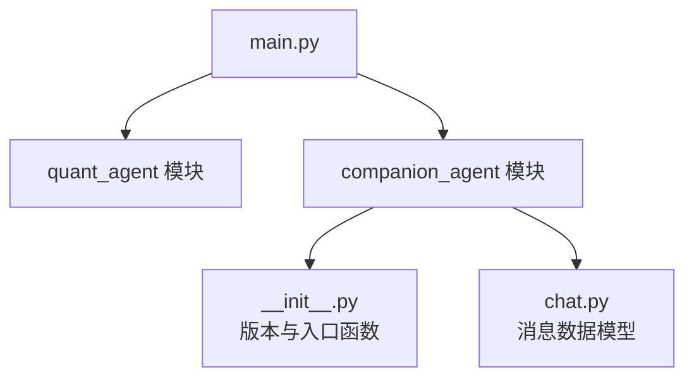
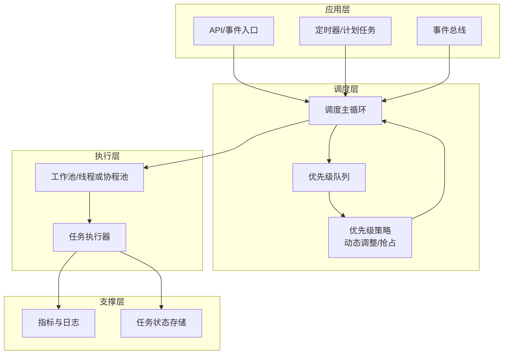
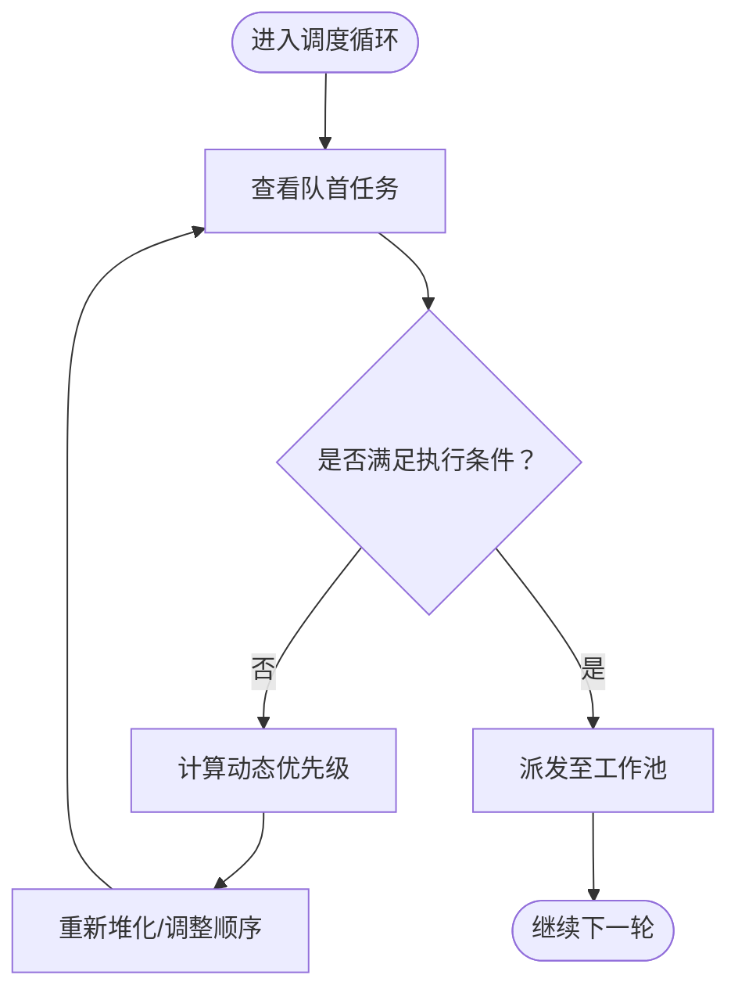
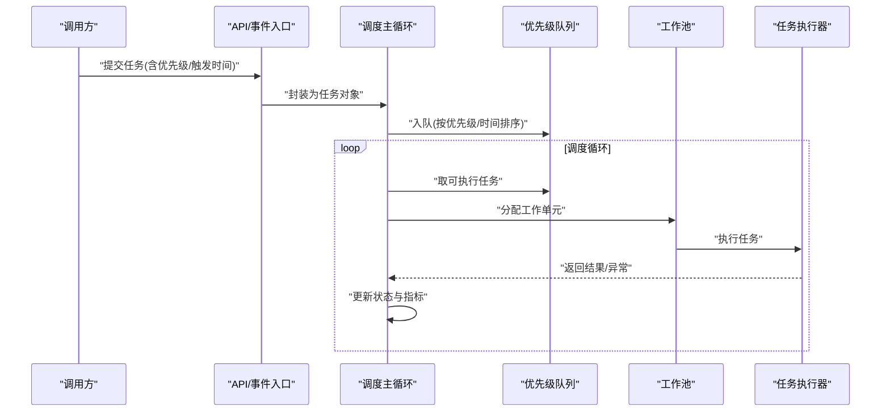
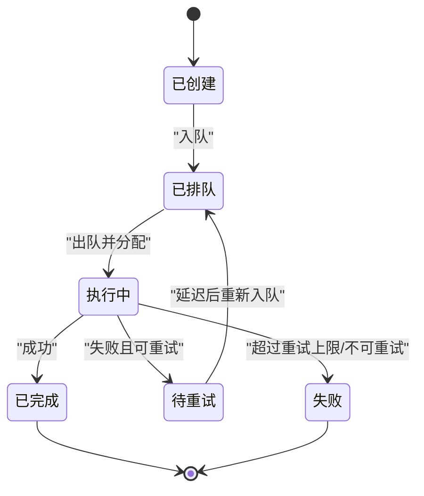
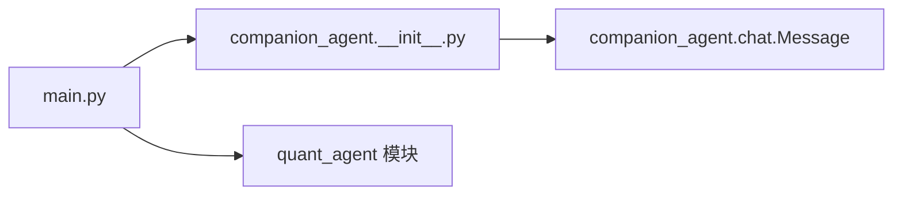

# 任务调度器

<cite>
**本文引用的文件**   
- [main.py](file://main.py)
- [companion_agent/__init__.py](file://packages/companion-agent/src/companion_agent/__init__.py)
- [companion_agent/chat.py](file://packages/companion-agent/src/companion_agent/chat.py)
</cite>

## 目录
1. [简介](#简介)
2. [项目结构](#项目结构)
3. [核心组件](#核心组件)
4. [架构总览](#架构总览)
5. [详细组件分析](#详细组件分析)
6. [依赖分析](#依赖分析)
7. [性能考虑](#性能考虑)
8. [故障排查指南](#故障排查指南)
9. [结论](#结论)
10. [附录](#附录)

## 简介
本技术文档围绕“陪伴助手”的任务调度器进行系统化说明，重点覆盖：
- 任务优先级管理算法（优先级队列、动态优先级调整、资源竞争处理）
- 执行时机控制机制（定时任务调度、事件驱动调度、延迟执行策略）
- 任务生命周期管理（创建、排队、执行、完成）
- 任务状态监控与性能指标收集方案
- 并发控制、线程安全与资源池管理的最佳实践

需要特别说明的是：在当前仓库中未发现直接实现任务调度器的源代码。因此，本文在“架构总览”和“详细组件分析”部分提供基于工程实践的参考设计与落地建议，并在“依赖分析”“项目结构”等章节严格依据现有代码进行分析与引用。

## 项目结构
仓库采用多包组织方式，根入口 main.py 聚合了 quant-agent 与 companion-agent 的启动能力；陪伴助手相关代码位于 packages/companion-agent 下，当前可见模块包含初始化与对话消息模型。

图表来源
- [main.py:1-13](file://main.py#L1-L13)
- [companion_agent/__init__.py:1-15](file://packages/companion-agent/src/companion_agent/__init__.py#L1-L15)
- [companion_agent/chat.py:1-12](file://packages/companion-agent/src/companion_agent/chat.py#L1-L12)

章节来源
- [main.py:1-13](file://main.py#L1-L13)
- [companion_agent/__init__.py:1-15](file://packages/companion-agent/src/companion_agent/__init__.py#L1-L15)
- [companion_agent/chat.py:1-12](file://packages/companion-agent/src/companion_agent/chat.py#L1-L12)

## 核心组件
- 任务定义与数据结构
  - 使用轻量数据类承载任务元信息（如任务ID、类型、优先级、触发时间、重试次数等），便于序列化与日志追踪。
- 优先级队列
  - 基于最小堆/最大堆实现，支持按优先级与到达时间排序；当优先级相同时，优先选择更早入队的任务，保证公平性。
- 调度器主循环
  - 负责从队列中取出可执行任务，分发给工作线程或协程执行器，并更新任务状态与指标。
- 执行器与工作池
  - 维护固定大小的工作集，避免资源耗尽；支持任务超时、取消与幂等重试。
- 监控与指标
  - 采集任务排队时长、执行时长、失败率、吞吐、队列深度等关键指标，暴露给外部监控系统。

[本节为概念性设计说明，不直接分析具体源文件]

## 架构总览
下图给出一个面向陪伴助手的任务调度参考架构，涵盖优先级队列、调度主循环、执行器、监控与持久化等子系统。该图为概念性设计，用于指导后续落地。

[此图为概念性架构图，未映射到具体源码文件，故无图表来源]

## 详细组件分析

### 任务优先级管理算法
- 优先级队列实现
  - 使用堆结构维护任务顺序，比较键由“优先级 + 到达时间戳”构成，确保高优先级且早到达的任务优先出队。
  - 支持插入、删除、peek、size 等操作，复杂度 O(log n)。
- 动态优先级调整
  - 根据任务等待时长、SLA 剩余时间、系统负载等因子对优先级进行再评分，防止低优先级任务饥饿。
  - 调整策略需具备单调性与稳定性，避免频繁抖动导致重排开销过大。
- 资源竞争处理
  - 通过互斥锁保护队列与共享状态；对临界区尽量缩小范围，减少锁持有时间。
  - 对于长耗时任务，采用“快速路径+异步执行”模式，避免阻塞调度主循环。

[此流程图展示通用调度逻辑，未映射到具体源码文件，故无图表来源]

章节来源
- [companion_agent/chat.py:1-12](file://packages/companion-agent/src/companion_agent/chat.py#L1-L12)

### 执行时机控制机制
- 定时任务调度
  - 基于时间轮或最小堆的时间表，将到期任务提前放入优先级队列，由调度主循环统一消费。
- 事件驱动调度
  - 事件总线收到业务事件后，构造任务并设置触发时间或立即入队；支持事件去重与合并。
- 延迟执行策略
  - 支持“延迟入队”，即任务先放入延时队列，到期后再提升到优先级队列；适用于重试、冷却期等场景。

[此序列图为概念流程，未映射到具体源码文件，故无图表来源]

### 任务生命周期管理
- 创建
  - 接收输入参数，生成唯一任务ID，填充元数据（类型、优先级、超时、重试上限等）。
- 排队
  - 根据触发策略（立即/延迟/定时/事件）入队相应队列。
- 执行
  - 从优先级队列取出任务，交由工作池执行；执行过程中记录开始时间与上下文。
- 完成
  - 成功则写入结果与完成时间；失败则按策略重试或转入死信队列；最终状态落盘并上报指标。

[此状态图为概念模型，未映射到具体源码文件，故无图表来源]

### 任务状态监控与性能指标收集
- 指标维度
  - 队列深度、任务等待时长、执行时长、成功率/失败率、重试次数、吞吐、CPU/内存占用。
- 采集方式
  - 在任务入队、出队、开始、结束等关键点埋点；使用计数器、直方图、仪表盘等度量类型。
- 可视化与告警
  - 将指标导出至时序数据库，配置阈值告警与趋势分析，辅助容量规划与问题定位。

[本节为通用方案说明，不直接分析具体源文件]

### 并发控制、线程安全与资源池管理
- 并发控制
  - 使用读写锁分离读多写少场景；对队列操作加细粒度锁，降低争用。
- 线程安全
  - 所有共享状态变更均需原子化或受锁保护；避免在持锁期间执行长耗时操作。
- 资源池管理
  - 固定大小工作池配合有界队列，防止OOM；支持优雅关闭与任务拒绝策略（丢弃/降级/排队）。

[本节为通用最佳实践说明，不直接分析具体源文件]

## 依赖分析
当前仓库中，main.py 作为根入口，导入并调用 quant-agent 与 companion-agent 的 hello 方法；companion-agent 提供基础版本信息与简单入口，chat.py 定义了消息数据模型。这些模块尚未包含任务调度器实现，但可作为未来扩展的集成点。

图表来源
- [main.py:1-13](file://main.py#L1-L13)
- [companion_agent/__init__.py:1-15](file://packages/companion-agent/src/companion_agent/__init__.py#L1-L15)
- [companion_agent/chat.py:1-12](file://packages/companion-agent/src/companion_agent/chat.py#L1-L12)

章节来源
- [main.py:1-13](file://main.py#L1-L13)
- [companion_agent/__init__.py:1-15](file://packages/companion-agent/src/companion_agent/__init__.py#L1-L15)
- [companion_agent/chat.py:1-12](file://packages/companion-agent/src/companion_agent/chat.py#L1-L12)

## 性能考虑
- 队列与堆操作复杂度为 O(log n)，在高并发下应尽量减少锁粒度与锁持有时间。
- 动态优先级调整不宜过于频繁，可采用批处理或节流策略。
- 工作池大小应与CPU核数及I/O特性匹配，结合压测确定最优值。
- 指标采集应避免热点路径上的额外开销，必要时采用异步上报与采样。

[本节为通用性能建议，不直接分析具体源文件]

## 故障排查指南
- 常见问题
  - 任务饥饿：检查动态优先级策略是否合理，是否存在长期低优先级任务。
  - 队列堆积：评估工作池容量与任务执行时长，必要时扩容或优化任务拆分。
  - 重复执行：确认幂等性与去重策略，避免网络重试导致的重复入队。
- 定位手段
  - 通过指标看板观察队列深度与执行时延分布；结合任务ID追踪全链路日志。
  - 对热点路径增加慢查询与异常堆栈上报，快速定位瓶颈。

[本节为通用排障建议，不直接分析具体源文件]

## 结论
当前仓库尚未包含陪伴助手任务调度器的具体实现。本文提供了完整的参考设计与落地建议，涵盖优先级管理、执行时机控制、生命周期管理、监控指标以及并发与资源管理等方面。建议在 companion-agent 包内新增调度子模块，逐步引入上述设计，并通过单元测试与压测验证其正确性与性能表现。

[本节为总结性内容，不直接分析具体源文件]

## 附录
- 术语
  - 优先级队列：按优先级排序的数据结构，常用于任务调度。
  - 工作池：一组可复用执行单元（线程/协程），用于并行执行任务。
  - 指标：用于衡量系统运行状态的量化数据，如延迟、吞吐、错误率等。
- 参考实现思路
  - Python 标准库 heapq 可用于构建最小堆；asyncio 可用于协程级调度；concurrent.futures.ThreadPoolExecutor 可用于线程池。

[本节为补充说明，不直接分析具体源文件]