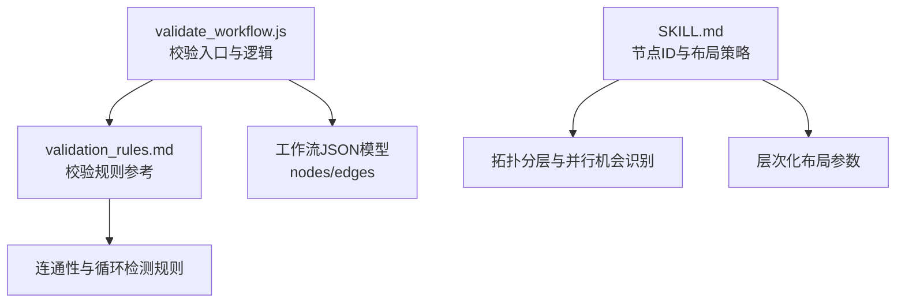
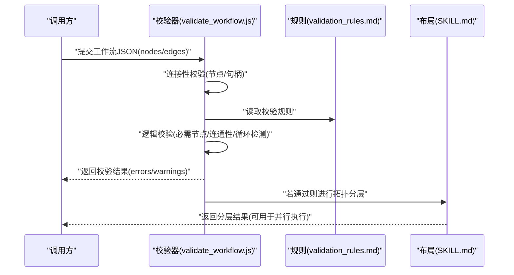
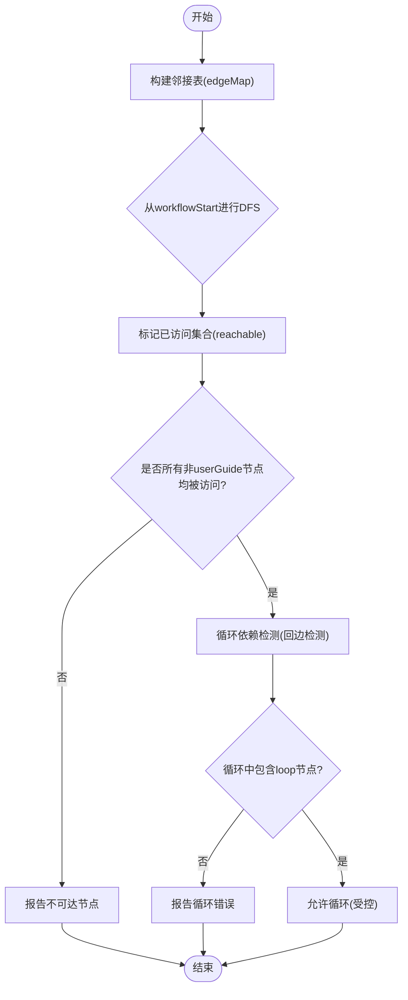
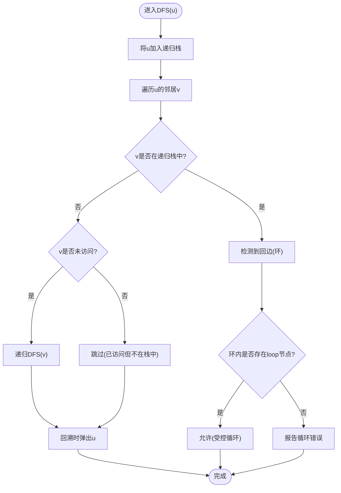
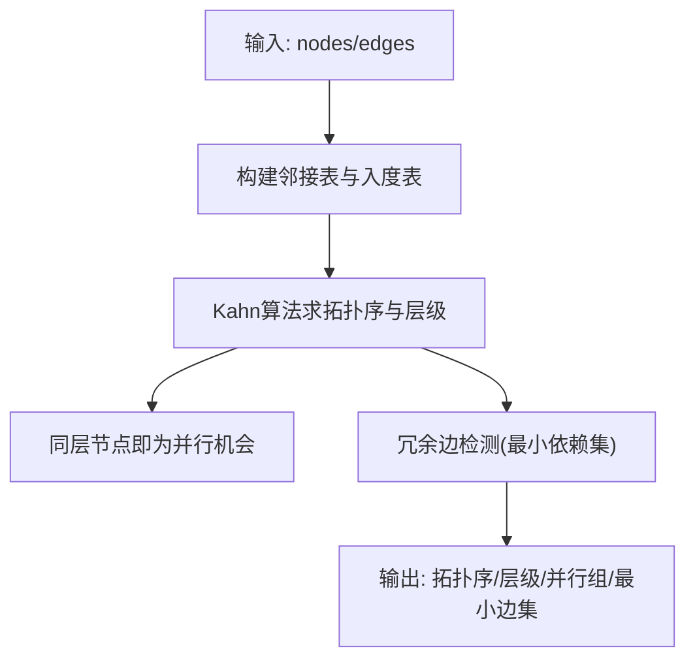
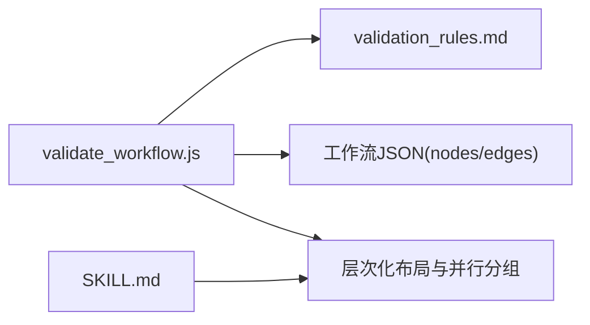

# 任务依赖解析

<cite>
**本文引用的文件**   
- [validate_workflow.js](file://.agent/skills/fastgpt-workflow-generator/scripts/validate_workflow.js)
- [validation_rules.md](file://.agent/skills/fastgpt-workflow-generator/references/validation_rules.md)
- [SKILL.md](file://.agent/skills/fastgpt-workflow-generator/SKILL.md)
</cite>

## 目录
1. [引言](#引言)
2. [项目结构](#项目结构)
3. [核心组件](#核心组件)
4. [架构总览](#架构总览)
5. [详细组件分析](#详细组件分析)
6. [依赖关系分析](#依赖关系分析)
7. [性能考量](#性能考量)
8. [故障排查指南](#故障排查指南)
9. [结论](#结论)
10. [附录](#附录)

## 引言
本技术文档聚焦于工作流编排引擎中的“任务依赖解析”模块，围绕有向无环图（DAG）的构建、拓扑排序、循环依赖检测、依赖验证与优化展开。目标读者包括需要理解并扩展该模块的工程师与产品实现者。文档将结合仓库中已有的工作流校验脚本与规范说明，给出算法原理、流程图示、复杂度分析与最佳实践，并提供可操作的示例路径以便快速上手。

## 项目结构
与任务依赖解析直接相关的代码与规范位于 .agent/skills/fastgpt-workflow-generator 目录下：
- scripts/validate_workflow.js：工作流校验主脚本，包含连接性检查、逻辑校验等关键流程。
- references/validation_rules.md：校验规则参考，涵盖节点类型、连接性、循环依赖检测等。
- SKILL.md：技能说明，包含节点ID生成、自动布局（基于拓扑分层）、引用格式等。

图示来源
- [validate_workflow.js:236-284](file://.agent/skills/fastgpt-workflow-generator/scripts/validate_workflow.js#L236-L284)
- [validation_rules.md:107-148](file://.agent/skills/fastgpt-workflow-generator/references/validation_rules.md#L107-L148)
- [SKILL.md:574-587](file://.agent/skills/fastgpt-workflow-generator/SKILL.md#L574-L587)

章节来源
- [validate_workflow.js:122-171](file://.agent/skills/fastgpt-workflow-generator/scripts/validate_workflow.js#L122-L171)
- [validate_workflow.js:236-284](file://.agent/skills/fastgpt-workflow-generator/scripts/validate_workflow.js#L236-L284)
- [validation_rules.md:83-148](file://.agent/skills/fastgpt-workflow-generator/references/validation_rules.md#L83-L148)
- [SKILL.md:562-587](file://.agent/skills/fastgpt-workflow-generator/SKILL.md#L562-L587)

## 核心组件
- 图模型
  - 节点（Node）：具有唯一标识（nodeId），以及输入输出键（inputs/outputs）。
  - 边（Edge）：表示从源节点到目标节点的依赖方向，附带句柄信息（sourceHandle/targetHandle）。
- 校验器（Validator）
  - 连接性校验：确保所有边指向的节点存在且句柄格式合法。
  - 逻辑校验：必需节点检查、可达性检查（DFS）、循环依赖检测（回边检测）。
- 布局器（Layouter）
  - 基于拓扑分层的层次化布局，用于可视化与并行执行阶段划分。

章节来源
- [validate_workflow.js:134-171](file://.agent/skills/fastgpt-workflow-generator/scripts/validate_workflow.js#L134-L171)
- [validate_workflow.js:250-284](file://.agent/skills/fastgpt-workflow-generator/scripts/validate_workflow.js#L250-L284)
- [validation_rules.md:107-148](file://.agent/skills/fastgpt-workflow-generator/references/validation_rules.md#L107-L148)
- [SKILL.md:574-587](file://.agent/skills/fastgpt-workflow-generator/SKILL.md#L574-L587)

## 架构总览
下图展示了依赖解析的核心流程：从工作流JSON模型出发，经连接性校验、逻辑校验（含连通性与循环检测），最终产出拓扑分层结果以支持并行执行与可视化布局。

图示来源
- [validate_workflow.js:236-284](file://.agent/skills/fastgpt-workflow-generator/scripts/validate_workflow.js#L236-L284)
- [validation_rules.md:107-148](file://.agent/skills/fastgpt-workflow-generator/references/validation_rules.md#L107-L148)
- [SKILL.md:574-587](file://.agent/skills/fastgpt-workflow-generator/SKILL.md#L574-L587)

## 详细组件分析

### DAG构建与遍历策略
- 节点表示
  - 使用唯一标识（nodeId）作为顶点；输入输出键用于数据依赖绑定。
- 边关系定义
  - 边由 source/target 指定依赖方向，sourceHandle/targetHandle 限定端口匹配。
- 图遍历策略
  - 连通性检查采用深度优先搜索（DFS），从 workflowStart 出发标记可达节点。
  - 循环依赖检测在DFS过程中检测回边（back edge），并结合 loop 节点的特殊语义允许特定循环。

图示来源
- [validate_workflow.js:250-284](file://.agent/skills/fastgpt-workflow-generator/scripts/validate_workflow.js#L250-L284)
- [validation_rules.md:119-148](file://.agent/skills/fastgpt-workflow-generator/references/validation_rules.md#L119-L148)

章节来源
- [validate_workflow.js:250-284](file://.agent/skills/fastgpt-workflow-generator/scripts/validate_workflow.js#L250-L284)
- [validation_rules.md:107-148](file://.agent/skills/fastgpt-workflow-generator/references/validation_rules.md#L107-L148)

### 拓扑排序实现与选择
- Kahn算法（入度法）
  - 优点：天然适合并行批次调度，易于计算最小依赖集与层级。
  - 适用场景：需要按层并行执行、统计最长路径或资源受限调度。
- DFS方法
  - 优点：实现简洁，便于与连通性检查、回边检测统一处理。
  - 适用场景：快速验证DAG性质、定位环路、生成逆序执行序列。
- 选择建议
  - 若需并行执行与分层布局，优先采用Kahn算法；若仅需验证与调试，DFS更便捷。
  - 实际系统中可同时实现两者：DFS用于诊断，Kahn用于执行计划。

[本节为通用算法讨论，不直接分析具体文件]

### 循环依赖检测机制
- 回边检测
  - 在DFS过程中维护“当前递归栈”集合，若遇到已在栈中的节点即发现回边，判定为环。
- 冲突解决策略
  - 若环中存在 loop 节点，视为受控循环，允许继续；否则报错并中止。
  - 对不可达节点单独报告，避免误判为环。

图示来源
- [validation_rules.md:119-148](file://.agent/skills/fastgpt-workflow-generator/references/validation_rules.md#L119-L148)

章节来源
- [validation_rules.md:119-148](file://.agent/skills/fastgpt-workflow-generator/references/validation_rules.md#L119-L148)

### 依赖关系验证与优化
- 验证项
  - 必需节点：必须包含 workflowStart 与至少一个输出节点（answerNode/pluginOutput）。
  - 连接性：所有边指向的节点必须存在，句柄格式需符合约定。
  - 可达性：除 userGuide 外，所有节点应从 workflowStart 可达。
  - 循环：仅允许包含 loop 节点的受控循环。
- 优化项
  - 最小依赖集：剔除冗余边后仍保持相同偏序关系的边集合，可减少调度开销。
  - 并行机会识别：基于拓扑分层，同一层内的节点可并行执行。

[本节为通用优化思路，不直接分析具体文件]

### 代码示例与用法指引
- 定义任务依赖关系
  - 在工作流JSON中声明 nodes 与 edges，确保每个边指向的节点存在且句柄格式正确。
  - 参考示例路径：
    - [validate_workflow.js:122-171](file://.agent/skills/fastgpt-workflow-generator/scripts/validate_workflow.js#L122-L171)
- 执行依赖解析过程
  - 调用校验器进行连接性与逻辑校验，通过后进行拓扑分层以获得并行执行计划。
  - 参考示例路径：
    - [validate_workflow.js:236-284](file://.agent/skills/fastgpt-workflow-generator/scripts/validate_workflow.js#L236-L284)
    - [validation_rules.md:107-148](file://.agent/skills/fastgpt-workflow-generator/references/validation_rules.md#L107-L148)

章节来源
- [validate_workflow.js:122-171](file://.agent/skills/fastgpt-workflow-generator/scripts/validate_workflow.js#L122-L171)
- [validate_workflow.js:236-284](file://.agent/skills/fastgpt-workflow-generator/scripts/validate_workflow.js#L236-L284)
- [validation_rules.md:107-148](file://.agent/skills/fastgpt-workflow-generator/references/validation_rules.md#L107-L148)

## 依赖关系分析
- 组件耦合
  - validate_workflow.js 依赖 validation_rules.md 的规则描述，并在逻辑校验中实现连通性与循环检测。
  - SKILL.md 提供节点ID生成与层次化布局参数，支撑可视化与并行分组。
- 外部依赖
  - 工作流JSON模型（nodes/edges）为输入契约；校验器输出结构化错误与警告。
- 潜在风险
  - 若忽略句柄格式校验，可能导致运行时数据路由异常。
  - 未正确处理 loop 节点语义，可能误报循环错误。

图示来源
- [validate_workflow.js:236-284](file://.agent/skills/fastgpt-workflow-generator/scripts/validate_workflow.js#L236-L284)
- [validation_rules.md:107-148](file://.agent/skills/fastgpt-workflow-generator/references/validation_rules.md#L107-L148)
- [SKILL.md:574-587](file://.agent/skills/fastgpt-workflow-generator/SKILL.md#L574-L587)

章节来源
- [validate_workflow.js:236-284](file://.agent/skills/fastgpt-workflow-generator/scripts/validate_workflow.js#L236-L284)
- [validation_rules.md:107-148](file://.agent/skills/fastgpt-workflow-generator/references/validation_rules.md#L107-L148)
- [SKILL.md:574-587](file://.agent/skills/fastgpt-workflow-generator/SKILL.md#L574-L587)

## 性能考量
- 时间复杂度
  - 连通性检查（DFS）：O(V+E)。
  - 循环检测（DFS回边）：O(V+E)。
  - 拓扑排序（Kahn）：O(V+E)。
- 空间复杂度
  - 邻接表与入度表：O(V+E)。
  - 递归栈与访问集合：O(V)。
- 优化建议
  - 预构建邻接表与入度表，避免重复扫描边列表。
  - 对大规模图采用迭代式Kahn算法以减少递归开销。
  - 并行执行时按层调度，限制最大并发度以避免资源争用。

[本节为通用性能讨论，不直接分析具体文件]

## 故障排查指南
- 常见错误
  - 缺少必需节点：如 workflowStart 或输出节点缺失。
  - 边指向不存在节点或句柄格式非法。
  - 不可达节点：除 userGuide 外的节点未被访问。
  - 循环依赖：非受控循环（不含 loop 节点）。
- 定位步骤
  - 查看校验器返回的错误与警告字段，定位具体 edges/index 或 node 标识。
  - 使用连通性检查输出确认不可达节点集合。
  - 针对循环，检查环内是否包含 loop 节点及其 childrenNodeIdList 配置。

章节来源
- [validate_workflow.js:122-171](file://.agent/skills/fastgpt-workflow-generator/scripts/validate_workflow.js#L122-L171)
- [validate_workflow.js:250-284](file://.agent/skills/fastgpt-workflow-generator/scripts/validate_workflow.js#L250-L284)
- [validation_rules.md:107-148](file://.agent/skills/fastgpt-workflow-generator/references/validation_rules.md#L107-L148)

## 结论
本模块以校验脚本与规则为核心，实现了工作流依赖的完整解析链路：从连接性校验、逻辑校验（连通性与循环检测）到拓扑分层与并行机会识别。推荐在生产环境中同时实现Kahn与DFS两种拓扑算法：前者用于执行计划与并行调度，后者用于诊断与调试。通过最小依赖集与分层并行，可显著提升执行效率与系统稳定性。

## 附录
- 相关参考
  - 节点ID生成与位置自动布局算法说明：
    - [SKILL.md:562-587](file://.agent/skills/fastgpt-workflow-generator/SKILL.md#L562-L587)
  - 校验规则与算法要点：
    - [validation_rules.md:83-148](file://.agent/skills/fastgpt-workflow-generator/references/validation_rules.md#L83-L148)
  - 校验脚本实现片段：
    - [validate_workflow.js:122-171](file://.agent/skills/fastgpt-workflow-generator/scripts/validate_workflow.js#L122-L171)
    - [validate_workflow.js:236-284](file://.agent/skills/fastgpt-workflow-generator/scripts/validate_workflow.js#L236-L284)