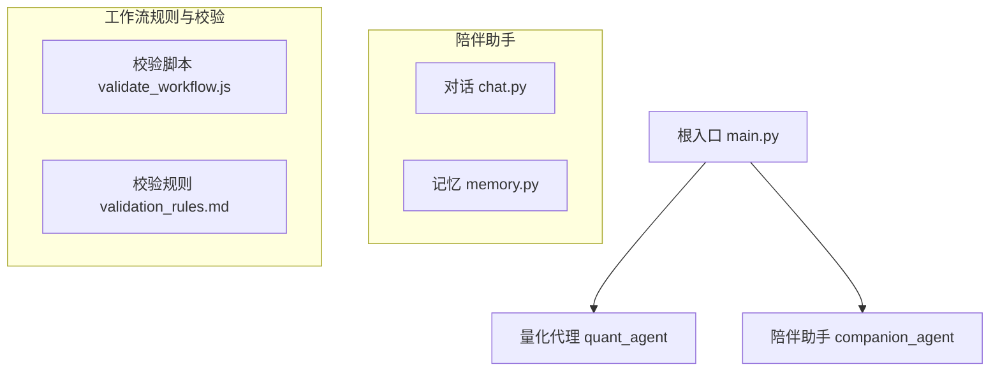
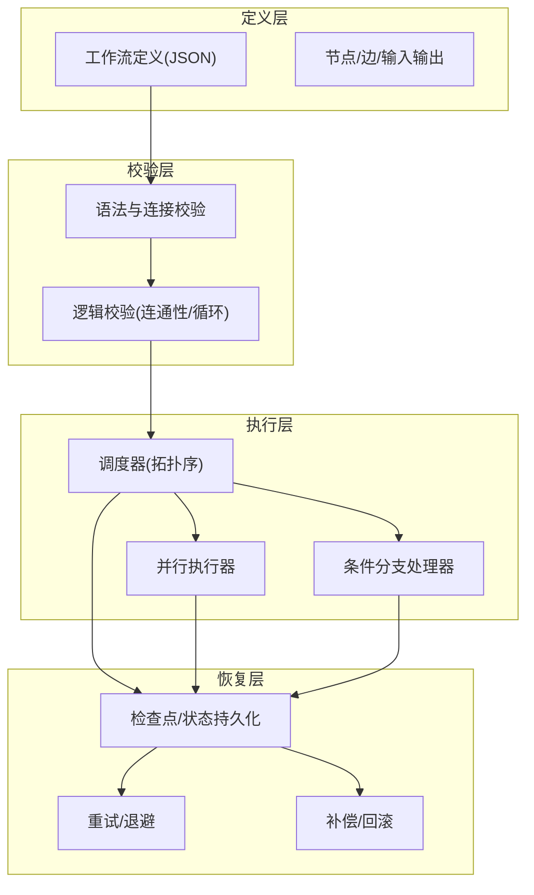
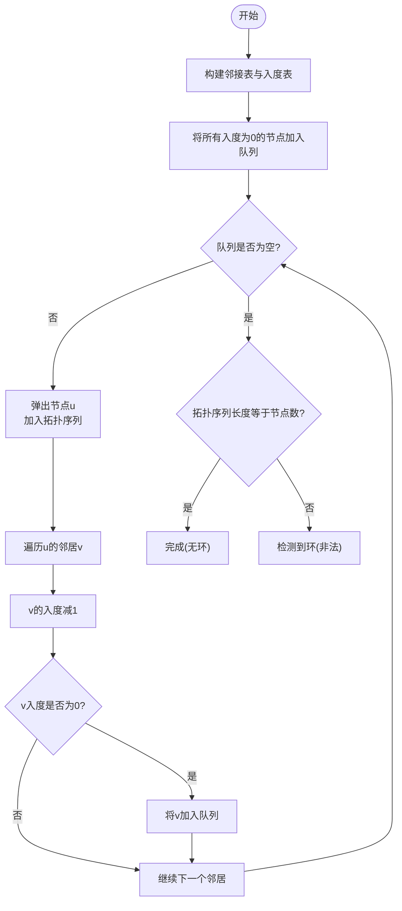
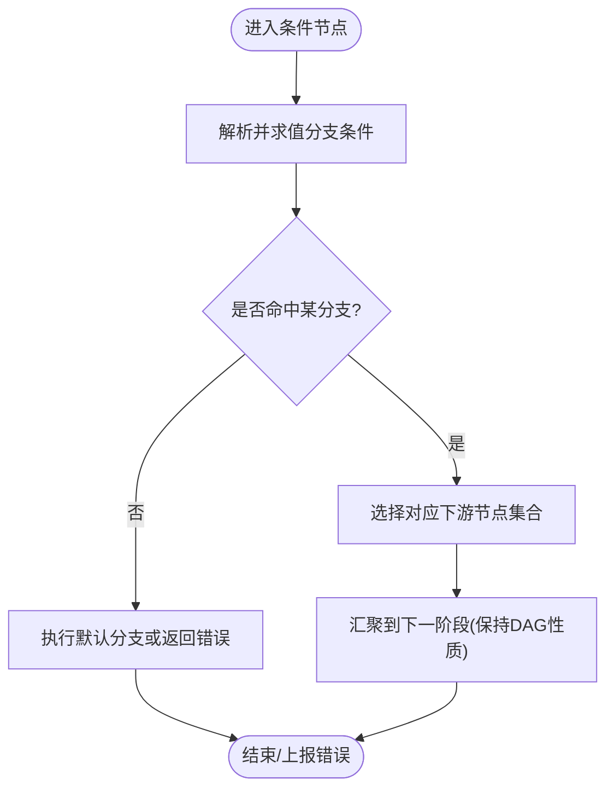
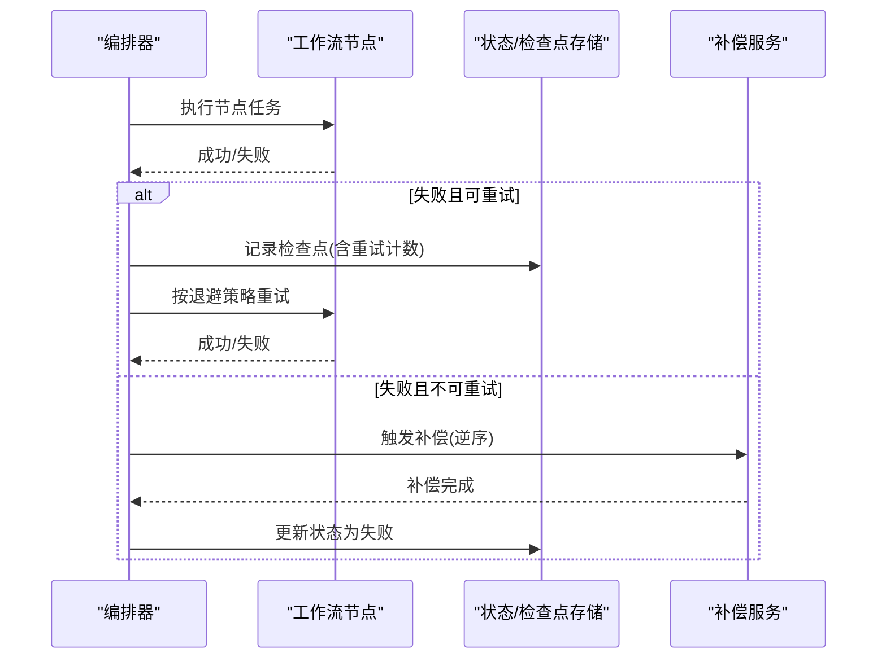
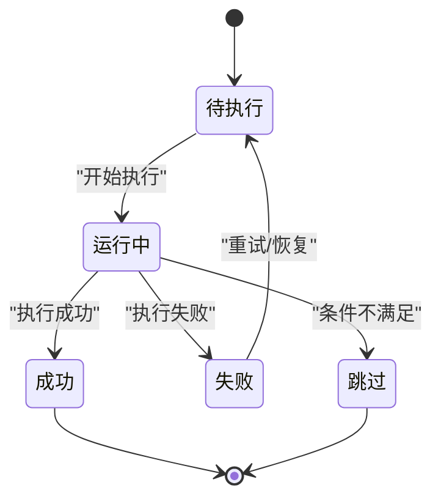
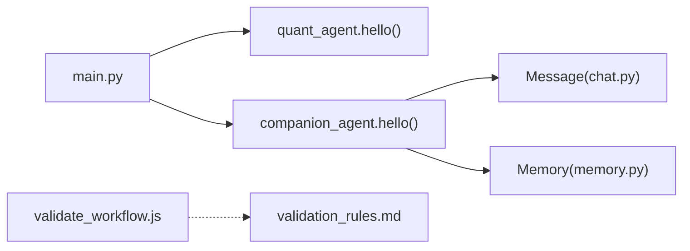

# 工作流编排引擎

<cite>
**本文引用的文件**
- [validate_workflow.js](file://.agent/skills/fastgpt-workflow-generator/scripts/validate_workflow.js)
- [validation_rules.md](file://.agent/skills/fastgpt-workflow-generator/references/validation_rules.md)
- [main.py](file://main.py)
- [chat.py](file://packages/companion-agent/src/companion_agent/chat.py)
- [memory.py](file://packages/companion-agent/src/companion_agent/memory.py)
</cite>

## 目录
1. [简介](#简介)
2. [项目结构](#项目结构)
3. [核心组件](#核心组件)
4. [架构总览](#架构总览)
5. [详细组件分析](#详细组件分析)
6. [依赖关系分析](#依赖关系分析)
7. [性能考量](#性能考量)
8. [故障排查指南](#故障排查指南)
9. [结论](#结论)
10. [附录](#附录)

## 简介
本技术文档面向“陪伴助手”的工作流编排引擎，聚焦以下关键能力：
- 任务依赖解析算法：有向无环图（DAG）构建、拓扑排序与循环依赖检测
- 条件分支处理机制：决策树实现、条件表达式解析与动态路径选择
- 异常恢复机制：错误分类、重试策略、补偿事务与回滚操作
- 状态持久化与断点续跑：工作流状态存储、检查点与恢复流程
- 版本管理与向后兼容：工作流版本控制与兼容性保证策略

本项目仓库包含工作流校验脚本与规范说明，以及应用入口与基础数据模型。基于这些材料，本文对编排引擎的算法与工程实践进行系统化梳理，并提供可落地的架构图与流程图。

## 项目结构
仓库采用多包组织方式，根入口负责聚合子模块；工作流相关规则与校验脚本位于技能目录中，便于复用与扩展。

图表来源
- [main.py:1-13](file://main.py#L1-L13)
- [chat.py:1-12](file://packages/companion-agent/src/companion_agent/chat.py#L1-L12)
- [memory.py:1-12](file://packages/companion-agent/src/companion_agent/memory.py#L1-L12)
- [validate_workflow.js:122-284](file://.agent/skills/fastgpt-workflow-generator/scripts/validate_workflow.js#L122-L284)
- [validation_rules.md:83-310](file://.agent/skills/fastgpt-workflow-generator/references/validation_rules.md#L83-L310)

章节来源
- [main.py:1-13](file://main.py#L1-L13)
- [chat.py:1-12](file://packages/companion-agent/src/companion_agent/chat.py#L1-L12)
- [memory.py:1-12](file://packages/companion-agent/src/companion_agent/memory.py#L1-L12)
- [validate_workflow.js:122-284](file://.agent/skills/fastgpt-workflow-generator/scripts/validate_workflow.js#L122-L284)
- [validation_rules.md:83-310](file://.agent/skills/fastgpt-workflow-generator/references/validation_rules.md#L83-L310)

## 核心组件
- 工作流定义与节点类型
  - 必须包含起始节点 workflowStart
  - 必须包含输出节点 answerNode 或 pluginOutput
  - 建议包含系统配置 userGuide/systemConfig
- 连接与句柄格式
  - sourceHandle/targetHandle 需遵循命名约定
  - 边必须指向存在的节点
- 逻辑校验
  - 连通性检查：从 workflowStart 可达所有非引导节点
  - 循环检测：仅允许 loop 节点参与环路
- 模板引用校验
  - 支持在值中使用 {{$nodeId.key$}} 引用上游输出

章节来源
- [validation_rules.md:99-147](file://.agent/skills/fastgpt-workflow-generator/references/validation_rules.md#L99-L147)
- [validate_workflow.js:134-171](file://.agent/skills/fastgpt-workflow-generator/scripts/validate_workflow.js#L134-L171)
- [validate_workflow.js:250-284](file://.agent/skills/fastgpt-workflow-generator/scripts/validate_workflow.js#L250-L284)

## 架构总览
工作流编排引擎由“定义—校验—执行—恢复”四层构成：
- 定义层：以 JSON 描述节点、边、输入输出与条件
- 校验层：语法、连接、逻辑三层校验，确保 DAG 合法
- 执行层：按拓扑序调度节点，支持并行与条件分支
- 恢复层：检查点持久化、失败重试、补偿与回滚

[此图为概念性架构示意，不直接映射具体源码文件]

## 详细组件分析

### 任务依赖解析算法（DAG 构建、拓扑排序、循环检测）
- DAG 构建
  - 将节点作为顶点，边作为依赖方向，形成有向图
  - 校验层确保源/目标节点存在且句柄格式正确
- 拓扑排序
  - 使用入度表与队列进行 Kahn 算法
  - 若队列空且仍有未访问节点，则存在环
- 循环依赖检测
  - 在 DFS 过程中记录回溯边，仅在含 loop 节点的子图中允许环
  - 否则判定为非法循环并报错

图表来源
- [validate_workflow.js:250-284](file://.agent/skills/fastgpt-workflow-generator/scripts/validate_workflow.js#L250-L284)
- [validation_rules.md:107-127](file://.agent/skills/fastgpt-workflow-generator/references/validation_rules.md#L107-L127)

章节来源
- [validate_workflow.js:134-171](file://.agent/skills/fastgpt-workflow-generator/scripts/validate_workflow.js#L134-L171)
- [validate_workflow.js:250-284](file://.agent/skills/fastgpt-workflow-generator/scripts/validate_workflow.js#L250-L284)
- [validation_rules.md:107-127](file://.agent/skills/fastgpt-workflow-generator/references/validation_rules.md#L107-L127)

### 条件分支处理机制（决策树、表达式解析、动态路径）
- 决策树实现
  - 每个条件节点维护若干分支，分支条件为布尔表达式
  - 运行时根据上下文变量求值，选择唯一分支进入下一节点
- 条件表达式解析
  - 支持简单比较与逻辑组合，必要时引入安全沙箱环境
  - 变量来源包括上游节点输出、系统配置与用户输入
- 动态路径选择
  - 根据分支结果动态决定后续执行路径
  - 结合拓扑排序，确保所选路径仍满足无环约束

[此图为概念性流程示意，不直接映射具体源码文件]

### 异常恢复机制（错误分类、重试、补偿与回滚）
- 错误分类
  - 可重试错误：网络抖动、临时资源不可用
  - 不可重试错误：参数非法、权限不足、业务校验失败
- 重试策略
  - 指数退避 + 抖动，限制最大重试次数
  - 针对幂等操作可安全重试；非幂等需加锁或去重
- 补偿事务与回滚
  - 对副作用操作记录补偿动作（如删除已创建资源）
  - 失败时按逆序执行补偿，保证最终一致性

[此图为概念性时序示意，不直接映射具体源码文件]

### 状态持久化与断点续跑
- 状态模型
  - 全局状态：运行ID、版本、开始/结束时间、当前阶段
  - 节点状态：状态机（待执行/运行中/成功/失败/跳过）、输入输出快照、错误信息
  - 检查点：增量写入，包含最近一次稳定状态
- 断点续跑
  - 启动时加载最新检查点，恢复未完成的节点集
  - 对幂等节点可直接重放；非幂等节点通过幂等键避免重复副作用
- 一致性保障
  - 原子写入检查点（先写临时文件再替换）
  - 失败后保留旧检查点，避免损坏

[此图为概念性状态机示意，不直接映射具体源码文件]

### 工作流版本管理与向后兼容
- 版本管理
  - 工作流定义附带版本号与变更日志
  - 发布前执行全量校验与回归测试
- 向后兼容策略
  - 字段弃用需保留兼容路径，提供迁移工具
  - 新增可选字段不得破坏旧版解析
  - 条件表达式与节点接口升级需声明兼容矩阵

[本节为通用策略说明，不直接分析具体文件]

## 依赖关系分析
- 应用入口 main.py 聚合子模块，调用各模块的对外接口
- 陪伴助手模块提供基础数据结构（消息、记忆），可作为工作流上下文的载体
- 工作流校验脚本与规则文件独立于 Python 应用，可在 CI 中作为前置检查

图表来源
- [main.py:1-13](file://main.py#L1-L13)
- [chat.py:1-12](file://packages/companion-agent/src/companion_agent/chat.py#L1-L12)
- [memory.py:1-12](file://packages/companion-agent/src/companion_agent/memory.py#L1-L12)
- [validate_workflow.js:122-284](file://.agent/skills/fastgpt-workflow-generator/scripts/validate_workflow.js#L122-L284)
- [validation_rules.md:83-310](file://.agent/skills/fastgpt-workflow-generator/references/validation_rules.md#L83-L310)

章节来源
- [main.py:1-13](file://main.py#L1-L13)
- [chat.py:1-12](file://packages/companion-agent/src/companion_agent/chat.py#L1-L12)
- [memory.py:1-12](file://packages/companion-agent/src/companion_agent/memory.py#L1-L12)
- [validate_workflow.js:122-284](file://.agent/skills/fastgpt-workflow-generator/scripts/validate_workflow.js#L122-L284)
- [validation_rules.md:83-310](file://.agent/skills/fastgpt-workflow-generator/references/validation_rules.md#L83-L310)

## 性能考量
- 拓扑排序复杂度 O(V+E)，适合大规模工作流
- 并行执行需评估共享资源竞争与内存占用
- 检查点写入应批量合并，降低 I/O 压力
- 条件表达式求值尽量缓存中间结果，避免重复计算

[本节为通用指导，不直接分析具体文件]

## 故障排查指南
- 常见校验错误
  - 缺少必要节点：workflowStart 或输出节点缺失
  - 连接无效：source/target 不存在或句柄格式不正确
  - 连通性问题：存在不可达节点
  - 循环依赖：非 loop 节点构成的环
- 定位步骤
  - 查看校验报告中的错误级别与字段路径
  - 使用连通性检查确认从起点可达性
  - 对循环依赖，识别环上节点并重构流程

章节来源
- [validate_workflow.js:134-171](file://.agent/skills/fastgpt-workflow-generator/scripts/validate_workflow.js#L134-L171)
- [validate_workflow.js:250-284](file://.agent/skills/fastgpt-workflow-generator/scripts/validate_workflow.js#L250-L284)
- [validation_rules.md:99-147](file://.agent/skills/fastgpt-workflow-generator/references/validation_rules.md#L99-L147)

## 结论
本引擎围绕“可验证、可执行、可恢复、可演进”的目标设计：
- 通过严格的 DAG 校验与拓扑调度，确保执行顺序正确
- 借助条件分支与动态路径，提升编排灵活性
- 以检查点、重试与补偿机制保障鲁棒性与一致性
- 以版本管理与兼容策略支撑长期演进

[本节为总结性内容，不直接分析具体文件]

## 附录
- 术语
  - DAG：有向无环图
  - 拓扑排序：线性排列使每条边从前驱指向后继
  - 检查点：运行过程中的稳定状态快照
- 参考
  - 校验脚本与规则文件可用于 CI 前置检查，防止非法工作流入库

[本节为补充说明，不直接分析具体文件]