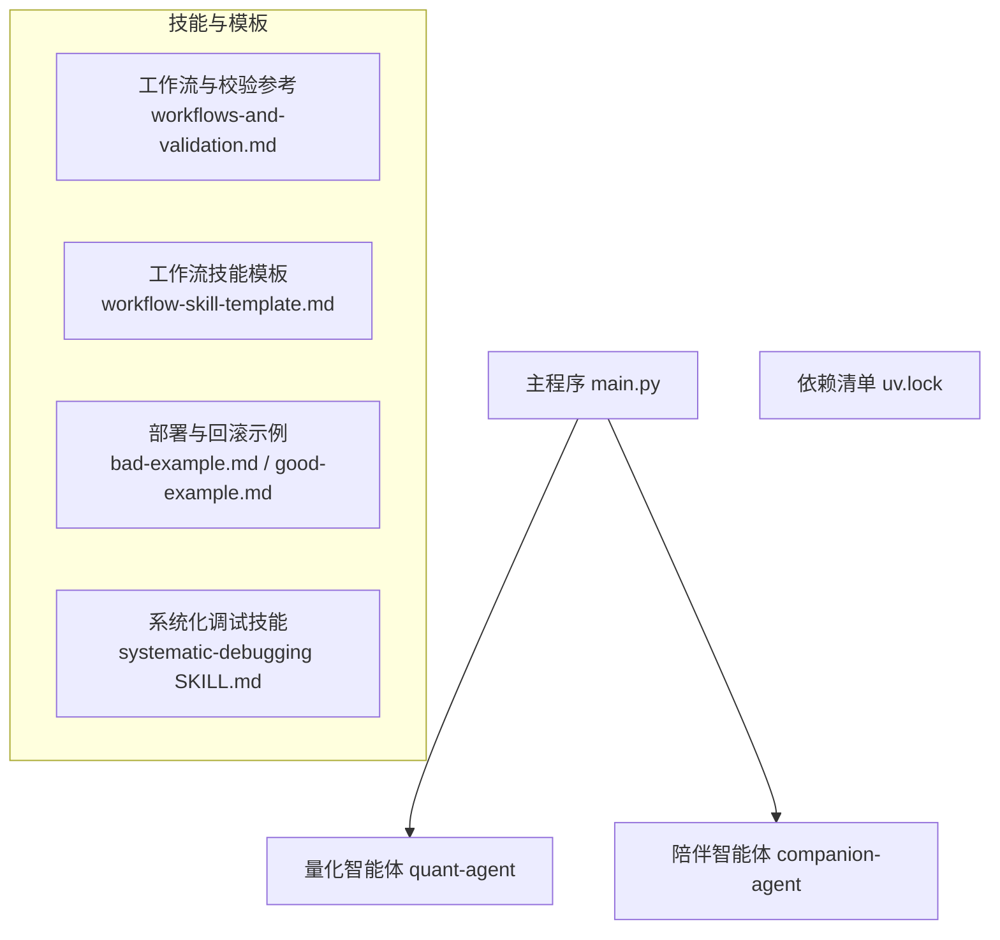
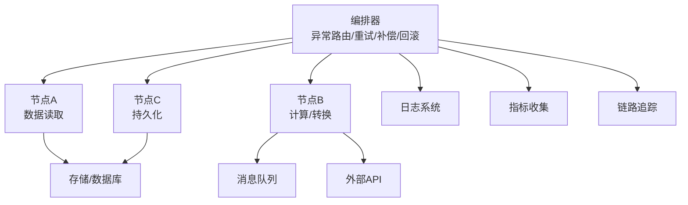
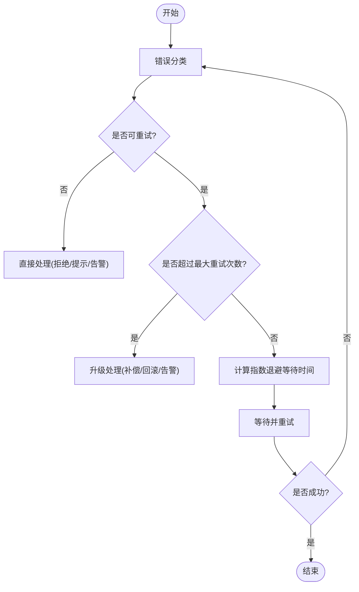
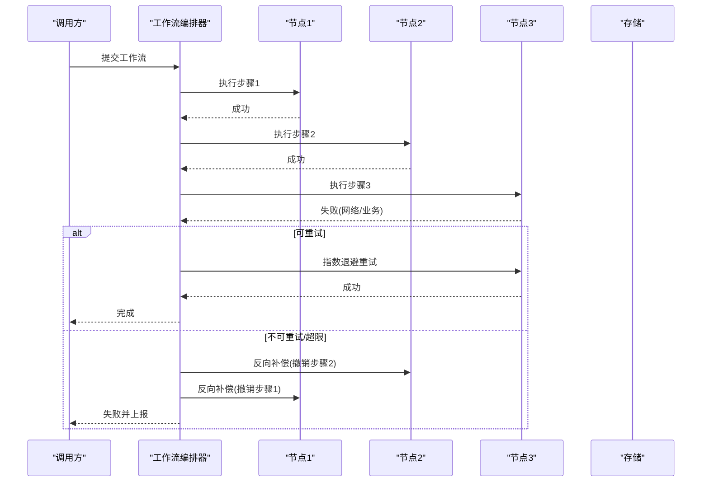
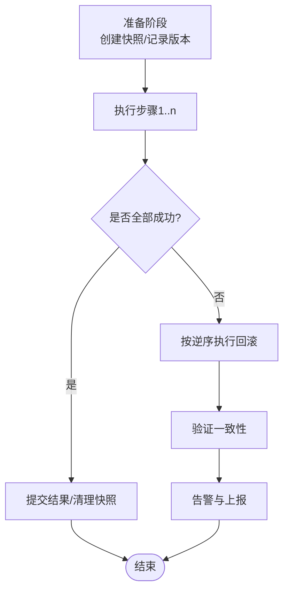
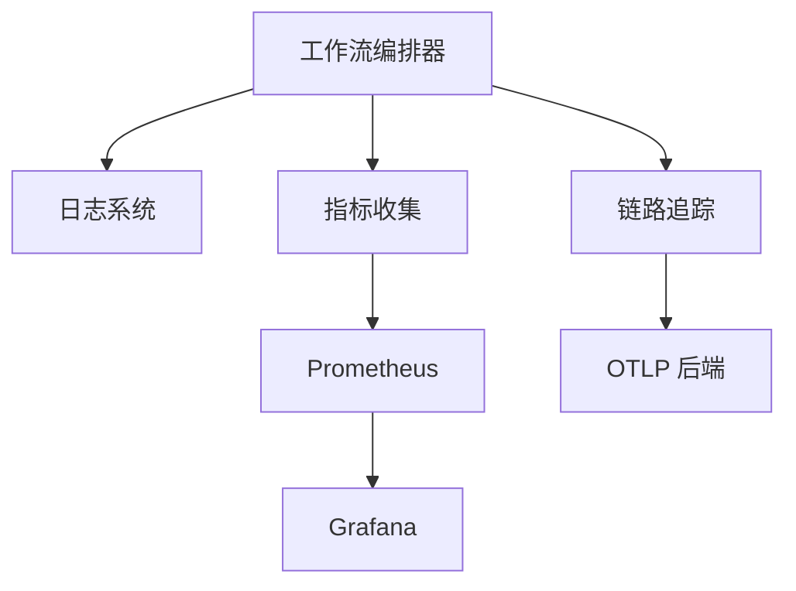
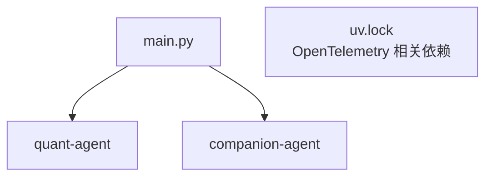

# 异常恢复机制

<cite>
**本文引用的文件**   
- [main.py](file://main.py)
- [workflows-and-validation.md](file://.agent\skills\create-agent-skills\references\workflows-and-validation.md)
- [workflow-skill-template.md](file://.agent\skills\create-skill-file\templates\workflow-skill-template.md)
- [bad-example.md](file://.agent\skills\create-skill-file\examples\bad-example.md)
- [good-example.md](file://.agent\skills\create-skill-file-EN\examples\good-example.md)
- [systematic-debugging SKILL.md](file://.agent\skills\systematic-debugging\SKILL.md)
- [uv.lock](file://uv.lock)
</cite>

## 目录
1. [简介](#简介)
2. [项目结构](#项目结构)
3. [核心组件](#核心组件)
4. [架构总览](#架构总览)
5. [详细组件分析](#详细组件分析)
6. [依赖分析](#依赖分析)
7. [性能考虑](#性能考虑)
8. [故障排查指南](#故障排查指南)
9. [结论](#结论)
10. [附录](#附录)

## 简介
本文件面向工作流编排引擎的“异常恢复机制”，围绕错误分类、重试策略（含指数退避与最大重试次数）、补偿事务（正向/反向）、回滚与一致性保证、监控告警与诊断工具，以及配置示例与最佳实践进行系统化说明。文档同时结合仓库中已有的工作流模板与技能规范，给出可落地的流程设计与工程化建议。

## 项目结构
仓库采用多包组织方式，主入口位于根目录，各功能域以独立包形式提供能力。当前仓库未包含显式的异常处理实现代码，但提供了工作流模板与调试技能等参考材料，可用于指导异常恢复机制的设计与落地。

图示来源
- [main.py:1-13](file://main.py#L1-L13)
- [workflows-and-validation.md:469-511](file://.agent\skills\create-agent-skills\references\workflows-and-validation.md#L469-L511)
- [workflow-skill-template.md:248-287](file://.agent\skills\create-skill-file\templates\workflow-skill-template.md#L248-L287)
- [bad-example.md:665-792](file://.agent\skills\create-skill-file\examples\bad-example.md#L665-L792)
- [good-example.md:582-689](file://.agent\skills\create-skill-file-EN\examples\good-example.md#L582-L689)
- [systematic-debugging SKILL.md:50-120](file://.agent\skills\systematic-debugging\SKILL.md#L50-L120)
- [uv.lock:2534-2559](file://uv.lock#L2534-L2559)

章节来源
- [main.py:1-13](file://main.py#L1-L13)

## 核心组件
本节从“异常恢复”视角梳理关键构件：错误分类体系、重试与退避、补偿事务、回滚与一致性、监控与告警、配置与最佳实践。这些构件将作为后续流程图与序列图的基础。

- 错误分类体系
  - 系统错误：进程崩溃、资源耗尽、权限不足、磁盘空间不足等。
  - 业务错误：输入不合法、状态机非法转换、业务规则冲突等。
  - 网络错误：超时、连接失败、远端限流（如 429）、服务端错误（如 5xx）。
- 重试与退避
  - 指数退避：在每次失败后按指数增长等待时间，降低瞬时拥塞压力。
  - 最大重试次数：防止无限重试导致雪崩或资源泄露。
  - 重试条件判断：仅对幂等或可安全重试的错误类型触发重试。
- 补偿事务
  - 正向补偿：在部分成功场景下，继续完成剩余步骤并记录已生效变更。
  - 反向补偿：在失败时执行逆向操作，撤销已完成的副作用，保持最终一致。
- 回滚与一致性
  - 状态快照：在执行前保存关键状态，用于快速回滚。
  - 部分回滚：按步骤粒度撤销已完成步骤，避免全量重放。
  - 一致性保证：通过幂等性、去重键、事务边界控制等手段确保最终一致。
- 监控与告警
  - 错误日志：结构化记录错误上下文、堆栈、耗时、请求标识。
  - 指标采集：错误率、重试次数、P95/P99 延迟、吞吐等。
  - 诊断工具：链路追踪、分布式跟踪、运行时快照。
- 配置与最佳实践
  - 按错误类别配置不同重试策略与降级路径。
  - 为外部依赖设置合理的超时与熔断阈值。
  - 建立灰度发布与蓝绿切换流程，配合自动回滚。

章节来源
- [workflows-and-validation.md:469-511](file://.agent\skills\create-agent-skills\references\workflows-and-validation.md#L469-L511)
- [workflow-skill-template.md:248-287](file://.agent\skills\create-skill-file\templates\workflow-skill-template.md#L248-L287)
- [bad-example.md:665-792](file://.agent\skills\create-skill-file\examples\bad-example.md#L665-L792)
- [good-example.md:582-689](file://.agent\skills\create-skill-file-EN\examples\good-example.md#L582-L689)
- [systematic-debugging SKILL.md:50-120](file://.agent\skills\systematic-debugging\SKILL.md#L50-L120)

## 架构总览
下图展示工作流编排引擎在异常恢复方面的整体架构：编排器负责调度节点、捕获异常、决策重试/补偿/回滚；外部依赖包括存储、消息队列、第三方 API；观测层集成日志、指标与追踪。

图示来源
- [workflows-and-validation.md:469-511](file://.agent\skills\create-agent-skills\references\workflows-and-validation.md#L469-L511)
- [workflow-skill-template.md:248-287](file://.agent\skills\create-skill-file\templates\workflow-skill-template.md#L248-L287)
- [bad-example.md:665-792](file://.agent\skills\create-skill-file\examples\bad-example.md#L665-L792)
- [good-example.md:582-689](file://.agent\skills\create-skill-file-EN\examples\good-example.md#L582-L689)
- [systematic-debugging SKILL.md:50-120](file://.agent\skills\systematic-debugging\SKILL.md#L50-L120)

## 详细组件分析

### 错误分类与处理策略
- 系统错误
  - 特征：不可恢复或需人工介入（如磁盘满、权限不足）。
  - 策略：立即中止、触发告警、保留现场快照、通知运维。
- 业务错误
  - 特征：输入不合法、状态非法、规则冲突。
  - 策略：拒绝执行、返回明确错误码与提示、允许用户修正后重试。
- 网络错误
  - 特征：超时、连接失败、远端限流、服务端错误。
  - 策略：根据错误码决定是否重试；对限流与临时错误启用指数退避；对非幂等操作谨慎重试。

章节来源
- [workflows-and-validation.md:469-511](file://.agent\skills\create-agent-skills\references\workflows-and-validation.md#L469-L511)

### 重试机制与指数退避
- 指数退避算法
  - 基本思想：第 i 次重试等待时间为 base * exp(i)，并可叠加抖动以避免惊群效应。
  - 适用场景：网络抖动、远端限流、短暂资源争用。
- 最大重试次数
  - 目的：防止雪崩与资源泄漏；超过阈值后进入补偿或回滚流程。
- 重试条件判断
  - 仅对幂等或可安全重试的操作触发重试。
  - 区分错误类型：429/5xx/连接错误可重试；400/404/业务校验失败不重试。

图示来源
- [workflows-and-validation.md:469-511](file://.agent\skills\create-agent-skills\references\workflows-and-validation.md#L469-L511)

章节来源
- [workflows-and-validation.md:469-511](file://.agent\skills\create-agent-skills\references\workflows-and-validation.md#L469-L511)

### 补偿事务设计模式
- 正向补偿
  - 场景：部分步骤成功，后续步骤失败。
  - 做法：继续完成必要步骤，记录已生效变更，生成补偿任务以便后续清理或对齐。
- 反向补偿
  - 场景：发生不可恢复错误，需要撤销已完成的副作用。
  - 做法：按逆序执行补偿动作，确保最终一致；必要时引入幂等补偿接口。

图示来源
- [workflows-and-validation.md:469-511](file://.agent\skills\create-agent-skills\references\workflows-and-validation.md#L469-L511)

章节来源
- [workflows-and-validation.md:469-511](file://.agent\skills\create-agent-skills\references\workflows-and-validation.md#L469-L511)

### 回滚操作机制
- 状态快照保存
  - 在执行前对关键状态进行快照，支持快速恢复到已知一致点。
- 部分回滚
  - 按步骤粒度撤销已完成步骤，减少不必要的重放成本。
- 一致性保证
  - 使用幂等写入、去重键、事务边界与版本戳，确保最终一致。

图示来源
- [bad-example.md:665-792](file://.agent\skills\create-skill-file\examples\bad-example.md#L665-L792)
- [good-example.md:582-689](file://.agent\skills\create-skill-file-EN\examples\good-example.md#L582-L689)

章节来源
- [bad-example.md:665-792](file://.agent\skills\create-skill-file\examples\bad-example.md#L665-L792)
- [good-example.md:582-689](file://.agent\skills\create-skill-file-EN\examples\good-example.md#L582-L689)

### 异常监控与告警集成
- 错误日志记录
  - 结构化字段：时间戳、步骤名、状态、错误码、上下文、请求ID、耗时。
- 性能指标收集
  - 指标项：错误率、重试次数、P95/P99 延迟、吞吐、资源占用。
- 故障诊断工具
  - 链路追踪：跨服务/跨组件追踪调用链。
  - 运行时快照：内存、线程、句柄、锁竞争等。
- 集成方案
  - 日志：集中式日志平台（如 ELK/Loki）。
  - 指标：Prometheus + Grafana。
  - 追踪：OpenTelemetry 导出到后端（如 OTLP）。

图示来源
- [workflow-skill-template.md:248-287](file://.agent\skills\create-skill-file\templates\workflow-skill-template.md#L248-L287)
- [uv.lock:2534-2559](file://uv.lock#L2534-L2559)

章节来源
- [workflow-skill-template.md:248-287](file://.agent\skills\create-skill-file\templates\workflow-skill-template.md#L248-L287)
- [uv.lock:2534-2559](file://uv.lock#L2534-L2559)

### 配置示例与最佳实践
- 重试配置
  - 最大重试次数：针对网络错误设置上限（例如 3~5 次），业务错误不重试。
  - 指数退避：基础等待时间 1s，指数增长，叠加随机抖动。
  - 超时：为外部依赖设置合理超时，避免长时间阻塞。
- 降级与熔断
  - 当错误率超过阈值时，启用降级策略（如只读缓存、简化流程）。
  - 熔断器：在连续失败后快速失败，避免放大故障。
- 灰度与回滚
  - 蓝绿/金丝雀发布：先小流量验证，再逐步放量。
  - 自动回滚：监控到错误率升高或健康检查失败时自动切回旧版本。
- 日志与告警
  - 关键路径必须输出结构化日志与指标。
  - 告警阈值：错误率、重试次数、P99 延迟、资源水位。

章节来源
- [bad-example.md:665-792](file://.agent\skills\create-skill-file\examples\bad-example.md#L665-L792)
- [good-example.md:582-689](file://.agent\skills\create-skill-file-EN\examples\good-example.md#L582-L689)
- [workflow-skill-template.md:248-287](file://.agent\skills\create-skill-file\templates\workflow-skill-template.md#L248-L287)

## 依赖分析
- 内部依赖
  - 主程序 main.py 聚合多个子包能力，便于统一编排与异常处理。
- 外部依赖
  - 依赖清单 uv.lock 中包含 OpenTelemetry 相关包，可用于指标与追踪集成。

图示来源
- [main.py:1-13](file://main.py#L1-L13)
- [uv.lock:2534-2559](file://uv.lock#L2534-L2559)

章节来源
- [main.py:1-13](file://main.py#L1-L13)
- [uv.lock:2534-2559](file://uv.lock#L2534-L2559)

## 性能考虑
- 重试风暴防护：指数退避+抖动，限制并发重试数量。
- 超时与熔断：避免长尾请求拖垮系统。
- 幂等与去重：减少重复执行带来的额外开销。
- 批量与批处理：合并小任务以降低系统调用次数。
- 资源隔离：为关键路径分配独立资源池，避免相互影响。

## 故障排查指南
- 根因定位
  - 仔细阅读错误信息与堆栈，记录行号、文件路径、错误码。
  - 稳定复现问题，确认触发条件与环境差异。
  - 在多组件系统中，逐层记录入参/出参与环境配置，定位失败边界。
- 证据收集
  - 在组件边界增加诊断日志，运行一次以收集证据后再分析。
  - 回溯数据流，找到坏值的源头并在源头修复。
- 快速修复
  - 优先解决阻断性问题，再进行简单修复与复杂重构。
  - 逐项验证修复效果，确保无回归。

章节来源
- [systematic-debugging SKILL.md:50-120](file://.agent\skills\systematic-debugging\SKILL.md#L50-L120)

## 结论
本文件基于仓库中的工作流模板与技能规范，构建了工作流编排引擎的异常恢复机制蓝图：以错误分类为基础，结合指数退避重试、补偿事务与回滚策略，辅以完善的监控告警与诊断工具，形成端到端的可靠性保障体系。建议在工程中逐步落地上述方案，并通过灰度发布与自动回滚提升上线安全性。

## 附录
- 术语
  - 幂等：多次执行与单次执行结果一致。
  - 补偿：在部分成功或失败时，通过正向/反向操作达到最终一致。
  - 熔断：在连续失败后快速失败，保护系统不被放大故障。
- 参考
  - 工作流与校验参考：[workflows-and-validation.md:469-511](file://.agent\skills\create-agent-skills\references\workflows-and-validation.md#L469-L511)
  - 工作流技能模板：[workflow-skill-template.md:248-287](file://.agent\skills\create-skill-file\templates\workflow-skill-template.md#L248-L287)
  - 部署与回滚示例：[bad-example.md:665-792](file://.agent\skills\create-skill-file\examples\bad-example.md#L665-L792), [good-example.md:582-689](file://.agent\skills\create-skill-file-EN\examples\good-example.md#L582-L689)
  - 系统化调试技能：[systematic-debugging SKILL.md:50-120](file://.agent\skills\systematic-debugging\SKILL.md#L50-L120)
  - 依赖清单（OpenTelemetry）：[uv.lock:2534-2559](file://uv.lock#L2534-L2559)