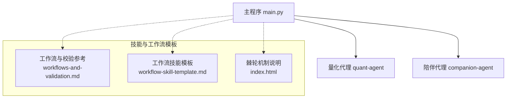
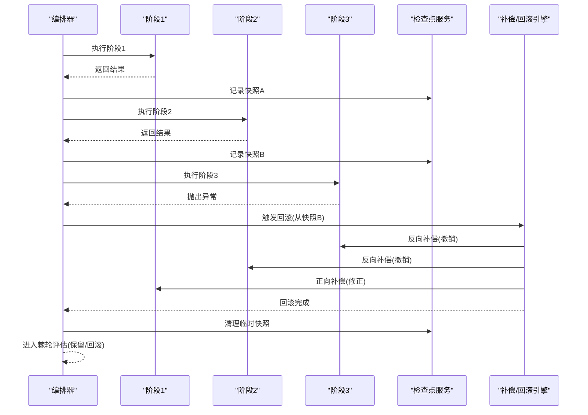
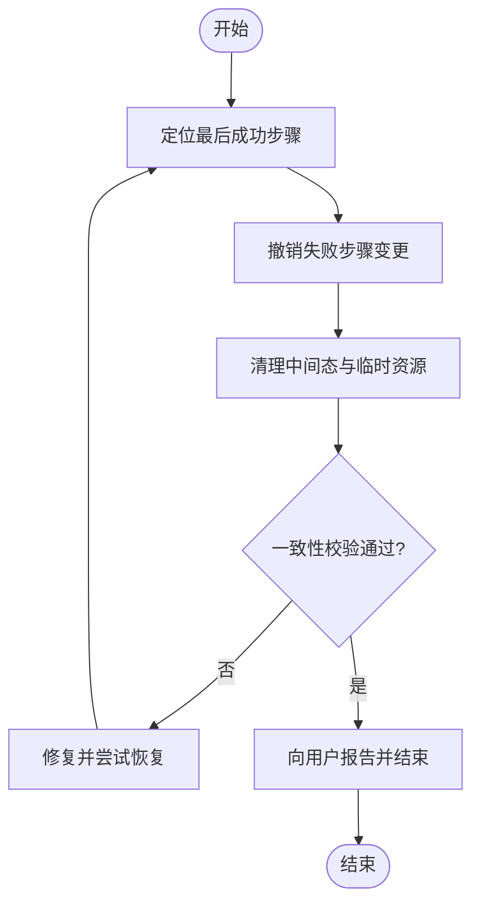
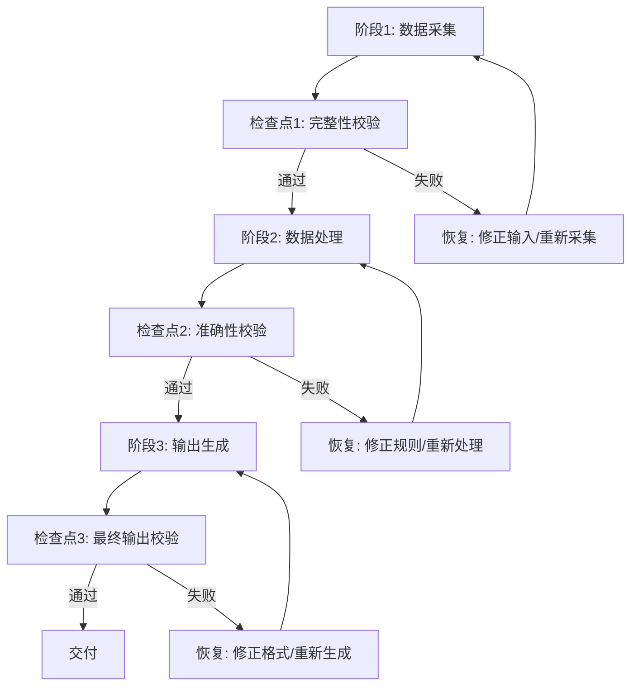
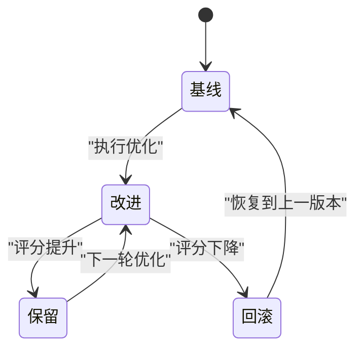
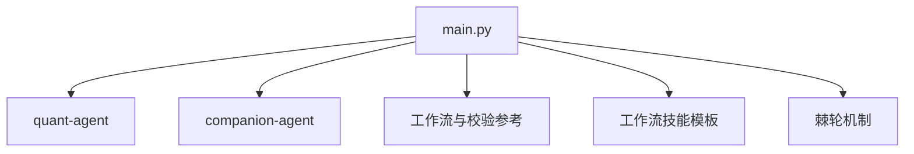

# 补偿与回滚

<cite>
**本文引用的文件**   
- [main.py](file://main.py)
- [workflows-and-validation.md](file://.agent\skills\create-agent-skills\references\workflows-and-validation.md)
- [workflow-skill-template.md](file://.agent\skills\create-skill-file\templates\workflow-skill-template.md)
- [index.html](file://.agent\skills\darwin-skill\docs\index.html)
</cite>

## 目录
1. [简介](#简介)
2. [项目结构](#项目结构)
3. [核心组件](#核心组件)
4. [架构总览](#架构总览)
5. [详细组件分析](#详细组件分析)
6. [依赖分析](#依赖分析)
7. [性能考虑](#性能考虑)
8. [故障排查指南](#故障排查指南)
9. [结论](#结论)
10. [附录](#附录)

## 简介
本文件围绕“补偿事务与回滚”的实现方案，结合仓库中的工作流模板、校验与错误恢复规范，以及棘轮机制文档，系统阐述：
- 状态快照保存策略
- 部分回滚与一致性保证
- 正向补偿与反向补偿的设计模式
- 补偿函数的编写规范与测试方法
- 数据一致性检查与恢复策略的实际应用示例

目标是在不侵入现有代码的前提下，提供可落地的工程化实践，帮助在多步骤、跨系统的业务流程中实现可靠的事务语义。

## 项目结构
仓库采用多包组织方式，入口脚本聚合各子模块能力；同时包含大量技能与工作流模板，用于指导复杂流程的构建、校验与恢复。与补偿和回滚直接相关的素材主要位于 .agent/skills 下的模板与参考文档中。

图示来源
- [main.py:1-13](file://main.py#L1-L13)
- [workflows-and-validation.md:411-511](file://.agent\skills\create-agent-skills\references\workflows-and-validation.md#L411-L511)
- [workflow-skill-template.md:171-246](file://.agent\skills\create-skill-file\templates\workflow-skill-template.md#L171-L246)
- [index.html:889-947](file://.agent\skills\darwin-skill\docs\index.html#L889-L947)

章节来源
- [main.py:1-13](file://main.py#L1-L13)

## 核心组件
- 工作流阶段与检查点
  - 将长流程拆分为若干阶段，每个阶段设置检查点（CHECKPOINT），在继续前进行完整性与正确性验证。
- 错误恢复与升级
  - 定义正常路径与错误恢复路径，明确重试、修复与上报策略。
- 回滚程序
  - 失败时识别最后成功步骤，撤销变更并清理中间态，最终报告用户并确认系统回到前置状态。
- 棘轮机制
  - 分数只升不降，每轮要么改进，要么干净回滚，避免局部退化随时间累积。

章节来源
- [workflows-and-validation.md:411-511](file://.agent\skills\create-agent-skills\references\workflows-and-validation.md#L411-L511)
- [workflow-skill-template.md:171-246](file://.agent\skills\create-skill-file\templates\workflow-skill-template.md#L171-L246)
- [index.html:889-947](file://.agent\skills\darwin-skill\docs\index.html#L889-L947)

## 架构总览
下图展示基于“检查点 + 补偿/回滚 + 棘轮”的整体架构思路，适用于多步骤、跨系统的工作流。

图示来源
- [workflows-and-validation.md:411-511](file://.agent\skills\create-agent-skills\references\workflows-and-validation.md#L411-L511)
- [workflow-skill-template.md:171-246](file://.agent\skills\create-skill-file\templates\workflow-skill-template.md#L171-L246)
- [index.html:889-947](file://.agent\skills\darwin-skill\docs\index.html#L889-L947)

## 详细组件分析

### 状态快照保存与一致性保证
- 快照粒度
  - 以阶段为单位保存最小必要状态的快照，确保回滚时可定位到最近一致点。
- 快照内容
  - 业务关键实体、外部系统调用凭证、中间产物索引等。
- 一致性策略
  - 先写快照后执行业务；若业务失败，优先使用快照恢复；必要时配合幂等键与去重表避免重复副作用。

章节来源
- [workflows-and-validation.md:411-511](file://.agent\skills\create-agent-skills\references\workflows-and-validation.md#L411-L511)
- [workflow-skill-template.md:171-246](file://.agent\skills\create-skill-file\templates\workflow-skill-template.md#L171-L246)

### 部分回滚与一致性恢复
- 识别最后成功步骤
  - 通过检查点日志或状态机确定失败前的最后一个稳定点。
- 逆向撤销
  - 对失败步骤及后续已变更资源逐一执行反向操作。
- 清理中间态
  - 删除临时文件、取消未持久化的缓存条目、释放锁等。
- 验证系统状态
  - 运行一致性校验，确认无残留副作用。

图示来源
- [workflow-skill-template.md:171-246](file://.agent\skills\create-skill-file\templates\workflow-skill-template.md#L171-L246)

章节来源
- [workflow-skill-template.md:171-246](file://.agent\skills\create-skill-file\templates\workflow-skill-template.md#L171-L246)

### 正向补偿与反向补偿设计模式
- 反向补偿（Undo）
  - 针对已发生的副作用，执行相反操作以撤销影响，如删除记录、回退库存、取消订单等。
- 正向补偿（Fix/Adjust）
  - 当无法完全撤销时，通过额外调整使系统达到期望一致状态，如补发通知、补齐缺失字段、修正计数偏差等。
- 选择原则
  - 优先可逆操作；不可逆时设计最小代价的正向补偿；所有补偿需幂等且可重试。

章节来源
- [workflows-and-validation.md:411-511](file://.agent\skills\create-agent-skills\references\workflows-and-validation.md#L411-L511)
- [workflow-skill-template.md:171-246](file://.agent\skills\create-skill-file\templates\workflow-skill-template.md#L171-L246)

### 补偿函数编写规范
- 幂等性
  - 同一补偿请求多次执行应得到相同结果。
- 原子性与顺序
  - 单步补偿尽量原子；多步补偿按严格顺序执行，并在每一步记录日志。
- 可观测性
  - 输出结构化日志，包含上下文ID、受影响资源、操作类型与结果。
- 超时与重试
  - 为外部调用设置合理超时；对可重试错误实施指数退避。
- 失败降级
  - 补偿失败时记录待处理队列，支持离线修复与人工介入。

章节来源
- [workflows-and-validation.md:411-511](file://.agent\skills\create-agent-skills\references\workflows-and-validation.md#L411-L511)
- [workflow-skill-template.md:171-246](file://.agent\skills\create-skill-file\templates\workflow-skill-template.md#L171-L246)

### 测试方法与验收标准
- 单元测试
  - 覆盖正常路径、边界条件与异常分支；断言补偿前后状态一致。
- 集成测试
  - 模拟外部依赖失败，验证回滚链路与补偿顺序。
- 混沌与回归
  - 注入随机延迟与错误，验证系统在抖动下的稳定性。
- 验收指标
  - 回滚成功率、平均恢复时间、补偿幂等通过率、一致性校验通过率。

章节来源
- [workflows-and-validation.md:411-511](file://.agent\skills\create-agent-skills\references\workflows-and-validation.md#L411-L511)
- [workflow-skill-template.md:171-246](file://.agent\skills\create-skill-file\templates\workflow-skill-template.md#L171-L246)

### 数据一致性检查与恢复策略的应用示例
- 检查点验证
  - 在每个阶段结束时运行校验脚本，确保数据完整与格式正确，仅通过后方可进入下一阶段。
- 错误恢复路径
  - 针对常见错误（输入损坏、逻辑失败、格式错误、保存失败）定义具体恢复动作与重试策略。
- 升级与上报
  - 多次重试仍失败时，记录完整上下文并上报，便于人工介入与审计。

图示来源
- [workflows-and-validation.md:411-511](file://.agent\skills\create-agent-skills\references\workflows-and-validation.md#L411-L511)

章节来源
- [workflows-and-validation.md:411-511](file://.agent\skills\create-agent-skills\references\workflows-and-validation.md#L411-L511)

### 棘轮机制与回滚决策
- 核心理念
  - 分数只升不降，每轮要么改进，要么干净回滚，避免退化累积。
- 决策流程
  - 基线评分 → 改进尝试 → 评估得分 → 提升则保留，否则回滚至上一版本。
- 适用场景
  - 持续优化类任务（如提示词、策略参数、评测指标）。

图示来源
- [index.html:889-947](file://.agent\skills\darwin-skill\docs\index.html#L889-L947)

章节来源
- [index.html:889-947](file://.agent\skills\darwin-skill\docs\index.html#L889-L947)

## 依赖分析
- 入口与模块
  - 主程序聚合多个子模块能力，便于统一编排与监控。
- 工作流与回滚
  - 工作流模板定义了检查点、错误恢复与回滚程序，作为补偿事务的工程化基础。
- 棘轮机制
  - 提供“只升不降”的演进约束，确保回滚不会引入长期退化。

图示来源
- [main.py:1-13](file://main.py#L1-L13)
- [workflows-and-validation.md:411-511](file://.agent\skills\create-agent-skills\references\workflows-and-validation.md#L411-L511)
- [workflow-skill-template.md:171-246](file://.agent\skills\create-skill-file\templates\workflow-skill-template.md#L171-L246)
- [index.html:889-947](file://.agent\skills\darwin-skill\docs\index.html#L889-L947)

章节来源
- [main.py:1-13](file://main.py#L1-L13)

## 性能考虑
- 快照成本
  - 控制快照粒度与大小，避免频繁全量拷贝；增量快照优先。
- 补偿开销
  - 补偿函数需幂等且轻量，减少对外部系统的二次压力。
- 重试与退避
  - 对网络与IO错误采用指数退避与熔断，防止雪崩。
- 可观测性
  - 完善指标与链路追踪，快速定位瓶颈与异常。

[本节为通用建议，无需特定文件引用]

## 故障排查指南
- 常见问题定位
  - 检查点失败：核对输入完整性与处理规则。
  - 保存失败：检查磁盘空间、权限与路径有效性。
  - 多次重试失败：收集上下文并上报，准备人工介入。
- 回滚验证
  - 确认最后成功步骤，逐项撤销变更，清理中间态，再次运行一致性校验。
- 上报与复盘
  - 记录错误上下文、操作步骤与恢复结果，形成复盘文档。

章节来源
- [workflows-and-validation.md:411-511](file://.agent\skills\create-agent-skills\references\workflows-and-validation.md#L411-L511)
- [workflow-skill-template.md:171-246](file://.agent\skills\create-skill-file\templates\workflow-skill-template.md#L171-L246)

## 结论
通过将工作流划分为带检查点的阶段，并结合快照保存、反向补偿与正向补偿，可以在复杂流程中实现可靠的回滚与一致性保障。棘轮机制进一步确保系统在持续优化过程中不会出现退化累积。配合完善的测试与可观测性，可在生产环境中稳健落地。

[本节为总结性内容，无需特定文件引用]

## 附录
- 术语
  - 检查点：流程中用于记录一致状态的标记点。
  - 反向补偿：撤销已发生副作用的操作。
  - 正向补偿：通过额外调整达成期望一致状态的操作。
  - 棘轮机制：评分只升不降的演进约束。
- 参考路径
  - 工作流与校验参考：[workflows-and-validation.md](file://.agent\skills\create-agent-skills\references\workflows-and-validation.md)
  - 工作流技能模板：[workflow-skill-template.md](file://.agent\skills\create-skill-file\templates\workflow-skill-template.md)
  - 棘轮机制说明：[index.html](file://.agent\skills\darwin-skill\docs\index.html)