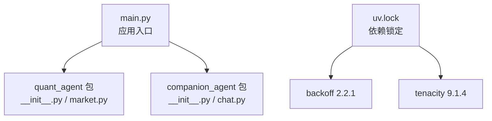
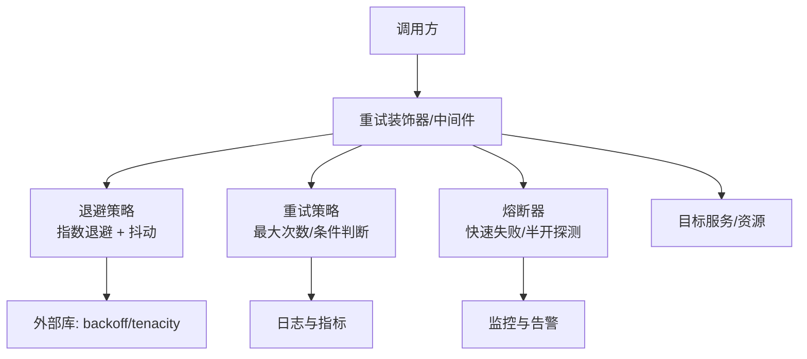
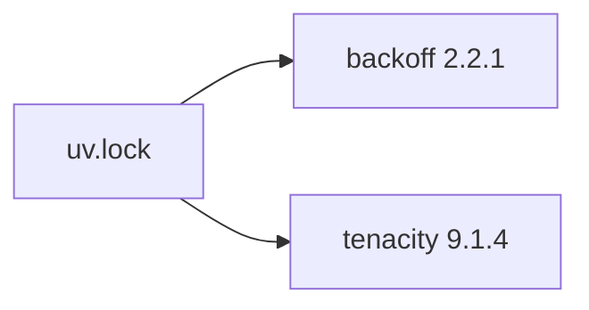

# 重试策略实现

<cite>
**本文引用的文件**   
- [main.py](file://main.py)
- [uv.lock](file://uv.lock)
- [packages/quant-agent/src/quant_agent/__init__.py](file://packages/quant-agent/src/quant_agent/__init__.py)
- [packages/companion-agent/src/companion_agent/__init__.py](file://packages/companion-agent/src/companion_agent/__init__.py)
- [packages/quant-agent/src/quant_agent/market.py](file://packages/quant-agent/src/quant_agent/market.py)
- [packages/companion-agent/src/companion_agent/chat.py](file://packages/companion-agent/src/companion_agent/chat.py)
</cite>

## 目录
1. [简介](#简介)
2. [项目结构](#项目结构)
3. [核心组件](#核心组件)
4. [架构总览](#架构总览)
5. [详细组件分析](#详细组件分析)
6. [依赖分析](#依赖分析)
7. [性能考虑](#性能考虑)
8. [故障排查指南](#故障排查指南)
9. [结论](#结论)
10. [附录](#附录)

## 简介
本文件聚焦于“重试机制”的实现与最佳实践，围绕指数退避算法、抖动策略、重试条件判断、最大重试次数控制、重试间隔计算以及失败熔断机制展开。同时提供不同重试策略的配置示例与性能调优建议，并给出可落地的测试方法。需要特别说明的是：当前仓库中未发现内建的重试实现代码，但存在重试相关第三方库的锁定记录（如 backoff、tenacity），因此本文在“现状说明”的基础上，给出面向该仓库的可扩展设计与落地方案，便于后续在业务模块中引入统一的重试能力。

## 项目结构
仓库采用多包组织方式，包含量化交易智能体与陪伴型智能体两个子包，入口脚本负责初始化并调用各子包的对外接口。当前未在生产代码中发现重试逻辑的直接实现，但依赖清单中包含重试相关的库，为后续引入重试能力提供了基础。

图表来源
- [main.py:1-13](file://main.py#L1-L13)
- [packages/quant-agent/src/quant_agent/__init__.py:1-15](file://packages/quant-agent/src/quant_agent/__init__.py#L1-L15)
- [packages/quant-agent/src/quant_agent/market.py:1-16](file://packages/quant-agent/src/quant_agent/market.py#L1-L16)
- [packages/companion-agent/src/companion_agent/__init__.py:1-15](file://packages/companion-agent/src/companion_agent/__init__.py#L1-L15)
- [packages/companion-agent/src/companion_agent/chat.py:1-12](file://packages/companion-agent/src/companion_agent/chat.py#L1-L12)
- [uv.lock:706-713](file://uv.lock#L706-L713)
- [uv.lock:5117-5122](file://uv.lock#L5117-L5122)

章节来源
- [main.py:1-13](file://main.py#L1-L13)
- [packages/quant-agent/src/quant_agent/__init__.py:1-15](file://packages/quant-agent/src/quant_agent/__init__.py#L1-L15)
- [packages/companion-agent/src/companion_agent/__init__.py:1-15](file://packages/companion-agent/src/companion_agent/__init__.py#L1-L15)
- [uv.lock:706-713](file://uv.lock#L706-L713)
- [uv.lock:5117-5122](file://uv.lock#L5117-L5122)

## 核心组件
- 应用入口 main.py：仅做初始化与打印，不包含业务重试逻辑。
- quant_agent 与 companion_agent 子包：分别提供领域模型与对外接口，当前未包含重试实现。
- 依赖 uv.lock：记录了 backoff 与 tenacity 的版本信息，表明项目具备使用成熟重试库的基础。

章节来源
- [main.py:1-13](file://main.py#L1-L13)
- [packages/quant-agent/src/quant_agent/__init__.py:1-15](file://packages/quant-agent/src/quant_agent/__init__.py#L1-L15)
- [packages/companion-agent/src/companion_agent/__init__.py:1-15](file://packages/companion-agent/src/companion_agent/__init__.py#L1-L15)
- [uv.lock:706-713](file://uv.lock#L706-L713)
- [uv.lock:5117-5122](file://uv.lock#L5117-L5122)

## 架构总览
下图展示了一个通用的重试与熔断架构，适用于未来在业务模块中集成重试能力的场景。该图用于概念性说明，不直接映射到现有源码。

[此图为概念性架构图，无需图表来源]

## 详细组件分析

### 指数退避与抖动策略
- 指数退避：每次重试等待时间按指数增长，避免雪崩效应，典型公式为 base * factor^attempt。
- 抖动：在指数退避基础上叠加随机扰动，降低多个客户端同时重试导致的“惊群”问题。
- 结合外部库：可使用 backoff 或 tenacity 提供的内置策略，减少重复造轮子。

章节来源
- [uv.lock:706-713](file://uv.lock#L706-L713)
- [uv.lock:5117-5122](file://uv.lock#L5117-L5122)

### 重试条件判断
- 基于异常类型：仅对特定异常进行重试（如网络超时、限流）。
- 基于返回码/状态：例如 HTTP 429/5xx 或业务错误码。
- 基于幂等性：确保重试不会导致副作用重复执行。
- 基于上下文：如请求耗时过长、上游健康度低时自动降级或停止重试。

[本节为通用设计说明，不涉及具体源码文件]

### 最大重试次数控制
- 全局上限：防止无限重试导致资源耗尽。
- 分级上限：根据错误严重性与业务重要性设置不同上限。
- 动态调整：依据系统负载与错误率动态调整上限。

[本节为通用设计说明，不涉及具体源码文件]

### 重试间隔计算
- 固定间隔：简单但易造成拥塞。
- 线性退避：间隔线性增长，缓解拥塞但不如指数退避有效。
- 指数退避+抖动：推荐默认策略，兼顾恢复速度与去抖。
- 上限封顶：设置最大等待时间，避免长时间阻塞。

[本节为通用设计说明，不涉及具体源码文件]

### 失败熔断机制
- 熔断三态：关闭→打开→半开。
- 触发条件：错误率阈值、慢调用比例、连续失败次数。
- 恢复策略：半开阶段放行少量请求探测，成功则关闭，失败则继续打开。
- 观察窗口：统计周期内的错误率与延迟分布。

[本节为通用设计说明，不涉及具体源码文件]

### 配置示例（以 tenacity 为例）
- 固定间隔重试：设置最大重试次数与固定等待时间。
- 指数退避+抖动：设置 base、factor、max_delay、jitter。
- 条件重试：仅对指定异常或返回码重试。
- 回调钩子：记录重试次数、等待时间、错误原因。

[本节为通用设计说明，不涉及具体源码文件]

### 测试方法
- 单元测试：
  - 验证重试次数不超过上限。
  - 验证退避时间区间符合预期（允许抖动范围）。
  - 验证仅在指定条件下重试。
- 集成测试：
  - 模拟上游不稳定（间歇性失败后恢复）。
  - 注入网络延迟与超时，验证整体成功率与延迟分布。
- 混沌测试：
  - 随机注入错误与延迟，评估熔断与回退效果。
- 压测：
  - 高并发下验证重试风暴是否被退避与熔断抑制。

[本节为通用设计说明，不涉及具体源码文件]

## 依赖分析
当前仓库的依赖锁定文件中包含重试相关库，但未在业务代码中显式引用。建议在需要重试能力的模块中按需引入。

图表来源
- [uv.lock:706-713](file://uv.lock#L706-L713)
- [uv.lock:5117-5122](file://uv.lock#L5117-L5122)

章节来源
- [uv.lock:706-713](file://uv.lock#L706-L713)
- [uv.lock:5117-5122](file://uv.lock#L5117-L5122)

## 性能考虑
- 合理设置最大重试次数与最大等待时间，避免长尾延迟放大。
- 使用指数退避+抖动抑制重试风暴，降低下游压力。
- 区分可重试与不可重试错误，减少无效重试带来的资源消耗。
- 对非幂等操作增加幂等键或补偿机制，保障一致性。
- 通过指标与日志观测重试成功率、平均等待时间与熔断触发频率，持续优化参数。

[本节为通用指导，不涉及具体源码文件]

## 故障排查指南
- 定位重试风暴：检查是否存在缺少抖动或过大的并发重试。
- 确认重试条件：核对异常类型与返回码过滤是否正确。
- 校验幂等性：确保重试不会导致数据重复写入。
- 熔断有效性：观察错误率阈值与恢复策略是否合理。
- 日志与追踪：在关键边界点记录进入/退出状态、错误信息与重试计数。

[本节为通用指导，不涉及具体源码文件]

## 结论
当前仓库尚未在生产代码中实现重试逻辑，但已锁定 backoff 与 tenacity 等成熟重试库，具备良好的扩展基础。建议在各业务模块中引入统一的重试与熔断能力，采用指数退避+抖动作为默认策略，并结合严格的条件判断与熔断保护，以提升系统的鲁棒性与可用性。

[本节为总结性内容，不涉及具体源码文件]

## 附录
- 入口与模块概览
  - 入口脚本：[main.py:1-13](file://main.py#L1-L13)
  - 量化智能体入口：[packages/quant-agent/src/quant_agent/__init__.py:1-15](file://packages/quant-agent/src/quant_agent/__init__.py#L1-L15)
  - 陪伴智能体入口：[packages/companion-agent/src/companion_agent/__init__.py:1-15](file://packages/companion-agent/src/companion_agent/__init__.py#L1-L15)
  - 领域模型示例：
    - [packages/quant-agent/src/quant_agent/market.py:1-16](file://packages/quant-agent/src/quant_agent/market.py#L1-L16)
    - [packages/companion-agent/src/companion_agent/chat.py:1-12](file://packages/companion-agent/src/companion_agent/chat.py#L1-L12)
- 依赖锁定
  - backoff 2.2.1：[uv.lock:706-713](file://uv.lock#L706-L713)
  - tenacity 9.1.4：[uv.lock:5117-5122](file://uv.lock#L5117-L5122)

章节来源
- [main.py:1-13](file://main.py#L1-L13)
- [packages/quant-agent/src/quant_agent/__init__.py:1-15](file://packages/quant-agent/src/quant_agent/__init__.py#L1-L15)
- [packages/companion-agent/src/companion_agent/__init__.py:1-15](file://packages/companion-agent/src/companion_agent/__init__.py#L1-L15)
- [packages/quant-agent/src/quant_agent/market.py:1-16](file://packages/quant-agent/src/quant_agent/market.py#L1-L16)
- [packages/companion-agent/src/companion_agent/chat.py:1-12](file://packages/companion-agent/src/companion_agent/chat.py#L1-L12)
- [uv.lock:706-713](file://uv.lock#L706-L713)
- [uv.lock:5117-5122](file://uv.lock#L5117-L5122)