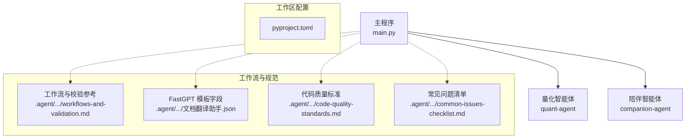
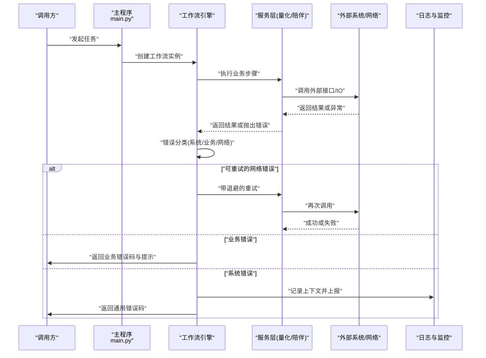
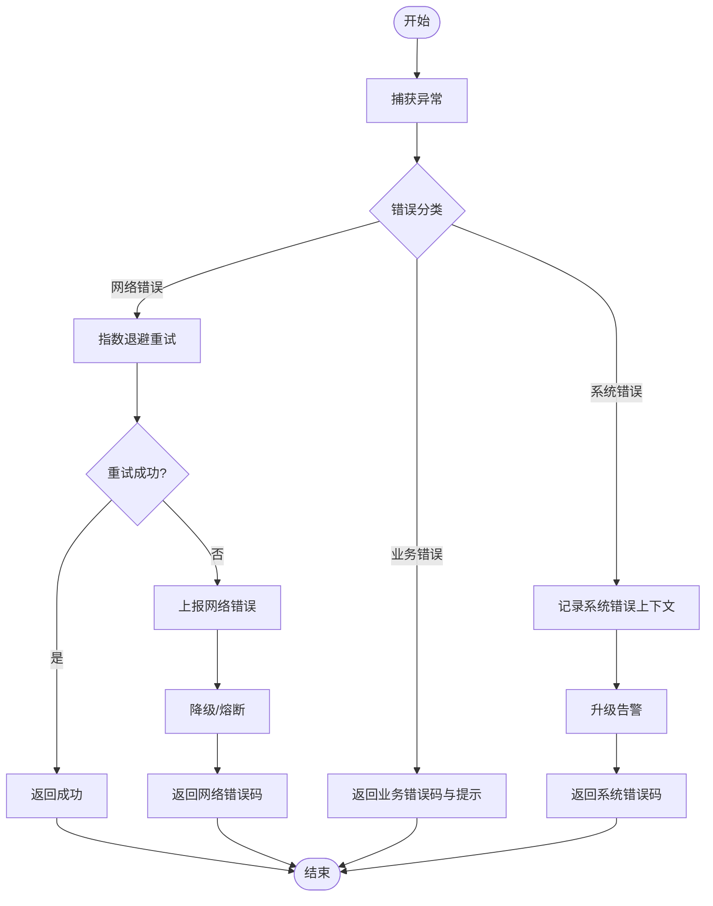
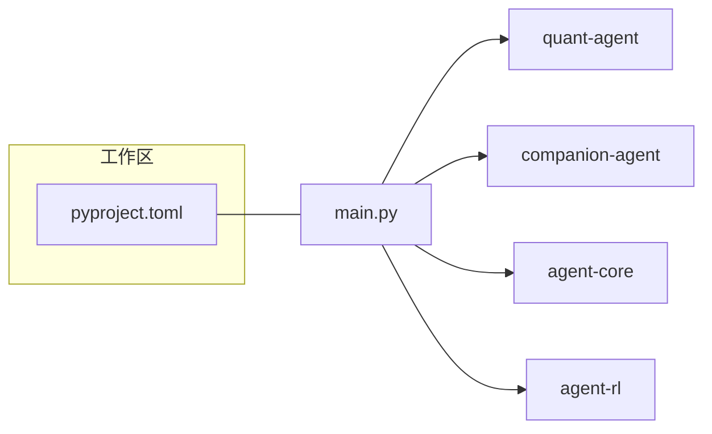

# 错误分类与处理

<cite>
**本文引用的文件**   
- [main.py](file://main.py)
- [pyproject.toml](file://pyproject.toml)
- [workflows-and-validation.md](file://.agent\skills\create-agent-skills\references\workflows-and-validation.md)
- [文档翻译助手.json](file://.agent\skills\fastgpt-workflow-generator\templates\文档翻译助手.json)
- [code-quality-standards.md](file://.agent\skills\local-diff-review\code-quality-standards.md)
- [common-issues-checklist.md](file://.agent\skills\local-diff-review\common-issues-checklist.md)
</cite>

## 目录
1. [引言](#引言)
2. [项目结构](#项目结构)
3. [核心组件](#核心组件)
4. [架构总览](#架构总览)
5. [详细组件分析](#详细组件分析)
6. [依赖分析](#依赖分析)
7. [性能考虑](#性能考虑)
8. [故障排查指南](#故障排查指南)
9. [结论](#结论)
10. [附录](#附录)

## 引言
本文件聚焦于工作流中的错误分类体系与处理策略，目标是：
- 明确系统错误、业务错误、网络错误的定义与识别方法
- 给出统一的错误码规范与错误消息格式标准
- 提供可操作的错误处理配置示例与最佳实践
- 结合仓库中已有的工作流模板与质量规范，形成可落地的错误治理方案

## 项目结构
本项目为多包工作区，主入口通过 main.py 调用各子包能力。错误治理贯穿工作流编排、外部交互与代码质量检查等环节。

图表来源
- [main.py:1-13](file://main.py#L1-L13)
- [pyproject.toml:1-30](file://pyproject.toml#L1-L30)
- [workflows-and-validation.md:469-511](file://.agent\skills\create-agent-skills\references\workflows-and-validation.md#L469-L511)
- [文档翻译助手.json:1070-1119](file://.agent\skills\fastgpt-workflow-generator\templates\文档翻译助手.json#L1070-L1119)
- [code-quality-standards.md:172-205](file://.agent\skills\local-diff-review\code-quality-standards.md#L172-L205)
- [common-issues-checklist.md:165-235](file://.agent\skills\local-diff-review\common-issues-checklist.md#L165-L235)

章节来源
- [main.py:1-13](file://main.py#L1-L13)
- [pyproject.toml:1-30](file://pyproject.toml#L1-L30)

## 核心组件
围绕错误治理的关键要素包括：
- 错误类型划分：系统错误、业务错误、网络错误
- 错误码规范：统一前缀与层级，便于定位与统计
- 错误消息格式：结构化、可观测、可追溯
- 处理流程：捕获、分类、重试/补偿、上报、降级
- 配置化策略：基于工作流模板的 catch/error 字段与恢复路径

章节来源
- [workflows-and-validation.md:469-511](file://.agent\skills\create-agent-skills\references\workflows-and-validation.md#L469-L511)
- [文档翻译助手.json:1070-1119](file://.agent\skills\fastgpt-workflow-generator\templates\文档翻译助手.json#L1070-L1119)
- [code-quality-standards.md:172-205](file://.agent\skills\local-diff-review\code-quality-standards.md#L172-L205)
- [common-issues-checklist.md:165-235](file://.agent\skills\local-diff-review\common-issues-checklist.md#L165-L235)

## 架构总览
下图展示从请求进入、工作流执行到错误分类与处理的端到端流程，覆盖系统、业务、网络三类错误。

图表来源
- [main.py:1-13](file://main.py#L1-L13)
- [workflows-and-validation.md:469-511](file://.agent\skills\create-agent-skills\references\workflows-and-validation.md#L469-L511)
- [文档翻译助手.json:1070-1119](file://.agent\skills\fastgpt-workflow-generator\templates\文档翻译助手.json#L1070-L1119)

## 详细组件分析

### 错误类型定义与识别
- 系统错误
  - 定义：运行时环境、资源、依赖不可用导致的错误（如磁盘空间不足、权限不足、依赖缺失）
  - 识别：无业务语义、通常伴随底层异常堆栈；在模板中对应 system_error_text 等字段
  - 处理：记录完整上下文、快速失败、必要时触发告警与回滚
- 业务错误
  - 定义：输入不合法、状态机不允许转换、规则校验失败等
  - 识别：具有明确业务含义的错误码与消息；可通过工作流分支进行判定
  - 处理：返回具体错误码与用户可读提示，避免泄露内部细节
- 网络错误
  - 定义：超时、连接失败、DNS解析失败、HTTP非2xx等
  - 识别：包含网络相关异常信息；适合做重试与熔断
  - 处理：指数退避重试、熔断降级、限流保护

章节来源
- [文档翻译助手.json:1070-1119](file://.agent\skills\fastgpt-workflow-generator\templates\文档翻译助手.json#L1070-L1119)
- [workflows-and-validation.md:469-511](file://.agent\skills\create-agent-skills\references\workflows-and-validation.md#L469-L511)

### 错误码规范
建议采用“模块前缀 + 类别 + 编号”的结构，保证全局唯一且可读：
- 前缀：按子系统划分，如 QNT(量化)、CMP(陪伴)、SYS(系统)
- 类别：BUS(业务)、NET(网络)、SYS(系统)
- 编号：三位数，按场景递增
- 示例（仅说明结构，不含具体值）：QNT-BUS-001、CMP-NET-002、SYS-SYS-003

使用要点：
- 对外只暴露稳定、稳定的错误码集合
- 错误码与错误消息分离，消息面向用户，错误码面向机器
- 对网络错误优先使用标准 HTTP 状态码映射，再叠加业务扩展码

章节来源
- [code-quality-standards.md:172-205](file://.agent\skills\local-diff-review\code-quality-standards.md#L172-L205)

### 错误消息格式标准
推荐统一响应结构（以字段名示意）：
- code: 错误码（字符串）
- message: 人类可读的错误描述（中文为主）
- details: 可选，调试信息（敏感信息脱敏）
- trace_id: 可选，链路追踪ID
- retryable: 是否可重试（布尔）
- category: 错误类别（system/business/network）

原则：
- 对用户可见的消息不包含堆栈、密钥、内部路径
- 对运维侧保留足够上下文（trace_id、时间戳、参数摘要）
- 保持消息简洁、一致、可本地化

章节来源
- [common-issues-checklist.md:165-235](file://.agent\skills\local-diff-review\common-issues-checklist.md#L165-L235)

### 处理流程与策略
- 捕获与分类
  - 在边界处集中捕获，依据异常类型与上下文进行分类
  - 将原始异常包装为统一错误对象，附带 code、message、category、retryable
- 重试与补偿
  - 网络错误：指数退避+最大重试次数；幂等接口支持重试
  - 业务错误：一般不重试，直接返回
  - 系统错误：根据影响面决定是否重试或快速失败
- 上报与降级
  - 关键错误上报监控平台，附带 trace_id 与必要上下文
  - 对依赖不稳定时启用降级策略（缓存、默认值、只读模式）
- 用户反馈
  - 向调用方返回错误码与友好消息
  - 对可修复问题给出下一步操作指引

图表来源
- [workflows-and-validation.md:469-511](file://.agent\skills\create-agent-skills\references\workflows-and-validation.md#L469-L511)

### 工作流模板中的错误字段与恢复
- 模板字段
  - system_error_text：用于承载系统级错误文本
  - reasoningText：推理过程文本，可用于辅助诊断
  - error 类型字段：用于显式标记错误节点
- 恢复策略
  - 校验失败：回退到输入阶段或修正逻辑后重试
  - 保存失败：检查磁盘、权限、路径，修正后重试
  - 多次失败：收集上下文、保存部分结果、上报用户

章节来源
- [文档翻译助手.json:1070-1119](file://.agent\skills\fastgpt-workflow-generator\templates\文档翻译助手.json#L1070-L1119)
- [workflows-and-validation.md:469-511](file://.agent\skills\create-agent-skills\references\workflows-and-validation.md#L469-L511)

### 代码质量与错误处理规范
- 必须
  - 所有异步操作具备 try-catch 或 .catch()
  - 区分业务错误与系统错误
  - 错误日志包含上下文信息
- 建议
  - 保留原始错误原因，避免丢失堆栈
  - 静默忽略需有明确注释与理由
  - 错误信息清晰、可操作

章节来源
- [code-quality-standards.md:172-205](file://.agent\skills\local-diff-review\code-quality-standards.md#L172-L205)
- [common-issues-checklist.md:165-235](file://.agent\skills\local-diff-review\common-issues-checklist.md#L165-L235)

## 依赖分析
主程序依赖多个子包，错误治理需要在各包边界统一实现。

图表来源
- [main.py:1-13](file://main.py#L1-L13)
- [pyproject.toml:1-30](file://pyproject.toml#L1-L30)

章节来源
- [main.py:1-13](file://main.py#L1-L13)
- [pyproject.toml:1-30](file://pyproject.toml#L1-L30)

## 性能考虑
- 重试策略
  - 指数退避与抖动，避免雪崩
  - 设置最大重试次数与总超时上限
- 熔断与限流
  - 对不稳定依赖启用熔断器
  - 对热点接口实施限流
- 日志与监控
  - 控制日志级别与采样率
  - 关键指标埋点（错误率、延迟、重试次数）

[本节为通用指导，无需源码引用]

## 故障排查指南
- 快速定位
  - 通过 trace_id 关联全链路日志
  - 关注错误码与 category，先分系统/业务/网络
- 常见陷阱
  - 错误丢失：捕获后不要丢弃原始错误，应保留 cause
  - 静默忽略：空 catch 必须有注释说明原因
  - 过度包装：避免多层包裹导致堆栈过长
- 处置建议
  - 网络错误：检查超时、重试、熔断配置
  - 业务错误：核对输入校验与状态机
  - 系统错误：检查资源、权限、依赖版本

章节来源
- [common-issues-checklist.md:165-235](file://.agent\skills\local-diff-review\common-issues-checklist.md#L165-L235)
- [code-quality-standards.md:172-205](file://.agent\skills\local-diff-review\code-quality-standards.md#L172-L205)

## 结论
通过统一的错误分类、错误码与消息规范，以及可配置的工作流恢复策略，可以在保证用户体验的同时提升系统的可观测性与稳定性。建议在项目中落地以下要点：
- 在边界集中捕获与分类
- 严格区分系统/业务/网络错误
- 使用模板字段承载错误上下文
- 建立重试、熔断、降级的组合策略
- 完善日志与监控，确保可追溯

[本节为总结性内容，无需源码引用]

## 附录

### 错误处理配置示例（基于工作流模板）
- 在模板中声明错误字段
  - 使用 system_error_text 承载系统错误文本
  - 使用 reasoningText 记录推理过程，辅助诊断
- 定义恢复路径
  - 校验失败：回退到输入或修正逻辑后重试
  - 保存失败：检查磁盘、权限、路径，修正后重试
  - 多次失败：收集上下文、保存部分结果、上报用户

章节来源
- [文档翻译助手.json:1070-1119](file://.agent\skills\fastgpt-workflow-generator\templates\文档翻译助手.json#L1070-L1119)
- [workflows-and-validation.md:469-511](file://.agent\skills\create-agent-skills\references\workflows-and-validation.md#L469-L511)