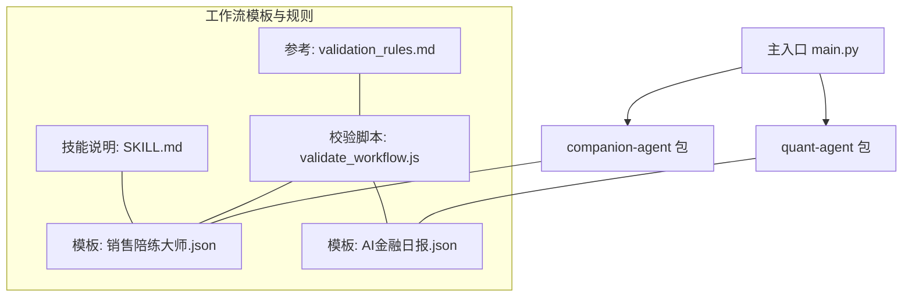
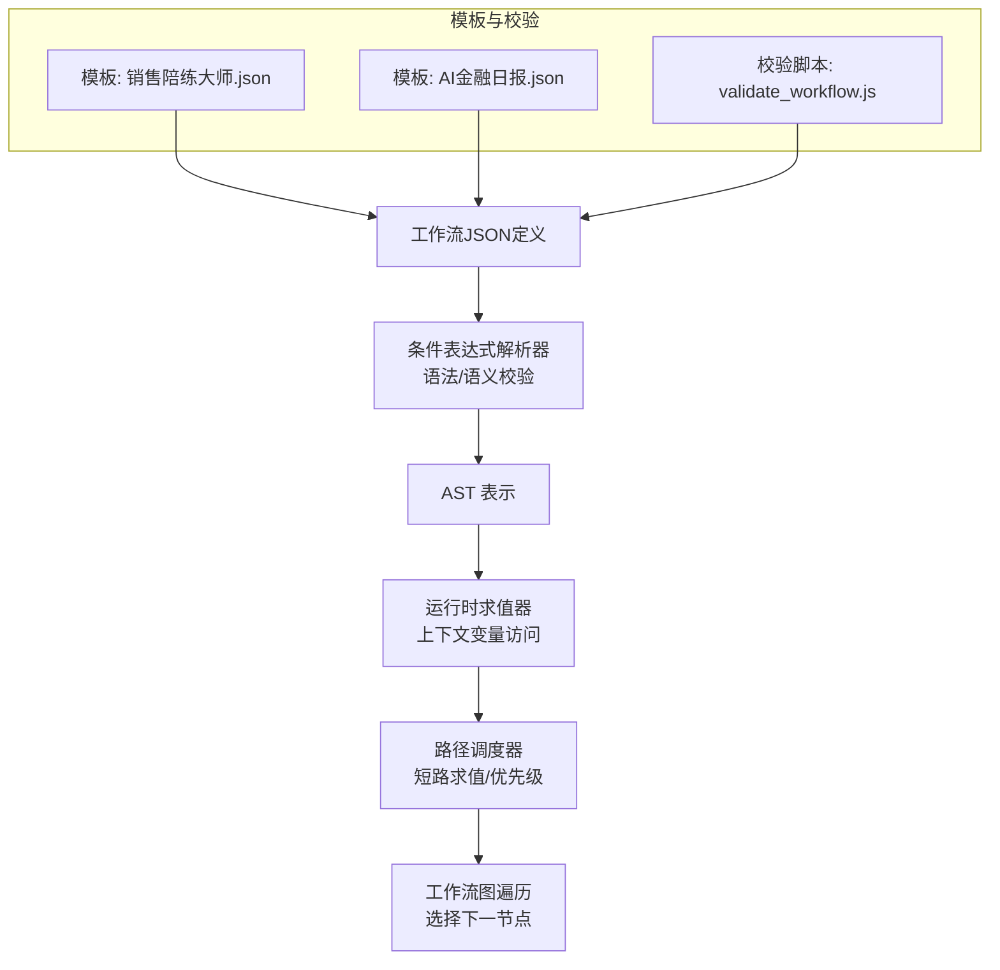
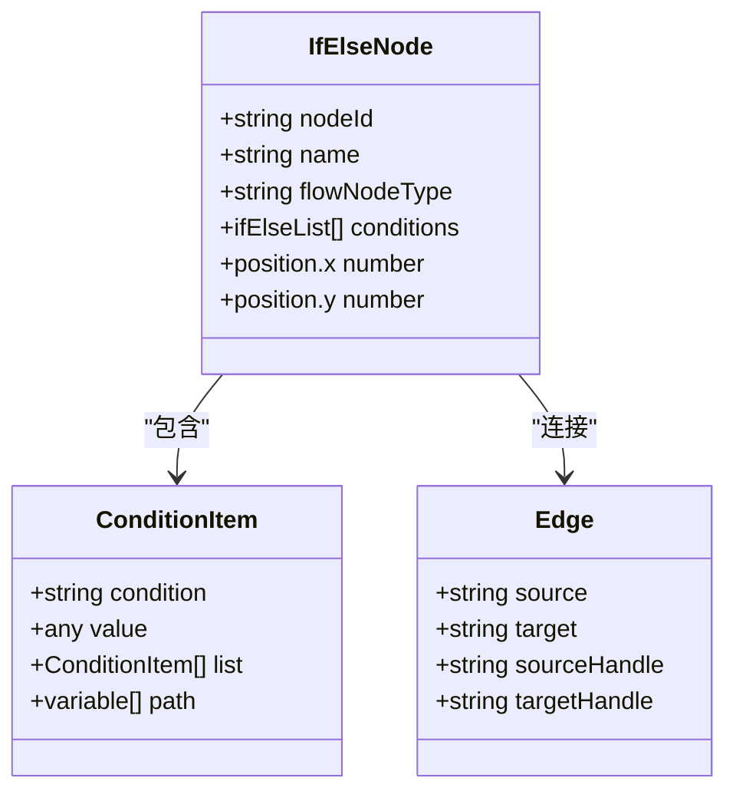
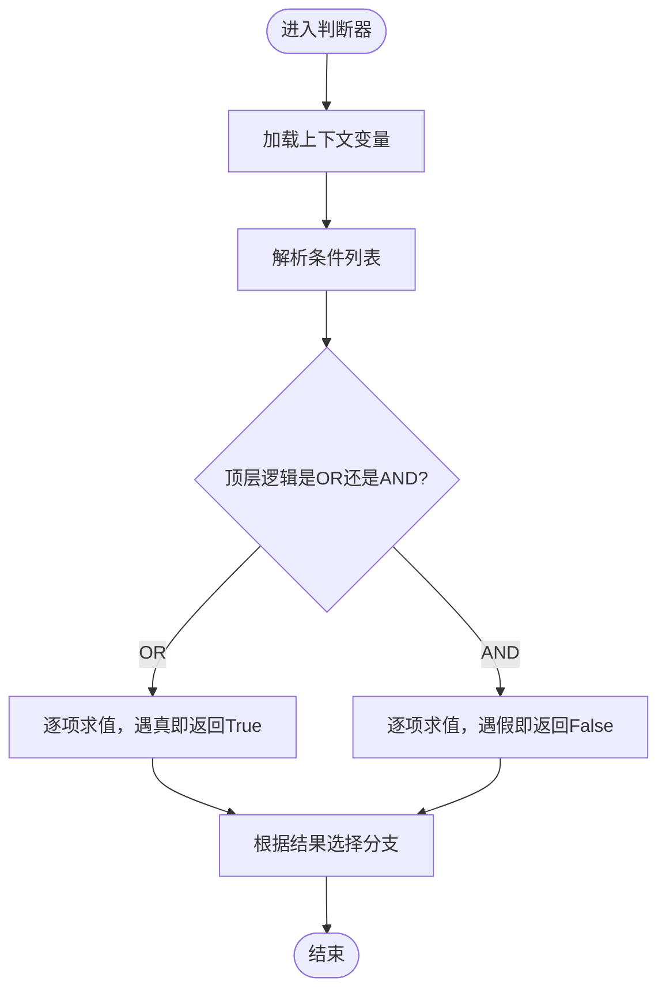
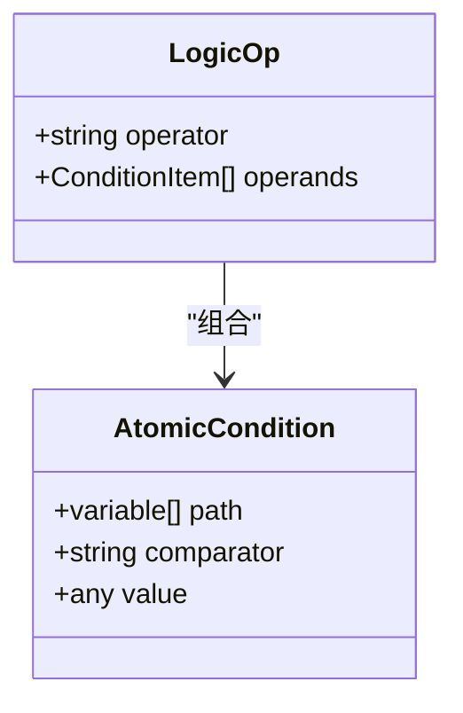
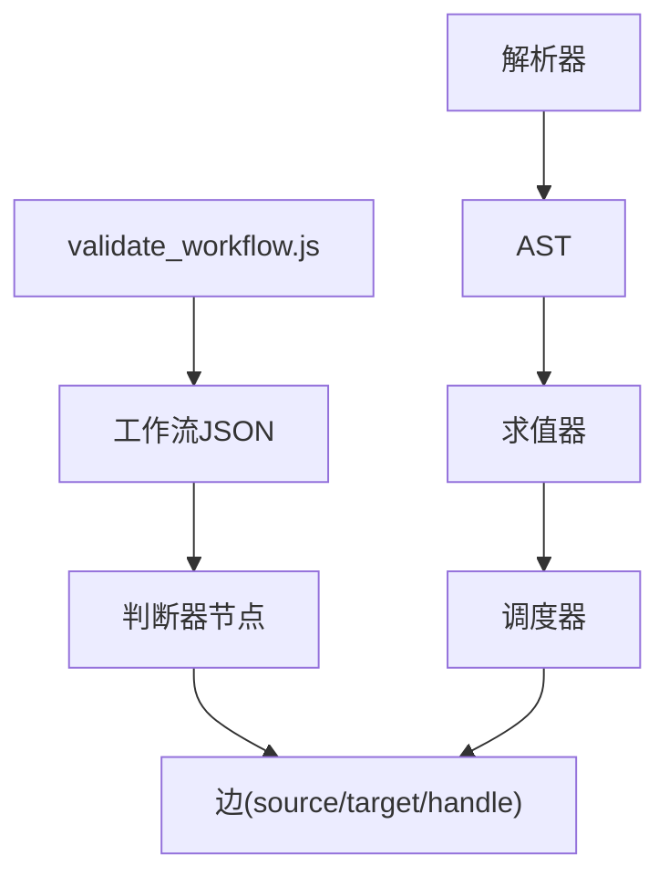

# 条件分支处理

<cite>
**本文引用的文件**
- [main.py](file://main.py)
- [chat.py](file://packages/companion-agent/src/companion_agent/chat.py)
- [memory.py](file://packages/companion-agent/src/companion_agent/memory.py)
- [market.py](file://packages/quant-agent/src/quant_agent/market.py)
- [strategies.py](file://packages/quant-agent/src/quant_agent/strategies.py)
- [__init__.py (agent-core)](file://packages/agent-core/src/agent_core/__init__.py)
- [__init__.py (agent-rl)](file://packages/agent-rl/src/agent_rl/__init__.py)
- [__init__.py (companion-agent)](file://packages/companion-agent/src/companion_agent/__init__.py)
- [__init__.py (quant-agent)](file://packages/quant-agent/src/quant_agent/__init__.py)
- [validation_rules.md](file://.agent/skills/fastgpt-workflow-generator/references/validation_rules.md)
- [validate_workflow.js](file://.agent/skills/fastgpt-workflow-generator/scripts/validate_workflow.js)
- [模板_销售陪练大师.json](file://.agent/skills/fastgpt-workflow-generator/templates/销售陪练大师.json)
- [模板_AI金融日报.json](file://.agent/skills/fastgpt-workflow-generator/templates/AI金融日报.json)
- [SKILL.md](file://.agent/skills/fastgpt-workflow-generator/SKILL.md)
</cite>

## 目录
1. [简介](#简介)
2. [项目结构](#项目结构)
3. [核心组件](#核心组件)
4. [架构总览](#架构总览)
5. [详细组件分析](#详细组件分析)
6. [依赖分析](#依赖分析)
7. [性能考虑](#性能考虑)
8. [故障排查指南](#故障排查指南)
9. [结论](#结论)
10. [附录](#附录)

## 简介
本技术文档聚焦于工作流编排引擎的“条件分支处理”模块，围绕以下目标展开：
- 决策树的数据结构设计：节点类型、条件表达式存储与分支路径管理
- 条件表达式解析器：语法分析、语义验证与运行时求值机制
- 动态路径选择算法：上下文变量访问、条件优先级与短路求值优化
- 复杂条件组合：AND/OR 逻辑运算、嵌套条件与正则匹配
- 实际使用示例：如何配置和使用各类条件分支场景

需要特别说明的是，当前仓库中并未发现直接实现条件分支与表达式解析的 Python 源码。因此，本文基于仓库内已有的工作流模板与校验脚本（JavaScript）进行逆向分析与设计建议，并给出可落地的架构与实现方案。

## 项目结构
仓库采用多包组织方式，包含多个独立 Agent 子包以及一个主入口。与条件分支相关的素材主要位于 .agent/skills/fastgpt-workflow-generator 下的模板与校验脚本，用于描述工作流节点、边与判断器的结构。



图表来源
- [main.py:1-13](file://main.py#L1-L13)
- [模板_销售陪练大师.json:639-690](file://.agent/skills/fastgpt-workflow-generator/templates/销售陪练大师.json#L639-L690)
- [模板_AI金融日报.json:2966-3007](file://.agent/skills/fastgpt-workflow-generator/templates/AI金融日报.json#L2966-L3007)
- [validate_workflow.js:236-284](file://.agent/skills/fastgpt-workflow-generator/scripts/validate_workflow.js#L236-L284)
- [validation_rules.md:306-310](file://.agent/skills/fastgpt-workflow-generator/references/validation_rules.md#L306-L310)
- [SKILL.md:73-179](file://.agent/skills/fastgpt-workflow-generator/SKILL.md#L73-L179)

章节来源
- [main.py:1-13](file://main.py#L1-L13)
- [模板_销售陪练大师.json:639-690](file://.agent/skills/fastgpt-workflow-generator/templates/销售陪练大师.json#L639-L690)
- [模板_AI金融日报.json:2966-3007](file://.agent/skills/fastgpt-workflow-generator/templates/AI金融日报.json#L2966-L3007)
- [validate_workflow.js:236-284](file://.agent/skills/fastgpt-workflow-generator/scripts/validate_workflow.js#L236-L284)
- [validation_rules.md:306-310](file://.agent/skills/fastgpt-workflow-generator/references/validation_rules.md#L306-L310)
- [SKILL.md:73-179](file://.agent/skills/fastgpt-workflow-generator/SKILL.md#L73-L179)

## 核心组件
本节从仓库现有素材出发，抽象出条件分支处理的核心组件与职责边界：
- 决策树模型：以“判断器”节点为核心，承载条件列表、逻辑运算符与分支出口
- 表达式解析器：负责将声明式条件转换为可执行 AST，并进行语法/语义校验
- 运行时求值器：在上下文中解析变量引用、执行比较/逻辑/正则等操作
- 路径调度器：依据求值结果选择下一个节点，支持短路求值与优先级策略
- 校验与可视化：提供 JSON Schema 校验、连通性检查与调试标签输出

章节来源
- [模板_销售陪练大师.json:639-690](file://.agent/skills/fastgpt-workflow-generator/templates/销售陪练大师.json#L639-L690)
- [模板_AI金融日报.json:2966-3007](file://.agent/skills/fastgpt-workflow-generator/templates/AI金融日报.json#L2966-L3007)
- [validate_workflow.js:236-284](file://.agent/skills/fastgpt-workflow-generator/scripts/validate_workflow.js#L236-L284)
- [validation_rules.md:306-310](file://.agent/skills/fastgpt-workflow-generator/references/validation_rules.md#L306-L310)

## 架构总览
下图展示了条件分支处理在工作流中的位置与交互关系：工作流定义由 JSON 描述，其中包含“判断器”节点；运行时由解析器与求值器协作完成分支选择，最终驱动图遍历。



图表来源
- [模板_销售陪练大师.json:639-690](file://.agent/skills/fastgpt-workflow-generator/templates/销售陪练大师.json#L639-L690)
- [模板_AI金融日报.json:2966-3007](file://.agent/skills/fastgpt-workflow-generator/templates/AI金融日报.json#L2966-L3007)
- [validate_workflow.js:236-284](file://.agent/skills/fastgpt-workflow-generator/scripts/validate_workflow.js#L236-L284)

## 详细组件分析

### 决策树数据结构设计
- 节点类型
  - 判断器节点：用于条件分支，包含条件列表、逻辑运算符与分支出口
  - 输入/输出节点：数据汇聚与结果输出
  - 工具/插件节点：外部能力调用
- 条件表达式存储
  - 每个条件项包含：变量路径、比较操作符、常量值或子条件集合
  - 支持 OR/AND 聚合，形成层次化条件树
- 分支路径管理
  - 每个分支对应一个目标节点 ID 或默认分支
  - 通过 sourceHandle/targetHandle 建立有向边，形成可达图



图表来源
- [模板_销售陪练大师.json:639-690](file://.agent/skills/fastgpt-workflow-generator/templates/销售陪练大师.json#L639-L690)
- [模板_AI金融日报.json:2966-3007](file://.agent/skills/fastgpt-workflow-generator/templates/AI金融日报.json#L2966-L3007)

章节来源
- [模板_销售陪练大师.json:639-690](file://.agent/skills/fastgpt-workflow-generator/templates/销售陪练大师.json#L639-L690)
- [模板_AI金融日报.json:2966-3007](file://.agent/skills/fastgpt-workflow-generator/templates/AI金融日报.json#L2966-L3007)

### 条件表达式解析器实现
- 语法分析
  - 将声明式条件（如 variable、condition、value、list）解析为 AST
  - 支持嵌套 list 表达 AND/OR 组合
- 语义验证
  - 校验变量路径是否存在于上下文
  - 校验比较操作符是否合法（如 equalTo、include 等）
  - 校验值类型与变量类型兼容
- 运行时求值
  - 在给定上下文中解析变量引用
  - 执行比较、逻辑与正则匹配
  - 返回布尔结果供调度器使用

```mermaid
sequenceDiagram
participant WF as "工作流JSON"
participant PAR as "解析器"
participant VAL as "语义校验"
participant RUN as "运行时求值器"
participant DSP as "路径调度器"
WF->>PAR : 读取 ifElseList
PAR->>VAL : 生成AST并校验语法/语义
VAL-->>PAR : 校验通过/错误
PAR->>RUN : 传入上下文与AST
RUN-->>DSP : 返回布尔结果
DSP->>DSP : 短路求值/优先级处理
DSP-->>WF : 选择下一节点
```

图表来源
- [模板_销售陪练大师.json:639-690](file://.agent/skills/fastgpt-workflow-generator/templates/销售陪练大师.json#L639-L690)
- [validate_workflow.js:236-284](file://.agent/skills/fastgpt-workflow-generator/scripts/validate_workflow.js#L236-L284)

章节来源
- [模板_销售陪练大师.json:639-690](file://.agent/skills/fastgpt-workflow-generator/templates/销售陪练大师.json#L639-L690)
- [validate_workflow.js:236-284](file://.agent/skills/fastgpt-workflow-generator/scripts/validate_workflow.js#L236-L284)

### 动态路径选择算法
- 上下文变量访问
  - 支持数组路径访问（如 ["VARIABLE_NODE_ID", "对话轮数"]）
  - 支持模板引用格式（如 {{$nodeId.key$}}），需先替换再求值
- 条件优先级处理
  - 外层逻辑（OR/AND）优先于内部比较
  - 短路求值：OR 遇到真即止，AND 遇到假即止
- 短路求值优化
  - 按声明顺序评估，尽早返回
  - 对复杂子条件缓存中间结果，避免重复计算



图表来源
- [模板_销售陪练大师.json:639-690](file://.agent/skills/fastgpt-workflow-generator/templates/销售陪练大师.json#L639-L690)
- [SKILL.md:73-179](file://.agent/skills/fastgpt-workflow-generator/SKILL.md#L73-L179)

章节来源
- [模板_销售陪练大师.json:639-690](file://.agent/skills/fastgpt-workflow-generator/templates/销售陪练大师.json#L639-L690)
- [SKILL.md:73-179](file://.agent/skills/fastgpt-workflow-generator/SKILL.md#L73-L179)

### 复杂条件组合处理
- AND/OR 逻辑运算
  - 使用 list 嵌套表达组合条件
  - 外层指定逻辑运算符（如 OR），内层为原子条件
- 嵌套条件
  - 支持多层嵌套，便于表达复杂业务规则
- 正则表达式匹配
  - 在比较操作中引入正则模式，提升文本匹配能力
  - 建议在语义校验阶段预编译正则，提高运行期性能



图表来源
- [模板_销售陪练大师.json:639-690](file://.agent/skills/fastgpt-workflow-generator/templates/销售陪练大师.json#L639-L690)

章节来源
- [模板_销售陪练大师.json:639-690](file://.agent/skills/fastgpt-workflow-generator/templates/销售陪练大师.json#L639-L690)

### 实际使用示例
- 基础分支：当“对话轮数”等于 1 时走分支A，否则走分支B
- 复合分支：当“用户输入包含‘重新开始’”或“对话轮数等于 1”时走分支A
- 正则分支：当“用户输入匹配特定模式”时走分支A
- 嵌套分支：外层为 OR，内层为多个 AND 条件组合

以上示例均可在“销售陪练大师”模板中找到对应的 ifElseList 结构与变量路径引用。

章节来源
- [模板_销售陪练大师.json:639-690](file://.agent/skills/fastgpt-workflow-generator/templates/销售陪练大师.json#L639-L690)

## 依赖分析
- 组件耦合
  - 判断器节点与工作流边强耦合，依赖 sourceHandle/targetHandle 确定流向
  - 解析器与校验脚本解耦，前者关注 AST，后者关注连通性与完整性
- 外部依赖
  - JavaScript 校验脚本用于工作流结构的静态检查
  - 模板 JSON 作为运行时输入，驱动解析与求值流程



图表来源
- [模板_AI金融日报.json:2966-3007](file://.agent/skills/fastgpt-workflow-generator/templates/AI金融日报.json#L2966-L3007)
- [validate_workflow.js:236-284](file://.agent/skills/fastgpt-workflow-generator/scripts/validate_workflow.js#L236-L284)

章节来源
- [模板_AI金融日报.json:2966-3007](file://.agent/skills/fastgpt-workflow-generator/templates/AI金融日报.json#L2966-L3007)
- [validate_workflow.js:236-284](file://.agent/skills/fastgpt-workflow-generator/scripts/validate_workflow.js#L236-L284)

## 性能考虑
- 短路求值：在 OR/AND 组合中尽早返回，减少不必要的求值开销
- 正则预编译：在语义校验阶段编译正则，避免运行期重复构建
- 变量缓存：对频繁访问的上下文变量进行缓存，降低查找成本
- 条件排序：将高命中率的原子条件前置，提升短路效率
- 增量更新：在上下文变化较小时，复用上次求值结果

[本节为通用指导，不直接分析具体文件]

## 故障排查指南
- 常见错误
  - 缺少必要节点：如 workflowStart、systemConfig/userGuide、answerNode/pluginOutput
  - 连通性问题：存在不可达节点或断链
  - 条件语法错误：变量路径不存在、比较操作符非法、值类型不匹配
- 定位方法
  - 使用校验脚本进行静态检查，获取错误与警告信息
  - 借助 debugLabel 与日志输出，追踪分支选择过程
  - 逐步简化条件，定位问题所在子条件

章节来源
- [validate_workflow.js:236-284](file://.agent/skills/fastgpt-workflow-generator/scripts/validate_workflow.js#L236-L284)
- [validation_rules.md:306-310](file://.agent/skills/fastgpt-workflow-generator/references/validation_rules.md#L306-L310)

## 结论
通过对仓库中工作流模板与校验脚本的分析，我们抽象出条件分支处理的完整架构与实现要点。尽管当前仓库未包含直接的 Python 实现，但基于现有素材可以设计出高效、可扩展的条件分支模块，涵盖决策树结构、表达式解析、运行时求值与路径调度等关键环节。建议后续在 agent-core 或 companion-agent 中落地该模块，并与现有消息/记忆/市场等组件集成，形成统一的工作流编排能力。

[本节为总结性内容，不直接分析具体文件]

## 附录
- 相关包与入口
  - 主入口：main.py
  - companion-agent：聊天与记忆数据模型
  - quant-agent：市场与策略数据模型
  - agent-core、agent-rl：占位包，待扩展

章节来源
- [main.py:1-13](file://main.py#L1-L13)
- [chat.py:1-12](file://packages/companion-agent/src/companion_agent/chat.py#L1-L12)
- [memory.py:1-12](file://packages/companion-agent/src/companion_agent/memory.py#L1-L12)
- [market.py:1-12](file://packages/quant-agent/src/quant_agent/market.py#L1-L12)
- [strategies.py:1-12](file://packages/quant-agent/src/quant_agent/strategies.py#L1-L12)
- [__init__.py (agent-core):1-12](file://packages/agent-core/src/agent_core/__init__.py#L1-L12)
- [__init__.py (agent-rl):1-12](file://packages/agent-rl/src/agent_rl/__init__.py#L1-L12)
- [__init__.py (companion-agent):1-12](file://packages/companion-agent/src/companion_agent/__init__.py#L1-L12)
- [__init__.py (quant-agent):1-12](file://packages/quant-agent/src/quant_agent/__init__.py#L1-L12)