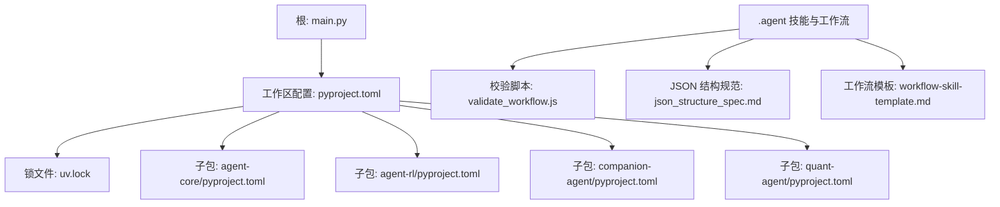
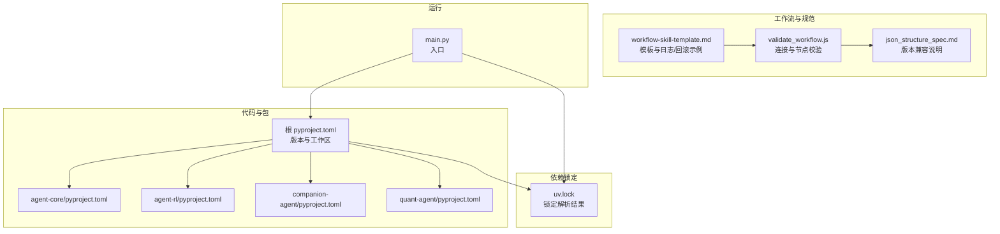
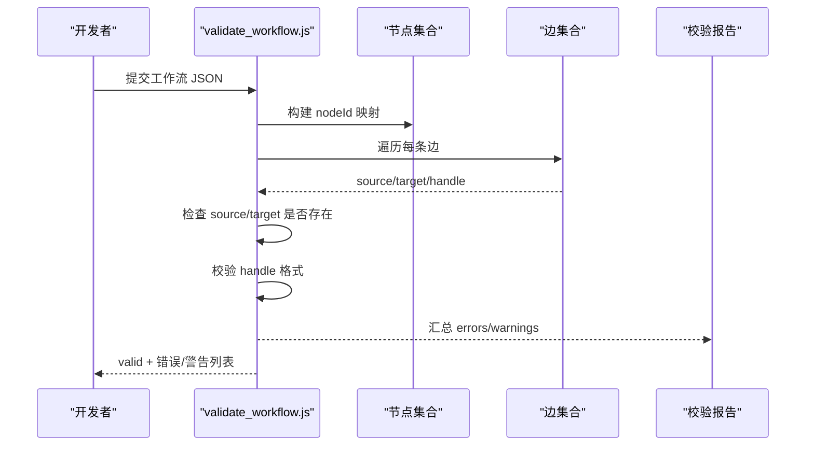
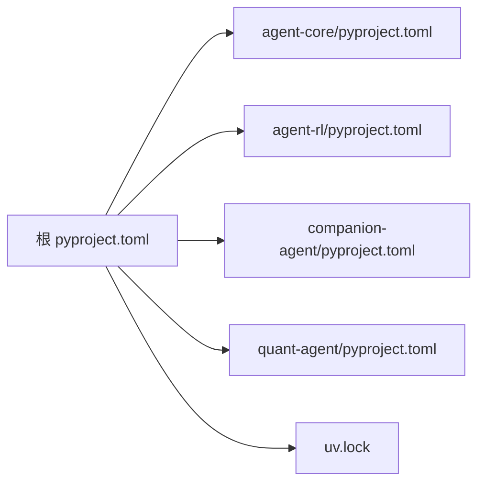

# 版本管理

<cite>
**本文引用的文件**   
- [README.md](file://README.md)
- [main.py](file://main.py)
- [pyproject.toml](file://pyproject.toml)
- [uv.lock](file://uv.lock)
- [packages/agent-core/pyproject.toml](file://packages/agent-core/pyproject.toml)
- [packages/agent-rl/pyproject.toml](file://packages/agent-rl/pyproject.toml)
- [packages/companion-agent/pyproject.toml](file://packages/companion-agent/pyproject.toml)
- [packages/quant-agent/pyproject.toml](file://packages/quant-agent/pyproject.toml)
- [.agent/skills/fastgpt-workflow-generator/scripts/validate_workflow.js](file://.agent/skills/fastgpt-workflow-generator/scripts/validate_workflow.js)
- [.agent/skills/fastgpt-workflow-generator/references/json_structure_spec.md](file://.agent/skills/fastgpt-workflow-generator/references/json_structure_spec.md)
- [.agent/skills/create-skill-file/templates/workflow-skill-template.md](file://.agent/skills/create-skill-file/templates/workflow-skill-template.md)
</cite>

## 目录
1. [引言](#引言)
2. [项目结构](#项目结构)
3. [核心组件](#核心组件)
4. [架构总览](#架构总览)
5. [详细组件分析](#详细组件分析)
6. [依赖分析](#依赖分析)
7. [性能考虑](#性能考虑)
8. [故障排查指南](#故障排查指南)
9. [结论](#结论)
10. [附录](#附录)

## 引言
本技术文档面向工作流编排引擎的版本管理系统，聚焦以下目标：
- 定义工作流版本的规范与策略（版本号、变更日志、兼容性矩阵）
- 明确向后兼容保证机制（字段废弃、默认值、渐进式迁移）
- 文档化部署与升级流程（灰度发布、回滚、监控告警）
- 提供冲突检测与自动修复方案（依赖锁定、冲突解决算法）
- 总结最佳实践与常见问题解决方案

该仓库采用 Python 工作区模式与 uv 包管理器，配合多子包（agent-core、agent-rl、companion-agent、quant-agent），并通过 .agent 下的技能与工作流模板进行编排。版本管理贯穿“代码—配置—工作流—运行时”全链路。

## 项目结构
仓库根目录包含应用入口、工作区配置与锁文件；packages 下为各子包；.agent 下包含工作流生成器、校验脚本与模板等。

图示来源
- [main.py:1-13](file://main.py#L1-L13)
- [pyproject.toml:1-30](file://pyproject.toml#L1-L30)
- [uv.lock:1-50](file://uv.lock#L1-L50)
- [packages/agent-core/pyproject.toml:1-18](file://packages/agent-core/pyproject.toml#L1-L18)
- [packages/agent-rl/pyproject.toml:1-17](file://packages/agent-rl/pyproject.toml#L1-L17)
- [packages/companion-agent/pyproject.toml:1-18](file://packages/companion-agent/pyproject.toml#L1-L18)
- [packages/quant-agent/pyproject.toml:1-18](file://packages/quant-agent/pyproject.toml#L1-L18)
- [.agent/skills/fastgpt-workflow-generator/scripts/validate_workflow.js:122-171](file://.agent/skills/fastgpt-workflow-generator/scripts/validate_workflow.js#L122-L171)
- [.agent/skills/fastgpt-workflow-generator/references/json_structure_spec.md:473-514](file://.agent/skills/fastgpt-workflow-generator/references/json_structure_spec.md#L473-L514)
- [.agent/skills/create-skill-file/templates/workflow-skill-template.md:248-287](file://.agent/skills/create-skill-file/templates/workflow-skill-template.md#L248-L287)

章节来源
- [README.md:39-94](file://README.md#L39-L94)
- [main.py:1-13](file://main.py#L1-L13)
- [pyproject.toml:1-30](file://pyproject.toml#L1-L30)

## 核心组件
- 工作区与版本声明
  - 根 pyproject.toml 声明工作区成员与依赖，统一版本与构建后端
  - 各子包 pyproject.toml 各自声明包名、版本与脚本入口
- 依赖锁定
  - uv.lock 固化第三方与内部工作区包的解析结果，确保可重复构建
- 工作流与校验
  - .agent 下提供工作流模板与 JSON 结构规范，以及连接与节点校验脚本
- 运行入口
  - main.py 作为框架入口，加载并调用子包能力

章节来源
- [pyproject.toml:14-30](file://pyproject.toml#L14-L30)
- [packages/agent-core/pyproject.toml:1-18](file://packages/agent-core/pyproject.toml#L1-L18)
- [packages/agent-rl/pyproject.toml:1-17](file://packages/agent-rl/pyproject.toml#L1-L17)
- [packages/companion-agent/pyproject.toml:1-18](file://packages/companion-agent/pyproject.toml#L1-L18)
- [packages/quant-agent/pyproject.toml:1-18](file://packages/quant-agent/pyproject.toml#L1-L18)
- [uv.lock:1-50](file://uv.lock#L1-L50)
- [.agent/skills/fastgpt-workflow-generator/scripts/validate_workflow.js:122-171](file://.agent/skills/fastgpt-workflow-generator/scripts/validate_workflow.js#L122-L171)
- [.agent/skills/fastgpt-workflow-generator/references/json_structure_spec.md:473-514](file://.agent/skills/fastgpt-workflow-generator/references/json_structure_spec.md#L473-L514)
- [main.py:1-13](file://main.py#L1-L13)

## 架构总览
从版本管理的视角，系统由“代码版本—依赖锁定—工作流版本—校验与执行”四层组成。

图示来源
- [pyproject.toml:1-30](file://pyproject.toml#L1-L30)
- [packages/agent-core/pyproject.toml:1-18](file://packages/agent-core/pyproject.toml#L1-L18)
- [packages/agent-rl/pyproject.toml:1-17](file://packages/agent-rl/pyproject.toml#L1-L17)
- [packages/companion-agent/pyproject.toml:1-18](file://packages/companion-agent/pyproject.toml#L1-L18)
- [packages/quant-agent/pyproject.toml:1-18](file://packages/quant-agent/pyproject.toml#L1-L18)
- [uv.lock:1-50](file://uv.lock#L1-L50)
- [.agent/skills/fastgpt-workflow-generator/scripts/validate_workflow.js:122-171](file://.agent/skills/fastgpt-workflow-generator/scripts/validate_workflow.js#L122-L171)
- [.agent/skills/fastgpt-workflow-generator/references/json_structure_spec.md:473-514](file://.agent/skills/fastgpt-workflow-generator/references/json_structure_spec.md#L473-L514)
- [.agent/skills/create-skill-file/templates/workflow-skill-template.md:248-287](file://.agent/skills/create-skill-file/templates/workflow-skill-template.md#L248-L287)
- [main.py:1-13](file://main.py#L1-L13)

## 详细组件分析

### 工作流版本定义与规范
- 版本字段与目标平台
  - 工作流 JSON 中的 version 字段用于指示目标平台版本，如 FastGPT v4.8.1、v4.9.7 等
  - 建议以“目标部署版本”为准进行开发与验证
- 向后兼容性原则
  - 新版本通常保持向后兼容，但可能移除已弃用字段、新增必填字段或变更节点类型
  - 最佳实践：在目标版本上验证工作流，避免跨大版本直接升级
- 校验要求清单
  - 必填字段完整、节点类型合法、nodeId 唯一、边引用有效、引用格式正确、类型兼容、无环依赖（除允许循环外）

章节来源
- [.agent/skills/fastgpt-workflow-generator/references/json_structure_spec.md:473-514](file://.agent/skills/fastgpt-workflow-generator/references/json_structure_spec.md#L473-L514)

### 版本号策略
- 语义化版本（推荐）
  - 主版本：破坏性变更（不兼容）
  - 次版本：新增功能（兼容）
  - 修订号：缺陷修复（兼容）
- 工作流版本与平台版本
  - 工作流 version 指向平台版本，便于在特定平台上稳定运行
  - 包版本（pyproject.toml）遵循语义化版本，便于依赖解析与升级控制
- 版本标识位置
  - 根与子包 pyproject.toml 的 version 字段
  - 工作流 JSON 的 version 字段

章节来源
- [pyproject.toml:1-12](file://pyproject.toml#L1-L12)
- [packages/agent-core/pyproject.toml:1-10](file://packages/agent-core/pyproject.toml#L1-L10)
- [packages/agent-rl/pyproject.toml:1-10](file://packages/agent-rl/pyproject.toml#L1-L10)
- [packages/companion-agent/pyproject.toml:1-10](file://packages/companion-agent/pyproject.toml#L1-L10)
- [packages/quant-agent/pyproject.toml:1-10](file://packages/quant-agent/pyproject.toml#L1-L10)
- [.agent/skills/fastgpt-workflow-generator/references/json_structure_spec.md:473-492](file://.agent/skills/fastgpt-workflow-generator/references/json_structure_spec.md#L473-L492)

### 变更日志记录
- 建议在每次版本发布时维护变更日志，涵盖：
  - 新增特性、行为变更、弃用与移除项、已知问题、升级指引
- 在工作流模板中，可通过结构化日志与阶段标记辅助追踪变更影响面

章节来源
- [.agent/skills/create-skill-file/templates/workflow-skill-template.md:248-287](file://.agent/skills/create-skill-file/templates/workflow-skill-template.md#L248-L287)

### 兼容性矩阵
- 维度
  - 工作流版本 vs 平台版本（FastGPT）
  - 包版本 vs Python 版本（requires-python）
  - 包版本 vs 第三方依赖（uv.lock）
- 维护方式
  - 在 json_structure_spec.md 中记录版本兼容要点
  - 通过 uv.lock 固定依赖解析结果，减少环境差异导致的兼容性问题

章节来源
- [.agent/skills/fastgpt-workflow-generator/references/json_structure_spec.md:473-514](file://.agent/skills/fastgpt-workflow-generator/references/json_structure_spec.md#L473-L514)
- [uv.lock:1-50](file://uv.lock#L1-L50)

### 向后兼容性保证机制
- 字段废弃策略
  - 先标记弃用，保留默认值与兼容逻辑，再于下个主版本移除
- 默认值处理
  - 对新增可选字段提供合理默认值，避免旧工作流失败
- 渐进式迁移
  - 提供双轨支持：旧路径与新路径并存，逐步切换流量
  - 使用校验脚本在 CI 中提前发现不兼容点

章节来源
- [.agent/skills/fastgpt-workflow-generator/references/json_structure_spec.md:484-492](file://.agent/skills/fastgpt-workflow-generator/references/json_structure_spec.md#L484-L492)
- [.agent/skills/fastgpt-workflow-generator/scripts/validate_workflow.js:122-171](file://.agent/skills/fastgpt-workflow-generator/scripts/validate_workflow.js#L122-L171)

### 版本部署与升级流程
- 灰度发布
  - 按工作流版本或节点粒度分批上线，观察指标后再全量
- 回滚策略
  - 基于快照与版本标签快速回退到上一稳定版本
  - 工作流模板中包含 dry-run 与回滚步骤示例，便于演练
- 监控告警
  - 在关键步骤输出结构化日志，结合错误与警告级别触发告警

章节来源
- [.agent/skills/create-skill-file/templates/workflow-skill-template.md:248-287](file://.agent/skills/create-skill-file/templates/workflow-skill-template.md#L248-L287)

### 版本冲突检测与自动修复
- 依赖版本锁定
  - 使用 uv.lock 锁定所有依赖解析结果，避免“在我机器上能跑”的问题
- 冲突检测
  - 在 CI 中运行 uv sync 与校验脚本，尽早暴露版本与结构冲突
- 冲突解决算法（建议）
  - 最小变更优先：仅调整必要依赖范围
  - 向下兼容优先：选择满足最低要求的兼容版本
  - 隔离风险：将高风险变更放入独立分支与灰度通道

章节来源
- [uv.lock:1-50](file://uv.lock#L1-L50)
- [.agent/skills/fastgpt-workflow-generator/scripts/validate_workflow.js:122-171](file://.agent/skills/fastgpt-workflow-generator/scripts/validate_workflow.js#L122-L171)

### 工作流连接与节点校验（代码级流程）

图示来源
- [.agent/skills/fastgpt-workflow-generator/scripts/validate_workflow.js:122-171](file://.agent/skills/fastgpt-workflow-generator/scripts/validate_workflow.js#L122-L171)

章节来源
- [.agent/skills/fastgpt-workflow-generator/scripts/validate_workflow.js:122-171](file://.agent/skills/fastgpt-workflow-generator/scripts/validate_workflow.js#L122-L171)

### 工作流模板与回滚演练
- 模板包含严格模式与宽松模式的权衡说明
- 提供 dry-run 与注入错误的演练方式，验证错误恢复与回滚路径

章节来源
- [.agent/skills/create-skill-file/templates/workflow-skill-template.md:248-287](file://.agent/skills/create-skill-file/templates/workflow-skill-template.md#L248-L287)

## 依赖分析
- 工作区依赖关系
  - 根 pyproject.toml 声明 workspace members 与依赖组，统一构建后端
  - 子包各自声明版本与脚本入口，形成清晰的包边界
- 锁定与一致性
  - uv.lock 固化解析结果，确保团队与环境一致
- 外部依赖约束
  - requires-python 限定 Python 版本范围，降低运行时兼容风险

图示来源
- [pyproject.toml:14-30](file://pyproject.toml#L14-L30)
- [packages/agent-core/pyproject.toml:1-18](file://packages/agent-core/pyproject.toml#L1-L18)
- [packages/agent-rl/pyproject.toml:1-17](file://packages/agent-rl/pyproject.toml#L1-L17)
- [packages/companion-agent/pyproject.toml:1-18](file://packages/companion-agent/pyproject.toml#L1-L18)
- [packages/quant-agent/pyproject.toml:1-18](file://packages/quant-agent/pyproject.toml#L1-L18)
- [uv.lock:1-50](file://uv.lock#L1-L50)

章节来源
- [pyproject.toml:1-30](file://pyproject.toml#L1-L30)
- [uv.lock:1-50](file://uv.lock#L1-L50)

## 性能考虑
- 构建与安装
  - 使用 uv 工作区与锁文件，减少依赖解析与安装时间
- 校验与测试
  - 在 CI 中并行运行校验脚本与单元测试，缩短反馈周期
- 工作流执行
  - 在严格模式下启用更多校验与审计日志，注意生产环境的性能开销

[本节为通用指导，无需源码引用]

## 故障排查指南
- 常见错误
  - 节点不存在或边引用无效：检查 nodes 与 edges 的 id 与 handle 格式
  - 版本不兼容：确认工作流 version 与目标平台版本匹配
  - 依赖冲突：核对 uv.lock 与 requires-python 是否一致
- 定位方法
  - 查看校验报告的 errors/warnings 列表，定位具体字段
  - 使用 dry-run 模拟执行，观察回滚与错误恢复路径
- 恢复措施
  - 回滚到上一个稳定版本的工作流与依赖快照
  - 修正字段与版本后重新提交校验

章节来源
- [.agent/skills/fastgpt-workflow-generator/scripts/validate_workflow.js:122-171](file://.agent/skills/fastgpt-workflow-generator/scripts/validate_workflow.js#L122-L171)
- [.agent/skills/create-skill-file/templates/workflow-skill-template.md:248-287](file://.agent/skills/create-skill-file/templates/workflow-skill-template.md#L248-L287)

## 结论
本仓库通过“语义化包版本 + uv 锁定 + 工作流版本与校验”的组合，构建了端到端的版本管理体系。建议在持续集成中强化版本与结构校验，结合灰度与回滚策略，保障工作流编排的稳定演进。

[本节为总结性内容，无需源码引用]

## 附录
- 快速开始与开发栈参考 README
- 工作流模板与校验脚本位于 .agent 目录下，可直接复用与扩展

章节来源
- [README.md:95-129](file://README.md#L95-L129)