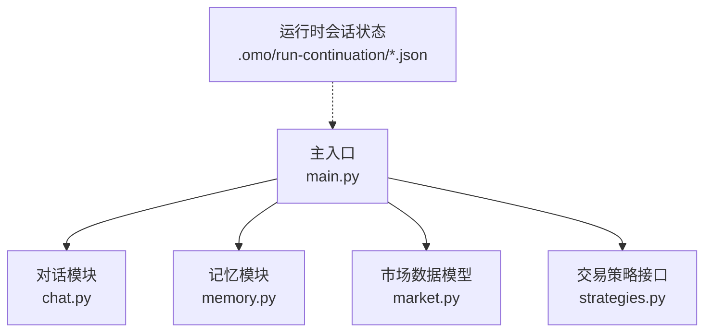
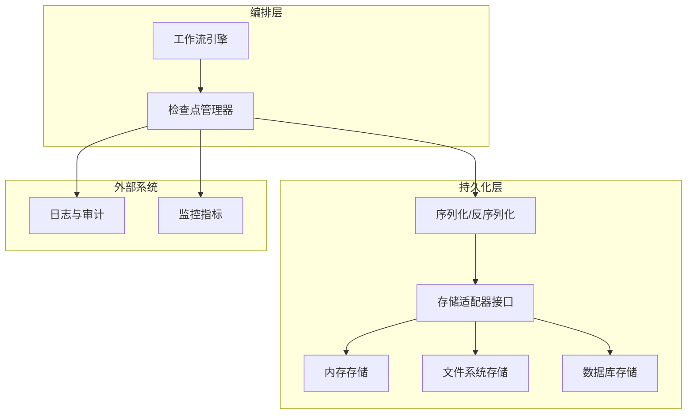
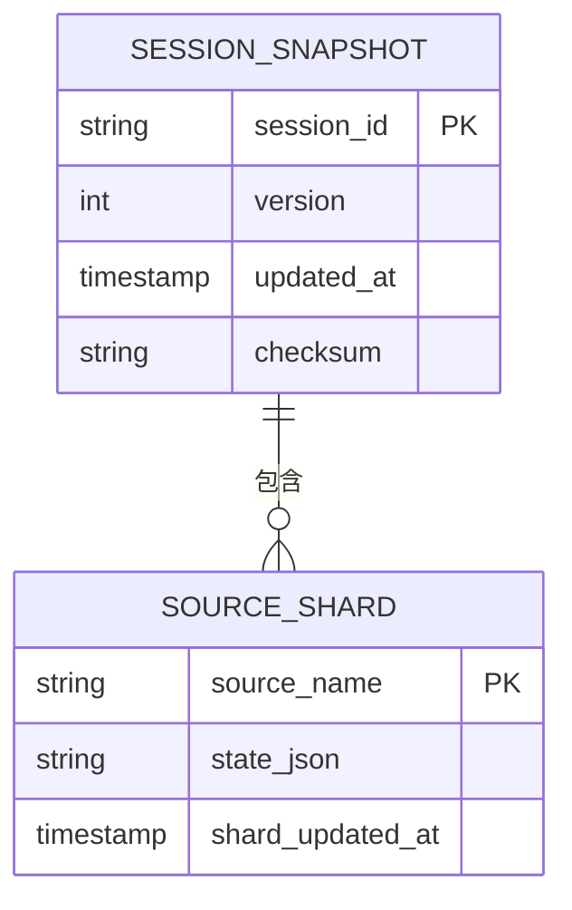
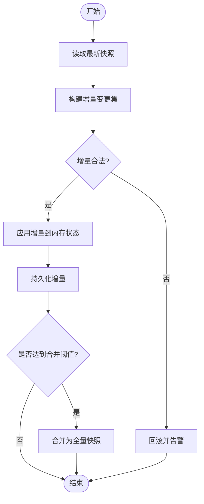
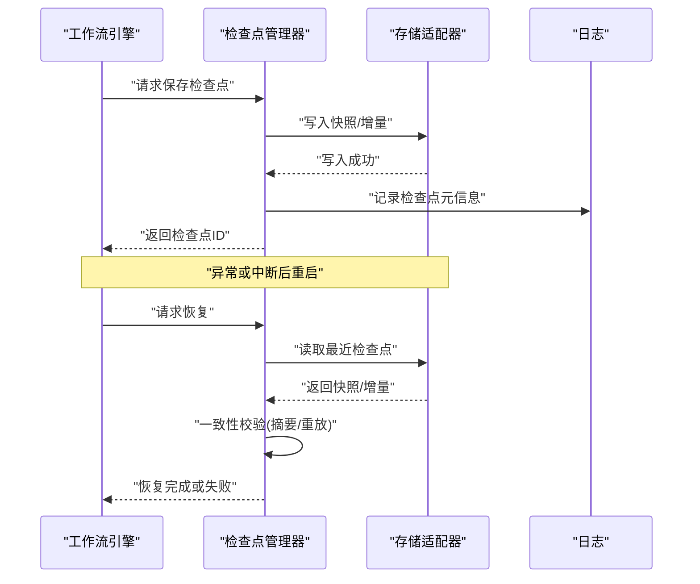
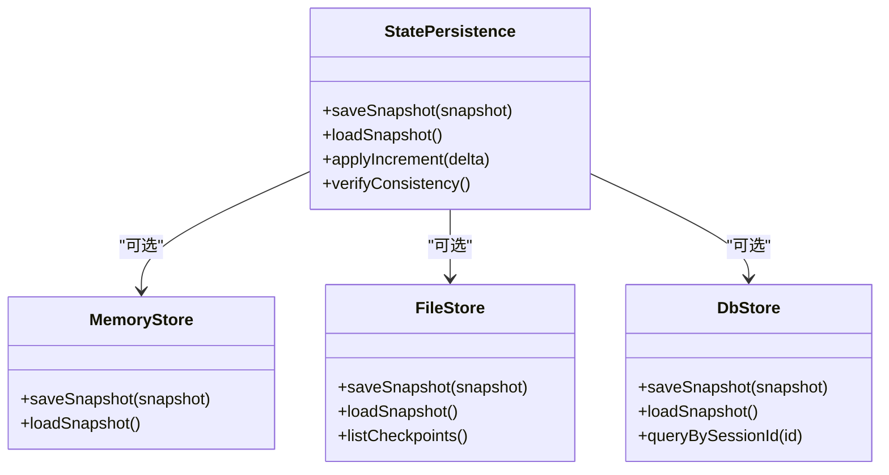
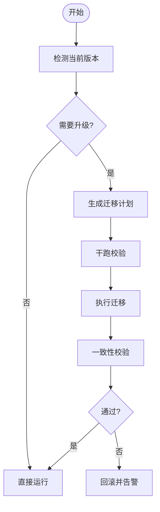
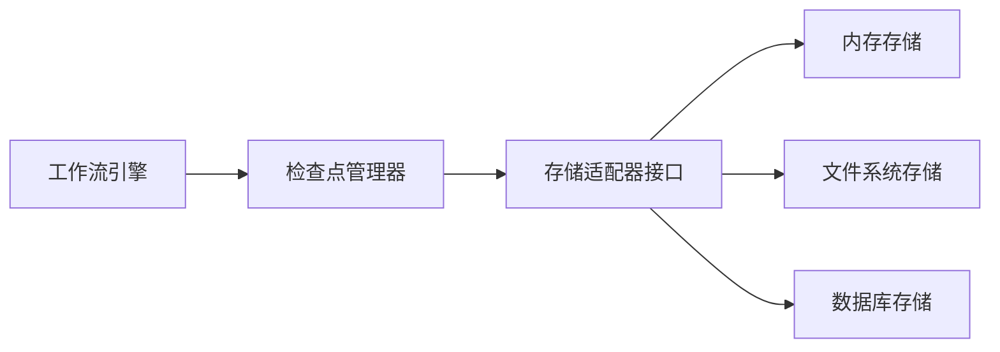

# 状态持久化

<cite>
**本文引用的文件**   
- [main.py](file://main.py)
- [memory.py](file://packages/companion-agent/src/companion_agent/memory.py)
- [chat.py](file://packages/companion-agent/src/companion_agent/chat.py)
- [market.py](file://packages/quant-agent/src/quant_agent/market.py)
- [strategies.py](file://packages/quant-agent/src/quant_agent/strategies.py)
- [ses_0de0ba8e7ffe7f2M89BsQ600ba.json](file://.omo/run-continuation/ses_0de0ba8e7ffe7f2M89BsQ600ba.json)
</cite>

## 目录
1. [简介](#简介)
2. [项目结构](#项目结构)
3. [核心组件](#核心组件)
4. [架构总览](#架构总览)
5. [详细组件分析](#详细组件分析)
6. [依赖分析](#依赖分析)
7. [性能考虑](#性能考虑)
8. [故障恢复指南](#故障恢复指南)
9. [结论](#结论)
10. [附录](#附录)

## 简介
本技术文档围绕工作流编排引擎的状态持久化模块，系统化阐述以下主题：
- 状态序列化格式设计：状态快照结构与增量更新机制
- 断点续跑实现原理：检查点保存、状态恢复与一致性验证
- 存储后端适配方案：内存、文件系统与数据库三种后端
- 版本管理与迁移策略：向后兼容性与数据格式演进
- 性能优化技巧与故障恢复方案

为便于读者理解，文档在概念层面给出通用设计与模式，并结合仓库中已有的会话状态示例文件进行对照说明。

## 项目结构
仓库采用多包组织方式，包含多个子包（如 companion-agent、quant-agent 等），根入口 main.py 负责聚合调用各子包能力。当前仓库未提供显式的“状态持久化”模块源码，但存在一个会话运行时的 JSON 状态文件，可作为状态快照的参考样例。

图示来源
- [main.py:1-13](file://main.py#L1-L13)
- [chat.py:1-12](file://packages/companion-agent/src/companion_agent/chat.py#L1-L12)
- [memory.py:1-12](file://packages/companion-agent/src/companion_agent/memory.py#L1-L12)
- [market.py:1-16](file://packages/quant-agent/src/quant_agent/market.py#L1-L16)
- [strategies.py:1-13](file://packages/quant-agent/src/quant_agent/strategies.py#L1-L13)
- [ses_0de0ba8e7ffe7f2M89BsQ600ba.json:1-11](file://.omo/run-continuation/ses_0de0ba8e7ffe7f2M89BsQ600ba.json#L1-L11)

章节来源
- [main.py:1-13](file://main.py#L1-L13)

## 核心组件
本节从“状态实体建模”的角度梳理与状态持久化相关的核心数据结构，并说明其在序列化与恢复过程中的作用。

- 会话状态（示例）
  - 字段含义：会话标识、更新时间、按来源分片的状态映射
  - 用途：作为工作流执行上下文的快照，支持断点续跑与一致性校验
  - 参考路径：[ses_0de0ba8e7ffe7f2M89BsQ600ba.json:1-11](file://.omo/run-continuation/ses_0de0ba8e7ffe7f2M89BsQ600ba.json#L1-L11)

- 消息（对话上下文）
  - 字段含义：角色、内容、时间戳
  - 用途：用于对话历史持久化与回放
  - 参考路径：[chat.py:1-12](file://packages/companion-agent/src/companion_agent/chat.py#L1-L12)

- 记忆条目
  - 字段含义：内容、创建时间、标签
  - 用途：长期记忆或中间产物的持久化载体
  - 参考路径：[memory.py:1-12](file://packages/companion-agent/src/companion_agent/memory.py#L1-L12)

- 行情数据条
  - 字段含义：标的、时间戳、开高低收量
  - 用途：量化场景下的时序数据快照
  - 参考路径：[market.py:1-16](file://packages/quant-agent/src/quant_agent/market.py#L1-L16)

- 策略抽象
  - 字段与方法：名称、描述、运行接口
  - 用途：定义可插拔的策略执行单元，其内部状态可通过工作流状态进行持久化
  - 参考路径：[strategies.py:1-13](file://packages/quant-agent/src/quant_agent/strategies.py#L1-L13)

章节来源
- [ses_0de0ba8e7ffe7f2M89BsQ600ba.json:1-11](file://.omo/run-continuation/ses_0de0ba8e7ffe7f2M89BsQ600ba.json#L1-L11)
- [chat.py:1-12](file://packages/companion-agent/src/companion_agent/chat.py#L1-L12)
- [memory.py:1-12](file://packages/companion-agent/src/companion_agent/memory.py#L1-L12)
- [market.py:1-16](file://packages/quant-agent/src/quant_agent/market.py#L1-L16)
- [strategies.py:1-13](file://packages/quant-agent/src/quant_agent/strategies.py#L1-L13)

## 架构总览
下图展示了一个通用的“工作流状态持久化”子系统如何与上层编排器交互，涵盖快照写入、增量更新、断点恢复与一致性校验的关键路径。

图示来源
- [ses_0de0ba8e7ffe7f2M89BsQ600ba.json:1-11](file://.omo/run-continuation/ses_0de0ba8e7ffe7f2M89BsQ600ba.json#L1-L11)

## 详细组件分析

### 状态快照结构设计
- 目标
  - 以最小代价表达工作流的完整上下文，确保可恢复、可比较、可演进
- 关键要素
  - 元信息：会话ID、版本号、时间戳、哈希摘要
  - 分片状态：按来源/阶段划分，避免全量重写
  - 增量标记：新增、修改、删除操作序列
  - 一致性指纹：对关键状态计算摘要，用于恢复后校验
- 与现有示例的对应
  - 会话ID、更新时间、来源分片状态与示例文件中的键一致，可作为最小可用快照形态
  - 参考路径：[ses_0de0ba8e7ffe7f2M89BsQ600ba.json:1-11](file://.omo/run-continuation/ses_0de0ba8e7ffe7f2M89BsQ600ba.json#L1-L11)

图示来源
- [ses_0de0ba8e7ffe7f2M89BsQ600ba.json:1-11](file://.omo/run-continuation/ses_0de0ba8e7ffe7f2M89BsQ600ba.json#L1-L11)

章节来源
- [ses_0de0ba8e7ffe7f2M89BsQ600ba.json:1-11](file://.omo/run-continuation/ses_0de0ba8e7ffe7f2M89BsQ600ba.json#L1-L11)

### 增量更新机制
- 设计要点
  - 基于差异的更新：记录新增/变更/删除的片段，减少IO与序列化开销
  - 幂等写入：同一增量多次应用结果一致
  - 合并策略：定期将增量合并为全量快照，清理旧增量
- 流程示意

### 断点续跑实现原理
- 检查点保存
  - 在关键步骤完成后生成检查点，包含必要的最小状态与一致性指纹
- 状态恢复
  - 启动时加载最近检查点，重建内存状态
- 一致性验证
  - 通过摘要对比或重放少量事件，确认状态未被破坏
- 流程示意

### 存储后端适配方案
- 内存存储
  - 适用：开发调试、短生命周期任务
  - 特点：低延迟、无持久性
- 文件系统存储
  - 适用：单机部署、离线批处理
  - 特点：简单可靠、易备份；注意原子写入与并发控制
- 数据库存储
  - 适用：高可用、分布式、强一致需求
  - 特点：事务保障、索引查询；需关注锁与吞吐

### 版本管理与迁移策略
- 版本管理
  - 快照中包含 schema 版本与兼容性标志
  - 升级路径：vN → vN+1，必要时引入过渡期双写
- 迁移策略
  - 向前兼容：新代码能读取旧格式（忽略未知字段）
  - 向后兼容：旧代码能读取新格式（使用默认值）
  - 迁移脚本：批量转换历史数据，保留降级能力
- 校验与回滚
  - 迁移前后计算摘要，失败自动回滚并告警

## 依赖分析
- 组件耦合
  - 工作流引擎仅依赖检查点管理器与存储适配器接口，降低与具体实现的耦合
- 外部依赖
  - 序列化库：JSON 为主，可扩展二进制格式以提升吞吐
  - 存储介质：内存、文件系统、数据库
- 潜在循环依赖
  - 通过接口隔离避免循环引用

## 性能考虑
- 序列化优化
  - 使用高效序列化库（如 orjson）提升吞吐
  - 对大对象采用分块与压缩
- IO 优化
  - 顺序追加写入增量，定期合并为全量快照
  - 使用原子写入与预写日志（WAL）保证一致性
- 并发控制
  - 读写分离：读副本与写主实例分离
  - 细粒度锁：按会话/来源分片加锁
- 缓存策略
  - 热点会话状态常驻内存，设置过期与淘汰策略
- 监控与度量
  - 记录写入耗时、大小、失败率、恢复时长等指标

## 故障恢复指南
- 常见问题定位
  - 检查点损坏：通过摘要校验失败判断，切换至上一有效检查点
  - 增量丢失：根据最近全量快照重放增量，缺失则回退
  - 并发冲突：重试与退避策略，必要时强制串行化
- 恢复步骤
  - 停止写入
  - 选择最近有效检查点
  - 执行一致性校验
  - 逐步恢复增量
  - 恢复后冒烟测试
- 预防建议
  - 定期全量快照
  - 多副本与异地备份
  - 自动化演练与回归测试

## 结论
本方案以“快照+增量”为核心，结合严格的版本管理与一致性校验，实现了高可用的工作流状态持久化。通过统一的存储适配器接口，可在内存、文件系统与数据库之间灵活切换，满足不同场景的性能与可靠性需求。配合完善的监控与故障恢复流程，可有效支撑长时间运行的复杂工作流编排。

## 附录
- 术语
  - 快照：某一时刻的完整状态表示
  - 增量：两次快照之间的变更集合
  - 检查点：用于恢复的最小状态集合
  - 一致性指纹：用于校验状态完整性的摘要
- 参考样例
  - 会话状态示例文件可用于对齐最小可用快照结构
  - 参考路径：[ses_0de0ba8e7ffe7f2M89BsQ600ba.json:1-11](file://.omo/run-continuation/ses_0de0ba8e7ffe7f2M89BsQ600ba.json#L1-L11)