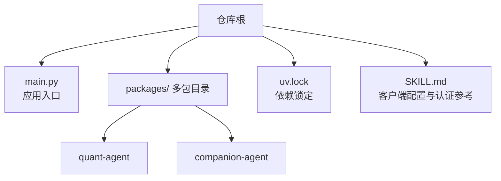
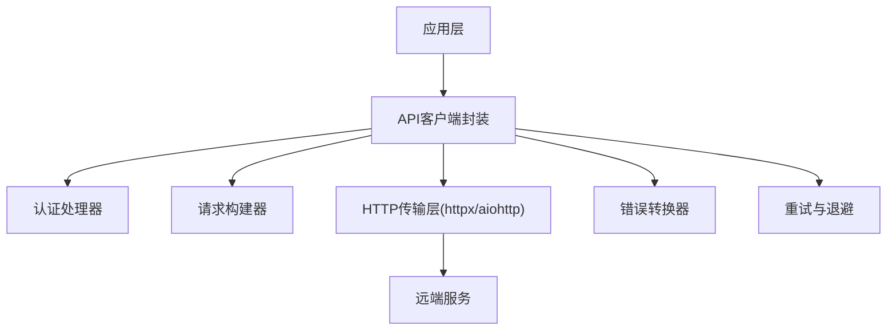
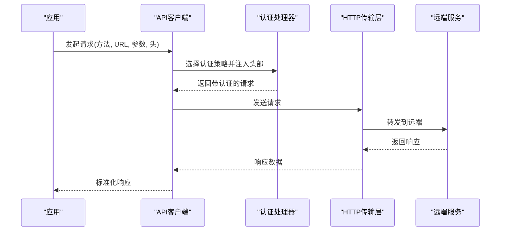
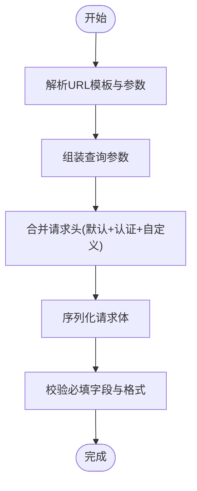
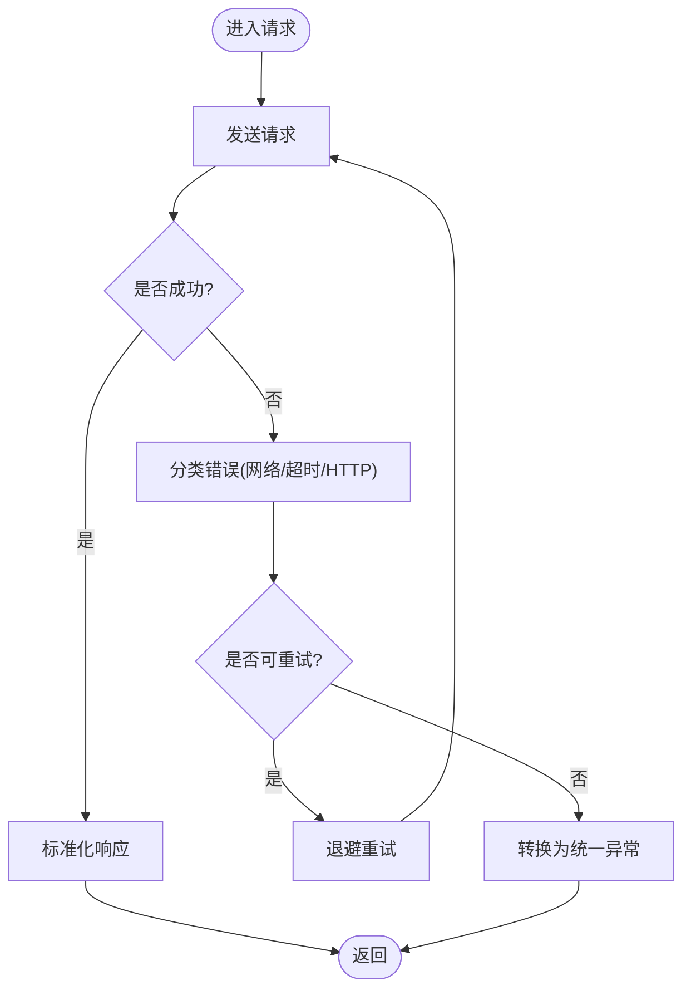
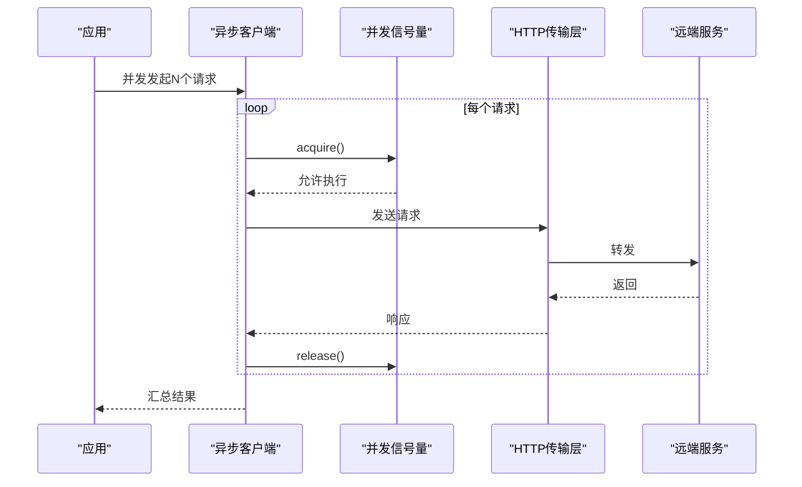
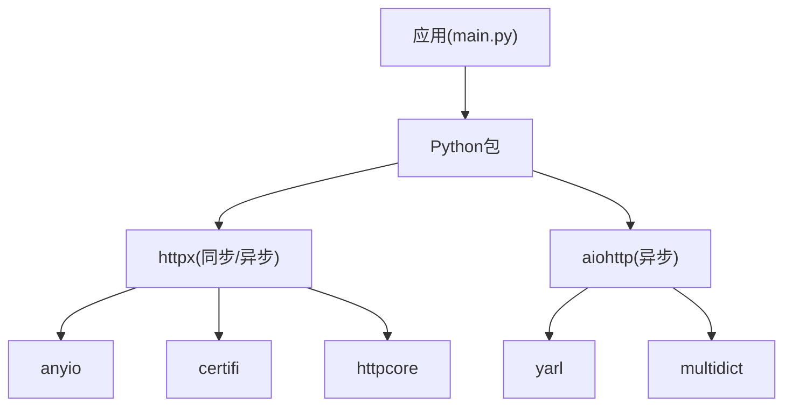

# API客户端封装

<cite>
**本文引用的文件**   
- [main.py](file://main.py)
- [uv.lock](file://uv.lock)
- [SKILL.md](file://.agent\skills\claude-api\SKILL.md)
</cite>

## 目录
1. [简介](#简介)
2. [项目结构](#项目结构)
3. [核心组件](#核心组件)
4. [架构总览](#架构总览)
5. [详细组件分析](#详细组件分析)
6. [依赖分析](#依赖分析)
7. [性能考虑](#性能考虑)
8. [故障排查指南](#故障排查指南)
9. [结论](#结论)
10. [附录](#附录)

## 简介
本技术文档围绕“API客户端封装”展开，目标是系统化说明HTTP客户端的配置机制（连接池、超时与重试）、认证处理流程（Bearer Token、API Key等）、请求构建器（URL模板、查询参数、请求头管理）、错误处理与异常转换、以及异步请求与并发控制策略。文档同时结合仓库中已存在的依赖与示例配置，给出可落地的实现建议与最佳实践。

## 项目结构
仓库采用多包组织方式，根入口脚本加载多个子包；当前仓库未包含显式的HTTP客户端实现代码，但通过依赖锁定文件可见已引入httpx/aiohttp等HTTP库，并在技能文档中包含客户端配置与认证示例。

图表来源
- [main.py:1-13](file://main.py#L1-L13)
- [uv.lock:2031-2043](file://uv.lock#L2031-L2043)
- [SKILL.md:456-458](file://.agent\skills\claude-api\SKILL.md#L456-L458)

章节来源
- [main.py:1-13](file://main.py#L1-L13)
- [uv.lock:2031-2043](file://uv.lock#L2031-L2043)

## 核心组件
本节从工程角度定义API客户端封装应包含的核心组件，并结合仓库现有依赖与参考文档给出落地要点：
- HTTP客户端实例：基于httpx或aiohttp创建，统一配置连接池、超时、重试、代理与TLS。
- 认证中间件/拦截器：集中注入Authorization、X-API-Key等头部，支持多种认证模式。
- 请求构建器：提供URL模板渲染、查询参数组装、请求体序列化与请求头合并。
- 错误处理与异常转换：将底层网络/HTTP异常转换为统一的业务异常与响应结构。
- 异步与并发控制：基于asyncio的并发调用、限流与退避重试。

章节来源
- [uv.lock:2031-2043](file://uv.lock#L2031-L2043)
- [SKILL.md:456-458](file://.agent\skills\claude-api\SKILL.md#L456-L458)

## 架构总览
下图展示API客户端在应用中的位置与关键交互：应用层通过客户端发起请求，客户端负责认证注入、请求构建、发送与响应解析，并统一错误转换。

图表来源
- [uv.lock:2031-2043](file://uv.lock#L2031-L2043)
- [SKILL.md:456-458](file://.agent\skills\claude-api\SKILL.md#L456-L458)

## 详细组件分析

### HTTP客户端配置机制
- 连接池管理
  - httpx默认复用连接，可通过Transport/Session级别参数调整连接池大小、空闲保持时间等。
  - aiohttp使用ConnectorPool，可配置最大连接数、每个主机最大连接数、Keep-Alive等。
- 超时设置
  - 参考文档指出不同SDK单位差异与默认值，建议在客户端初始化时设置全局超时，并提供单次请求覆盖能力。
- 重试策略
  - 参考文档建议对特定状态码（如408/409/429/5xx）与连接错误进行重试，并配合指数退避与抖动。
  - 注意超时与重试叠加导致的实际等待时长上限。

章节来源
- [uv.lock:2031-2043](file://uv.lock#L2031-L2043)
- [SKILL.md:456-458](file://.agent\skills\claude-api\SKILL.md#L456-L458)

### 认证处理流程
- 支持的认证方式
  - Bearer Token：在Authorization头携带“Bearer <token>”。
  - API Key：根据目标服务约定，可能以Header或Query参数形式传递。
- 流程设计
  - 在客户端初始化时注册认证插件/中间件，按优先级合并请求头。
  - 支持按域名/路径白名单选择认证策略，避免泄露敏感信息。
  - 支持动态刷新Token（例如OAuth），在过期前自动续期。

图表来源
- [SKILL.md:224-230](file://.agent\skills\claude-api\SKILL.md#L224-L230)

章节来源
- [SKILL.md:224-230](file://.agent\skills\claude-api\SKILL.md#L224-L230)

### 请求构建器
- URL模板
  - 支持路径参数替换与基础URL拼接，便于按环境切换base_url。
- 查询参数
  - 自动编码与去重，支持列表/字典参数序列化为标准查询串。
- 请求头管理
  - 合并默认头、认证头与用户自定义头，冲突时遵循明确优先级。
- 请求体
  - JSON表单化、分块上传、流式读取等场景的统一抽象。

[此图为概念流程图，不直接映射具体源码文件]

### 错误处理与异常转换
- 统一异常类型
  - 将网络异常、超时、HTTP状态码异常转换为内部统一异常类，附带上下文信息（URL、方法、耗时、重试次数）。
- 错误分类
  - 客户端错误（4xx）与服务端错误（5xx）区分，针对429/503等实施重试。
- 响应规范化
  - 成功响应包装为统一数据结构，失败响应包含错误码、消息与可选的调试信息。

[此图为概念流程图，不直接映射具体源码文件]

### 异步请求与并发控制
- 异步模型
  - 基于httpx.AsyncClient或aiohttp.ClientSession，充分利用事件循环。
- 并发控制
  - 使用信号量限制并发度，避免压垮下游服务。
  - 批量请求可使用任务分组与结果聚合。
- 资源清理
  - 确保会话关闭与连接释放，防止连接泄漏。

[此图为概念流程图，不直接映射具体源码文件]

## 依赖分析
仓库通过依赖锁定文件引入了现代HTTP客户端库，具备异步与连接复用能力，适合用于构建高性能API客户端。

图表来源
- [uv.lock:2031-2043](file://uv.lock#L2031-L2043)
- [uv.lock:344-377](file://uv.lock#L344-L377)

章节来源
- [uv.lock:2031-2043](file://uv.lock#L2031-L2043)
- [uv.lock:344-377](file://uv.lock#L344-L377)

## 性能考虑
- 连接池
  - 合理设置最大连接数与每主机最大连接数，避免过多TCP握手开销。
- 超时
  - 全局超时与单请求超时分层配置，避免长尾阻塞。
- 重试
  - 仅对幂等请求启用重试，结合指数退避与抖动，避免雪崩。
- 压缩与缓存
  - 启用GZIP/Deflate压缩，必要时对GET请求做本地缓存。
- 监控
  - 记录延迟、吞吐、错误率与重试次数，辅助容量规划。

[本节为通用指导，不直接分析具体文件]

## 故障排查指南
- 常见问题
  - 认证失败：检查Authorization头是否正确注入，确认Token有效期与作用域。
  - 超时频繁：评估网络质量与下游处理能力，适当调大超时或优化请求体积。
  - 连接耗尽：检查连接池上限与并发度，避免连接泄漏。
  - 重试风暴：确认重试条件与退避策略，避免放大负载。
- 定位手段
  - 开启调试日志，记录请求URL、方法、头部与耗时。
  - 使用抓包工具验证网络路径与证书链。
  - 对比不同环境的base_url与代理配置。

[本节为通用指导，不直接分析具体文件]

## 结论
本仓库尚未包含显式的API客户端实现，但已引入httpx/aiohttp等成熟HTTP库，并在技能文档中提供了客户端配置与认证的最佳实践。建议在此基础上构建统一的客户端封装，涵盖连接池、超时、重试、认证、请求构建、错误转换与异步并发控制，以提升稳定性与可维护性。

[本节为总结性内容，不直接分析具体文件]

## 附录
- 相关参考
  - 客户端配置与重试默认值、超时单位差异与覆盖方式见技能文档。
  - 依赖锁定文件显示已引入httpx与aiohttp，可作为客户端实现的基础。

章节来源
- [SKILL.md:456-458](file://.agent\skills\claude-api\SKILL.md#L456-L458)
- [uv.lock:2031-2043](file://uv.lock#L2031-L2043)