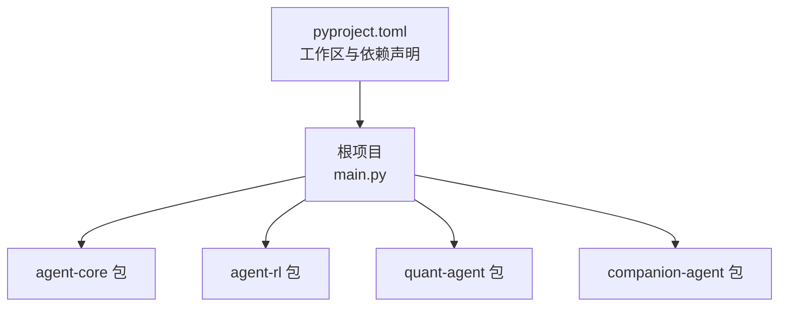
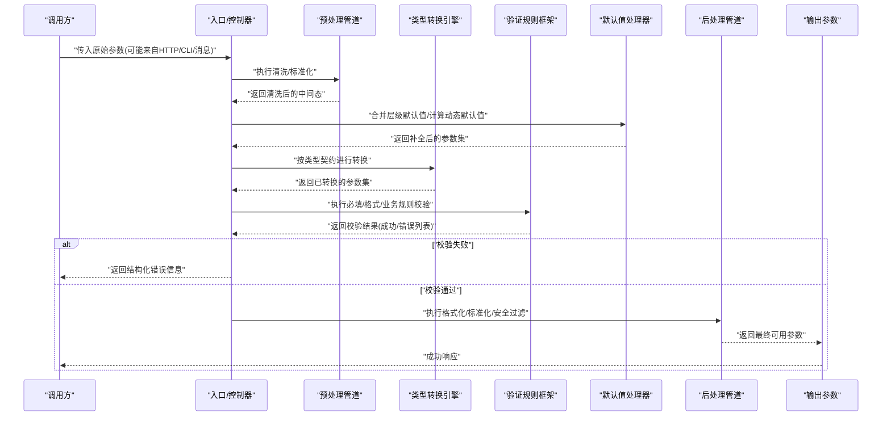
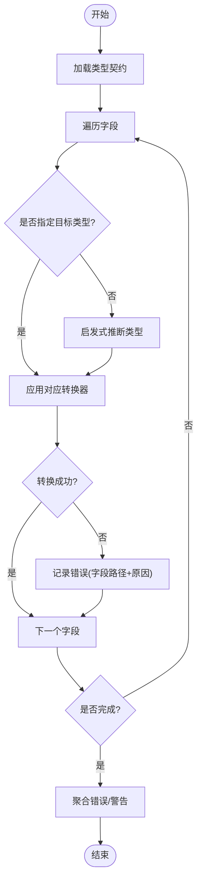
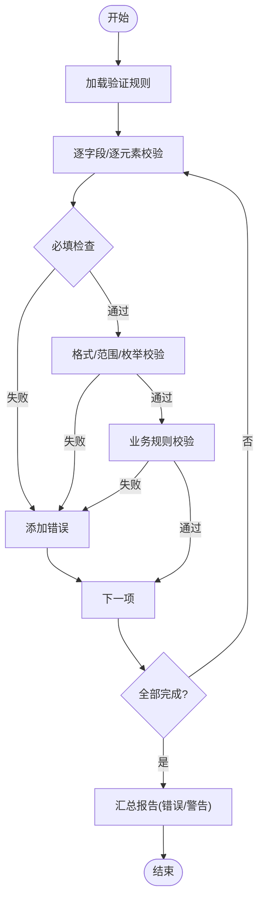
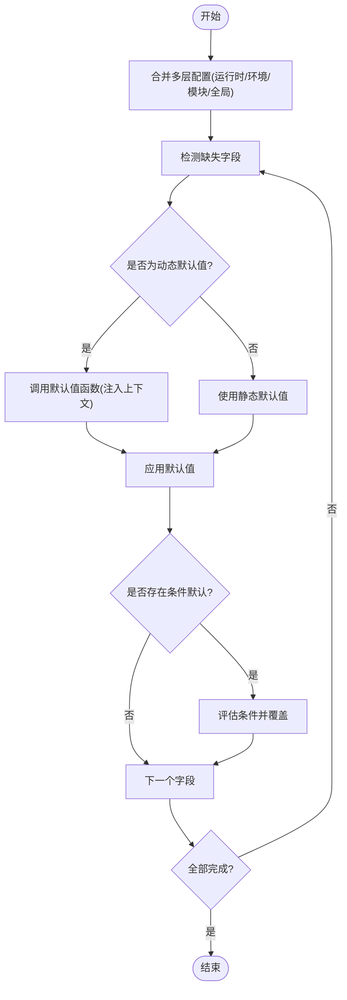
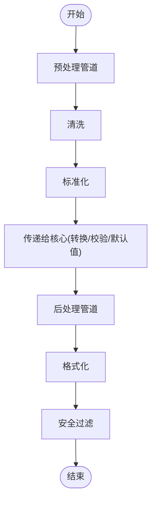
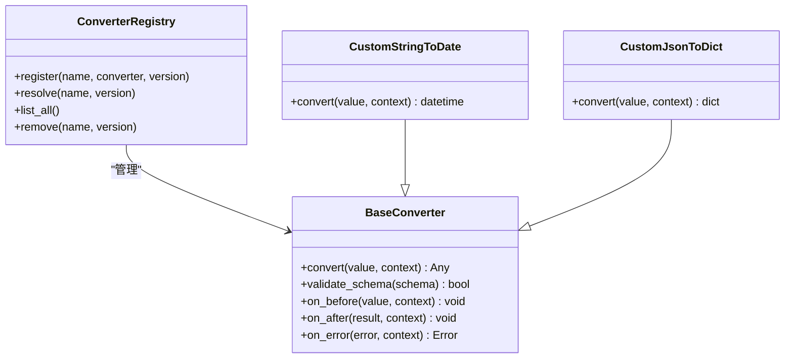
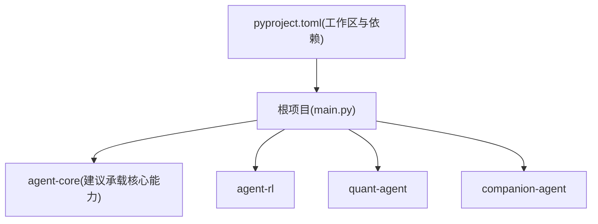

# 参数映射系统

<cite>
**本文引用的文件**   
- [main.py](file://main.py)
- [pyproject.toml](file://pyproject.toml)
</cite>

## 目录
1. [简介](#简介)
2. [项目结构](#项目结构)
3. [核心组件](#核心组件)
4. [架构总览](#架构总览)
5. [详细组件分析](#详细组件分析)
6. [依赖分析](#依赖分析)
7. [性能考虑](#性能考虑)
8. [故障排查指南](#故障排查指南)
9. [结论](#结论)
10. [附录](#附录)

## 简介
本技术文档围绕“参数映射系统”的设计与实现展开，目标是在Python原生类型与外部API数据类型之间提供自动、可配置、可扩展的类型转换与校验能力。文档涵盖以下关键主题：
- 类型转换引擎：支持Python内置类型与外部数据类型的双向映射与自动转换
- 验证规则框架：必填字段检查、格式校验、业务规则校验的统一机制
- 默认值处理：层级化配置与动态默认值生成策略
- 预处理/后处理管道：数据清洗、格式化与标准化流水线
- 自定义转换器注册与扩展：插件式注册表与生命周期钩子

说明：当前仓库为多包工作区，入口脚本仅打印各子包信息，未包含具体参数映射实现代码。因此，本节与后续章节以概念性设计与最佳实践为主，结合现有工程结构与依赖进行总体说明。

## 项目结构
仓库采用多包工作区组织方式，根项目通过依赖声明聚合多个子包（agent-core、agent-rl、quant-agent、companion-agent）。入口脚本负责初始化并调用子包能力。

图表来源
- [main.py:1-13](file://main.py#L1-L13)
- [pyproject.toml:1-30](file://pyproject.toml#L1-L30)

章节来源
- [main.py:1-13](file://main.py#L1-L13)
- [pyproject.toml:1-30](file://pyproject.toml#L1-L30)

## 核心组件
基于参数映射系统的通用设计，建议将系统拆分为以下核心组件：
- 类型转换引擎：定义类型契约、内置转换器、自动推断与回退策略
- 验证规则框架：统一描述必填、格式、范围、枚举、正则等约束，并提供错误聚合与定位
- 默认值处理器：支持静态默认值、函数式动态默认值、层级覆盖与上下文注入
- 预处理/后处理管道：链式阶段，包括清洗、规范化、格式化、去重、脱敏等
- 转换器注册中心：集中管理自定义转换器，支持命名空间、版本兼容与热插拔

上述组件的职责边界清晰、耦合度低，便于在子包中按需复用或扩展。

## 架构总览
下图展示参数映射系统在请求进入时的端到端流程：从原始输入到最终可用参数的全过程。

该流程体现了“先清洗、再补齐、后转换、强校验、终标准化”的稳健顺序，有助于减少下游逻辑的负担并提升可维护性。

## 详细组件分析

### 类型转换引擎
- 设计要点
  - 类型契约：以声明式方式描述字段的目标类型、嵌套结构、可选性与别名
  - 内置转换器：针对Python原生类型（str/int/float/bool/list/dict/tuple/set/None）与常见外部类型（日期时间、URL、IP、JSON字符串、Base64等）提供转换器
  - 自动推断：当目标类型缺失时，依据输入值特征进行启发式推断，并记录日志以便审计
  - 回退策略：当严格转换失败时，尝试宽松模式（如字符串转数字允许空白与单位后缀），并在错误报告中给出建议
  - 错误聚合：收集所有转换失败的字段路径与原因，便于一次性修复

- 复杂度与性能
  - 典型转换操作为O(n)（n为字段数），嵌套结构递归处理；对大型对象建议启用并行转换与短路失败（fail-fast）开关
  - 缓存热点类型映射表，避免重复解析类型契约

- 扩展点
  - 自定义转换器接口：提供统一的输入/输出签名与错误语义
  - 命名空间与版本控制：支持同名转换器不同版本的共存与选择

### 验证规则框架
- 规则类型
  - 必填检查：字段存在性与非空判定
  - 格式校验：正则表达式、长度/范围、枚举值、唯一性、跨字段一致性
  - 业务规则：复杂条件组合、外部服务联动校验（如库存、权限）
- 错误模型
  - 结构化错误对象：包含字段路径、错误码、提示语、建议修复方案
  - 分级策略：error/warning/critical，支持阻断或继续执行
- 性能优化
  - 短路校验：遇到critical错误立即停止后续规则
  - 批量校验：对数组元素使用批处理与并发策略

### 默认值处理机制
- 层级配置
  - 优先级：运行时参数 > 环境配置 > 模块级默认 > 全局默认
  - 合并策略：字典深度合并，数组追加或替换（可配置）
- 动态默认值
  - 支持函数式默认值：在需要时惰性求值，并可注入上下文（如当前用户、时间戳）
  - 条件默认：根据其他字段值决定默认值（例如当A为空且B为某值时，C取默认）
- 幂等与可观测性
  - 默认值生成需幂等，避免副作用
  - 记录默认值来源与生成时间，便于追踪

### 预处理与后处理管道
- 预处理阶段
  - 数据清洗：去除空白、转义字符归一化、编码统一
  - 标准化：键名规范化（大小写、下划线/驼峰）、单位换算、时区统一
- 后处理阶段
  - 格式化：输出前格式化（如日期、金额、布尔显示）
  - 安全过滤：敏感字段脱敏、XSS/SQL注入防护
- 管道编排
  - 阶段内有序执行，阶段间可并行
  - 支持跳过、重试与熔断策略

### 自定义转换器注册与扩展机制
- 注册中心
  - 提供装饰器或显式注册API，支持命名空间隔离与版本选择
  - 支持元数据：描述、示例、兼容性矩阵、性能指标
- 生命周期钩子
  - 转换前/后钩子：用于日志、埋点、监控
  - 错误恢复钩子：捕获异常并转换为友好错误
- 测试与回归
  - 提供断言工具与样例数据集，确保新转换器不破坏既有契约

## 依赖分析
当前仓库通过pyproject.toml声明工作区成员与依赖关系，入口脚本仅做简单初始化。参数映射系统的具体实现应位于子包中，建议在如下位置落地：
- agent-core：通用能力（类型转换、验证、默认值、管道、注册中心）
- companion-agent/quant-agent/agent-rl：各自领域的数据契约与特定转换器

图表来源
- [main.py:1-13](file://main.py#L1-L13)
- [pyproject.toml:1-30](file://pyproject.toml#L1-L30)

章节来源
- [main.py:1-13](file://main.py#L1-L13)
- [pyproject.toml:1-30](file://pyproject.toml#L1-L30)

## 性能考虑
- 转换与校验的短路策略：遇到严重错误尽早返回，避免无谓计算
- 并发与批处理：对大规模数组字段采用分片与并发处理，注意资源上限
- 缓存与复用：类型契约解析、正则编译、转换器实例缓存
- 内存友好：流式处理大对象，避免一次性加载整个请求体
- 可观测性：关键路径埋点（耗时、错误率、默认值命中率）

## 故障排查指南
- 常见问题定位
  - 类型不匹配：查看转换错误聚合中的字段路径与期望类型
  - 必填缺失：检查必填规则与默认值层级覆盖是否正确
  - 格式错误：核对正则/范围/枚举配置与实际输入
  - 业务规则失败：关注跨字段一致性与外部依赖状态
- 调试建议
  - 开启详细日志，记录每个阶段的输入/输出快照
  - 使用最小复现用例与固定种子数据
  - 逐步禁用管道阶段，定位问题所在阶段
- 错误反馈
  - 向调用方返回结构化错误，包含字段路径、错误码与建议修复步骤

## 结论
参数映射系统通过“类型转换—验证—默认值—管道—扩展”的分层设计，实现了对外部API数据的健壮接入与对内部Python原生的稳定输出。借助注册中心与钩子机制，系统具备良好的可演进性与可观测性。建议在agent-core中沉淀通用能力，在各子包中按需定制领域契约与转换器。

## 附录
- 术语
  - 类型契约：描述字段目标类型、嵌套结构与约束的声明式规范
  - 转换器：将一种类型值转换为另一种类型值的单元
  - 管道：由多个阶段组成的数据处理流水线
  - 默认值：当输入缺失或无效时使用的后备值
- 参考实现位置（建议）
  - 类型转换与验证：packages/agent-core/src/...
  - 领域契约与转换器：packages/companion-agent、packages/quant-agent、packages/agent-rl