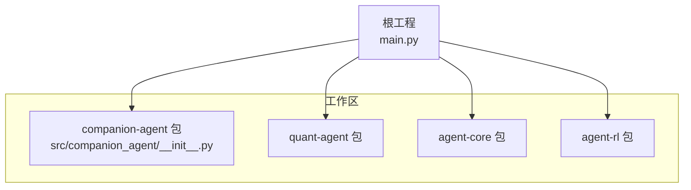
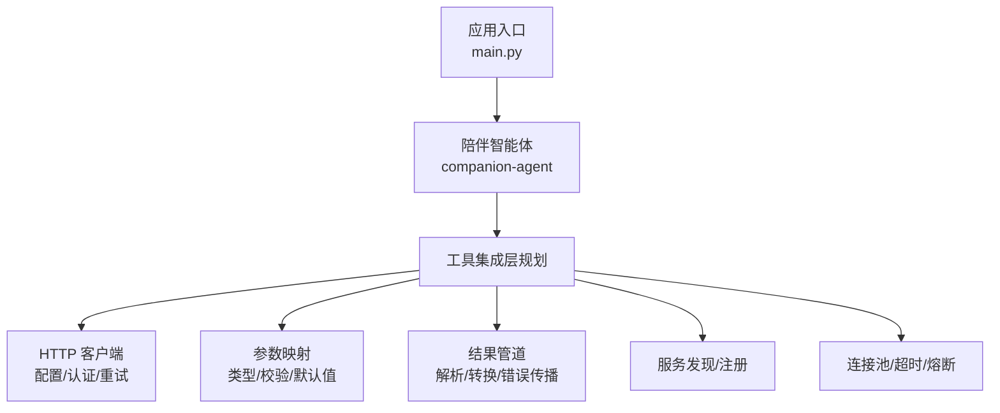
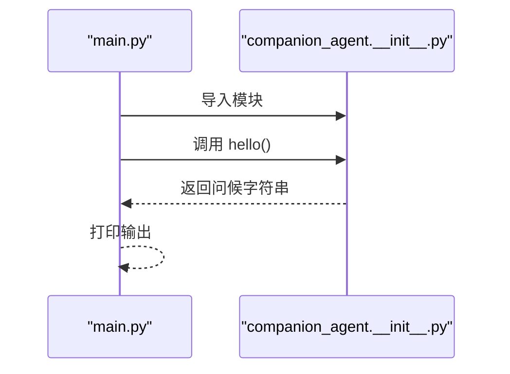
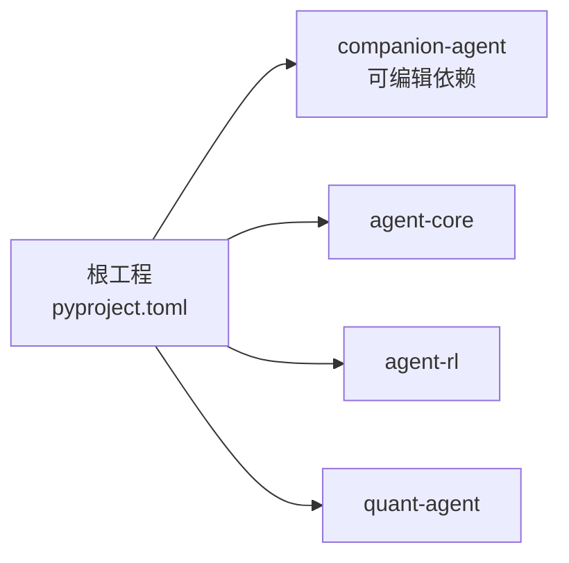

# 工具集成框架

<cite>
**本文引用的文件**   
- [main.py](file://main.py)
- [pyproject.toml](file://pyproject.toml)
- [uv.lock](file://uv.lock)
- [__init__.py](file://packages/companion-agent/src/companion_agent/__init__.py)
- [README.md](file://packages/companion-agent/README.md)
</cite>

## 目录
1. [简介](#简介)
2. [项目结构](#项目结构)
3. [核心组件](#核心组件)
4. [架构总览](#架构总览)
5. [详细组件分析](#详细组件分析)
6. [依赖分析](#依赖分析)
7. [性能考虑](#性能考虑)
8. [故障排查指南](#故障排查指南)
9. [结论](#结论)
10. [附录](#附录)

## 简介
本技术文档围绕“陪伴助手的工具集成框架”展开，聚焦以下目标：
- API 调用封装机制：HTTP 客户端配置、认证处理与请求重试策略
- 参数映射系统：类型转换、验证规则与默认值处理
- 结果处理管道：数据解析、格式转换与错误传播
- 外部服务发现与服务注册方案
- 连接池管理、超时控制与熔断降级策略

说明：当前仓库中 companion-agent 包处于早期阶段，仅暴露最小入口。本文在尊重现有代码的前提下，给出面向实现的架构设计与最佳实践建议，帮助后续扩展为完整的工具集成框架。

## 项目结构
仓库采用 uv workspace 组织多包，根工程通过 pyproject.toml 声明成员包与依赖。companion-agent 作为“感性之面”，提供对话、记忆与多轮交互能力的基础入口。

图表来源
- [main.py:1-12](file://main.py#L1-L12)
- [pyproject.toml:1-30](file://pyproject.toml#L1-L30)

章节来源
- [main.py:1-12](file://main.py#L1-L12)
- [pyproject.toml:1-30](file://pyproject.toml#L1-L30)
- [uv.lock:1063-1066](file://uv.lock#L1063-L1066)

## 核心组件
- 应用入口：根 main.py 负责初始化并调用各子包的 hello 接口，用于快速验证环境。
- companion-agent 包：提供版本信息与基础入口函数，便于后续扩展工具集成能力。

章节来源
- [main.py:1-12](file://main.py#L1-L12)
- [__init__.py:1-14](file://packages/companion-agent/src/companion_agent/__init__.py#L1-L14)

## 架构总览
从现有代码可抽象出如下分层与职责（概念性）：
- 应用层：编排与启动（main.py）
- 智能体层：情感陪伴与对话（companion-agent）
- 工具集成层（规划）：HTTP 客户端、认证、重试、参数映射、结果管道、服务发现/注册、连接池、超时与熔断

[此图为概念性示意，不直接映射具体源码文件]

## 详细组件分析

### 应用入口与包装配
- 根入口 main.py 导入 quant-agent 与 companion-agent，并打印各自 hello 信息，用于快速验证工作区装配是否成功。
- companion-agent 包通过 __init__.py 暴露版本与 hello 方法，遵循 Python 包规范。

图表来源
- [main.py:1-12](file://main.py#L1-L12)
- [__init__.py:1-14](file://packages/companion-agent/src/companion_agent/__init__.py#L1-L14)

章节来源
- [main.py:1-12](file://main.py#L1-L12)
- [__init__.py:1-14](file://packages/companion-agent/src/companion_agent/__init__.py#L1-L14)

### API 调用封装机制（规划）
为实现稳定的外部工具调用，建议在 companion-agent 内构建统一的 HTTP 客户端封装层，涵盖：
- 客户端配置：base_url、超时、重试次数、并发限制等
- 认证处理：Bearer Token、API Key、OAuth2 等统一注入
- 重试策略：针对 408/409/429/5xx 及网络异常进行指数退避重试
- 幂等性与去重：对 GET 等幂等请求启用缓存或去重键
- 可观测性：请求 ID、耗时、状态码、错误分类日志

注意：当前仓库未包含该实现，以上为推荐设计。

### 参数映射系统（规划）
为保证跨工具的一致性与健壮性，建议引入参数映射与校验层：
- 类型转换：将 JSON/表单/查询参数转换为强类型对象
- 验证规则：必填、范围、枚举、正则、自定义校验器
- 默认值处理：缺失字段自动填充默认值，避免下游空指针
- 错误聚合：收集所有校验错误并一次性返回，提升用户体验

### 结果处理管道（规划）
对外部响应进行标准化处理，形成统一的数据模型：
- 数据解析：JSON/XML/流式响应解析
- 格式转换：内部领域模型与外部协议之间的双向转换
- 错误传播：区分业务错误与系统错误，携带上下文与追踪信息
- 缓存与压缩：热点结果缓存、大响应压缩传输

### 外部服务发现与服务注册（规划）
- 服务发现：支持静态配置、环境变量、DNS SRV、轻量注册中心（如 etcd/Consul）
- 服务注册：健康检查、心跳上报、元数据发布
- 路由与负载均衡：按标签/权重/地域选择实例
- 容错隔离：按服务维度隔离失败影响面

### 连接池管理、超时控制与熔断降级（规划）
- 连接池：复用 TCP 连接，限制最大空闲/活跃连接数，避免资源耗尽
- 超时控制：连接超时、读超时、写超时、整体请求超时
- 熔断降级：基于错误率/延迟阈值触发熔断，提供降级响应或本地缓存
- 限流：令牌桶/漏桶算法保护上游服务

## 依赖分析
根工程通过 pyproject.toml 声明工作区成员与依赖，companion-agent 以可编辑方式参与工作区。

图表来源
- [pyproject.toml:1-30](file://pyproject.toml#L1-L30)
- [uv.lock:1063-1066](file://uv.lock#L1063-L1066)

章节来源
- [pyproject.toml:1-30](file://pyproject.toml#L1-L30)
- [uv.lock:1063-1066](file://uv.lock#L1063-L1066)

## 性能考虑
- 合理设置超时与重试上限，避免雪崩效应
- 使用连接池减少握手开销
- 对热路径启用缓存与批量请求
- 监控关键指标：QPS、P99 延迟、错误率、熔断开关状态

## 故障排查指南
- 确认工作区装配：运行根入口，观察 companion-agent 的 hello 输出是否正常
- 检查依赖安装：确保 companion-agent 以可编辑模式被 uv 识别
- 查看 README 中的开发指引，使用 uv run 执行命令

章节来源
- [main.py:1-12](file://main.py#L1-L12)
- [README.md:1-16](file://packages/companion-agent/README.md#L1-L16)
- [uv.lock:1063-1066](file://uv.lock#L1063-L1066)

## 结论
当前 companion-agent 包提供了最小可用的入口与版本信息，具备扩展为完整工具集成框架的良好起点。建议优先落地 HTTP 客户端封装、参数映射与结果管道三大基础设施，再逐步完善服务发现、连接池、超时与熔断等高级特性，以确保稳定性与可维护性。

## 附录
- 开发运行参考：参见 companion-agent 包的 README 中的 uv 命令示例

章节来源
- [README.md:1-16](file://packages/companion-agent/README.md#L1-L16)