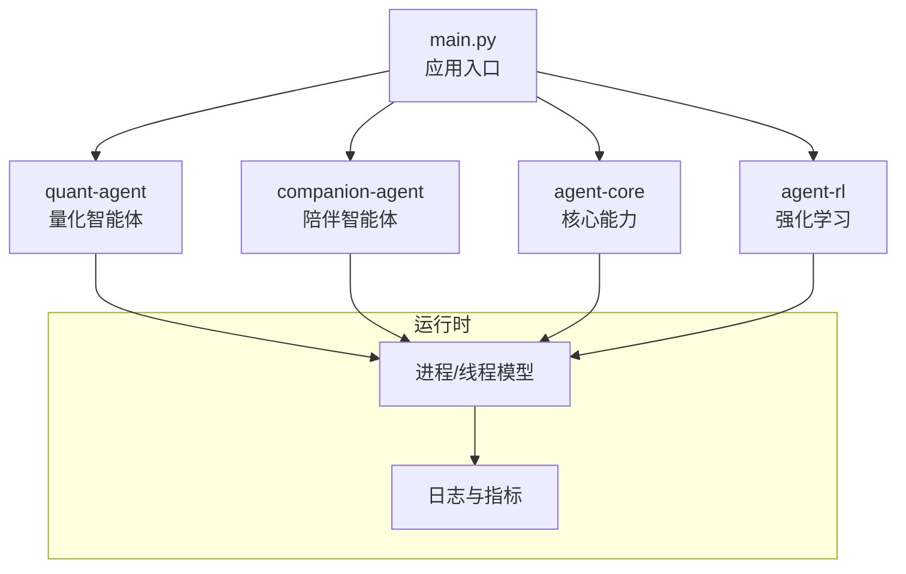
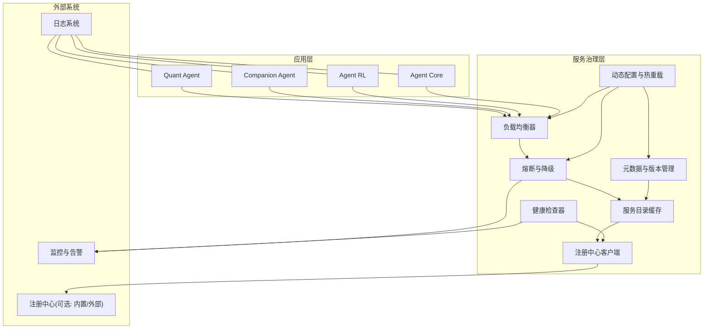
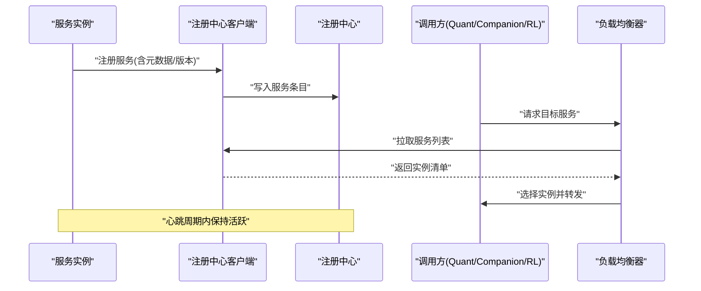
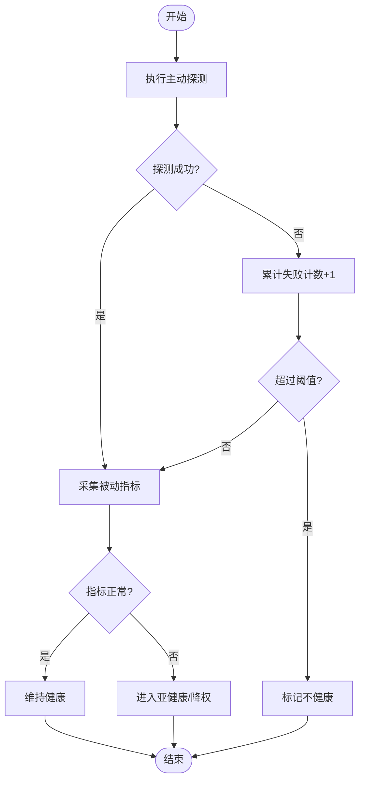
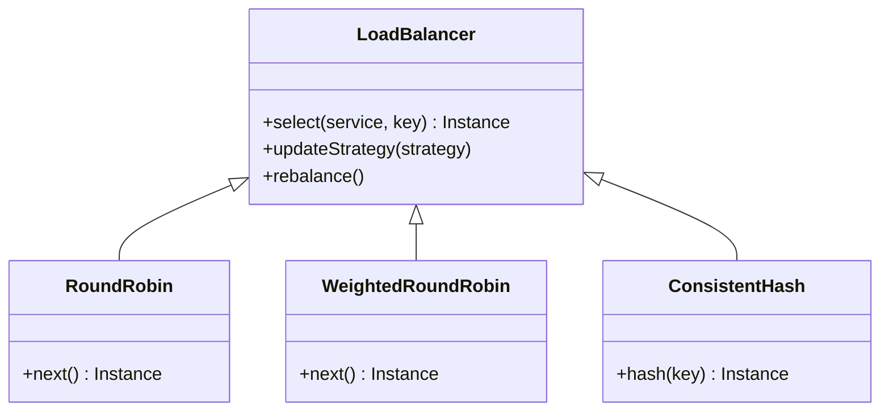
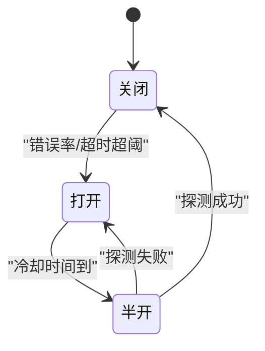
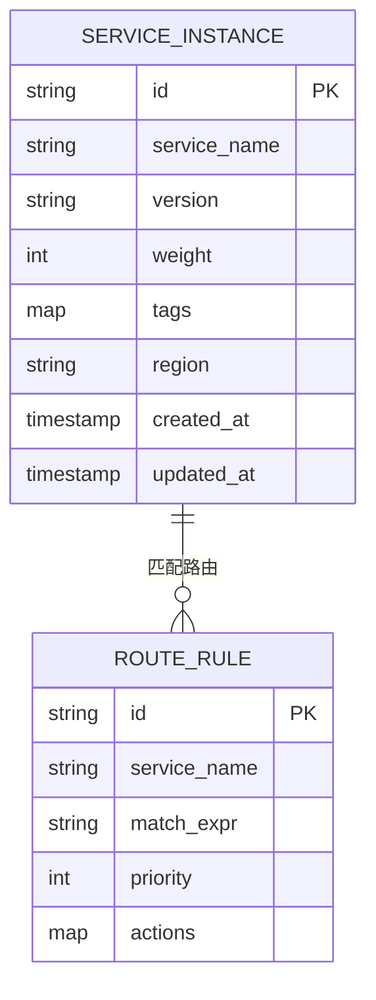
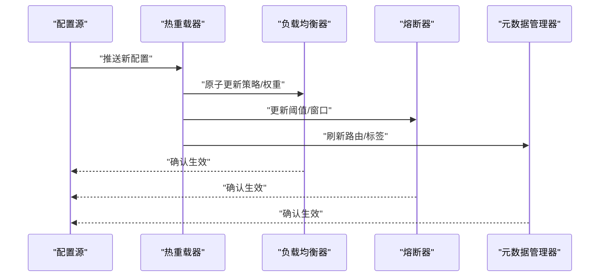
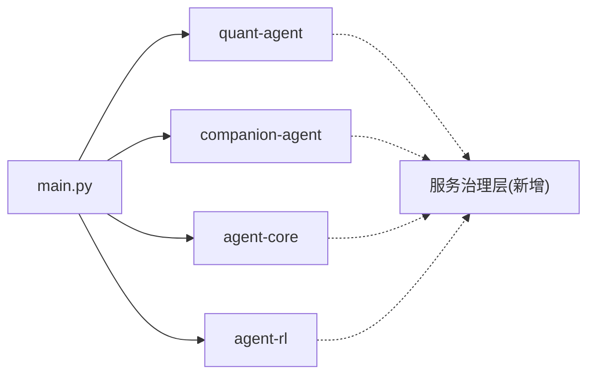

# 服务发现与注册

<cite>
**本文引用的文件**   
- [main.py](file://main.py)
- [agent-core __init__.py](file://packages/agent-core/src/agent_core/__init__.py)
- [companion-agent __init__.py](file://packages/companion-agent/src/companion_agent/__init__.py)
- [quant-agent __init__.py](file://packages/quant-agent/src/quant_agent/__init__.py)
- [agent-rl __init__.py](file://packages/agent-rl/src/agent_rl/__init__.py)
- [uv.lock](file://uv.lock)
- [AGENT.md](file://.agent/AGENT.md)
- [project.md](file://.agent/context/project.md)
</cite>

## 目录
1. [简介](#简介)
2. [项目结构](#项目结构)
3. [核心组件](#核心组件)
4. [架构总览](#架构总览)
5. [详细组件分析](#详细组件分析)
6. [依赖分析](#依赖分析)
7. [性能考虑](#性能考虑)
8. [故障排查指南](#故障排查指南)
9. [结论](#结论)
10. [附录](#附录)

## 简介
本技术文档围绕“服务发现与注册”主题，结合当前仓库中多智能体（Agent）工程的结构与入口组织方式，给出面向生产可用的设计与实现建议。由于当前代码库尚未包含显式的服务发现与注册实现，本文在尊重现有代码的前提下，提供一套可落地的方案蓝图：包括静态配置与服务发现协议、健康检查（主动探测与被动监控）、负载均衡策略（轮询、权重、一致性哈希）、熔断与降级、元数据管理与版本兼容、动态配置更新与热重载等能力，并给出与现有模块的集成路径和演进路线。

## 项目结构
仓库采用多包（monorepo）组织，顶层入口 main.py 聚合多个 Agent 子包；各子包以 Python 包形式提供最小可用接口，便于后续扩展为服务化组件。

图表来源
- [main.py:1-12](file://main.py#L1-L12)
- [quant-agent __init__.py:1-15](file://packages/quant-agent/src/quant_agent/__init__.py#L1-L15)
- [companion-agent __init__.py:1-15](file://packages/companion-agent/src/companion_agent/__init__.py#L1-L15)
- [agent-core __init__.py:1-3](file://packages/agent-core/src/agent_core/__init__.py#L1-L3)
- [agent-rl __init__.py:1-15](file://packages/agent-rl/src/agent_rl/__init__.py#L1-L15)

章节来源
- [main.py:1-12](file://main.py#L1-L12)
- [AGENT.md:1-18](file://.agent/AGENT.md#L1-L18)
- [project.md:52-75](file://.agent/context/project.md#L52-L75)

## 核心组件
基于现有包结构，建议将“服务发现与注册”能力抽象为独立的服务治理层，并与现有 Agent 包解耦。推荐的核心组件如下：
- 注册中心客户端：负责服务的注册、注销、心跳上报与拉取服务列表
- 服务目录缓存：本地维护最新服务实例清单，支持增量更新
- 健康检查器：主动探测（HTTP/TCP/自定义探针）与被动监控（错误率、延迟、资源水位）
- 负载均衡器：轮询、加权轮询、一致性哈希
- 熔断与降级：基于错误率、超时、慢调用阈值进行快速失败与降级策略
- 元数据与版本管理：服务标签、版本、路由规则、灰度策略
- 动态配置与热重载：监听配置变更，平滑切换策略与路由表

章节来源
- [agent-core __init__.py:1-3](file://packages/agent-core/src/agent_core/__init__.py#L1-L3)
- [quant-agent __init__.py:1-15](file://packages/quant-agent/src/quant_agent/__init__.py#L1-L15)
- [companion-agent __init__.py:1-15](file://packages/companion-agent/src/companion_agent/__init__.py#L1-L15)
- [agent-rl __init__.py:1-15](file://packages/agent-rl/src/agent_rl/__init__.py#L1-L15)

## 架构总览
下图展示服务发现与注册的整体架构，以及其与现有 Agent 包的集成点。

图表来源
- [main.py:1-12](file://main.py#L1-L12)
- [quant-agent __init__.py:1-15](file://packages/quant-agent/src/quant_agent/__init__.py#L1-L15)
- [companion-agent __init__.py:1-15](file://packages/companion-agent/src/companion_agent/__init__.py#L1-L15)
- [agent-rl __init__.py:1-15](file://packages/agent-rl/src/agent_rl/__init__.py#L1-L15)
- [agent-core __init__.py:1-3](file://packages/agent-core/src/agent_core/__init__.py#L1-L3)

## 详细组件分析

### 服务注册机制（静态配置与服务发现协议）
- 静态配置模式
  - 启动时从配置文件加载服务实例清单（地址、端口、权重、版本、标签）
  - 适用于小规模部署或开发环境
- 服务发现协议
  - 客户端定期向注册中心拉取服务列表，或订阅变更事件
  - 支持增量更新与去重，保证本地缓存一致性与幂等性
- 注册流程
  - 服务启动后向注册中心注册自身信息（含元数据与版本）
  - 定时上报心跳，未收到心跳则标记不健康并从流量中摘除

图表来源
- [main.py:1-12](file://main.py#L1-L12)
- [quant-agent __init__.py:1-15](file://packages/quant-agent/src/quant_agent/__init__.py#L1-L15)
- [companion-agent __init__.py:1-15](file://packages/companion-agent/src/companion_agent/__init__.py#L1-L15)
- [agent-rl __init__.py:1-15](file://packages/agent-rl/src/agent_rl/__init__.py#L1-L15)

章节来源
- [project.md:52-75](file://.agent/context/project.md#L52-L75)

### 健康检查（主动探测与被动监控）
- 主动探测
  - 周期性对实例执行 HTTP/TCP/自定义探针
  - 连续失败超过阈值则标记不健康，触发熔断与摘流
- 被动监控
  - 采集错误率、P99/P95 延迟、资源使用率等指标
  - 当指标越限时自动降权或隔离实例
- 健康状态机
  - 健康 → 亚健康（指标异常但可恢复）→ 不健康（持续失败）→ 下线

图表来源
- [agent-core __init__.py:1-3](file://packages/agent-core/src/agent_core/__init__.py#L1-L3)

章节来源
- [agent-core __init__.py:1-3](file://packages/agent-core/src/agent_core/__init__.py#L1-L3)

### 负载均衡策略（轮询、权重、一致性哈希）
- 轮询
  - 简单均匀分发，适合无状态且实例能力相近的场景
- 加权轮询
  - 根据实例权重分配流量，支持按容量、地域、版本差异化
- 一致性哈希
  - 基于会话或键值稳定路由，减少抖动，适合有状态或缓存敏感场景
- 策略选择
  - 通过动态配置切换策略，支持灰度与回滚

图表来源
- [quant-agent __init__.py:1-15](file://packages/quant-agent/src/quant_agent/__init__.py#L1-L15)
- [companion-agent __init__.py:1-15](file://packages/companion-agent/src/companion_agent/__init__.py#L1-L15)
- [agent-rl __init__.py:1-15](file://packages/agent-rl/src/agent_rl/__init__.py#L1-L15)

章节来源
- [quant-agent __init__.py:1-15](file://packages/quant-agent/src/quant_agent/__init__.py#L1-L15)
- [companion-agent __init__.py:1-15](file://packages/companion-agent/src/companion_agent/__init__.py#L1-L15)
- [agent-rl __init__.py:1-15](file://packages/agent-rl/src/agent_rl/__init__.py#L1-L15)

### 熔断与降级（防止级联故障）
- 熔断器状态
  - 关闭：正常放行
  - 打开：快速失败，避免雪崩
  - 半开：试探性放行，验证恢复
- 降级策略
  - 返回默认值、缓存结果、限流或拒绝非关键请求
- 触发条件
  - 错误率、超时比例、慢调用比例、下游不可用

图表来源
- [agent-core __init__.py:1-3](file://packages/agent-core/src/agent_core/__init__.py#L1-L3)

章节来源
- [agent-core __init__.py:1-3](file://packages/agent-core/src/agent_core/__init__.py#L1-L3)

### 服务元数据管理与版本兼容性
- 元数据字段
  - 版本、标签、区域、容量、特性开关、路由规则
- 版本兼容
  - 语义化版本控制，向后兼容策略，灰度发布与回滚
- 路由与分流
  - 基于标签与权重实现多版本共存与逐步放量

图表来源
- [quant-agent __init__.py:1-15](file://packages/quant-agent/src/quant_agent/__init__.py#L1-L15)
- [companion-agent __init__.py:1-15](file://packages/companion-agent/src/companion_agent/__init__.py#L1-L15)

章节来源
- [quant-agent __init__.py:1-15](file://packages/quant-agent/src/quant_agent/__init__.py#L1-L15)
- [companion-agent __init__.py:1-15](file://packages/companion-agent/src/companion_agent/__init__.py#L1-L15)

### 动态配置更新与服务热重载
- 配置项
  - 负载均衡策略、权重、熔断阈值、健康检查间隔、路由规则
- 热重载
  - 监听配置变更事件，原子替换策略与路由表，零停机生效
- 回滚
  - 保留历史配置快照，一键回滚至上一稳定版本

图表来源
- [agent-core __init__.py:1-3](file://packages/agent-core/src/agent_core/__init__.py#L1-L3)

章节来源
- [agent-core __init__.py:1-3](file://packages/agent-core/src/agent_core/__init__.py#L1-L3)

## 依赖分析
当前仓库通过 uv.lock 声明了多包依赖关系，主应用 main.py 聚合 quant-agent 与 companion-agent。服务治理层应作为独立模块被这些包引用，避免反向耦合。

图表来源
- [main.py:1-12](file://main.py#L1-L12)
- [uv.lock:2158-2179](file://uv.lock#L2158-L2179)

章节来源
- [uv.lock:2158-2179](file://uv.lock#L2158-L2179)
- [main.py:1-12](file://main.py#L1-L12)

## 性能考虑
- 服务目录缓存
  - 本地内存缓存，增量更新，避免频繁网络往返
- 健康检查
  - 合理设置探测间隔与失败阈值，平衡实时性与开销
- 负载均衡
  - 一致性哈希需维护稳定的哈希环，避免抖动
- 熔断与降级
  - 滑动窗口统计，避免瞬时尖峰误判
- 热重载
  - 原子切换数据结构，确保并发安全

## 故障排查指南
- 注册失败
  - 检查注册中心连通性与鉴权
  - 查看服务实例心跳是否按时上报
- 健康检查异常
  - 核对探针端点与超时配置
  - 观察被动指标是否越限
- 负载不均
  - 校验权重与标签是否正确下发
  - 检查一致性哈希键分布是否倾斜
- 熔断频繁
  - 分析错误率与慢调用原因
  - 调整阈值与冷却时间
- 配置未生效
  - 确认热重载器是否收到变更事件
  - 查看原子替换是否成功提交

## 结论
在当前多智能体工程基础上，引入统一的服务治理层可实现健壮的服务发现与注册、均衡的流量调度与高可用保障。通过静态配置与服务发现双模、完善的健康检查、灵活的负载均衡策略、熔断与降级机制、元数据与版本管理，以及动态配置与热重载能力，可在不破坏现有包结构的前提下平滑演进，提升整体系统的稳定性与可运维性。

## 附录
- 术语
  - 服务发现：动态获取可用服务实例的能力
  - 注册中心：集中管理服务实例信息的组件
  - 熔断：在异常情况下快速失败以避免雪崩
  - 降级：在压力或异常时降低非关键功能以保证核心可用性
- 参考
  - 项目概述与架构说明参见 .agent/AGENT.md 与 .agent/context/project.md