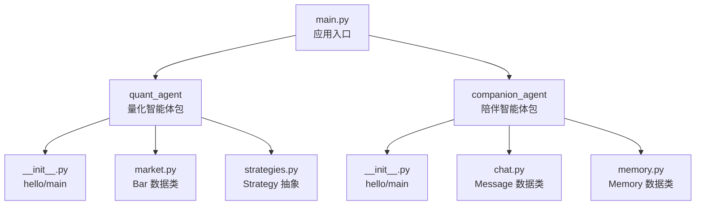
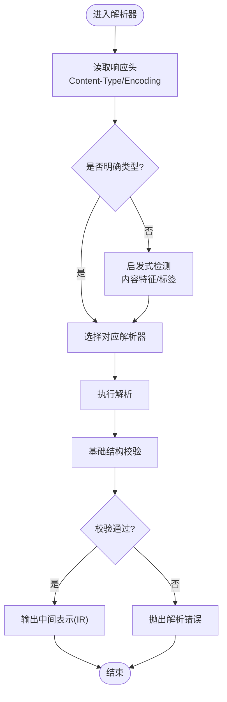
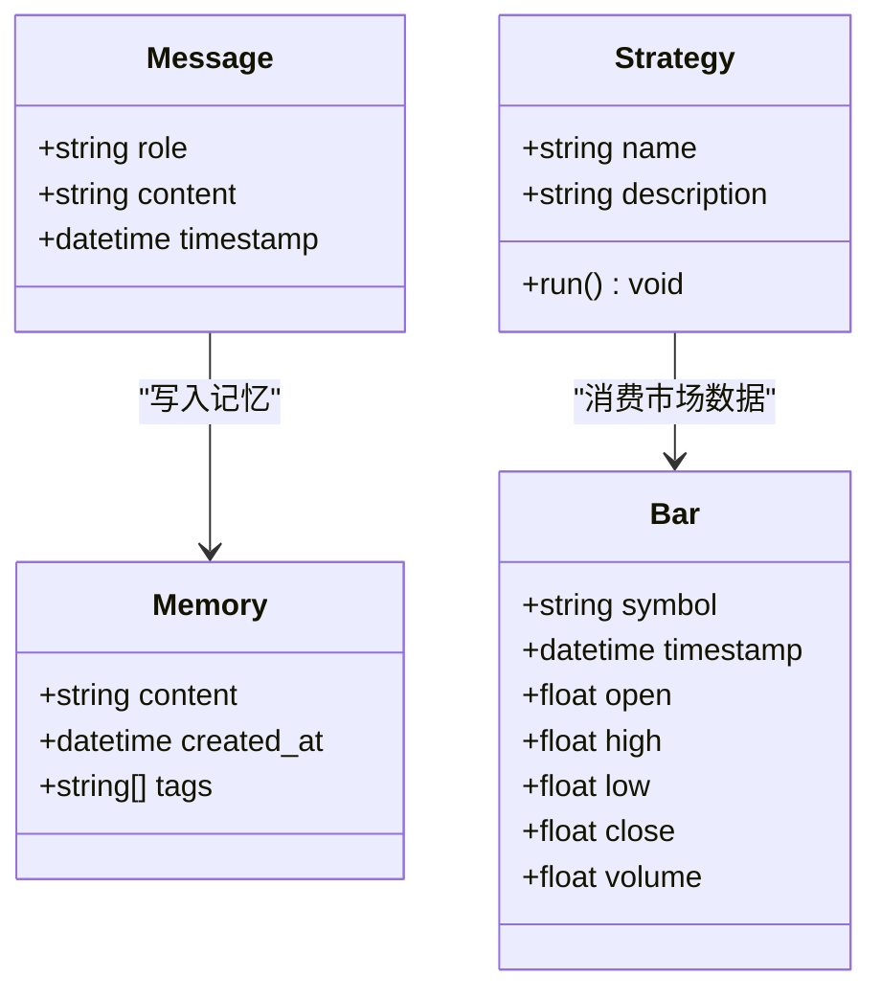
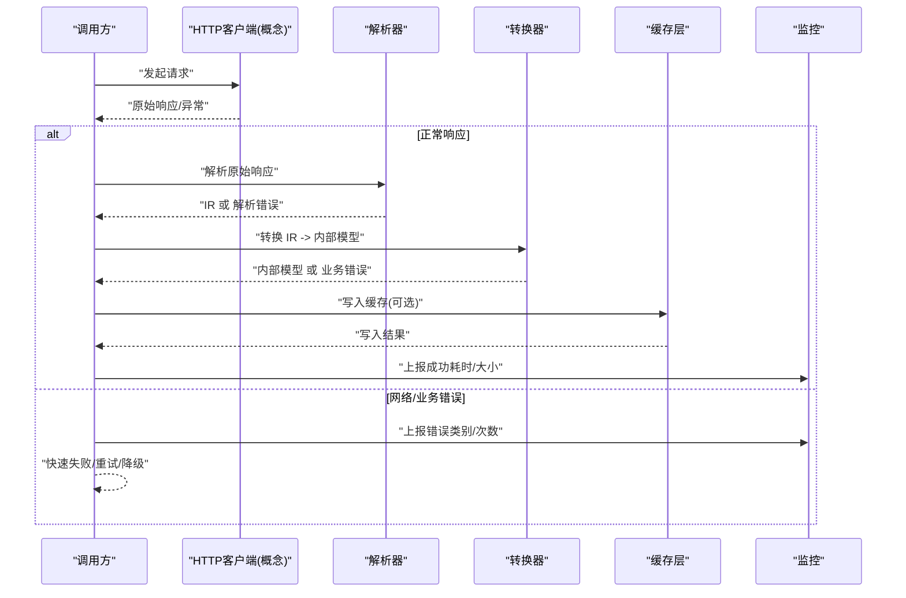
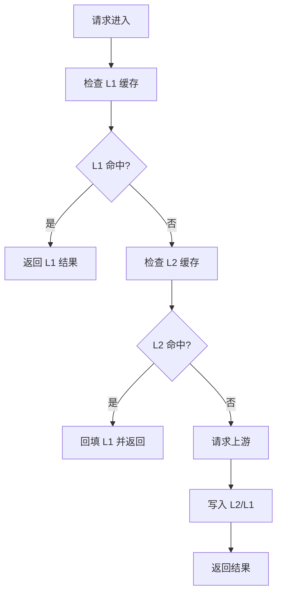
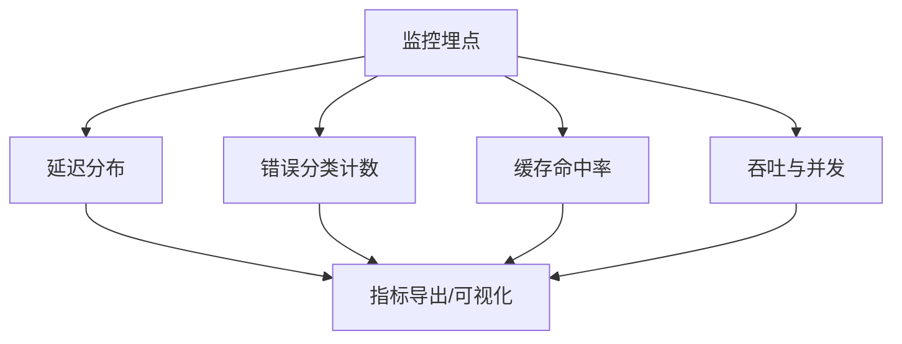
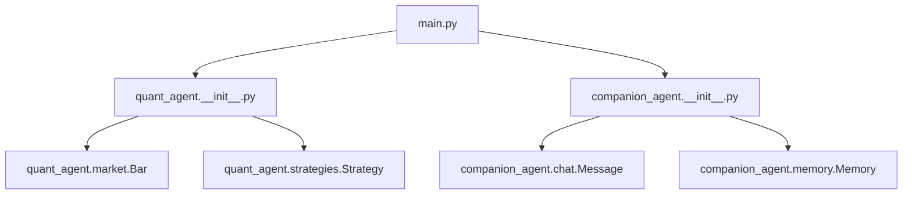

# 结果处理管道

<cite>
**本文引用的文件**   
- [main.py](file://main.py)
- [quant_agent/__init__.py](file://packages/quant-agent/src/quant_agent/__init__.py)
- [companion_agent/__init__.py](file://packages/companion-agent/src/companion_agent/__init__.py)
- [market.py](file://packages/quant-agent/src/quant_agent/market.py)
- [strategies.py](file://packages/quant-agent/src/quant_agent/strategies.py)
- [chat.py](file://packages/companion-agent/src/companion_agent/chat.py)
- [memory.py](file://packages/companion-agent/src/companion_agent/memory.py)
</cite>

## 目录
1. [简介](#简介)
2. [项目结构](#项目结构)
3. [核心组件](#核心组件)
4. [架构总览](#架构总览)
5. [详细组件分析](#详细组件分析)
6. [依赖分析](#依赖分析)
7. [性能考虑](#性能考虑)
8. [故障排查指南](#故障排查指南)
9. [结论](#结论)
10. [附录](#附录)

## 简介
本技术文档聚焦“结果处理管道”，围绕以下目标展开：
- 数据解析器：支持 JSON、XML、表单等多种响应格式的自动识别与解析。
- 格式转换引擎：将外部 API 响应转换为内部统一数据模型。
- 错误传播机制：对网络错误、业务错误、解析错误进行分类与传播。
- 数据缓存策略：多级缓存与失效机制。
- 性能监控与统计信息收集：在关键路径埋点，输出可观测指标。

说明：当前仓库为多包骨架工程，尚未包含具体的 HTTP 客户端、解析器或缓存实现。本节提供面向该仓库的“结果处理管道”设计蓝图与落地建议，便于后续在 packages 中扩展实现。

## 项目结构
仓库采用多包组织方式，入口 main.py 聚合两个子包能力（量化智能体与陪伴智能体）。当前代码以轻量数据类为主，未包含网络请求、解析与缓存逻辑。



图示来源
- [main.py:1-13](file://main.py#L1-L13)
- [quant_agent/__init__.py:1-14](file://packages/quant-agent/src/quant_agent/__init__.py#L1-L14)
- [companion_agent/__init__.py:1-14](file://packages/companion-agent/src/companion_agent/__init__.py#L1-L14)
- [market.py:1-16](file://packages/quant-agent/src/quant_agent/market.py#L1-L16)
- [strategies.py:1-13](file://packages/quant-agent/src/quant_agent/strategies.py#L1-L13)
- [chat.py:1-12](file://packages/companion-agent/src/companion_agent/chat.py#L1-L12)
- [memory.py:1-12](file://packages/companion-agent/src/companion_agent/memory.py#L1-L12)

章节来源
- [main.py:1-13](file://main.py#L1-L13)
- [quant_agent/__init__.py:1-14](file://packages/quant-agent/src/quant_agent/__init__.py#L1-L14)
- [companion_agent/__init__.py:1-14](file://packages/companion-agent/src/companion_agent/__init__.py#L1-L14)

## 核心组件
为实现“结果处理管道”，建议在现有包基础上新增如下组件（概念性设计）：
- 解析器（Parser）：负责自动识别并解析多种响应格式（JSON、XML、表单等），输出中间表示（IR）。
- 转换器（Transformer）：将 IR 映射到内部统一数据模型（如 Bar、Message、Memory 等）。
- 错误处理器（ErrorHandler）：分类捕获网络错误、业务错误、解析错误，并进行传播与上报。
- 缓存层（Cache）：多级缓存（进程内 LRU + 持久化/共享存储），支持键生成、TTL 与失效策略。
- 监控与统计（Metrics）：采集耗时、命中率、错误率、吞吐等指标。

这些组件可在 quant-agent 或 companion-agent 中按职责拆分，并通过统一的接口对外暴露。

章节来源
- [market.py:1-16](file://packages/quant-agent/src/quant_agent/market.py#L1-L16)
- [chat.py:1-12](file://packages/companion-agent/src/companion_agent/chat.py#L1-L12)
- [memory.py:1-12](file://packages/companion-agent/src/companion_agent/memory.py#L1-L12)

## 架构总览
下图展示“结果处理管道”的概念架构，涵盖从外部响应到内部模型的完整链路，以及错误与缓存、监控的横切关注点。

```mermaid
graph TB
subgraph "调用方"
Caller["上层业务/策略/对话流程"]
end
subgraph "结果处理管道"
Parser["解析器<br/>自动识别 JSON/XML/表单"]
Transformer["转换器<br/>IR -> 内部模型"]
ErrorHandler["错误处理器<br/>网络/业务/解析错误分类"]
Cache["缓存层<br/>多级缓存与失效"]
Metrics["监控与统计<br/>耗时/命中率/错误率"]
end
subgraph "外部系统"
API["外部API服务"]
end
Caller --> |发起请求| API
API --> |原始响应| Parser
Parser --> |中间表示(IR)| Transformer
Transformer --> |内部模型| Caller
Parser -.->|异常| ErrorHandler
Transformer -.->|异常| ErrorHandler
ErrorHandler --> |记录/上报| Metrics
Caller -.->|命中/写入| Cache
Cache -.->|命中/失效| Metrics
```

图示来源
- [main.py:1-13](file://main.py#L1-L13)
- [quant_agent/__init__.py:1-14](file://packages/quant-agent/src/quant_agent/__init__.py#L1-L14)
- [companion_agent/__init__.py:1-14](file://packages/companion-agent/src/companion_agent/__init__.py#L1-L14)

## 详细组件分析

### 数据解析器（自动识别与解析）
- 自动识别策略：基于 Content-Type、Content-Encoding、响应体特征（如首字符、标签匹配）进行推断；若缺失则回退到启发式检测。
- 解析流程：读取原始字节流 -> 选择解析器 -> 校验基本结构 -> 输出中间表示（IR）。
- 可扩展性：通过注册表模式扩展新格式解析器；支持流式解析以降低大响应内存占用。
- 典型输入/输出：
  - 输入：HTTP 响应头与主体
  - 输出：IR（键值树/事件流）



章节来源
- [main.py:1-13](file://main.py#L1-L13)

### 格式转换引擎（IR -> 内部统一模型）
- 映射规则：定义 IR 字段到内部模型的映射表，支持嵌套对象、数组、枚举与默认值。
- 类型安全：在转换阶段进行类型检查与强制转换，失败时抛出明确的业务错误。
- 适配不同领域模型：
  - 量化领域：IR -> Bar（K线数据）
  - 对话领域：IR -> Message（消息）、Memory（记忆）



图示来源
- [market.py:1-16](file://packages/quant-agent/src/quant_agent/market.py#L1-L16)
- [chat.py:1-12](file://packages/companion-agent/src/companion_agent/chat.py#L1-L12)
- [memory.py:1-12](file://packages/companion-agent/src/companion_agent/memory.py#L1-L12)
- [strategies.py:1-13](file://packages/quant-agent/src/quant_agent/strategies.py#L1-L13)

章节来源
- [market.py:1-16](file://packages/quant-agent/src/quant_agent/market.py#L1-L16)
- [chat.py:1-12](file://packages/companion-agent/src/companion_agent/chat.py#L1-L12)
- [memory.py:1-12](file://packages/companion-agent/src/companion_agent/memory.py#L1-L12)
- [strategies.py:1-13](file://packages/quant-agent/src/quant_agent/strategies.py#L1-L13)

### 错误传播机制（网络/业务/解析）
- 错误分类：
  - 网络错误：连接超时、DNS 解析失败、TLS 握手失败、HTTP 状态码异常等。
  - 业务错误：上游返回的业务码非成功、参数不合法、权限不足等。
  - 解析错误：格式不匹配、字段缺失、类型不兼容等。
- 传播策略：
  - 在解析器与转换器边界捕获并包装为统一错误类型，附带上下文（URL、方法、请求ID、部分响应片段）。
  - 根据错误类别决定重试、降级或快速失败。
  - 向监控上报错误计数与采样详情。



章节来源
- [main.py:1-13](file://main.py#L1-L13)

### 数据缓存策略（多级缓存与失效）
- 层级设计：
  - L1：进程内 LRU（低延迟，容量受限）
  - L2：持久化/共享存储（磁盘或内存数据库，跨进程/实例共享）
- 键生成：基于请求签名（URL、查询参数、Header 白名单）+ 版本前缀，避免脏读。
- 失效策略：
  - TTL 过期
  - 主动失效（发布订阅/版本号递增）
  - 写穿透/旁路更新
- 一致性：对于强一致场景，优先直连上游；对于读多写少场景，使用最终一致缓存。



章节来源
- [main.py:1-13](file://main.py#L1-L13)

### 性能监控与统计信息收集
- 指标维度：
  - 延迟：P50/P95/P99、分模块耗时（解析、转换、缓存、网络）
  - 吞吐：QPS、并发数
  - 质量：成功率、错误率（按类别）、缓存命中率
  - 资源：CPU/内存/GC 情况（按需）
- 埋点位置：
  - 请求进入/退出
  - 解析前后
  - 转换前后
  - 缓存命中/未命中
  - 错误分支
- 输出形式：结构化日志 + 指标导出（Prometheus/OpenTelemetry 等，按需集成）



章节来源
- [main.py:1-13](file://main.py#L1-L13)

## 依赖分析
当前仓库为骨架工程，主要依赖关系集中在入口与子包的 hello/main 函数。结果处理管道的具体实现尚未存在，以下为现有依赖图：



图示来源
- [main.py:1-13](file://main.py#L1-L13)
- [quant_agent/__init__.py:1-14](file://packages/quant-agent/src/quant_agent/__init__.py#L1-L14)
- [companion_agent/__init__.py:1-14](file://packages/companion-agent/src/companion_agent/__init__.py#L1-L14)
- [market.py:1-16](file://packages/quant-agent/src/quant_agent/market.py#L1-L16)
- [strategies.py:1-13](file://packages/quant-agent/src/quant_agent/strategies.py#L1-L13)
- [chat.py:1-12](file://packages/companion-agent/src/companion_agent/chat.py#L1-L12)
- [memory.py:1-12](file://packages/companion-agent/src/companion_agent/memory.py#L1-L12)

章节来源
- [main.py:1-13](file://main.py#L1-L13)
- [quant_agent/__init__.py:1-14](file://packages/quant-agent/src/quant_agent/__init__.py#L1-L14)
- [companion_agent/__init__.py:1-14](file://packages/companion-agent/src/companion_agent/__init__.py#L1-L14)

## 性能考虑
- 解析优化：
  - 优先使用增量/流式解析降低峰值内存。
  - 对热点格式（如 JSON）启用零拷贝或复用缓冲区。
- 转换优化：
  - 预编译映射规则，减少运行时反射开销。
  - 批量转换时合并 I/O 与序列化操作。
- 缓存优化：
  - 合理设置 TTL 与容量上限，避免抖动。
  - 使用原子操作与分段锁提升并发性能。
- 监控与可观测性：
  - 控制采样率，避免高负载下监控成为瓶颈。
  - 指标打点尽量无阻塞，异步落盘或发送。

## 故障排查指南
- 常见问题定位：
  - 解析失败：检查 Content-Type 与实际内容是否一致；查看解析错误上下文（URL、请求ID、部分响应）。
  - 转换失败：核对 IR 字段与映射规则；确认必填字段与类型约束。
  - 缓存问题：验证键生成策略是否稳定；检查 TTL 与失效事件；观察命中率趋势。
  - 性能退化：对比 P95/P99 延迟变化；定位慢步骤（网络/解析/转换/缓存）。
- 建议动作：
  - 增加更细粒度的错误分类与上报。
  - 引入灰度与熔断策略，保护上游与服务自身。
  - 完善单元测试与契约测试，覆盖异常路径。

章节来源
- [main.py:1-13](file://main.py#L1-L13)

## 结论
本仓库目前提供了清晰的多包结构与基础数据模型，为构建“结果处理管道”奠定了良好基础。下一步应在各包中逐步实现解析器、转换器、错误处理器、缓存层与监控埋点，形成端到端的高可用数据处理流水线。通过合理的错误分类、多级缓存与完善的监控体系，可显著提升系统的稳定性与可观测性。

## 附录
- 术语
  - IR：中间表示（Intermediate Representation）
  - TTL：生存时间（Time To Live）
  - LRU：最近最少使用（Least Recently Used）
- 参考数据模型
  - Bar：K线数据
  - Message：对话消息
  - Memory：记忆条目
  - Strategy：交易策略抽象