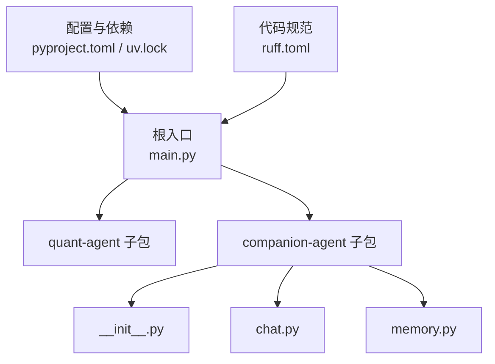
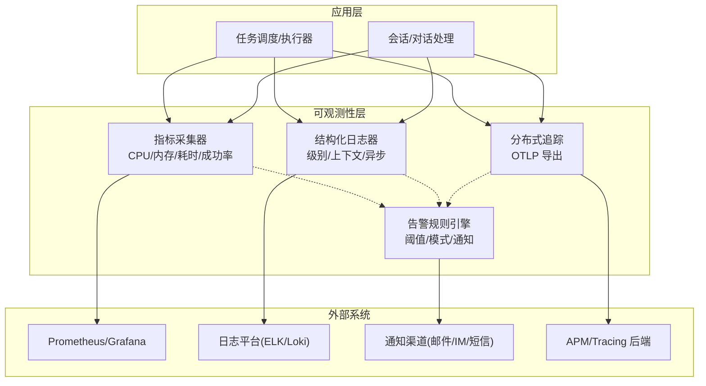
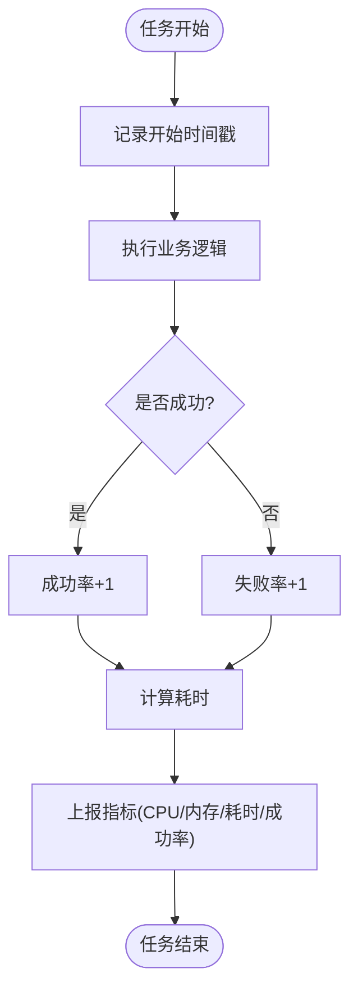
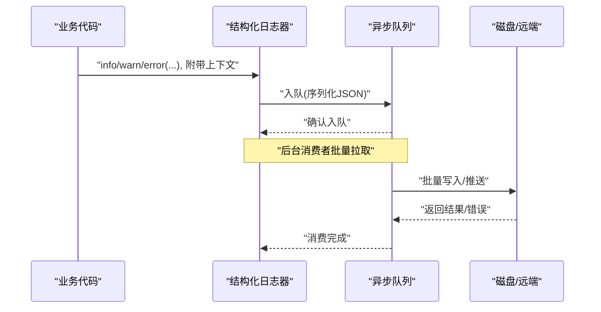
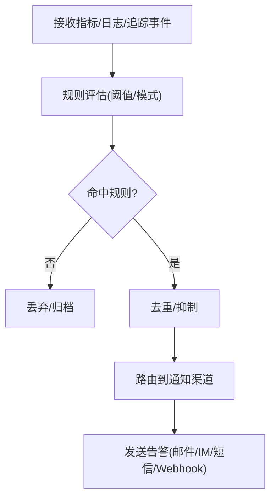
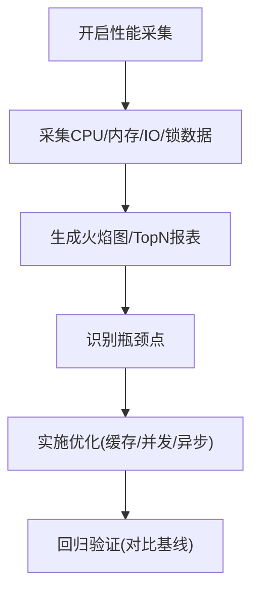
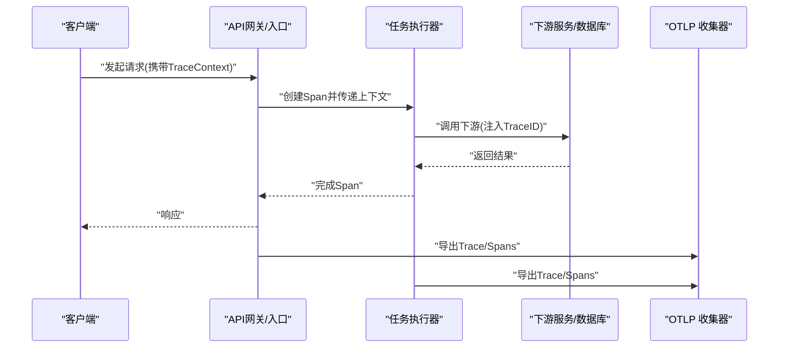
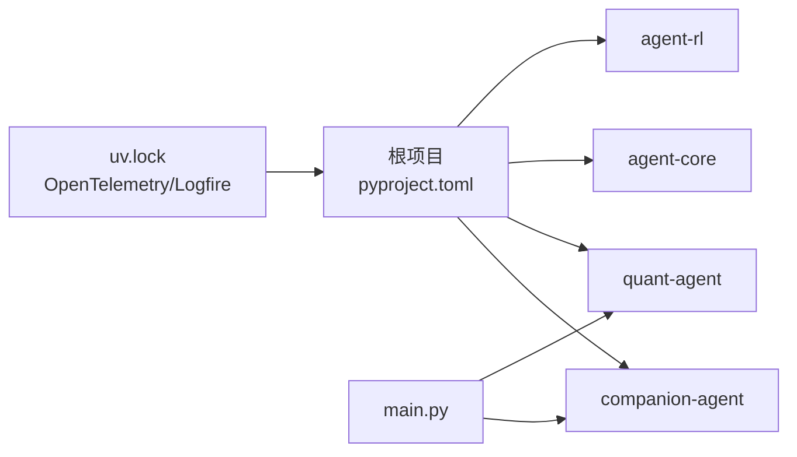

# 监控与日志

<cite>
**本文引用的文件**   
- [main.py](file://main.py)
- [pyproject.toml](file://pyproject.toml)
- [uv.lock](file://uv.lock)
- [ruff.toml](file://ruff.toml)
- [companion_agent/__init__.py](file://packages/companion-agent/src/companion_agent/__init__.py)
- [companion_agent/chat.py](file://packages/companion-agent/src/companion_agent/chat.py)
- [companion_agent/memory.py](file://packages/companion-agent/src/companion_agent/memory.py)
</cite>

## 目录
1. [引言](#引言)
2. [项目结构](#项目结构)
3. [核心组件](#核心组件)
4. [架构总览](#架构总览)
5. [详细组件分析](#详细组件分析)
6. [依赖分析](#依赖分析)
7. [性能考虑](#性能考虑)
8. [故障排查指南](#故障排查指南)
9. [结论](#结论)
10. [附录](#附录)

## 引言
本技术文档面向“陪伴助手”的任务监控系统，聚焦以下目标：
- 任务执行监控指标收集：CPU使用率、内存占用、执行时间、成功率统计
- 结构化日志记录系统：日志级别管理、上下文信息注入、异步日志写入
- 告警规则引擎：阈值监控、模式识别、通知渠道集成
- 性能分析工具：瓶颈识别与优化建议
- 分布式追踪与链路跟踪：OpenTelemetry 集成方案

当前仓库处于早期骨架阶段，尚未包含具体的监控/日志/告警实现代码。本文基于现有工程结构与依赖（如 OpenTelemetry、Logfire）给出可落地的设计与接入方案，确保后续在 companion-agent 等子包中快速落地。

## 项目结构
仓库采用多包工作区组织，根入口 main.py 聚合各子包能力；companion-agent 为“感性之面”，提供对话与记忆的数据模型。

图表来源
- [main.py:1-12](file://main.py#L1-L12)
- [companion_agent/__init__.py:1-15](file://packages/companion-agent/src/companion_agent/__init__.py#L1-L15)
- [companion_agent/chat.py:1-12](file://packages/companion-agent/src/companion_agent/chat.py#L1-L12)
- [companion_agent/memory.py:1-12](file://packages/companion-agent/src/companion_agent/memory.py#L1-L12)
- [pyproject.toml:1-30](file://pyproject.toml#L1-L30)
- [uv.lock:2534-2552](file://uv.lock#L2534-L2552)
- [ruff.toml:41-45](file://ruff.toml#L41-L45)

章节来源
- [main.py:1-12](file://main.py#L1-L12)
- [pyproject.toml:1-30](file://pyproject.toml#L1-L30)
- [uv.lock:2534-2552](file://uv.lock#L2534-L2552)
- [ruff.toml:41-45](file://ruff.toml#L41-L45)
- [companion_agent/__init__.py:1-15](file://packages/companion-agent/src/companion_agent/__init__.py#L1-L15)
- [companion_agent/chat.py:1-12](file://packages/companion-agent/src/companion_agent/chat.py#L1-L12)
- [companion_agent/memory.py:1-12](file://packages/companion-agent/src/companion_agent/memory.py#L1-L12)

## 核心组件
围绕任务监控与可观测性，建议将以下组件纳入 companion-agent 或独立的可观测性子模块：
- 指标采集器：进程级 CPU/内存、任务级耗时与成功率的计数器与时序指标
- 结构化日志器：统一日志格式、分级输出、上下文注入、异步落盘
- 告警规则引擎：阈值规则、模式匹配、多渠道通知
- 分布式追踪：OpenTelemetry SDK + OTLP 导出，跨服务链路串联
- 性能分析探针：热点函数计时、采样与火焰图数据导出

说明：上述组件目前为设计态，尚未在源码中出现具体实现。

## 架构总览
下图展示“任务执行—指标—日志—告警—追踪”的整体闭环。

[此图为概念性架构图，未直接映射到具体源文件，故不附图表来源]

## 详细组件分析

### 指标采集器（CPU/内存/耗时/成功率）
- 指标定义
  - 进程级：CPU 使用率、RSS/虚拟内存、句柄数、GC 次数
  - 任务级：执行时长直方图、成功/失败计数、错误码分布、重试次数
- 采集方式
  - 进程级：通过系统 API 定期采样
  - 任务级：以装饰器/中间件形式自动埋点，按任务维度打标签
- 存储与查询
  - 时序数据库（如 Prometheus）+ 可视化（Grafana）
  - 支持滑动窗口、分位数、同比环比
- 关键设计
  - 低开销：采样频率可调，避免阻塞主流程
  - 可扩展：指标名、标签键值遵循命名规范
  - 容错：采集失败不影响业务逻辑

[此图为概念流程图，未直接映射到具体源文件，故不附图表来源]

章节来源
- [pyproject.toml:1-30](file://pyproject.toml#L1-L30)
- [uv.lock:2534-2552](file://uv.lock#L2534-L2552)

### 结构化日志系统（级别/上下文/异步）
- 日志级别管理
  - DEBUG/INFO/WARN/ERROR/FATAL，默认 INFO，可按环境切换
- 上下文信息注入
  - 请求ID、用户ID、任务ID、TraceID、SpanID、租户/环境标签
- 异步写入
  - 队列缓冲 + 批量落盘，降低 IO 对主流程影响
- 输出格式
  - JSON 结构化字段：时间戳、级别、消息、上下文键值对、堆栈摘要
- 安全与合规
  - 敏感字段脱敏，控制最大长度，避免大对象入日志

[此图为概念序列图，未直接映射到具体源文件，故不附图表来源]

章节来源
- [ruff.toml:41-45](file://ruff.toml#L41-L45)

### 告警规则引擎（阈值/模式/通知）
- 阈值监控
  - 单指标阈值（如 CPU>80% 持续 3 分钟）、复合条件（CPU>80% 且 错误率>5%）
- 模式识别
  - 错误模式聚类、突发检测、周期性异常识别
- 通知渠道
  - 邮件、企业 IM、短信、Webhook；支持去重、静默期、升级策略
- 规则管理
  - 规则即配置（YAML/DB），支持热更新与灰度发布

[此图为概念流程图，未直接映射到具体源文件，故不附图表来源]

### 性能分析工具（瓶颈识别与优化建议）
- 采集项
  - CPU 热点（函数调用频次/耗时）、内存分配峰值、锁竞争、IO 等待
- 工具链
  - Python 内置 cProfile/py-spy、OpenTelemetry Profiling、APM 探针
- 分析方法
  - 火焰图定位热点、TopN 慢接口、长尾延迟分析
- 优化建议
  - 缓存热点数据、批量化 IO、减少锁粒度、异步化非关键路径

[此图为概念流程图，未直接映射到具体源文件，故不附图表来源]

### 分布式追踪与链路跟踪（OpenTelemetry）
- 组件
  - OpenTelemetry SDK、Instrumentation（HTTP/ASGI/自定义）、OTLP 导出器
- 集成点
  - 入口拦截（创建 Trace/Span）、跨进程传播（TraceID/SpanID）、资源标签（环境/版本/实例）
- 后端
  - Jaeger/Zipkin/自研 APM；支持采样策略（头部/尾部/动态）
- 最佳实践
  - 语义化 Span 命名、关键属性标注、错误标记、避免过度采样

图表来源
- [uv.lock:2534-2552](file://uv.lock#L2534-L2552)

章节来源
- [uv.lock:2534-2552](file://uv.lock#L2534-L2552)

## 依赖分析
- 工作区与依赖
  - pyproject.toml 声明了四个子包成员，根入口 main.py 聚合调用
- 可观测性相关依赖
  - uv.lock 中包含 OpenTelemetry 生态与 Logfire 相关包，可作为分布式追踪与日志的可选增强

图表来源
- [pyproject.toml:1-30](file://pyproject.toml#L1-L30)
- [main.py:1-12](file://main.py#L1-L12)
- [uv.lock:2534-2552](file://uv.lock#L2534-L2552)

章节来源
- [pyproject.toml:1-30](file://pyproject.toml#L1-L30)
- [main.py:1-12](file://main.py#L1-L12)
- [uv.lock:2534-2552](file://uv.lock#L2534-L2552)

## 性能考虑
- 指标采集
  - 合理采样间隔，避免高频系统调用；对高吞吐任务采用抽样上报
- 日志写入
  - 异步队列 + 批量落盘；限制日志大小与轮转策略；生产环境关闭 DEBUG
- 追踪采样
  - 头部采样用于全量关键路径，尾部采样用于长尾优化；按环境调整采样率
- 资源隔离
  - 监控组件与业务进程解耦，必要时独立部署，避免争抢资源

## 故障排查指南
- 快速定位
  - 通过 TraceID 关联日志与链路，结合错误码与堆栈摘要快速定位
- 常见症状
  - 指标突增/突降、日志缺失、告警风暴、追踪断链
- 处置步骤
  - 检查采集器健康状态、队列堆积情况、导出通道连通性、规则去重与静默配置
- 回滚与降级
  - 临时关闭非关键指标/日志、降级采样率、启用只读告警

章节来源
- [ruff.toml:41-45](file://ruff.toml#L41-L45)

## 结论
本项目已具备多包架构与 OpenTelemetry/Logfire 依赖基础，适合在此之上构建完整的任务监控与可观测体系。建议优先落地：
- 指标采集器与结构化日志器（最小可用）
- 分布式追踪（OTLP 导出）
- 告警规则引擎（阈值为主，逐步引入模式识别）
- 性能分析工具（cProfile/py-spy/APM）

## 附录
- 术语
  - Trace/Span：分布式追踪的基本单元
  - 指标：数值型度量（Counter/Histogram/Gauge）
  - 告警：基于规则触发的通知
- 参考
  - OpenTelemetry 官方文档
  - Logfire 文档（可选增强）