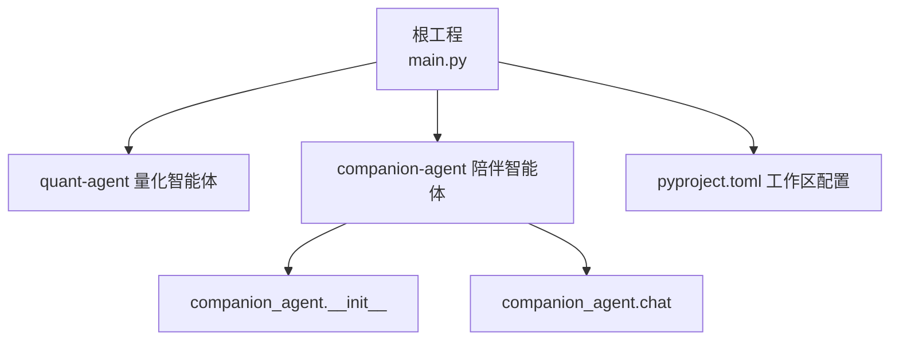
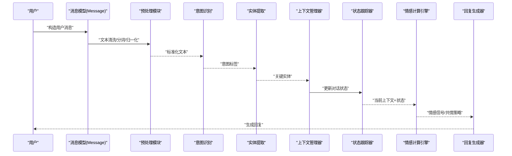
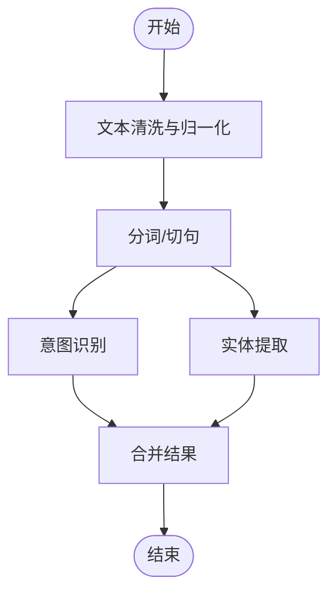
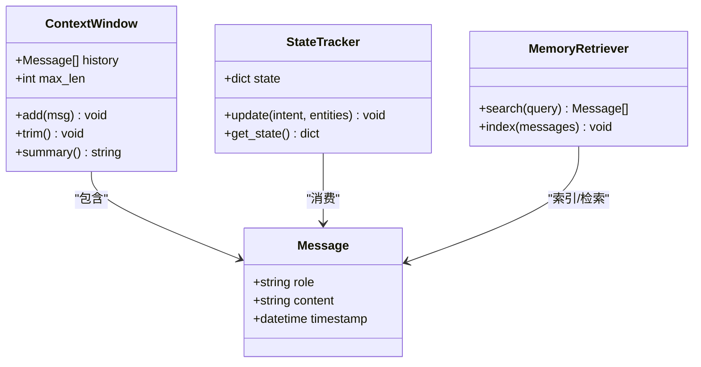
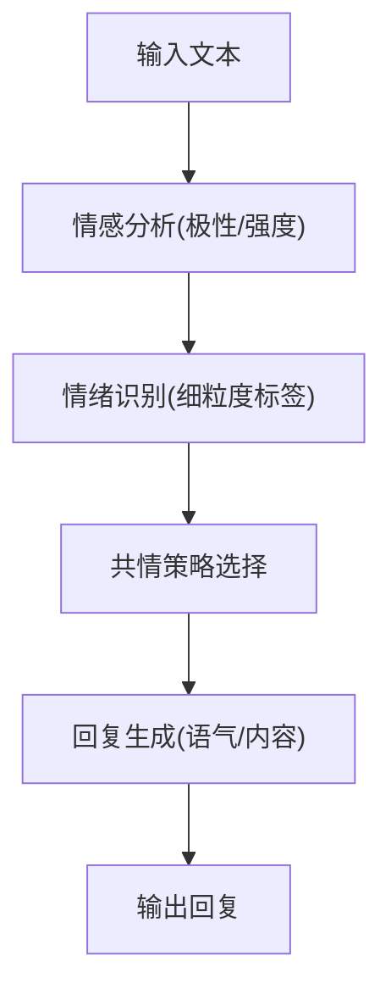
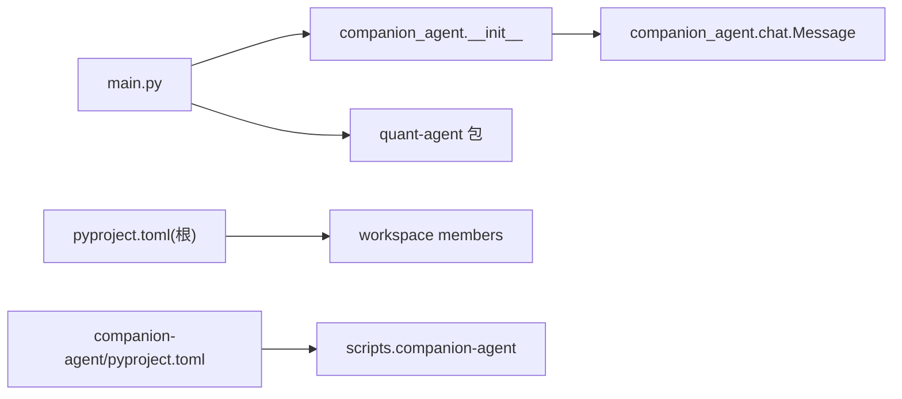

# 核心对话管理

<cite>
**本文引用的文件**   
- [main.py](file://main.py)
- [README.md](file://README.md)
- [pyproject.toml](file://pyproject.toml)
- [companion-agent/README.md](file://packages/companion-agent/README.md)
- [companion-agent/pyproject.toml](file://packages/companion-agent/pyproject.toml)
- [companion_agent/__init__.py](file://packages/companion-agent/src/companion_agent/__init__.py)
- [companion_agent/chat.py](file://packages/companion-agent/src/companion_agent/chat.py)
</cite>

## 目录
1. [简介](#简介)
2. [项目结构](#项目结构)
3. [核心组件](#核心组件)
4. [架构总览](#架构总览)
5. [详细组件分析](#详细组件分析)
6. [依赖关系分析](#依赖关系分析)
7. [性能考量](#性能考量)
8. [故障排查指南](#故障排查指南)
9. [结论](#结论)
10. [附录](#附录)

## 简介
本技术文档聚焦于“陪伴助手”的核心对话管理系统，围绕自然语言处理（文本预处理、意图识别、实体提取）、多轮对话上下文维护（对话状态跟踪、上下文窗口、记忆检索）、情感计算引擎（情感分析、情绪识别、共情响应生成）以及端到端对话流程展开。同时提供对话质量评估指标与性能优化建议，帮助读者快速理解并扩展该系统的对话能力。

## 项目结构
仓库采用多包工作区组织方式，根工程通过入口脚本聚合各子包能力；其中“陪伴之面”由 companion-agent 包实现，负责对话管理、记忆存储与多轮交互。



图表来源
- [main.py:1-13](file://main.py#L1-L13)
- [pyproject.toml:1-30](file://pyproject.toml#L1-L30)
- [companion_agent/__init__.py:1-14](file://packages/companion-agent/src/companion_agent/__init__.py#L1-L14)
- [companion_agent/chat.py:1-11](file://packages/companion-agent/src/companion_agent/chat.py#L1-L11)

章节来源
- [README.md:39-94](file://README.md#L39-L94)
- [pyproject.toml:1-30](file://pyproject.toml#L1-L30)
- [companion-agent/README.md:1-16](file://packages/companion-agent/README.md#L1-L16)

## 核心组件
- 消息模型：统一的消息数据结构，承载角色、内容与时间戳，作为对话流的基本单元。
- 模块入口：提供 hello/main 等便捷接口，便于独立运行与集成测试。
- 对话模块：定义 Message 数据类，为后续对话上下文、记忆与情感计算提供基础载体。

章节来源
- [companion_agent/chat.py:1-11](file://packages/companion-agent/src/companion_agent/chat.py#L1-L11)
- [companion_agent/__init__.py:1-14](file://packages/companion-agent/src/companion_agent/__init__.py#L1-L14)

## 架构总览
陪伴助手的对话系统以“消息驱动”的方式运转：用户输入被封装为消息对象，进入对话管理管线，依次经过预处理、意图识别、实体提取、上下文更新、情感计算与回复生成等环节，最终输出结构化或自然语言形式的回复。



图表来源
- [companion_agent/chat.py:1-11](file://packages/companion-agent/src/companion_agent/chat.py#L1-L11)

## 详细组件分析

### 自然语言处理模块
- 文本预处理
  - 目标：将原始输入规范化为稳定、可解析的中间表示，降低噪声对下游任务的影响。
  - 典型步骤：去噪（空白/标点/特殊字符）、分词、大小写与全角半角归一化、同义词映射、停用词过滤（可选）。
  - 复杂度：线性 O(n)，n 为字符数；分词可采用词典或统计方法，整体仍近似线性。
- 意图识别
  - 目标：判断用户输入所属的对话意图类别（如问候、倾诉、求助、闲聊等）。
  - 方法：规则匹配 + 轻量分类器（基于嵌入或传统机器学习），在陪伴场景下优先保证鲁棒性与可解释性。
  - 复杂度：分类阶段通常为 O(d·k) 或 O(k log k)，d 为特征维度，k 为类别数。
- 实体提取
  - 目标：从输入中抽取关键信息（人名、地点、事件、时间等），用于个性化与上下文增强。
  - 方法：命名实体识别（NER）或正则/模板抽取；陪伴场景更关注“人/事/时/地”等生活化实体。
  - 复杂度：序列标注一般为 O(n·m)，m 为标签集规模。



图表来源
- [companion_agent/chat.py:1-11](file://packages/companion-agent/src/companion_agent/chat.py#L1-L11)

章节来源
- [companion_agent/chat.py:1-11](file://packages/companion-agent/src/companion_agent/chat.py#L1-L11)

### 多轮对话上下文维护
- 对话状态跟踪（DST）
  - 目标：维护跨轮次的对话状态，包括用户画像、话题焦点、未决事项、偏好与历史摘要。
  - 设计要点：增量式更新、冲突消解、遗忘与巩固机制。
- 上下文窗口管理
  - 目标：控制参与推理的历史长度，平衡记忆容量与延迟。
  - 策略：滑动窗口、重要性评分裁剪、摘要压缩、分层记忆（短期/长期）。
- 记忆检索策略
  - 目标：根据当前上下文召回相关记忆片段，提升个性化与连贯性。
  - 方法：向量相似度检索、关键词倒排、混合检索（稠密+稀疏）、重排序。



图表来源
- [companion_agent/chat.py:1-11](file://packages/companion-agent/src/companion_agent/chat.py#L1-L11)

章节来源
- [companion_agent/chat.py:1-11](file://packages/companion-agent/src/companion_agent/chat.py#L1-L11)

### 情感计算引擎
- 情感分析
  - 目标：识别文本的情感极性（积极/消极/中性）与强度，支撑共情表达。
  - 方法：词典法、预训练情感模型、领域微调；陪伴场景需兼顾温和与包容。
- 情绪识别
  - 目标：细粒度情绪标签（如开心、悲伤、焦虑、愤怒、平静等），用于差异化回应。
  - 方法：多标签分类或层次化分类；结合上下文与历史进行平滑。
- 共情响应生成
  - 目标：在理解情感的基础上，生成具有同理心的回复，避免机械感与冒犯。
  - 策略：情感对齐（先认可再引导）、语气调节（温暖/坚定/轻松）、行动建议（可选）。



图表来源
- [companion_agent/chat.py:1-11](file://packages/companion-agent/src/companion_agent/chat.py#L1-L11)

章节来源
- [companion_agent/chat.py:1-11](file://packages/companion-agent/src/companion_agent/chat.py#L1-L11)

### 端到端对话流程示例
以下流程展示从用户输入到智能回复的关键环节，强调消息在各模块间的流转与状态更新。

```mermaid
sequenceDiagram
participant U as "用户"
participant Msg as "Message"
participant Pre as "预处理"
participant Int as "意图识别"
participant Ent as "实体提取"
ctx as "上下文/记忆"
dst as "状态跟踪"
emo as "情感计算"
gen as "回复生成"
U->>Msg : "创建消息(role=user,content=...)"
Msg->>Pre : "清洗/分词/归一化"
Pre-->>Int : "标准化文本"
Int-->>Ent : "意图标签"
Ent-->>ctx : "实体入库/索引"
ctx->>dst : "更新状态(话题/偏好/待办)"
dst-->>emo : "上下文+状态"
emo-->>gen : "情感信号/共情策略"
gen-->>U : "生成回复"
```

图表来源
- [companion_agent/chat.py:1-11](file://packages/companion-agent/src/companion_agent/chat.py#L1-L11)

章节来源
- [companion_agent/chat.py:1-11](file://packages/companion-agent/src/companion_agent/chat.py#L1-L11)

## 依赖关系分析
- 根工程 main.py 聚合 quant-agent 与 companion-agent 的能力，并通过各自 hello 接口进行演示。
- companion-agent 包提供命令行入口 companion-agent，指向 companion_agent.main。
- 工作区 pyproject.toml 声明成员包与源码路径，确保本地开发时可直接引用。



图表来源
- [main.py:1-13](file://main.py#L1-L13)
- [pyproject.toml:1-30](file://pyproject.toml#L1-L30)
- [companion-agent/pyproject.toml:1-18](file://packages/companion-agent/pyproject.toml#L1-L18)
- [companion_agent/__init__.py:1-14](file://packages/companion-agent/src/companion_agent/__init__.py#L1-L14)
- [companion_agent/chat.py:1-11](file://packages/companion-agent/src/companion_agent/chat.py#L1-L11)

章节来源
- [main.py:1-13](file://main.py#L1-L13)
- [pyproject.toml:1-30](file://pyproject.toml#L1-L30)
- [companion-agent/pyproject.toml:1-18](file://packages/companion-agent/pyproject.toml#L1-L18)

## 性能考量
- 预处理与分词
  - 使用向量化与批处理减少重复计算；对长文本采用分段处理与缓存。
- 意图识别与实体提取
  - 引入轻量模型与规则兜底，降低大模型调用成本；对高频意图做缓存与早返回。
- 上下文窗口
  - 动态裁剪低价值历史，使用摘要压缩保持语义密度；按会话热度加权保留关键片段。
- 记忆检索
  - 混合检索（稠密+稀疏）+ 重排序，提高召回精度；建立增量索引，避免全量重建。
- 情感计算
  - 离线预计算常见情感模式，在线仅做微调与融合；对极端情绪启用快速通道。
- 并发与异步
  - 将预处理、检索与生成并行化，利用异步 IO 降低端到端延迟。

[本节为通用指导，不直接分析具体文件]

## 故障排查指南
- 启动与入口
  - 确认根入口 main.py 能正常导入 companion-agent 与 quant-agent。
  - 检查 companion-agent 的脚本入口是否指向正确的模块函数。
- 依赖与工作区
  - 验证 pyproject.toml 的 workspace members 与源码路径一致。
  - 若本地无法解析包，尝试在工作区根执行 uv sync 后重试。
- 运行时错误
  - 若出现模块找不到，检查包名与 __init__.py 暴露的符号是否正确。
  - 若命令行不可用，确认 scripts 配置与安装环境。

章节来源
- [main.py:1-13](file://main.py#L1-L13)
- [companion-agent/pyproject.toml:1-18](file://packages/companion-agent/pyproject.toml#L1-L18)
- [companion_agent/__init__.py:1-14](file://packages/companion-agent/src/companion_agent/__init__.py#L1-L14)
- [pyproject.toml:1-30](file://pyproject.toml#L1-L30)

## 结论
陪伴助手的对话系统以消息为核心，串联预处理、意图识别、实体提取、上下文维护、情感计算与回复生成等关键环节。通过合理的上下文窗口管理与记忆检索策略，系统在个性化与效率之间取得平衡；情感计算引擎则赋予其共情能力，提升用户体验。建议在后续迭代中持续完善 DST 与记忆索引，强化情感细粒度识别与可解释性，并结合评测体系持续优化。

[本节为总结性内容，不直接分析具体文件]

## 附录
- 快速开始
  - 根工程：python main.py
  - companion-agent：uv run companion-agent
- 开发规范
  - 代码检查：ruff check .
  - 格式化：ruff format .
  - 测试：pytest

章节来源
- [README.md:95-112](file://README.md#L95-L112)
- [companion-agent/README.md:7-15](file://packages/companion-agent/README.md#L7-L15)