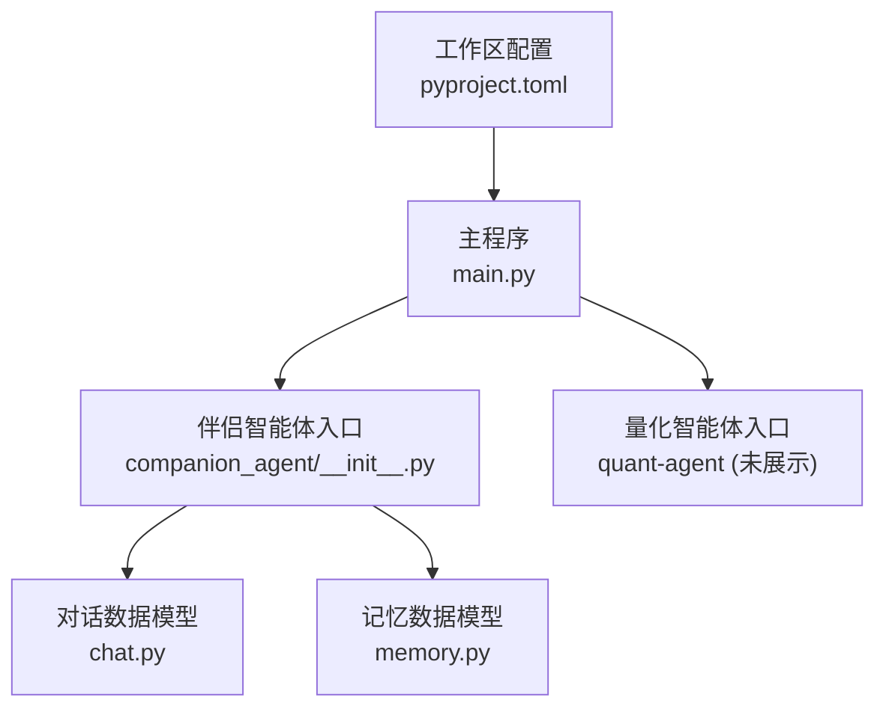
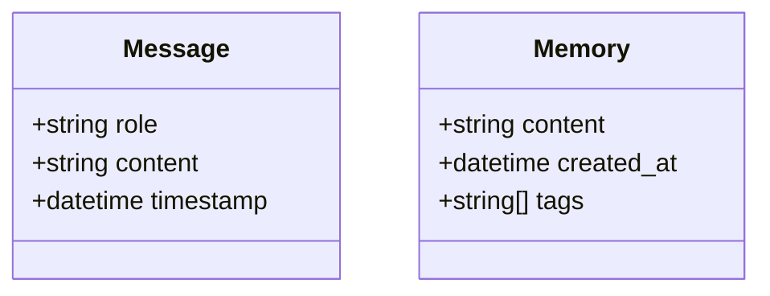
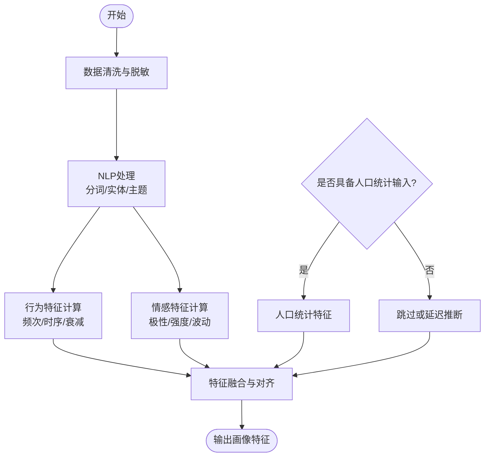
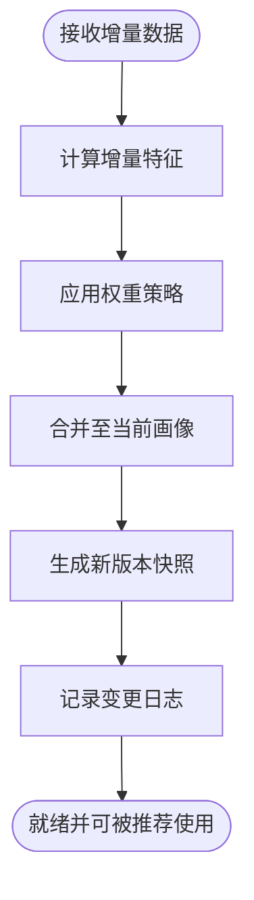
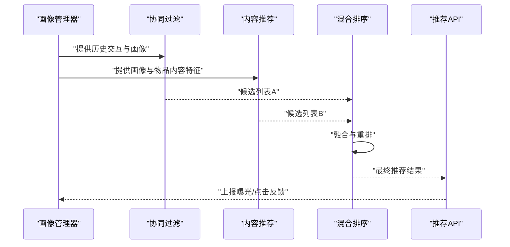
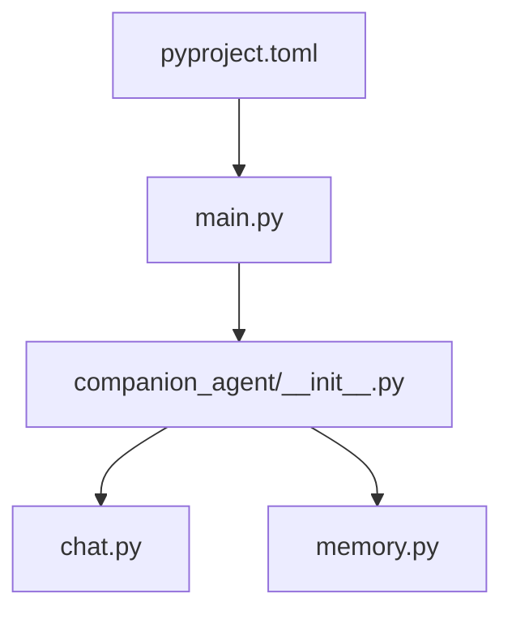

# 用户画像构建

<cite>
**本文引用的文件**   
- [main.py](file://main.py)
- [pyproject.toml](file://pyproject.toml)
- [companion_agent/__init__.py](file://packages/companion-agent/src/companion_agent/__init__.py)
- [companion_agent/chat.py](file://packages/companion-agent/src/companion_agent/chat.py)
- [companion_agent/memory.py](file://packages/companion-agent/src/companion_agent/memory.py)
</cite>

## 目录
1. [引言](#引言)
2. [项目结构](#项目结构)
3. [核心组件](#核心组件)
4. [架构总览](#架构总览)
5. [详细组件分析](#详细组件分析)
6. [依赖分析](#依赖分析)
7. [性能考虑](#性能考虑)
8. [故障排查指南](#故障排查指南)
9. [结论](#结论)
10. [附录](#附录)

## 引言
本技术文档围绕“陪伴助手的用户画像构建系统”展开，目标是系统化说明以下能力：
- 用户特征提取算法：人口统计学信息、行为特征与情感特征的自动识别路径。
- 用户画像的动态更新机制：增量学习、权重调整与版本管理。
- 个性化推荐引擎：协同过滤、内容推荐与混合推荐策略。
- 隐私保护与数据安全设计。
- 画像质量评估与用户反馈收集机制。

当前仓库为多包工作区，包含 companion-agent（感性之面）、agent-core、agent-rl、quant-agent 等模块。现有代码提供了对话消息与记忆的数据模型以及入口脚本，可作为画像系统的输入源与扩展点。后续章节将基于这些基础构件，给出可落地的架构设计与实现建议。

## 项目结构
仓库采用多包工作区组织，顶层 main.py 作为统一入口，加载 companion-agent 与 quant-agent 的能力；companion-agent 提供对话与记忆的基础数据结构，便于采集用户交互数据用于画像构建。



图表来源
- [main.py:1-13](file://main.py#L1-L13)
- [companion_agent/__init__.py:1-15](file://packages/companion-agent/src/companion_agent/__init__.py#L1-L15)
- [companion_agent/chat.py:1-12](file://packages/companion-agent/src/companion_agent/chat.py#L1-L12)
- [companion_agent/memory.py:1-12](file://packages/companion-agent/src/companion_agent/memory.py#L1-L12)
- [pyproject.toml:1-30](file://pyproject.toml#L1-L30)

章节来源
- [main.py:1-13](file://main.py#L1-L13)
- [pyproject.toml:1-30](file://pyproject.toml#L1-L30)
- [companion_agent/__init__.py:1-15](file://packages/companion-agent/src/companion_agent/__init__.py#L1-L15)
- [companion_agent/chat.py:1-12](file://packages/companion-agent/src/companion_agent/chat.py#L1-L12)
- [companion_agent/memory.py:1-12](file://packages/companion-agent/src/companion_agent/memory.py#L1-L12)

## 核心组件
- 对话消息模型：用于记录角色、内容与时间戳，是行为特征与情感特征提取的原始输入。
- 记忆模型：用于持久化关键片段、创建时间与标签，支持长期画像与兴趣演化追踪。
- 入口与装配：主程序负责初始化并调用各子模块，便于在启动阶段注册画像构建管线。

章节来源
- [companion_agent/chat.py:1-12](file://packages/companion-agent/src/companion_agent/chat.py#L1-L12)
- [companion_agent/memory.py:1-12](file://packages/companion-agent/src/companion_agent/memory.py#L1-L12)
- [companion_agent/__init__.py:1-15](file://packages/companion-agent/src/companion_agent/__init__.py#L1-L15)
- [main.py:1-13](file://main.py#L1-L13)

## 架构总览
下图展示了从对话到画像更新的端到端流程，包括特征提取、画像存储、动态更新与推荐服务。该图为概念性架构图，用于指导后续工程落地。

```mermaid
sequenceDiagram
participant U as "用户"
participant Chat as "对话接口<br/>chat.py"
participant Mem as "记忆接口<br/>memory.py"
participant FE as "特征提取器"
participant PM as "画像管理器"
rec as "推荐引擎"
U->>Chat : "发送消息"
Chat->>Mem : "写入会话/记忆"
Chat->>FE : "触发特征提取(文本/时序)"
FE-->>PM : "输出人口统计/行为/情感特征"
PM->>PM : "增量更新与权重调整"
PM-->>rec : "推送最新画像"
rec-->>U : "返回个性化内容"
```

[此图为概念流程图，不直接映射具体源码文件，故无图表来源]

## 详细组件分析

### 数据模型与输入源
- 对话消息：包含角色、内容与时间戳，适合进行序列建模、主题抽取与情绪分析。
- 记忆条目：包含内容、创建时间与标签，适合作为长期兴趣与偏好演化的载体。



图表来源
- [companion_agent/chat.py:1-12](file://packages/companion-agent/src/companion_agent/chat.py#L1-L12)
- [companion_agent/memory.py:1-12](file://packages/companion-agent/src/companion_agent/memory.py#L1-L12)

章节来源
- [companion_agent/chat.py:1-12](file://packages/companion-agent/src/companion_agent/chat.py#L1-L12)
- [companion_agent/memory.py:1-12](file://packages/companion-agent/src/companion_agent/memory.py#L1-L12)

### 用户特征提取算法
目标：从对话与记忆中自动识别三类特征
- 人口统计学信息：如年龄段、性别、地域、职业等（需结合显式授权或间接推断）。
- 行为特征：如活跃时段、话题偏好、互动频率、停留时长、点击/收藏等行为信号。
- 情感特征：如情绪极性、强度、波动性与触发因素。

处理流水线（概念）
- 输入清洗：去噪、标准化、敏感字段脱敏。
- 文本理解：分词、实体识别、主题聚类、关键词抽取。
- 时序建模：滑动窗口聚合、衰减加权、趋势检测。
- 情感分析：极性分类、强度估计、上下文关联。
- 规则与模型融合：基于规则的启发式与机器学习模型结果融合。
- 输出对齐：将特征映射至画像维度，生成结构化向量与元数据。



[此图为概念流程图，不直接映射具体源码文件，故无图表来源]

### 画像动态更新机制
- 增量学习：以新对话/记忆为增量输入，按时间衰减对旧特征进行平滑更新，避免全量重算。
- 权重调整：依据任务目标（如推荐点击率、留存）在线或离线更新特征权重，支持A/B实验。
- 版本管理：每次更新生成新版本画像快照，保留变更日志与回滚能力。



[此图为概念流程图，不直接映射具体源码文件，故无图表来源]

### 个性化推荐引擎
- 协同过滤：基于用户-物品交互矩阵，挖掘相似用户或相似物品，生成候选集。
- 内容推荐：基于画像特征与物品内容特征匹配，保证冷启动与多样性。
- 混合推荐：将协同过滤与内容推荐结果融合，结合业务规则与实时信号排序。



[此图为概念流程图，不直接映射具体源码文件，故无图表来源]

### 隐私保护与数据安全
- 最小化采集：仅采集必要字段，明确告知用途并获得授权。
- 本地优先：尽可能在设备端完成敏感特征计算，减少上行数据。
- 匿名化与去标识化：移除直接标识符，采用哈希或差分隐私技术。
- 传输与存储加密：TLS 传输、AES 静态加密、密钥轮换。
- 访问控制与审计：RBAC、细粒度权限、操作审计与异常告警。
- 合规与生命周期：数据保留策略、用户撤回权与删除权。

[本节为通用安全设计建议，不直接映射具体源码文件，故无章节来源]

### 画像质量评估与用户反馈
- 质量指标：覆盖率、准确率、稳定性、时效性、可解释性。
- 评估方法：离线回溯、A/B 测试、人工抽检、对抗样本检验。
- 反馈闭环：显式评分、隐式行为（点击/停留/分享）、负反馈（屏蔽/举报）。
- 持续改进：基于反馈优化特征权重与模型参数，定期复盘与回归验证。

[本节为通用方法论，不直接映射具体源码文件，故无章节来源]

## 依赖分析
- 顶层入口 main.py 依赖 companion-agent 与 quant-agent，通过工作区配置 pyproject.toml 统一管理成员包。
- companion-agent 内部 chat.py 与 memory.py 提供基础数据结构，供上层画像与推荐模块消费。



图表来源
- [pyproject.toml:1-30](file://pyproject.toml#L1-L30)
- [main.py:1-13](file://main.py#L1-L13)
- [companion_agent/__init__.py:1-15](file://packages/companion-agent/src/companion_agent/__init__.py#L1-L15)
- [companion_agent/chat.py:1-12](file://packages/companion-agent/src/companion_agent/chat.py#L1-L12)
- [companion_agent/memory.py:1-12](file://packages/companion-agent/src/companion_agent/memory.py#L1-L12)

章节来源
- [pyproject.toml:1-30](file://pyproject.toml#L1-L30)
- [main.py:1-13](file://main.py#L1-L13)
- [companion_agent/__init__.py:1-15](file://packages/companion-agent/src/companion_agent/__init__.py#L1-L15)
- [companion_agent/chat.py:1-12](file://packages/companion-agent/src/companion_agent/chat.py#L1-L12)
- [companion_agent/memory.py:1-12](file://packages/companion-agent/src/companion_agent/memory.py#L1-L12)

## 性能考虑
- 流式处理：对长对话采用滑动窗口与增量计算，降低CPU与内存峰值。
- 异步与批处理：特征提取与画像更新异步执行，批量写入以减少IO开销。
- 缓存与索引：热点画像与候选集缓存，键值索引加速检索。
- 模型轻量化：选择轻量NLP模型或蒸馏后的模型，平衡精度与延迟。
- 水平扩展：特征计算与推荐服务无状态化，便于横向扩容。

[本节为通用性能建议，不直接映射具体源码文件，故无章节来源]

## 故障排查指南
- 入口问题：确认 main.py 能正确导入 companion-agent 与 quant-agent，检查工作区依赖是否安装完整。
- 数据模型校验：确保 Message 与 Memory 字段类型与必填项符合预期，避免下游解析失败。
- 日志与监控：为特征提取、画像更新与推荐链路增加埋点，定位慢查询与异常分支。
- 回滚策略：画像版本快照应支持快速回滚，防止错误更新影响线上体验。

章节来源
- [main.py:1-13](file://main.py#L1-L13)
- [companion_agent/chat.py:1-12](file://packages/companion-agent/src/companion_agent/chat.py#L1-L12)
- [companion_agent/memory.py:1-12](file://packages/companion-agent/src/companion_agent/memory.py#L1-L12)

## 结论
本项目已提供对话与记忆的基础数据模型与统一入口，为构建用户画像系统奠定了良好基础。建议在现有基础上逐步引入特征提取、画像管理与推荐服务，形成“数据采集—特征计算—画像更新—推荐反馈”的闭环。同时，严格遵循隐私与安全规范，建立完善的评估与反馈机制，持续提升画像质量与用户体验。

## 附录
- 术语表
  - 画像：对用户属性、行为与偏好的结构化表示。
  - 增量学习：基于新增数据对已有模型或画像进行局部更新。
  - 协同过滤：基于用户-物品交互的推荐方法。
  - 内容推荐：基于内容与画像匹配的推荐方法。
  - 混合推荐：融合多种推荐策略以提升效果与鲁棒性。