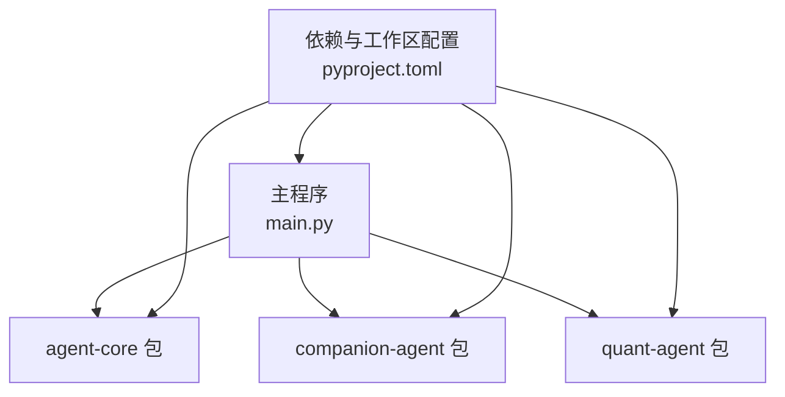
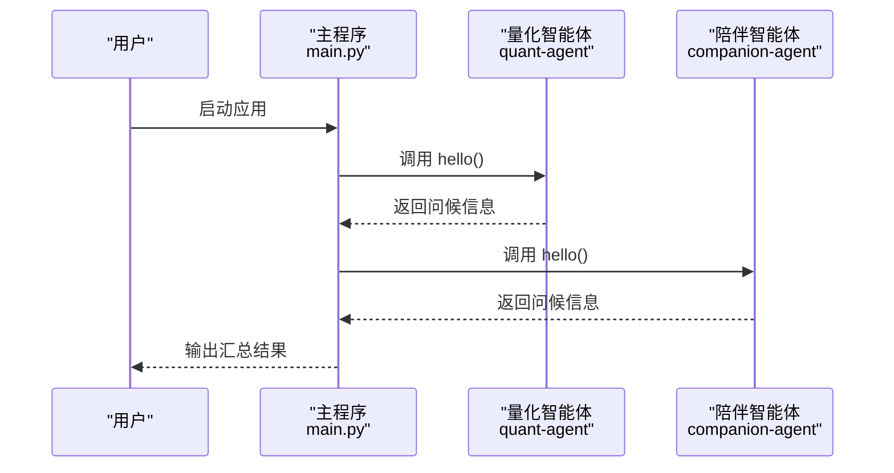
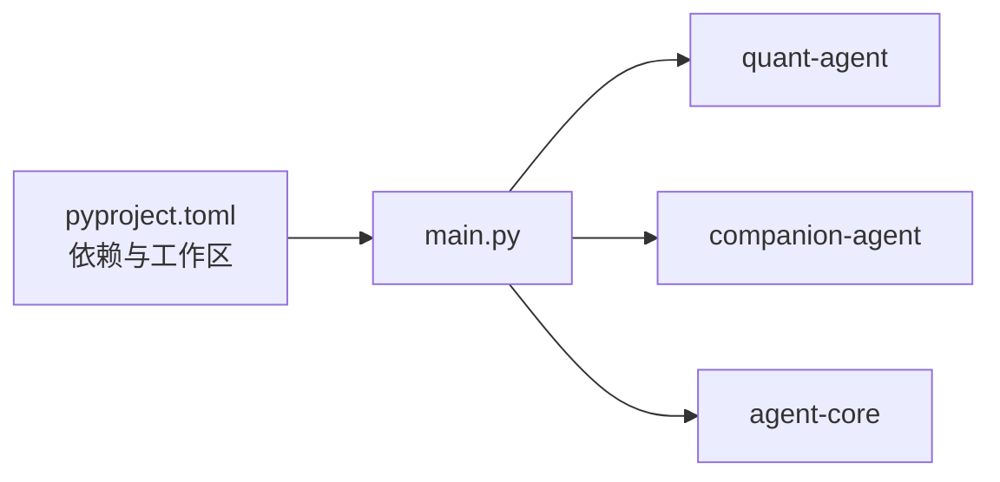

# 用户偏好学习

<cite>
**本文引用的文件**   
- [main.py](file://main.py)
- [pyproject.toml](file://pyproject.toml)
- [agent-core __init__.py](file://packages/agent-core/src/agent_core/__init__.py)
- [verl-learning-plan.md](file://docs/plans/verl-learning-plan.md)
</cite>

## 目录
1. [简介](#简介)
2. [项目结构](#项目结构)
3. [核心组件](#核心组件)
4. [架构总览](#架构总览)
5. [详细组件分析](#详细组件分析)
6. [依赖分析](#依赖分析)
7. [性能考虑](#性能考虑)
8. [故障排查指南](#故障排查指南)
9. [结论](#结论)
10. [附录](#附录)

## 简介
本技术文档面向“用户偏好学习系统”，围绕行为模式识别、兴趣标签体系、个性化模型训练、偏好冲突处理与评估/A/B测试等关键主题，提供从架构到实现细节的系统化说明。当前仓库为多包工作区，主入口通过 main.py 聚合 agent-core、companion-agent、quant-agent 等子能力；强化学习方向以 verl 学习计划作为后续能力引入的路线图。

## 项目结构
仓库采用多包工作区组织方式，顶层 main.py 作为统一入口，依赖由 pyproject.toml 声明并通过 uv workspace 管理。各功能域位于 packages/* 下（如 agent-core、agent-rl、quant-agent、companion-agent），便于按职责拆分与独立演进。

图表来源
- [main.py:1-13](file://main.py#L1-L13)
- [pyproject.toml:1-30](file://pyproject.toml#L1-L30)

章节来源
- [main.py:1-13](file://main.py#L1-L13)
- [pyproject.toml:1-30](file://pyproject.toml#L1-L30)

## 核心组件
- 主入口与装配：main.py 负责打印启动信息与调用子模块能力，体现“双面孔”智能体的组合式入口设计。
- 包能力示例：agent-core 提供基础能力入口（示例函数），用于验证环境连通性与模块可导入性。
- 依赖与工作区：pyproject.toml 声明项目元数据、Python 版本约束、依赖项以及 uv workspace 成员，确保多包协同构建与运行。

章节来源
- [main.py:1-13](file://main.py#L1-L13)
- [agent-core __init__.py:1-2](file://packages/agent-core/src/agent_core/__init__.py#L1-L2)
- [pyproject.toml:1-30](file://pyproject.toml#L1-L30)

## 架构总览
下图展示主程序如何加载并调用各子包能力，形成可扩展的双面智能体框架。该图映射到实际源码文件，体现运行时装配关系。

图表来源
- [main.py:1-13](file://main.py#L1-L13)

## 详细组件分析

### 行为模式识别算法
目标：从对话交互中识别用户的风格、话题兴趣与情感倾向，为后续标签体系与个性化建模提供输入。

- 对话风格分析
  - 维度建议：语速/长度、句式复杂度、礼貌程度、指令密度、幽默度、专业术语密度等。
  - 方法建议：基于规则与轻量模型的混合方案，先做特征抽取（词长分布、标点比例、句法树深度等），再用分类器或聚类进行风格分型。
  - 工程要点：流式计算窗口、滑动统计、增量更新，避免全量重算。

- 话题兴趣提取
  - 维度建议：领域（如金融、科技、健康）、任务类型（查询、创作、决策）、实体关注点（公司、产品、人物）。
  - 方法建议：关键词+命名实体识别+主题模型（如 LDA/BERTopic）结合，辅以人工标注的领域词典提升召回。
  - 工程要点：热词衰减机制、冷启动兜底策略、跨会话一致性平滑。

- 情感倾向判断
  - 维度建议：极性（正/负/中性）、强度、情绪类别（喜悦、愤怒、焦虑等）。
  - 方法建议：领域适配的情感词典 + 预训练情感模型微调；对短文本使用上下文增强。
  - 工程要点：置信度阈值、反讽/讽刺检测、多轮上下文融合。

[本节为概念性说明，不直接分析具体源文件]

### 兴趣标签体系设计
目标：构建层次化、可度量、可演进的标签体系，支撑个性化推荐与内容匹配。

- 标签层次结构
  - 一级：领域大类（如“投资”“编程”“健康”）
  - 二级：细分主题（如“股票”“量化”“前端”“健身”）
  - 三级：细粒度兴趣点（如“期权策略”“Rust异步”“HIIT”）
  - 属性：权重、时效性、来源（显式/隐式）、可信度

- 权重计算
  - 基础权重：基于出现频次、点击/停留时长、互动质量（点赞/收藏/转发）加权。
  - 时间衰减：指数衰减或分段衰减，保证近期行为影响更大。
  - 来源可信度：显式反馈（评分/选择）高于隐式反馈（浏览/停留）。
  - 去重与合并：同义/近义标签归一化，避免重复膨胀。

- 动态更新机制
  - 事件驱动：新交互触发增量更新，维护在线画像。
  - 周期批处理：离线校准长期趋势，修正漂移。
  - 冲突消解：当不同来源给出矛盾信号时，依据可信度与时效性综合决策。

[本节为概念性说明，不直接分析具体源文件]

### 个性化模型训练流程
目标：将行为与标签转化为可学习的用户表征，驱动个性化生成与推荐。

- 特征工程
  - 静态特征：人口学、设备、语言偏好、历史稳定兴趣。
  - 动态特征：最近N次交互序列、会话内状态、实时意图向量。
  - 交叉特征：用户×话题、用户×渠道、用户×时段。

- 模型选择
  - 排序/推荐：双塔/多塔、DIN/DIEN、Transformer-based 序列模型。
  - 生成/对话：指令微调大模型 + 检索增强（RAG）。
  - 强化学习：PPO/GRPO 等策略优化，参考 verl 学习计划引入 RLHF 能力。

- 参数调优
  - 离线：网格/贝叶斯搜索、早停、正则化。
  - 在线：A/B 实验、灰度发布、回滚策略。
  - 监控：指标看板、异常告警、漂移检测。

章节来源
- [verl-learning-plan.md:1-41](file://docs/plans/verl-learning-plan.md#L1-L41)

### 偏好冲突检测与处理策略
目标：在多源、多时段的偏好信号中保持一致性与准确性。

- 冲突检测
  - 信号不一致：同一标签在不同会话中出现相反倾向。
  - 语义冲突：相近标签表达互斥兴趣（如“保守投资” vs “高杠杆投机”）。
  - 时序冲突：短期冲动与长期稳定偏好的背离。

- 处理策略
  - 可信度加权：显式 > 隐式；权威来源 > 噪声来源。
  - 时间衰减：近期强信号优先，但保留长期基线。
  - 软投票与阈值：当分歧超过阈值时进入人工复核或降级策略。
  - 解释与可追溯：记录冲突原因、证据链与最终决策路径。

[本节为概念性说明，不直接分析具体源文件]

### 学习效果评估与 A/B 测试框架
目标：建立科学的评估体系与实验平台，持续验证与改进偏好学习效果。

- 评估指标
  - 离线：准确率、F1、AUC、NDCG、Recall@K、覆盖率、多样性。
  - 在线：CTR/CVR、留存率、会话时长、满意度评分、负反馈率。
  - 公平与稳健：群体差异、鲁棒性、漂移敏感度。

- A/B 测试框架
  - 分流策略：随机/分层/哈希，保证组间可比性。
  - 实验设计：假设明确、样本量估算、显著性检验。
  - 观测与决策：指标看板、自动告警、快速回滚。
  - 迭代闭环：失败复盘、策略回归、知识沉淀。

[本节为概念性说明，不直接分析具体源文件]

## 依赖分析
- 主程序依赖多个子包，通过 pyproject.toml 声明并在 uv workspace 中统一管理。
- 当前最小可用路径：main.py 调用 quant-agent 与 companion-agent 的 hello 接口，验证环境连通性。
- agent-core 提供基础入口，便于扩展更多通用能力。

图表来源
- [pyproject.toml:1-30](file://pyproject.toml#L1-L30)
- [main.py:1-13](file://main.py#L1-L13)

章节来源
- [pyproject.toml:1-30](file://pyproject.toml#L1-L30)
- [main.py:1-13](file://main.py#L1-L13)

## 性能考虑
- 流式与增量：对话特征与标签权重应支持增量更新，降低延迟与资源消耗。
- 缓存与索引：热门标签与用户表征缓存，减少重复计算。
- 模型服务：推理侧采用批处理、量化、蒸馏等手段提升吞吐。
- 监控与限流：关键链路埋点、熔断与降级策略保障稳定性。

[本节为通用指导，不直接分析具体源文件]

## 故障排查指南
- 启动问题：确认 Python 版本满足要求（>=3.12），检查 uv 工作区与依赖安装是否成功。
- 模块不可用：验证 agent-core、quant-agent、companion-agent 是否正确安装并可导入。
- 日志定位：在 main.py 入口增加结构化日志，捕获子模块异常堆栈。
- 回归验证：通过最小用例（如调用 hello）快速验证环境正确性。

章节来源
- [pyproject.toml:1-30](file://pyproject.toml#L1-L30)
- [main.py:1-13](file://main.py#L1-L13)
- [agent-core __init__.py:1-2](file://packages/agent-core/src/agent_core/__init__.py#L1-L2)

## 结论
本仓库提供了多包协作的基础骨架与统一入口，具备向“用户偏好学习系统”演进的良好起点。下一步建议：
- 在 agent-core 中沉淀通用的行为特征抽取与标签管理模块。
- 在 companion-agent 中实现对话风格分析与情感倾向判断。
- 在 quant-agent 中集成个性化推荐与生成能力。
- 结合 verl 学习计划逐步引入 RLHF 能力，完善个性化模型训练闭环。

[本节为总结性内容，不直接分析具体源文件]

## 附录
- 相关计划与背景：verl 学习计划为强化学习后训练能力引入提供参考路径。

章节来源
- [verl-learning-plan.md:1-41](file://docs/plans/verl-learning-plan.md#L1-L41)