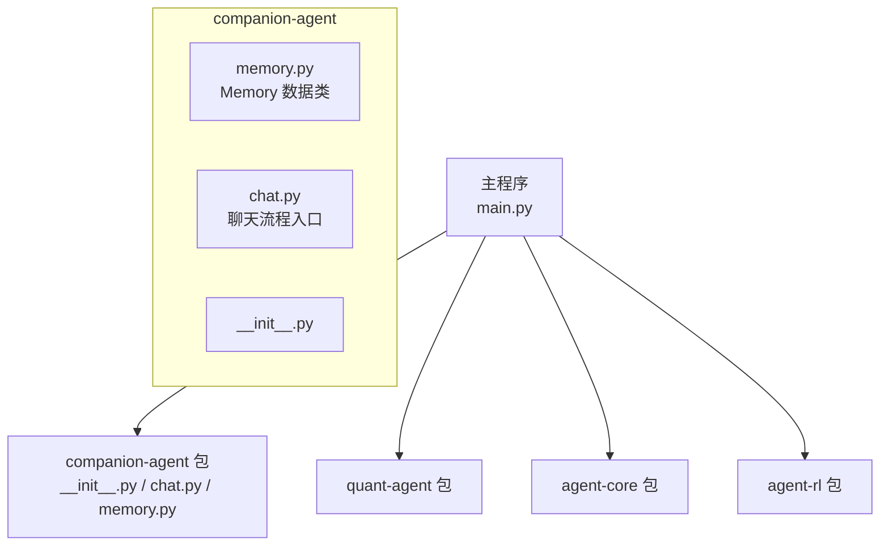
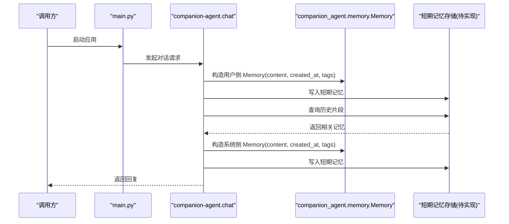
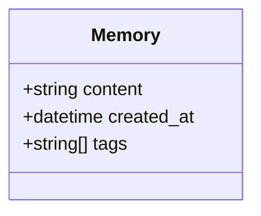
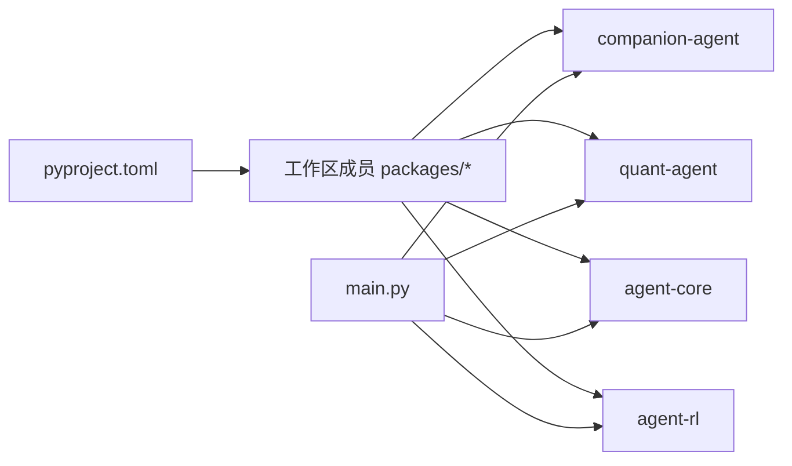

# 短期记忆管理

<cite>
**本文引用的文件**   
- [main.py](file://main.py)
- [memory.py](file://packages/companion-agent/src/companion_agent/memory.py)
- [chat.py](file://packages/companion-agent/src/companion_agent/chat.py)
- [pyproject.toml](file://pyproject.toml)
</cite>

## 目录
1. [简介](#简介)
2. [项目结构](#项目结构)
3. [核心组件](#核心组件)
4. [架构总览](#架构总览)
5. [详细组件分析](#详细组件分析)
6. [依赖分析](#依赖分析)
7. [性能考虑](#性能考虑)
8. [故障排查指南](#故障排查指南)
9. [结论](#结论)
10. [附录](#附录)

## 简介
本技术文档围绕“短期记忆管理系统”展开，聚焦以下目标：
- 数据结构设计：对话上下文缓存、会话状态管理与临时数据存储。
- 记忆编码算法：将用户输入与系统响应转换为可存储的向量表示（概念性说明）。
- 记忆检索策略：相似度计算、时间衰减函数与上下文相关性评分（概念性说明）。
- 容量控制：LRU淘汰、内存监控与自动清理（概念性说明）。
- 性能优化与调试方法。

当前仓库中已实现的短期记忆相关代码集中在 companion-agent 包内，包含一个轻量级的 Memory 数据模型以及聊天模块入口。其余高级能力（如向量编码、检索、容量控制）在仓库中尚未实现，本文以现有代码为基础进行现状说明，并对缺失能力给出可扩展的设计建议与参考实现路径。

## 项目结构
仓库采用多包工作区组织，主程序 main.py 聚合多个子包；短期记忆相关的最小可用实现位于 companion-agent 包中。

图表来源
- [main.py:1-13](file://main.py#L1-L13)
- [memory.py:1-12](file://packages/companion-agent/src/companion_agent/memory.py#L1-L12)
- [chat.py](file://packages/companion-agent/src/companion_agent/chat.py)

章节来源
- [main.py:1-13](file://main.py#L1-L13)
- [pyproject.toml:1-30](file://pyproject.toml#L1-L30)

## 核心组件
- Memory 数据类：用于承载单条短期记忆的基本信息，包括内容、创建时间与标签集合。该结构可作为对话上下文缓存、会话状态与临时数据的统一载体。
- 聊天模块：作为短期记忆的写入/读取入口，负责将用户输入与系统响应封装为 Memory 对象并纳入上下文缓存。

章节来源
- [memory.py:1-12](file://packages/companion-agent/src/companion_agent/memory.py#L1-L12)
- [chat.py](file://packages/companion-agent/src/companion_agent/chat.py)

## 架构总览
短期记忆在系统中的位置与交互关系如下：
- 上层调用（如 main.py）通过 companion-agent 提供的接口发起对话。
- 聊天模块接收用户输入，生成或获取系统响应，并将两者分别持久化为 Memory 记录。
- 后续请求时，从短期记忆中检索相关片段，拼接为新的上下文返回给模型。

图表来源
- [main.py:1-13](file://main.py#L1-L13)
- [memory.py:1-12](file://packages/companion-agent/src/companion_agent/memory.py#L1-L12)
- [chat.py](file://packages/companion-agent/src/companion_agent/chat.py)

## 详细组件分析

### Memory 数据类
- 字段说明
  - content：字符串，承载单条记忆的具体文本内容（用户输入或系统响应）。
  - created_at：时间戳，记录记忆创建时刻，用于时间衰减与排序。
  - tags：字符串列表，用于标记记忆主题、来源或用途，便于过滤与检索。
- 使用场景
  - 对话上下文缓存：将最近若干轮对话的关键片段以 Memory 形式保存。
  - 会话状态管理：将关键决策、偏好、约束等以带标签的记忆形式沉淀。
  - 临时数据存储：中间结果、工具输出摘要等以 Memory 暂存，供后续步骤复用。

图表来源
- [memory.py:1-12](file://packages/companion-agent/src/companion_agent/memory.py#L1-L12)

章节来源
- [memory.py:1-12](file://packages/companion-agent/src/companion_agent/memory.py#L1-L12)

### 聊天模块与短期记忆集成
- 职责边界
  - 接收外部请求，解析用户输入。
  - 调用 LLM 或其他服务生成系统响应。
  - 将用户输入与系统响应分别包装为 Memory 并写入短期记忆。
  - 根据检索策略召回相关记忆，构建新上下文返回。
- 与 Memory 的关系
  - 作为 Memory 的主要生产者与消费者。
  - 维护会话级上下文窗口，确保最新与最相关的记忆优先入窗。

章节来源
- [chat.py](file://packages/companion-agent/src/companion_agent/chat.py)
- [memory.py:1-12](file://packages/companion-agent/src/companion_agent/memory.py#L1-L12)

### 记忆编码算法（概念性说明）
- 目标
  - 将自然语言文本映射为固定维度的稠密向量，支持语义相似度比较。
- 常见方案
  - 基于预训练嵌入模型（如 sentence-transformers、OpenAI Embeddings 等）对每条 Memory.content 生成向量。
  - 可选：对 tags 做独热或词表映射后与内容向量融合，增强检索时的主题权重。
- 复杂度与权衡
  - 编码耗时与模型规模成正比；可通过批处理与缓存降低重复计算。
  - 向量维度越高精度越好但检索成本增加，需结合业务取舍。

[本节为概念性说明，不直接分析具体源码文件]

### 记忆检索策略（概念性说明）
- 相似度计算
  - 常用余弦相似度或点积，对查询向量与候选记忆向量进行打分。
- 时间衰减函数
  - 随时间推移降低旧记忆的权重，例如指数衰减或线性衰减，使近期记忆更受关注。
- 上下文相关性评分
  - 结合标签匹配度、位置权重（靠近当前对话末尾权重更高）、领域关键词命中等综合评分。
- 召回与重排
  - 先粗召回 Top-K，再按综合评分重排，最终截断到上下文窗口大小。

[本节为概念性说明，不直接分析具体源码文件]

### 记忆容量控制（概念性说明）
- LRU 淘汰
  - 以最近使用时间作为访问频率指标，超出容量时淘汰最久未使用的记忆。
- 内存使用监控
  - 统计 Memory 数量、平均长度、向量占用空间等指标，设置阈值告警。
- 自动清理机制
  - 定时任务扫描过期记忆（如超过 T 天），批量删除或归档至长期存储。

[本节为概念性说明，不直接分析具体源码文件]

## 依赖分析
- 主程序 main.py 聚合多个子包，其中 companion-agent 提供短期记忆相关的最小可用能力。
- pyproject.toml 声明了工作区成员与依赖关系，确保各包可被统一安装与运行。

图表来源
- [pyproject.toml:1-30](file://pyproject.toml#L1-L30)
- [main.py:1-13](file://main.py#L1-L13)

章节来源
- [pyproject.toml:1-30](file://pyproject.toml#L1-L30)
- [main.py:1-13](file://main.py#L1-L13)

## 性能考虑
- 编码阶段
  - 批量化调用嵌入模型，减少网络往返与初始化开销。
  - 对相同文本进行哈希去重，避免重复编码。
- 检索阶段
  - 使用近似最近邻（ANN）索引（如 FAISS、HNSW）加速大规模向量检索。
  - 分层检索：先用标签/关键词快速筛选，再做向量相似度精排。
- 存储与序列化
  - 对 Memory 进行紧凑序列化（如 Protobuf/MessagePack），降低 I/O 与内存占用。
- 上下文窗口管理
  - 动态调整窗口大小，依据消息长度与重要性评分裁剪，避免超限。

[本节为通用性能建议，不直接分析具体源码文件]

## 故障排查指南
- 常见问题定位
  - 记忆未写入：检查聊天模块是否正确构造 Memory 并调用存储接口。
  - 检索为空：确认向量索引是否更新、标签过滤条件是否过严。
  - 上下文过长：评估 Memory 长度与数量，启用裁剪与淘汰策略。
- 日志与观测
  - 记录每次写入/读取的 Memory 元信息（created_at、tags、content 长度）。
  - 统计检索耗时、Top-K 分数分布，识别异常波动。
- 回滚与恢复
  - 对重要会话建立快照，出现异常时可回退到上一稳定状态。

[本节为通用排障建议，不直接分析具体源码文件]

## 结论
当前仓库提供了短期记忆的最小可用基础：统一的 Memory 数据结构与聊天模块入口。为实现完整的短期记忆管理系统，建议在现有基础上逐步引入：
- 向量编码与索引（ANN）
- 检索策略（相似度、时间衰减、相关性评分）
- 容量控制（LRU、监控、清理）
这些扩展可在保持现有 Memory 结构不变的前提下平滑接入，从而在不破坏既有接口的基础上提升系统的智能性与稳定性。

[本节为总结性内容，不直接分析具体源码文件]

## 附录
- 术语
  - 短期记忆：指会话期间保留的、用于增强上下文的相关片段集合。
  - 上下文窗口：发送给模型的最近消息片段，通常有长度限制。
- 扩展阅读
  - 向量检索与 ANN 索引原理
  - 时间衰减与相关性评分的工程实践

[本节为补充说明，不直接分析具体源码文件]