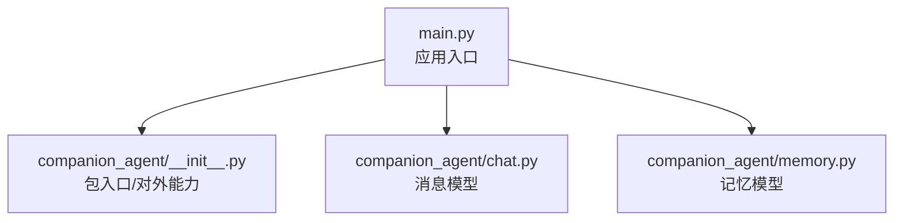
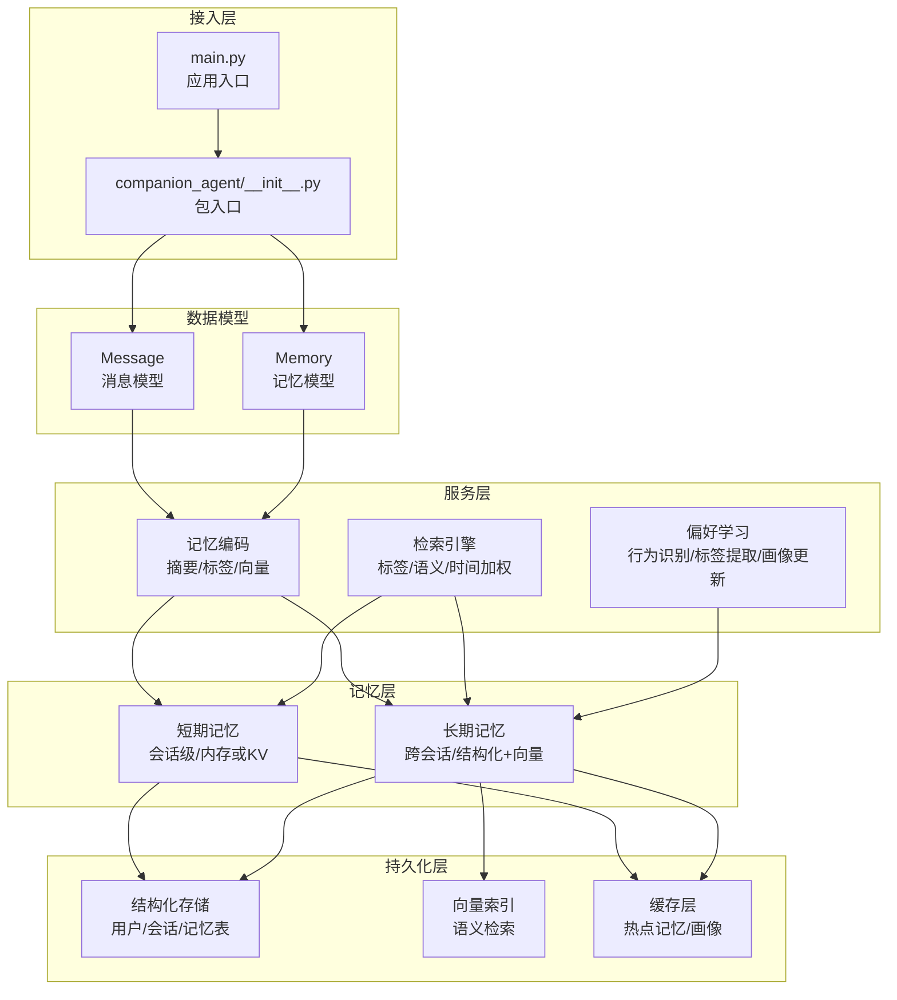
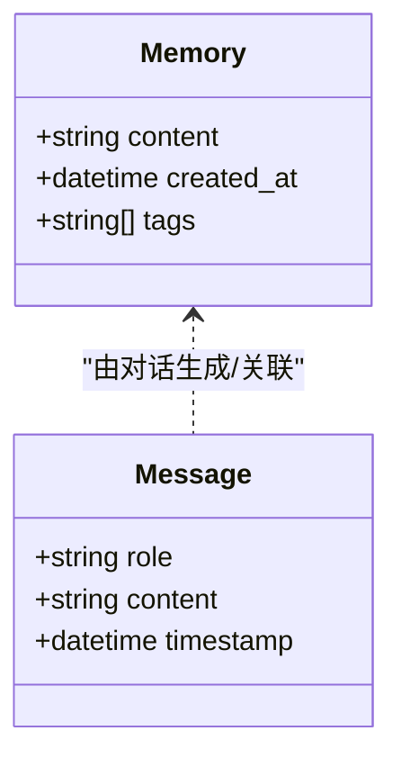
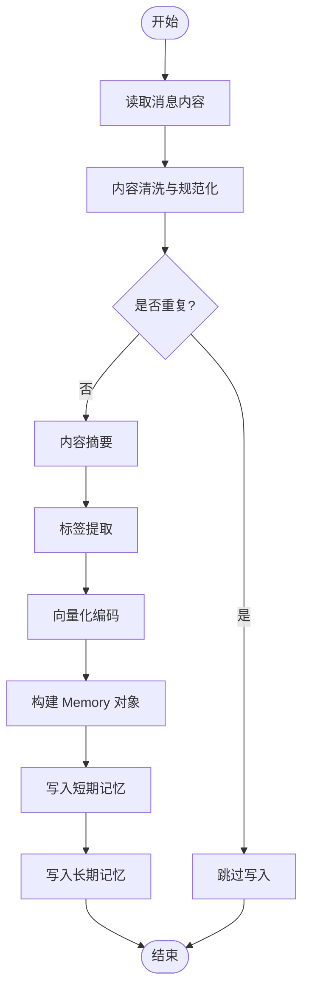
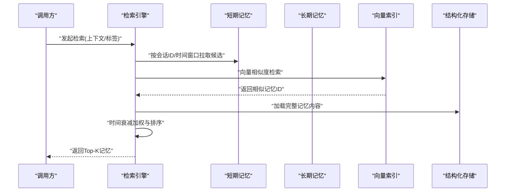
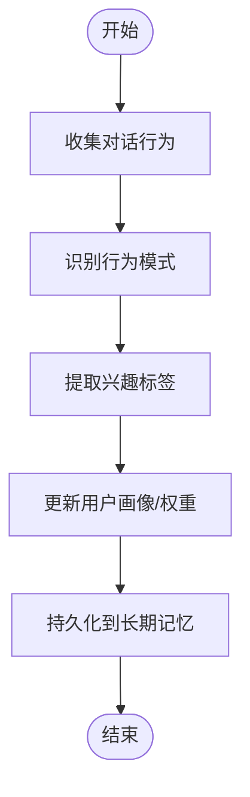
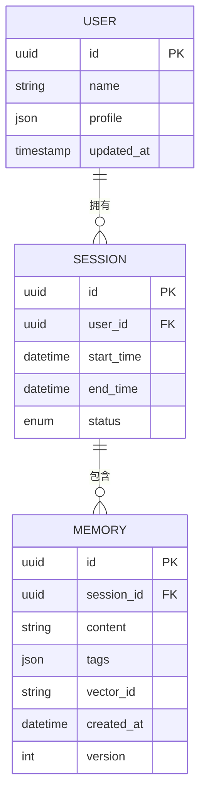
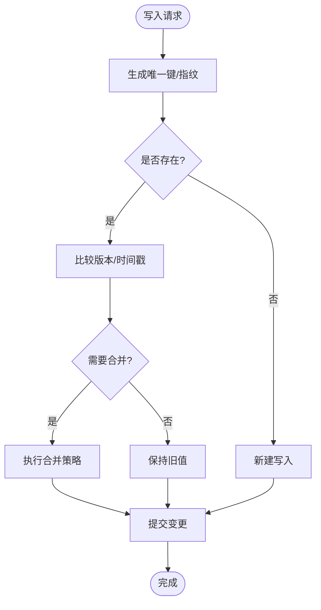
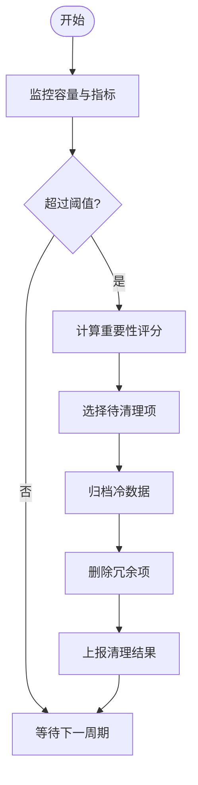
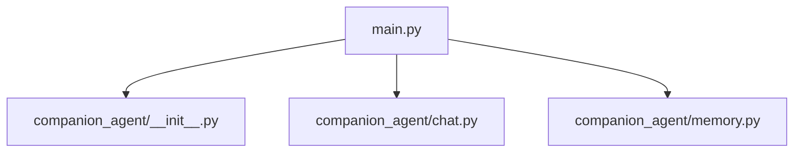

# 记忆存储系统

<cite>
**本文引用的文件**   
- [main.py](file://main.py)
- [companion_agent/__init__.py](file://packages/companion-agent/src/companion_agent/__init__.py)
- [companion_agent/chat.py](file://packages/companion-agent/src/companion_agent/chat.py)
- [companion_agent/memory.py](file://packages/companion-agent/src/companion_agent/memory.py)
</cite>

## 目录
1. [引言](#引言)
2. [项目结构](#项目结构)
3. [核心组件](#核心组件)
4. [架构总览](#架构总览)
5. [详细组件分析](#详细组件分析)
6. [依赖关系分析](#依赖关系分析)
7. [性能考量](#性能考量)
8. [故障排查指南](#故障排查指南)
9. [结论](#结论)
10. [附录](#附录)

## 引言
本技术文档围绕“陪伴助手的记忆存储系统”展开，目标是系统化阐述短期记忆与长期记忆的分层架构设计、记忆编码与检索策略、用户偏好学习机制、持久化方案（数据结构、索引优化、缓存）、一致性保障、容量管理与清理策略，以及性能监控方案。当前仓库中已提供陪伴助手的基础数据模型与入口模块，本文在严格依据现有代码的基础上，给出可扩展的架构设计与实现建议，帮助读者快速理解并落地一个可演进的记忆系统。

## 项目结构
陪伴助手位于 packages/companion-agent 包内，包含以下关键源文件：
- companion_agent/__init__.py：包入口与对外能力说明
- companion_agent/chat.py：对话消息的数据模型
- companion_agent/memory.py：记忆单元的数据模型
- main.py：应用启动入口，组合多个子代理能力

图示来源
- [main.py:1-13](file://main.py#L1-L13)
- [companion_agent/__init__.py:1-15](file://packages/companion-agent/src/companion_agent/__init__.py#L1-L15)
- [companion_agent/chat.py:1-12](file://packages/companion-agent/src/companion_agent/chat.py#L1-L12)
- [companion_agent/memory.py:1-12](file://packages/companion-agent/src/companion_agent/memory.py#L1-L12)

章节来源
- [main.py:1-13](file://main.py#L1-L13)
- [companion_agent/__init__.py:1-15](file://packages/companion-agent/src/companion_agent/__init__.py#L1-L15)
- [companion_agent/chat.py:1-12](file://packages/companion-agent/src/companion_agent/chat.py#L1-L12)
- [companion_agent/memory.py:1-12](file://packages/companion-agent/src/companion_agent/memory.py#L1-L12)

## 核心组件
- 记忆模型 Memory：用于表示一条记忆的基本信息，包括内容、创建时间与标签集合。该模型为后续短期/长期分层存储、检索与个性化学习提供统一的数据载体。
- 消息模型 Message：用于表示对话中的单条消息，包含角色、内容与时间戳，是构建会话历史与触发记忆写入的关键输入。
- 包入口 companion_agent：提供版本信息与对外能力描述，便于上层编排与集成。

章节来源
- [companion_agent/memory.py:1-12](file://packages/companion-agent/src/companion_agent/memory.py#L1-L12)
- [companion_agent/chat.py:1-12](file://packages/companion-agent/src/companion_agent/chat.py#L1-L12)
- [companion_agent/__init__.py:1-15](file://packages/companion-agent/src/companion_agent/__init__.py#L1-L15)

## 架构总览
基于现有数据模型，建议采用“短期记忆 + 长期记忆”的分层架构：
- 短期记忆：面向会话上下文的高频读写，强调低延迟与高吞吐，适合内存或轻量KV存储，支持按会话ID聚合与滑动窗口管理。
- 长期记忆：面向跨会话的用户画像与经验沉淀，强调可检索性与一致性，适合结构化数据库与向量索引结合，支持标签、语义与时间等多维检索。
- 记忆编码：对原始内容进行摘要、去重、标签化与向量化，形成可检索的标准化记忆条目。
- 检索算法：结合标签过滤、相似度检索与时间衰减排序，返回与当前上下文最相关的记忆片段。
- 用户偏好学习：从行为模式识别、兴趣标签提取到个性化模型更新，持续完善用户画像。
- 持久化方案：以结构化表+向量索引为主，辅以缓存层提升热点访问性能。
- 一致性与冲突解决：通过幂等写入、版本号/时间戳比较与合并策略保证最终一致性。
- 容量管理与清理：基于时间衰减、使用频率与重要性评分进行淘汰与归档。
- 性能监控：记录写入/读取延迟、命中率、索引大小与清理耗时等指标。

图示来源
- [main.py:1-13](file://main.py#L1-L13)
- [companion_agent/__init__.py:1-15](file://packages/companion-agent/src/companion_agent/__init__.py#L1-L15)
- [companion_agent/chat.py:1-12](file://packages/companion-agent/src/companion_agent/chat.py#L1-L12)
- [companion_agent/memory.py:1-12](file://packages/companion-agent/src/companion_agent/memory.py#L1-L12)

## 详细组件分析

### 数据模型与关系
- Memory：包含内容、创建时间与标签列表，作为记忆的最小单位。
- Message：包含角色、内容与时间戳，作为对话历史与记忆触发的基础。

图示来源
- [companion_agent/memory.py:1-12](file://packages/companion-agent/src/companion_agent/memory.py#L1-L12)
- [companion_agent/chat.py:1-12](file://packages/companion-agent/src/companion_agent/chat.py#L1-L12)

章节来源
- [companion_agent/memory.py:1-12](file://packages/companion-agent/src/companion_agent/memory.py#L1-L12)
- [companion_agent/chat.py:1-12](file://packages/companion-agent/src/companion_agent/chat.py#L1-L12)

### 记忆编码流程
记忆编码将原始对话内容转化为标准化的记忆条目，步骤如下：
- 输入：来自 Message 的内容与时间戳
- 处理：内容清洗、去重、摘要、标签提取、向量化
- 输出：Memory 对象，携带内容、创建时间与标签

图示来源
- [companion_agent/chat.py:1-12](file://packages/companion-agent/src/companion_agent/chat.py#L1-L12)
- [companion_agent/memory.py:1-12](file://packages/companion-agent/src/companion_agent/memory.py#L1-L12)

章节来源
- [companion_agent/chat.py:1-12](file://packages/companion-agent/src/companion_agent/chat.py#L1-L12)
- [companion_agent/memory.py:1-12](file://packages/companion-agent/src/companion_agent/memory.py#L1-L12)

### 检索流程
检索需结合标签、语义相似性与时间衰减，返回与当前上下文最相关的记忆片段：
- 输入：查询上下文（文本/标签）
- 处理：标签过滤、向量相似度检索、时间衰减加权排序
- 输出：Top-K 相关记忆

图示来源
- [companion_agent/memory.py:1-12](file://packages/companion-agent/src/companion_agent/memory.py#L1-L12)

章节来源
- [companion_agent/memory.py:1-12](file://packages/companion-agent/src/companion_agent/memory.py#L1-L12)

### 用户偏好学习机制
偏好学习从对话行为中提取用户偏好，持续更新画像：
- 行为模式识别：统计高频话题、交互风格、反馈信号
- 兴趣标签提取：基于标签共现与主题聚类生成兴趣标签
- 个性化模型更新：将新标签与权重写入长期记忆与画像存储

[此图为概念性流程图，不直接映射具体源码文件]

### 持久化方案
- 数据结构设计
  - 用户表：用户ID、画像快照、更新时间
  - 会话表：会话ID、用户ID、起止时间、状态
  - 记忆表：记忆ID、会话ID、内容、标签、向量ID、创建时间、版本
- 索引优化
  - 标签索引：加速标签过滤
  - 向量索引：加速语义检索
  - 时间索引：加速时间范围查询
- 缓存策略
  - 短期记忆缓存：会话级热点记忆
  - 画像缓存：用户偏好与标签权重

图示来源
- [companion_agent/memory.py:1-12](file://packages/companion-agent/src/companion_agent/memory.py#L1-L12)

章节来源
- [companion_agent/memory.py:1-12](file://packages/companion-agent/src/companion_agent/memory.py#L1-L12)

### 一致性保障与冲突解决
- 幂等写入：基于记忆ID或内容指纹避免重复写入
- 版本控制：每次更新递增版本号，写前检查版本
- 时间戳比较：当版本相同，比较创建/更新时间决定保留最新
- 合并策略：对冲突记忆进行摘要合并，保留关键信息
- 事务边界：批量写入时采用事务或补偿机制，失败回滚

[此图为概念性流程图，不直接映射具体源码文件]

### 容量管理与清理策略
- 容量上限：短期记忆按会话设置上限，长期记忆按用户画像维度设置上限
- 清理策略：基于时间衰减、使用频率与重要性评分进行淘汰
- 归档机制：冷数据迁移至低成本存储，保留元数据与索引
- 监控告警：当接近容量阈值时触发告警与自动清理

[此图为概念性流程图，不直接映射具体源码文件]

### 性能监控方案
- 写入路径：记录写入延迟、失败率、去重比例
- 检索路径：记录检索延迟、命中率、Top-K质量
- 索引健康：记录索引大小、重建耗时、召回率
- 清理任务：记录清理耗时、释放空间、影响范围
- 可视化：仪表盘展示关键指标与趋势

[本节为通用指导，不直接分析具体文件]

## 依赖关系分析
当前仓库中，主入口 main.py 组合了 quant_agent 与 companion_agent 两个子代理；companion_agent 包内部定义了消息与记忆的数据模型，尚未实现具体的存储与服务逻辑。

图示来源
- [main.py:1-13](file://main.py#L1-L13)
- [companion_agent/__init__.py:1-15](file://packages/companion-agent/src/companion_agent/__init__.py#L1-L15)
- [companion_agent/chat.py:1-12](file://packages/companion-agent/src/companion_agent/chat.py#L1-L12)
- [companion_agent/memory.py:1-12](file://packages/companion-agent/src/companion_agent/memory.py#L1-L12)

章节来源
- [main.py:1-13](file://main.py#L1-L13)
- [companion_agent/__init__.py:1-15](file://packages/companion-agent/src/companion_agent/__init__.py#L1-L15)
- [companion_agent/chat.py:1-12](file://packages/companion-agent/src/companion_agent/chat.py#L1-L12)
- [companion_agent/memory.py:1-12](file://packages/companion-agent/src/companion_agent/memory.py#L1-L12)

## 性能考量
- 写入路径优化：批处理写入、异步落盘、去重前置减少无效IO
- 检索路径优化：标签预过滤、向量近似检索、结果缓存
- 索引维护：增量更新、定期重建、冷热分离
- 缓存命中：会话级热点记忆与用户画像缓存，降低后端压力
- 资源隔离：短期与长期存储分库/分表，避免相互干扰

[本节为通用指导，不直接分析具体文件]

## 故障排查指南
- 写入失败：检查幂等键生成是否正确、版本冲突是否合理、事务是否回滚
- 检索异常：确认标签索引与向量索引是否同步、时间衰减参数是否合理
- 容量告警：查看清理任务日志、归档是否成功、存储空间是否可用
- 一致性错误：核对版本号与时间戳比较逻辑、合并策略是否符合预期

[本节为通用指导，不直接分析具体文件]

## 结论
当前仓库提供了陪伴助手的基础数据模型与入口模块，具备扩展为完整记忆存储系统的条件。建议优先实现记忆编码与检索服务，完善短期/长期分层存储与索引，逐步引入用户偏好学习与一致性保障机制，并通过容量管理与性能监控确保系统稳定演进。

[本节为总结性内容，不直接分析具体文件]

## 附录
- 术语说明
  - 短期记忆：与会话强相关、时效性强、读多写少的记忆层
  - 长期记忆：跨会话、可检索、可演化的用户画像与经验层
  - 向量索引：用于语义相似度检索的索引结构
  - 时间衰减：根据时间远近调整检索权重的策略
- 参考文件
  - [companion_agent/memory.py](file://packages/companion-agent/src/companion_agent/memory.py)
  - [companion_agent/chat.py](file://packages/companion-agent/src/companion_agent/chat.py)
  - [companion_agent/__init__.py](file://packages/companion-agent/src/companion_agent/__init__.py)
  - [main.py](file://main.py)