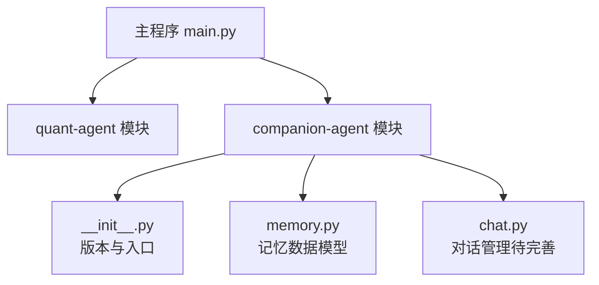
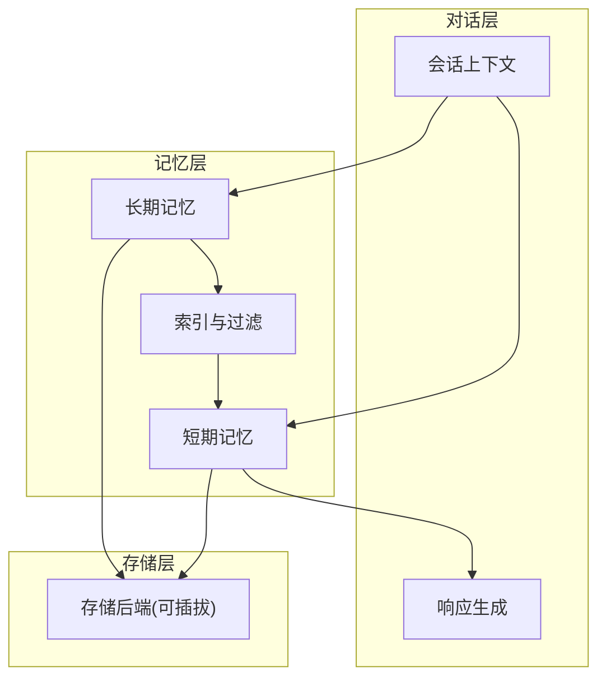
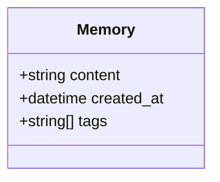
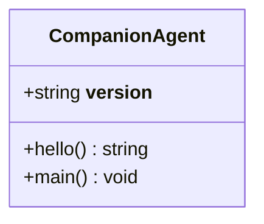
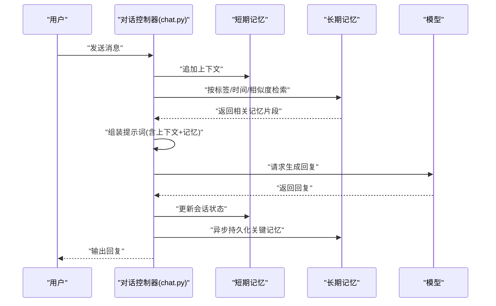
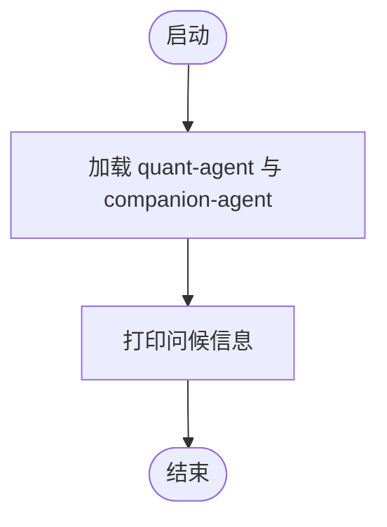
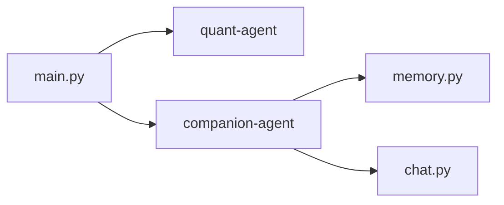

# 记忆系统集成

<cite>
**本文引用的文件**   
- [main.py](file://main.py)
- [companion_agent/__init__.py](file://packages/companion-agent/src/companion_agent/__init__.py)
- [companion_agent/memory.py](file://packages/companion-agent/src/companion_agent/memory.py)
- [companion_agent/chat.py](file://packages/companion-agent/src/companion_agent/chat.py)
- [README.md](file://packages/companion-agent/README.md)
</cite>

## 目录
1. [简介](#简介)
2. [项目结构](#项目结构)
3. [核心组件](#核心组件)
4. [架构总览](#架构总览)
5. [详细组件分析](#详细组件分析)
6. [依赖关系分析](#依赖关系分析)
7. [性能与一致性](#性能与一致性)
8. [监控与诊断](#监控与诊断)
9. [最佳实践](#最佳实践)
10. [故障排查指南](#故障排查指南)
11. [结论](#结论)

## 简介
本技术文档面向“记忆系统集成层”，聚焦短期记忆与长期记忆的协同机制、数据同步策略、一致性与性能优化，以及与对话管理的集成接口（上下文注入、记忆触发、响应生成）。同时提供扩展点设计（自定义存储后端、检索算法、过滤规则）和监控诊断工具建议，并给出最佳实践与常见问题解决方案。

当前仓库中已实现记忆系统的数据模型与入口模块，后续章节将基于现有代码进行系统化梳理，并给出可扩展的架构蓝图与落地建议。

## 项目结构
仓库采用多包组织方式，主入口聚合多个子代理能力；其中“陪伴智能体”负责对话、记忆等感性交互能力，记忆数据模型位于 companion-agent 包内。

图示来源
- [main.py:1-12](file://main.py#L1-L12)
- [companion_agent/__init__.py:1-15](file://packages/companion-agent/src/companion_agent/__init__.py#L1-L15)
- [companion_agent/memory.py:1-12](file://packages/companion-agent/src/companion_agent/memory.py#L1-L12)
- [companion_agent/chat.py](file://packages/companion-agent/src/companion_agent/chat.py)

章节来源
- [main.py:1-12](file://main.py#L1-L12)
- [companion_agent/__init__.py:1-15](file://packages/companion-agent/src/companion_agent/__init__.py#L1-L15)
- [companion_agent/memory.py:1-12](file://packages/companion-agent/src/companion_agent/memory.py#L1-L12)
- [README.md:1-16](file://packages/companion-agent/README.md#L1-L16)

## 核心组件
- 记忆数据模型：定义单条记忆的结构，包含内容、创建时间与标签集合，便于后续检索与过滤。
- 陪伴智能体入口：提供版本信息与基础启动方法，作为对话与记忆能力的承载模块。
- 对话管理（chat.py）：用于串联上下文、触发记忆读写与生成回复（当前为占位文件，需进一步实现）。

章节来源
- [companion_agent/memory.py:1-12](file://packages/companion-agent/src/companion_agent/memory.py#L1-L12)
- [companion_agent/__init__.py:1-15](file://packages/companion-agent/src/companion_agent/__init__.py#L1-L15)
- [companion_agent/chat.py](file://packages/companion-agent/src/companion_agent/chat.py)

## 架构总览
从系统视角看，记忆系统集成层由“会话上下文—记忆存取—检索过滤—响应生成”构成闭环。短期记忆负责当前会话内的即时上下文，长期记忆负责跨会话持久化；两者通过一致的抽象接口协作，确保上下文注入与记忆触发的可组合性。

说明
- 短期记忆：会话级缓存，低延迟，支持快速追加与滑动窗口裁剪。
- 长期记忆：持久化存储，支持标签、时间等多维检索与过滤。
- 索引与过滤：在检索前进行粗筛（标签/时间/相似度），再进入细筛（语义匹配）。
- 存储后端：可替换为内存、本地文件或外部向量数据库，保持上层接口稳定。

## 详细组件分析

### 记忆数据模型 Memory
- 字段
  - content：记忆文本内容
  - created_at：创建时间戳
  - tags：标签列表，用于分类与过滤
- 用途
  - 作为短期与长期记忆的统一数据载体
  - 支撑基于标签与时间的检索与裁剪策略

图示来源
- [companion_agent/memory.py:1-12](file://packages/companion-agent/src/companion_agent/memory.py#L1-L12)

章节来源
- [companion_agent/memory.py:1-12](file://packages/companion-agent/src/companion_agent/memory.py#L1-L12)

### 陪伴智能体入口 companion_agent
- 职责
  - 暴露模块版本与基础启动方法
  - 作为对话与记忆能力的容器
- 扩展点
  - 可在该模块中注册记忆服务、对话控制器与中间件

图示来源
- [companion_agent/__init__.py:1-15](file://packages/companion-agent/src/companion_agent/__init__.py#L1-L15)

章节来源
- [companion_agent/__init__.py:1-15](file://packages/companion-agent/src/companion_agent/__init__.py#L1-L15)

### 对话管理 chat.py（规划）
- 目标
  - 维护会话上下文（短期记忆）
  - 触发记忆写入/读取
  - 组装提示词并调用模型生成响应
- 关键流程
  - 接收用户输入 → 更新短期记忆 → 检索相关长期记忆 → 注入上下文 → 生成回复 → 落盘长期记忆

说明
- 该图为概念流程图，展示未来 chat.py 的实现思路与调用顺序。

### 主程序 main.py
- 职责
  - 聚合各子代理能力，打印问候信息
- 与记忆系统的关系
  - 作为整体应用的启动入口，后续可在其中初始化记忆服务与会话管理器

图示来源
- [main.py:1-12](file://main.py#L1-L12)

章节来源
- [main.py:1-12](file://main.py#L1-L12)

## 依赖关系分析
- 主程序依赖两个子代理模块：quant-agent 与 companion-agent
- companion-agent 内部包含记忆数据模型与对话管理模块
- 当前未见显式的第三方依赖声明，依赖关系较为轻量

图示来源
- [main.py:1-12](file://main.py#L1-L12)
- [companion_agent/__init__.py:1-15](file://packages/companion-agent/src/companion_agent/__init__.py#L1-L15)
- [companion_agent/memory.py:1-12](file://packages/companion-agent/src/companion_agent/memory.py#L1-L12)
- [companion_agent/chat.py](file://packages/companion-agent/src/companion_agent/chat.py)

章节来源
- [main.py:1-12](file://main.py#L1-L12)
- [companion_agent/__init__.py:1-15](file://packages/companion-agent/src/companion_agent/__init__.py#L1-L15)

## 性能与一致性

### 短期记忆与长期记忆协同
- 短期记忆
  - 使用滑动窗口或优先级队列维护最近 N 条上下文
  - 高频追加、低延迟读取
- 长期记忆
  - 基于标签与时间戳建立索引
  - 支持粗筛（标签/时间/关键词）+ 细筛（语义相似度）
- 协同策略
  - 写入：新消息先入短期记忆，周期性合并到长期记忆
  - 读取：优先从短期命中，未命中则检索长期记忆并回填短期

### 数据同步策略
- 事件驱动：对话完成后触发一次批量持久化
- 增量同步：仅持久化新增或变更的记忆条目
- 去重策略：基于内容哈希或相似度阈值避免重复

### 一致性保证
- 幂等写入：对相同内容的记忆写入具备幂等性
- 冲突检测：当检测到矛盾事实时，标记为待确认或保留多版本
- 回滚与补偿：持久化失败时保留短期记忆，重试或降级至内存存储

### 性能优化
- 索引优化：为常用标签与时间范围建立倒排索引
- 缓存热点：对高频检索结果做短时缓存
- 批处理：批量写入与压缩传输降低 I/O 开销
- 异步化：非关键路径（如长期记忆持久化）异步执行

## 监控与诊断

### 指标采集
- 记忆使用统计
  - 短期记忆大小与命中率
  - 长期记忆条目数、标签分布、平均相似度
- 性能指标
  - 写入/读取延迟分位数
  - 索引构建耗时
  - 并发写入吞吐
- 质量指标
  - 记忆去重率
  - 冲突检测触发次数

### 日志与追踪
- 结构化日志：记录每次读写的 key、tags、时间戳与耗时
- 链路追踪：为一次对话分配 trace_id，贯穿上下文组装、检索与生成阶段
- 告警规则：当 P95 延迟超过阈值或错误率上升时触发告警

### 诊断工具
- 记忆快照导出：支持导出某会话的短期与长期记忆快照
- 检索回放：根据 trace_id 回放检索过程，定位召回不足或误召回问题
- 健康检查：定期校验存储后端连通性与索引完整性

## 最佳实践

- 统一数据模型：所有记忆以 Memory 为载体，避免散乱结构
- 明确生命周期：短期记忆随会话销毁，长期记忆按策略归档与清理
- 标签治理：制定标签命名规范与层级，避免标签爆炸
- 渐进式增强：先实现内存存储与简单过滤，再逐步引入向量检索
- 可观测性先行：在核心路径埋点，尽早暴露性能瓶颈
- 灰度与开关：为记忆功能提供开关，便于对照实验与回滚

## 故障排查指南

- 症状：短期记忆丢失
  - 排查：检查会话上下文是否被意外重置；确认写入是否成功
- 症状：长期记忆检索不到
  - 排查：验证标签是否正确；检查索引是否构建完成；确认时间范围过滤条件
- 症状：写入延迟高
  - 排查：查看 I/O 吞吐与锁竞争；评估是否需改为异步写入
- 症状：重复记忆过多
  - 排查：调整去重阈值；检查内容归一化逻辑
- 症状：一致性冲突
  - 排查：启用冲突检测；人工复核或引入置信度评分

## 结论
当前仓库已提供记忆系统的基础数据模型与模块入口，具备向完整记忆系统集成层演进的骨架。建议在 chat.py 中实现对话控制流，结合短期/长期记忆协同、索引与过滤、异步持久化与可观测性，形成高可用、可扩展的记忆子系统。通过统一的扩展点设计，可灵活接入不同存储后端与检索算法，满足多样化业务场景需求。