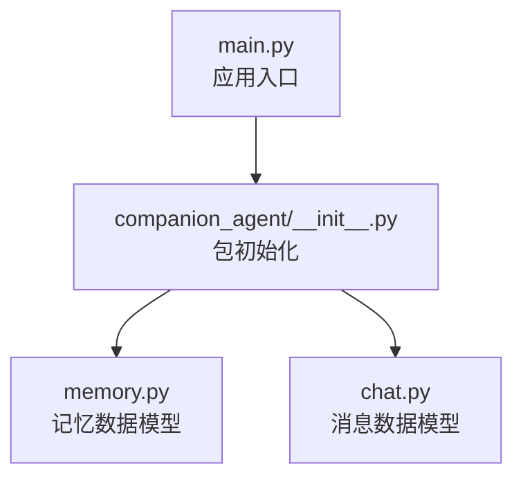
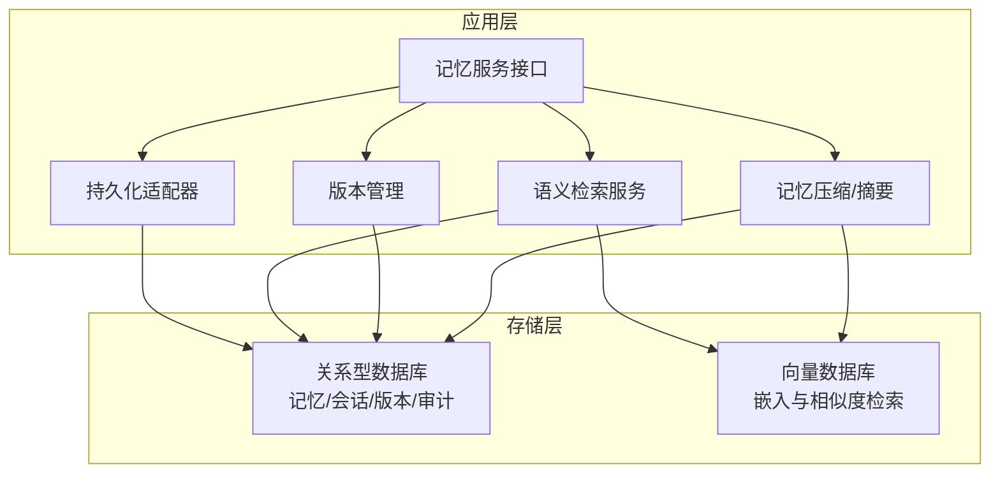
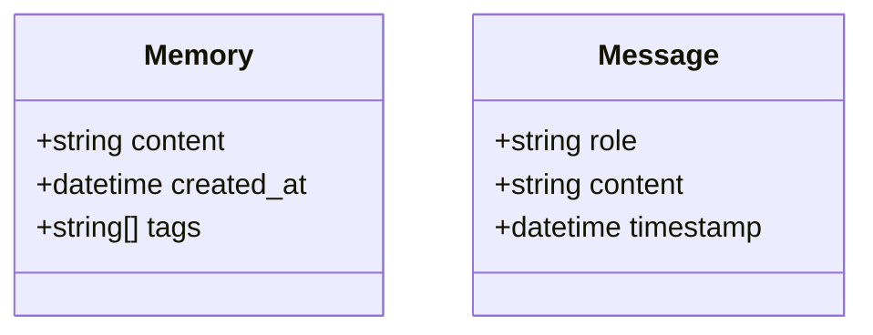
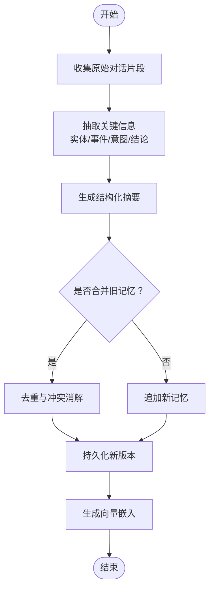
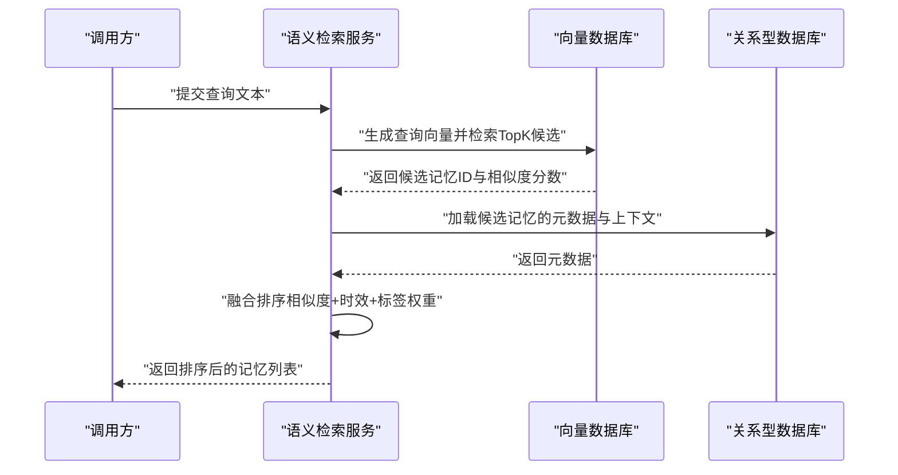
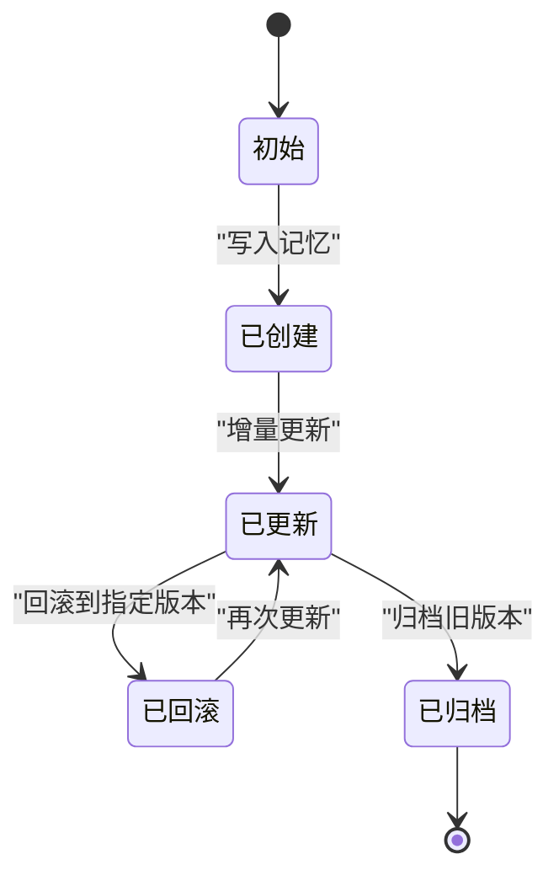
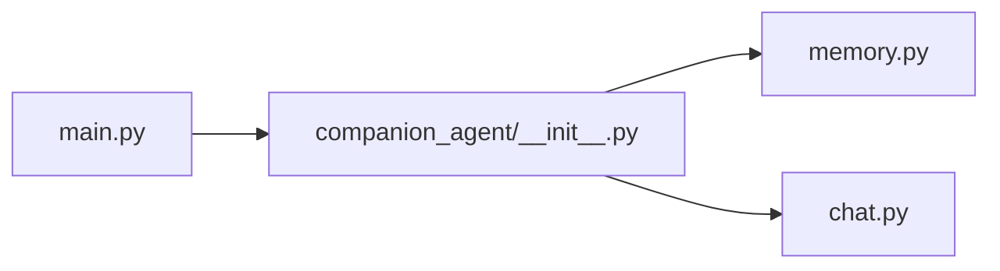

# 长期记忆存储

<cite>
**本文引用的文件**
- [main.py](file://main.py)
- [memory.py](file://packages/companion-agent/src/companion_agent/memory.py)
- [chat.py](file://packages/companion-agent/src/companion_agent/chat.py)
</cite>

## 目录
1. [简介](#简介)
2. [项目结构](#项目结构)
3. [核心组件](#核心组件)
4. [架构总览](#架构总览)
5. [详细组件分析](#详细组件分析)
6. [依赖关系分析](#依赖关系分析)
7. [性能考虑](#性能考虑)
8. [故障排查指南](#故障排查指南)
9. [结论](#结论)
10. [附录](#附录)

## 简介
本技术文档围绕“长期记忆存储系统”的目标，结合仓库中已有的最小化实现与通用工程实践，给出从持久化存储、表结构与索引优化，到记忆压缩、语义搜索、版本管理、数据迁移、备份恢复与性能调优的完整方案。当前代码库提供了记忆与对话的数据模型基础，尚未包含数据库与向量检索的具体实现；因此本文在尊重现有代码的前提下，提供可落地的架构设计与扩展建议，便于后续迭代落地。

## 项目结构
仓库采用多包组织方式，主入口位于根目录，companion-agent 包内定义了记忆与对话的基础数据结构。整体结构如下：

图表来源
- [main.py:1-13](file://main.py#L1-L13)
- [memory.py:1-12](file://packages/companion-agent/src/companion_agent/memory.py#L1-L12)
- [chat.py:1-12](file://packages/companion-agent/src/companion_agent/chat.py#L1-L12)

章节来源
- [main.py:1-13](file://main.py#L1-L13)
- [memory.py:1-12](file://packages/companion-agent/src/companion_agent/memory.py#L1-L12)
- [chat.py:1-12](file://packages/companion-agent/src/companion_agent/chat.py#L1-L12)

## 核心组件
- 记忆数据模型 Memory：用于表示一条记忆条目，包含内容、创建时间与标签集合。
- 消息数据模型 Message：用于表示一次对话中的单条消息，包含角色、内容与时间戳。

上述两个 dataclass 为后续持久化、检索与版本管理的基石。

章节来源
- [memory.py:1-12](file://packages/companion-agent/src/companion_agent/memory.py#L1-L12)
- [chat.py:1-12](file://packages/companion-agent/src/companion_agent/chat.py#L1-L12)

## 架构总览
基于现有数据模型，推荐采用“关系型数据库 + 向量数据库”的双引擎架构：
- 关系型数据库（如 PostgreSQL）：承载记忆元数据、会话历史、版本控制与审计日志。
- 向量数据库（如 pgvector/PostgreSQL 扩展或独立向量库）：承载语义嵌入与相似度检索。
- 应用层：封装记忆写入、压缩摘要、语义检索、版本管理与迁移工具。

[此图为概念性架构图，不直接映射具体源码文件]

## 详细组件分析

### 数据模型与类关系
当前仓库定义了 Memory 与 Message 两个核心数据类，二者均使用 dataclass 声明，具备轻量、易序列化的特点，适合作为 ORM 模型或 JSON 序列化载体。

图表来源
- [memory.py:1-12](file://packages/companion-agent/src/companion_agent/memory.py#L1-L12)
- [chat.py:1-12](file://packages/companion-agent/src/companion_agent/chat.py#L1-L12)

章节来源
- [memory.py:1-12](file://packages/companion-agent/src/companion_agent/memory.py#L1-L12)
- [chat.py:1-12](file://packages/companion-agent/src/companion_agent/chat.py#L1-L12)

### 持久化存储架构与表结构设计
建议将 Memory 与 Message 分别映射至关系型数据库表，并补充必要的索引与约束以支撑查询与排序。

- 记忆表 memory
  - id: 主键
  - content: 文本
  - created_at: 时间戳
  - tags: 数组/JSON 字段（支持标签过滤）
  - 索引：created_at、tags（GIN/JSONB 索引）、content（全文索引）

- 消息表 message
  - id: 主键
  - role: 枚举（user/assistant）
  - content: 文本
  - timestamp: 时间戳
  - 索引：timestamp、role

- 版本表 memory_version
  - id: 主键
  - memory_id: 外键
  - version_no: 版本号
  - snapshot: 快照（JSON/压缩后文本）
  - created_at: 时间戳
  - 索引：memory_id, version_no

- 审计表 audit_log
  - id: 主键
  - entity_type: 实体类型（memory/message）
  - entity_id: 实体ID
  - action: 操作类型（create/update/rollback）
  - changed_by: 操作者
  - created_at: 时间戳
  - 索引：entity_type, entity_id, created_at

- 向量表 memory_embedding
  - id: 主键
  - memory_id: 外键
  - embedding: 向量
  - created_at: 时间戳
  - 索引：embedding（向量索引，如 HNSW/IVF）

说明
- 若使用 PostgreSQL，可使用 JSONB 存储 tags/snapshot，配合 GIN 索引提升过滤性能。
- 向量索引选择需权衡召回率与延迟，HNSW 适合高并发低延迟场景。

[本节为设计建议，未直接分析具体源码文件]

### 记忆压缩算法（摘要提取与关键信息保留）
目标：在保持可追溯性的前提下，降低长对话的记忆体积，同时保留关键事实、意图与决策点。

流程概览

要点
- 关键信息抽取：优先保留实体、动作、结果、条件与时间线。
- 结构化摘要：按主题分块，避免纯自由文本导致检索困难。
- 合并策略：基于相似度阈值与时间窗口进行合并，减少冗余。
- 冲突消解：对同一主题的多版本记录，保留最新且证据更充分者。

[本节为算法设计建议，未直接分析具体源码文件]

### 语义搜索实现（向量嵌入、相似度匹配与排序）
流程概览

要点
- 嵌入模型：根据领域选择中文优化的嵌入模型，保证同义表达与专业术语的区分度。
- 相似度度量：余弦相似度为主，必要时引入 BM25 作为粗排再精排。
- 排序融合：相似度 × 权重 + 衰减因子（时间越近权重越高）+ 标签命中加分。
- 分页与缓存：热门查询结果短期缓存，降低向量库压力。

[本节为实现建议，未直接分析具体源码文件]

### 记忆版本管理机制（更新、回滚与冲突解决）
机制设计
- 版本号：每次更新递增，支持线性版本链。
- 快照：保存关键变更点的完整快照，支持快速回滚。
- 审计：所有变更写入审计日志，便于追踪与合规。
- 冲突解决：基于“最后写入胜出”或“差异合并”，并在冲突时触发人工确认。

要点
- 回滚粒度：支持按版本或按时间窗回滚。
- 一致性：更新与回滚需在事务中执行，确保元数据与快照一致。
- 并发控制：使用乐观锁（version_no）防止覆盖写。

[本节为机制设计建议，未直接分析具体源码文件]

### 数据迁移方案
原则
- 幂等：迁移脚本可重复执行而不产生副作用。
- 可回滚：每个迁移提供 downgrade 逻辑。
- 灰度：先在开发/预发验证，再逐步推广到生产。

步骤
- 检测变更：对比当前 schema 与期望状态，生成迁移脚本。
- 本地验证：在本地数据库执行 upgrade/downgrade，确保无数据损坏。
- 预发演练：在预发环境模拟真实数据量，评估耗时与风险。
- 生产发布：在低峰期执行，监控错误与慢查询，准备回滚预案。

[本节为迁移流程建议，未直接分析具体源码文件]

### 备份恢复策略
- 全量备份：定期导出数据库与向量索引文件，异地容灾。
- 增量备份：基于 WAL/增量快照，缩短恢复时间。
- 恢复演练：定期进行恢复演练，验证 RTO/RPO 指标。
- 一致性：备份期间锁定写入或使用快照一致性，避免脏读。

[本节为运维策略建议，未直接分析具体源码文件]

### 性能调优指南
- 索引优化：为高频查询字段建立合适索引（时间、标签、角色）。
- 查询优化：避免 SELECT *，只取必要字段；使用分页与限制返回数量。
- 连接池：合理配置数据库连接池大小，避免连接耗尽。
- 缓存策略：热点记忆与搜索结果短期缓存，降低后端压力。
- 批处理：批量写入与批量更新，减少往返开销。
- 向量索引：选择合适的索引参数（M、efConstruction），平衡召回与延迟。

[本节为通用性能建议，未直接分析具体源码文件]

## 依赖关系分析
当前入口 main.py 仅打印问候信息，实际业务逻辑尚未集成。companion-agent 包提供 memory 与 chat 模块，作为未来持久化与检索的基础。

图表来源
- [main.py:1-13](file://main.py#L1-L13)
- [memory.py:1-12](file://packages/companion-agent/src/companion_agent/memory.py#L1-L12)
- [chat.py:1-12](file://packages/companion-agent/src/companion_agent/chat.py#L1-L12)

章节来源
- [main.py:1-13](file://main.py#L1-L13)
- [memory.py:1-12](file://packages/companion-agent/src/companion_agent/memory.py#L1-L12)
- [chat.py:1-12](file://packages/companion-agent/src/companion_agent/chat.py#L1-L12)

## 性能考虑
- 读写分离：读多写少场景下，可将检索路由到只读副本。
- 异步写入：非关键路径的写入采用异步队列，削峰填谷。
- 冷热分层：近期记忆常驻内存/热存储，历史记忆下沉冷存储。
- 监控告警：对延迟、错误率、索引命中率设置阈值告警。

[本节为通用性能建议，未直接分析具体源码文件]

## 故障排查指南
- 连接失败：检查数据库与向量库连通性、认证信息与网络策略。
- 索引失效：核对索引定义与查询条件是否匹配，必要时重建索引。
- 回滚异常：确认事务边界与快照完整性，查看审计日志定位问题。
- 检索质量差：调整相似度阈值与排序权重，优化嵌入模型与预处理。

[本节为通用排查建议，未直接分析具体源码文件]

## 结论
当前仓库提供了记忆与对话的最小数据模型，为构建长期记忆存储系统奠定了良好基础。建议在现有基础上引入关系型数据库与向量数据库双引擎，完善表结构与索引设计，实现记忆压缩、语义检索与版本管理，并配套数据迁移、备份恢复与性能调优策略，以满足高可用、可扩展与高性能的生产需求。

## 附录
- 术语
  - 记忆：用户交互过程中沉淀的关键信息与上下文。
  - 语义检索：基于向量相似度的自然语言检索。
  - 版本管理：对记忆变更进行版本化与回滚的能力。
- 参考
  - 数据模型定义见 memory.py 与 chat.py。
  - 应用入口见 main.py。

章节来源
- [memory.py:1-12](file://packages/companion-agent/src/companion_agent/memory.py#L1-L12)
- [chat.py:1-12](file://packages/companion-agent/src/companion_agent/chat.py#L1-L12)
- [main.py:1-13](file://main.py#L1-L13)