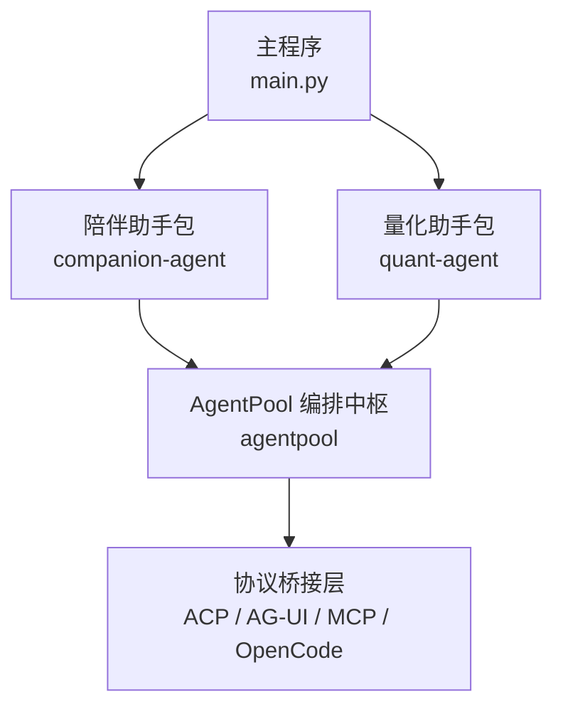
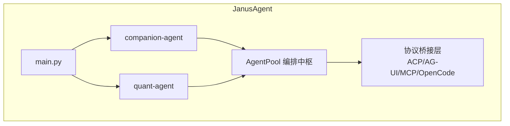
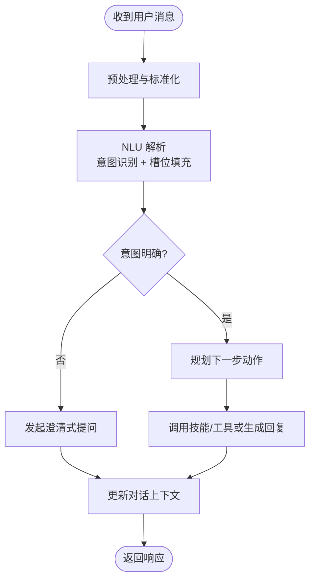
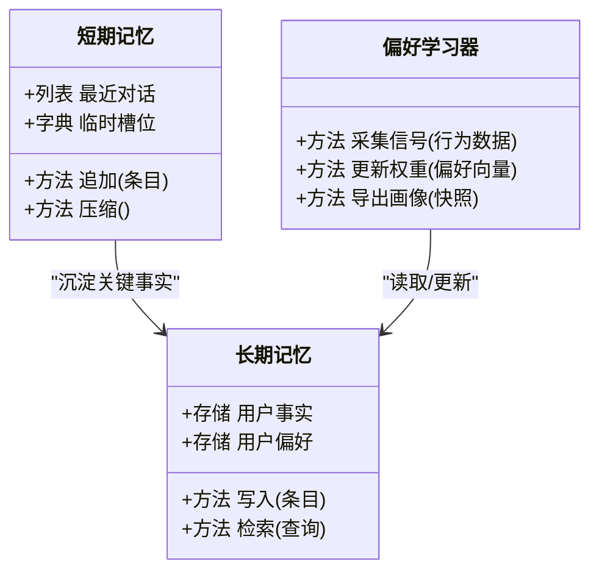
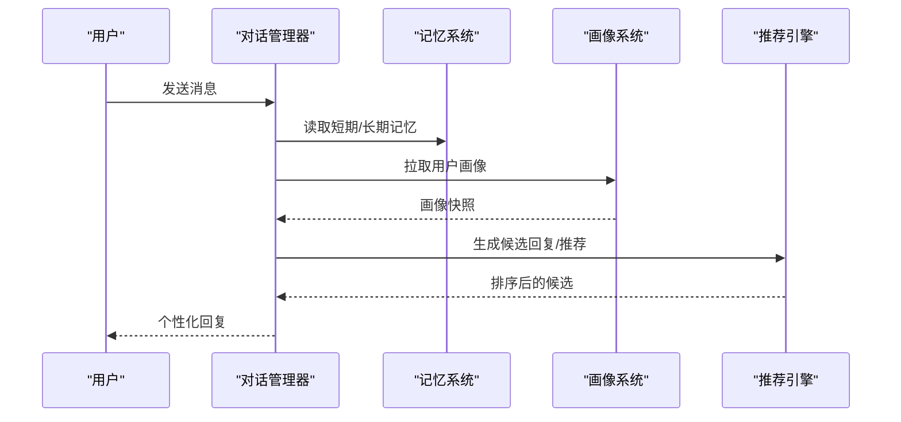
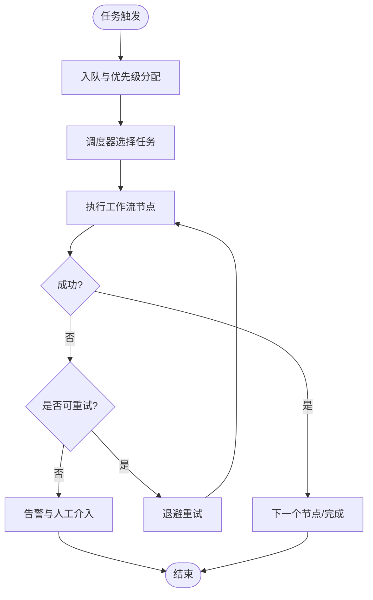
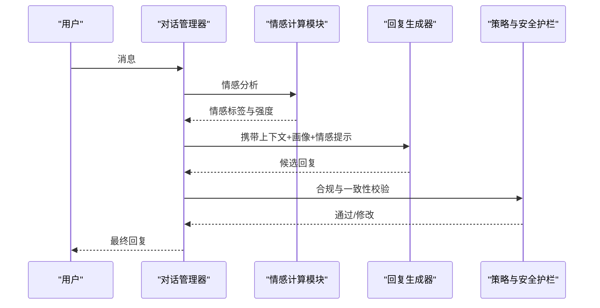
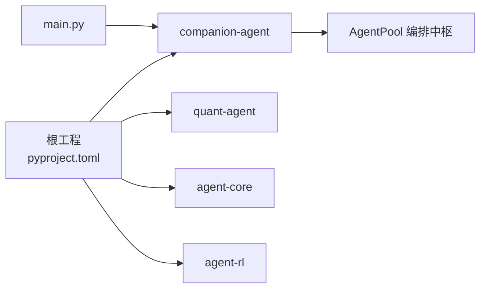

# 陪伴助手

<cite>
**本文引用的文件**   
- [main.py](file://main.py)
- [pyproject.toml](file://pyproject.toml)
- [README.md](file://README.md)
- [companion-agent/README.md](file://packages/companion-agent/README.md)
- [__init__.py](file://packages/companion-agent/src/companion_agent/__init__.py)
</cite>

## 目录
1. [简介](#简介)
2. [项目结构](#项目结构)
3. [核心组件](#核心组件)
4. [架构总览](#架构总览)
5. [详细组件分析](#详细组件分析)
6. [依赖分析](#依赖分析)
7. [性能考虑](#性能考虑)
8. [故障排查指南](#故障排查指南)
9. [结论](#结论)
10. [附录](#附录)

## 简介
本文件为 companion-agent（陪伴助手）的功能文档，聚焦以下目标：
- 对话管理系统设计：自然语言处理、意图识别与多轮对话上下文维护
- 记忆存储机制：短期记忆、长期记忆与用户偏好学习算法
- 用户画像构建系统：特征提取、行为分析与个性化推荐
- 任务自动化流程：任务调度、工作流编排与执行监控
- 典型对话场景示例：覆盖不同类型用户请求的处理路径
- 情感计算与个性化回复生成技术实现
- 性能优化与用户体验改进建议

本项目采用“双面智能体”架构：理性之面（quant-agent）与感性之面（companion-agent）共享统一的编排中枢与记忆底座。陪伴助手专注于情感陪伴、对话与共情体验，目标是“越用越懂你”。

章节来源
- [README.md:1-129](file://README.md#L1-L129)

## 项目结构
仓库采用 uv workspace 组织多个子包，其中 companion-agent 作为“感性之面”，提供对话管理、记忆存储与多轮交互能力。根入口 main.py 同时启动量化与陪伴两个智能体，并通过统一配置暴露多种协议接口。

图表来源
- [main.py:1-13](file://main.py#L1-L13)
- [pyproject.toml:1-30](file://pyproject.toml#L1-L30)
- [README.md:61-84](file://README.md#L61-L84)

章节来源
- [main.py:1-13](file://main.py#L1-L13)
- [pyproject.toml:1-30](file://pyproject.toml#L1-L30)
- [README.md:39-93](file://README.md#L39-L93)

## 核心组件
- 陪伴助手入口与对外能力
  - 提供 hello() 与 main() 等基础能力，用于快速验证与集成
- 运行与依赖
  - 通过 pyproject.toml 声明依赖与 uv workspace 成员，确保可独立安装与运行
- 开发指引
  - companion-agent/README.md 给出本地开发与运行方式

章节来源
- [__init__.py:1-14](file://packages/companion-agent/src/companion_agent/__init__.py#L1-L14)
- [companion-agent/README.md:1-16](file://packages/companion-agent/README.md#L1-L16)
- [pyproject.toml:1-30](file://pyproject.toml#L1-L30)

## 架构总览
陪伴助手在 JanusAgent 整体架构中承担“感性之面”的职责，与量化助手共同接入 AgentPool 编排中枢，并经由统一协议层对外提供服务。

图表来源
- [main.py:1-13](file://main.py#L1-L13)
- [README.md:61-84](file://README.md#L61-L84)

## 详细组件分析

### 对话管理系统
- 自然语言处理
  - 输入预处理：清洗、分词、实体抽取、去噪
  - 语义理解：基于 LLM 的意图分类与槽位填充
- 意图识别
  - 规则+模型混合策略：高频意图走轻量规则，长尾意图由模型判别
  - 置信度阈值与回退策略：低置信度时触发澄清式提问
- 多轮对话上下文维护
  - 会话状态机：记录当前意图、已收集槽位、历史摘要
  - 上下文窗口管理：滑动窗口 + 关键信息摘要，避免上下文膨胀
  - 跨会话迁移：将重要事实沉淀至长期记忆，减少重复询问

[此图为概念性流程图，不直接映射具体源码文件]

### 记忆存储机制
- 短期记忆
  - 会话内缓存：最近若干轮对话、临时槽位、待确认事项
  - 生命周期：随会话结束自动清理或压缩为摘要
- 长期记忆
  - 持久化存储：用户事实、偏好、里程碑事件
  - 检索增强：向量检索 + 关键词索引，支持按时间/主题过滤
- 用户偏好学习算法
  - 显式反馈：点赞/点踩、修正指令
  - 隐式信号：停留时长、重复问题、跳过率
  - 增量更新：在线权重调整与周期性离线校准

[此图为概念性类图，不直接映射具体源码文件]

### 用户画像构建系统
- 特征提取
  - 人口学属性（可选）、兴趣标签、沟通风格、活跃时段
  - 行为序列：访问路径、常用功能、失败重试次数
- 行为分析
  - 聚类分群：相似用户群体识别
  - 趋势检测：兴趣漂移与阶段性目标达成
- 个性化推荐
  - 冷启动：基于通用偏好与热门内容
  - 协同过滤 + 内容匹配：结合画像与实时上下文
  - 安全护栏：多样性、新颖性与公平性约束

[此图为概念性时序图，不直接映射具体源码文件]

### 任务自动化流程
- 任务调度
  - 事件驱动：对话事件、定时任务、外部回调
  - 优先级队列：高优任务抢占与降级策略
- 工作流编排
  - DAG 定义：节点为原子操作，边表示依赖关系
  - 幂等与重试：失败补偿与最大重试次数
- 执行监控
  - 指标采集：耗时、成功率、错误码分布
  - 告警与追踪：链路 ID 贯穿全流程

[此图为概念性流程图，不直接映射具体源码文件]

### 情感计算与个性化回复生成
- 情感计算
  - 情绪识别：文本情感极性、强度与类别
  - 共情建模：对用户情绪的镜像与安抚策略
- 个性化回复生成
  - 风格控制：语气、长度、专业度与幽默感可调
  - 知识注入：结合长期记忆与画像进行定制化表达
  - 安全合规：敏感话题拦截与引导

[此图为概念性时序图，不直接映射具体源码文件]

### 典型对话场景示例
- 闲聊与情绪安抚
  - 用户表达负面情绪 → 情感识别 → 共情回复 → 引导倾诉或提供资源
- 信息查询与问答
  - 用户提问 → 意图识别 → 检索知识库/记忆 → 生成答案 → 标注来源
- 任务型对话
  - 用户提出需求 → 槽位收集 → 工作流编排 → 执行与反馈 → 结果确认
- 个性化推荐
  - 用户浏览/点击 → 行为信号采集 → 画像更新 → 推荐候选排序 → 呈现

[本节为概念性说明，不直接映射具体源码文件]

## 依赖分析
- 包依赖与工作区
  - 根 pyproject.toml 声明了 agent-core、agent-rl、quant-agent、companion-agent 四个工作区成员
  - main.py 导入 companion_agent 并调用其 hello()，体现运行时装配
- 协议与编排
  - README 指出 AgentPool 负责多协议桥接（ACP、AG-UI、MCP、OpenCode），陪伴助手通过该中枢对外暴露能力

图表来源
- [pyproject.toml:1-30](file://pyproject.toml#L1-L30)
- [main.py:1-13](file://main.py#L1-L13)
- [README.md:61-84](file://README.md#L61-L84)

章节来源
- [pyproject.toml:1-30](file://pyproject.toml#L1-L30)
- [main.py:1-13](file://main.py#L1-L13)
- [README.md:86-93](file://README.md#L86-L93)

## 性能考虑
- 对话系统
  - 使用缓存与预取降低首字延迟；对高频意图做路由加速
  - 上下文压缩与摘要，控制 token 用量与成本
- 记忆系统
  - 分层存储：热数据内存、温数据对象存储、冷数据归档
  - 向量化检索索引定期重建与增量更新
- 任务编排
  - 并行执行无依赖节点；失败快速失败与熔断
  - 指标上报异步化，避免阻塞主流程
- 用户体验
  - 渐进式加载与骨架屏；打字机效果提升感知速度
  - 可解释性：关键决策附带简要依据

[本节为通用建议，不直接映射具体源码文件]

## 故障排查指南
- 常见问题定位
  - 启动失败：检查依赖安装与 uv workspace 配置
  - 无法运行命令：确认 companion-agent 可执行脚本是否存在
  - 协议不通：核对 AgentPool 与协议桥接层配置
- 日志与追踪
  - 开启结构化日志，包含会话 ID、意图、槽位、错误码
  - 端到端链路追踪，便于跨服务定位瓶颈
- 回滚与恢复
  - 版本灰度与一键回滚
  - 记忆与画像快照备份，异常后快速恢复

章节来源
- [companion-agent/README.md:1-16](file://packages/companion-agent/README.md#L1-L16)
- [README.md:95-112](file://README.md#L95-L112)

## 结论
陪伴助手以“对话 + 记忆 + 画像 + 任务编排”为核心，形成从理解到行动再到进化的闭环。通过短期/长期记忆与偏好学习，持续积累专属度；借助 AgentPool 与多协议桥接，具备良好扩展性与可观测性。后续可在情感计算、个性化生成与性能优化方面持续深耕，进一步提升用户体验与系统稳定性。

## 附录
- 快速开始
  - 安装依赖与运行：参考 companion-agent/README.md
  - 框架入口：python main.py
- 术语表
  - 意图识别：从用户输入中判断其目的与所需动作
  - 槽位填充：为任务型对话收集必要参数
  - 画像：对用户兴趣、偏好与行为的结构化描述
  - 编排：将多个原子操作组合为可执行的工作流

章节来源
- [companion-agent/README.md:1-16](file://packages/companion-agent/README.md#L1-L16)
- [README.md:95-112](file://README.md#L95-L112)