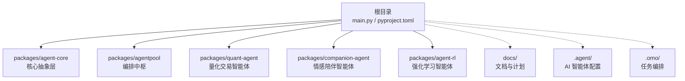
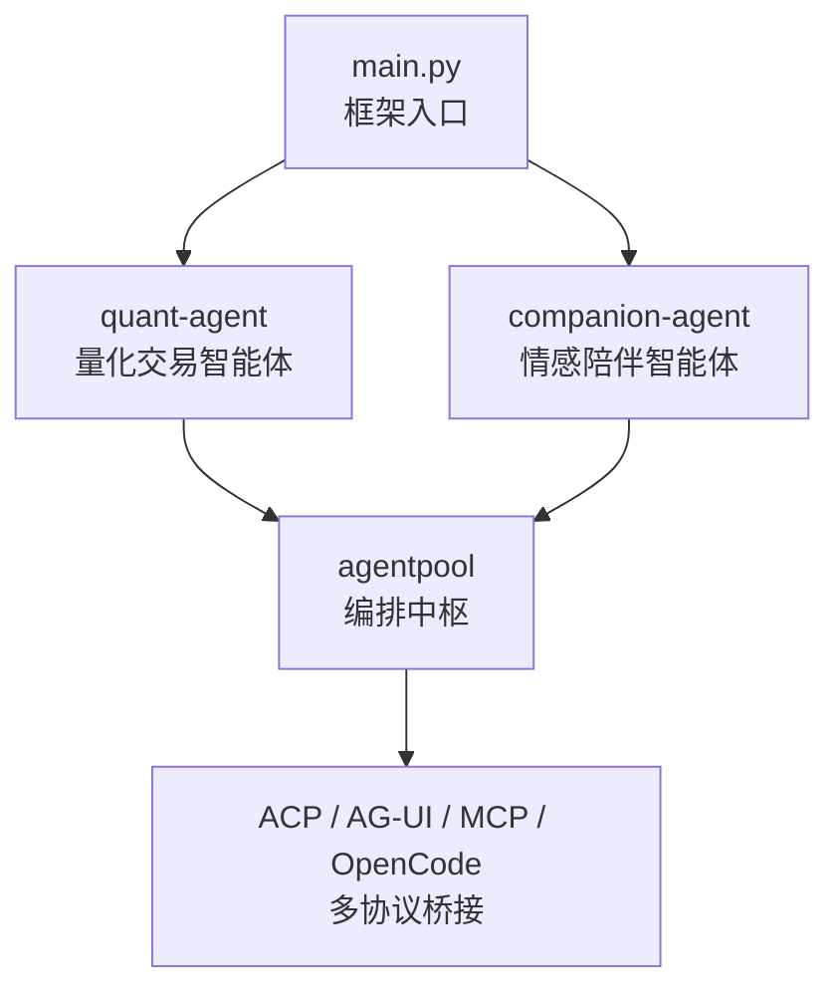
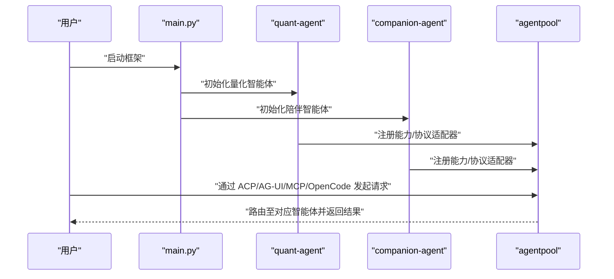
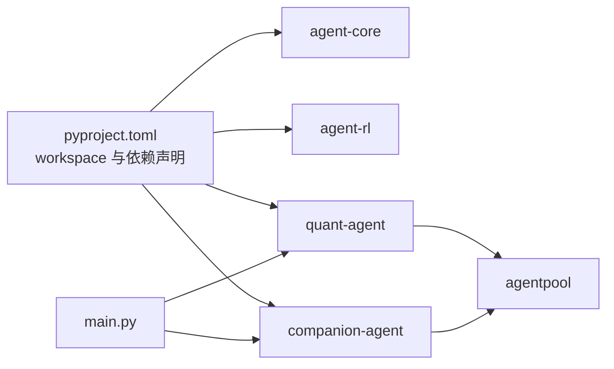

# 项目概述

<cite>
**本文引用的文件**   
- [main.py](file://main.py)
- [pyproject.toml](file://pyproject.toml)
- [README.md](file://README.md)
- [.agent/AGENT.md](file://.agent/AGENT.md)
- [packages/agent-core/README.md](file://packages/agent-core/README.md)
- [packages/quant-agent/README.md](file://packages/quant-agent/README.md)
- [packages/companion-agent/README.md](file://packages/companion-agent/README.md)
- [packages/agent-rl/README.md](file://packages/agent-rl/README.md)
</cite>

## 目录
1. [简介](#简介)
2. [项目结构](#项目结构)
3. [核心组件](#核心组件)
4. [架构总览](#架构总览)
5. [详细组件分析](#详细组件分析)
6. [依赖关系分析](#依赖关系分析)
7. [性能与可扩展性](#性能与可扩展性)
8. [故障排查指南](#故障排查指南)
9. [结论](#结论)
10. [附录](#附录)

## 简介
JanusAgent 是一个“双生智能体”框架，围绕“理性之面（量化交易）”和“感性之面（情感陪伴）”两大场景构建统一的双面智能体体系。其设计理念是：以统一的编排中枢与记忆底座，将不同领域的智能体能力进行深度特化与个性化定制，并通过多协议暴露给上层应用或外部系统。

- 核心理念
  - 双面一体：同一“自我”承载专业协助与情感陪伴两种角色，保持人格一致、不漂移。
  - 上下文工程优先：通过自进化拉平人+专家手感，沉淀记忆底座，作为差异化优势。
  - 插件化与可组合：以 AgentPool 为编排中枢，支持 YAML 驱动配置与多协议桥接。
- 目标与北极星
  - 在垂直领域（量化/陪伴）打磨通用内核，最终沉淀到 agent-core，形成通用 Agent 产品。
  - 北极星指标为“专属度”，即相比通用 Agent 的额外价值随使用时间增长而扩大。
- 技术主线
  - 以上下文工程为主，强化学习/微调仅作为降本辅助手段。

章节来源
- [README.md:1-26](file://README.md#L1-L26)
- [.agent/AGENT.md:8-17](file://.agent/AGENT.md#L8-L17)

## 项目结构
仓库采用 UV 工作区模式，根目录负责入口与全局配置，业务与基础设施拆分为多个子包，便于独立演进与复用。

图表来源
- [pyproject.toml:14-17](file://pyproject.toml#L14-L17)
- [README.md:49-59](file://README.md#L49-L59)

章节来源
- [README.md:39-59](file://README.md#L39-L59)
- [pyproject.toml:14-17](file://pyproject.toml#L14-L17)

## 核心组件
- agent-core：提供 Agent 内核基类、生命周期管理与插件接口定义，是其他智能体的共同基础。
- agentpool：编排中枢，YAML 驱动的多智能体编排，并桥接 ACP、AG-UI、MCP、OpenCode 等协议。
- quant-agent：面向数据驱动的量化交易智能体，提供市场数据（K线/Bar）、策略定义与回测框架。
- companion-agent：面向自然共情的对话体验，提供对话管理、记忆存储与多轮交互。
- agent-rl：强化学习智能体，提供环境交互、策略优化、奖励建模与模型部署，支撑持续学习与自主决策。

章节来源
- [packages/agent-core/README.md:1-6](file://packages/agent-core/README.md#L1-L6)
- [packages/agentpool/README.md](file://packages/agentpool/README.md)
- [packages/quant-agent/README.md:1-6](file://packages/quant-agent/README.md#L1-L6)
- [packages/companion-agent/README.md:1-6](file://packages/companion-agent/README.md#L1-L6)
- [packages/agent-rl/README.md:1-6](file://packages/agent-rl/README.md#L1-L6)

## 架构总览
整体架构由“入口编排 + 双生智能体 + 统一编排中枢 + 多协议桥接”构成。main.py 作为框架入口，加载并协调量化与陪伴两个智能体；两者共享 AgentPool 提供的编排与协议能力，并通过 YAML 配置实现灵活组合。

图表来源
- [main.py:1-13](file://main.py#L1-L13)
- [README.md:61-84](file://README.md#L61-L84)

章节来源
- [README.md:61-84](file://README.md#L61-L84)
- [main.py:1-13](file://main.py#L1-L13)

## 详细组件分析

### 量化交易智能体（quant-agent）
- 设计思路
  - 以数据为中心：提供 K 线/Bar 结构与历史数据访问，支撑策略研究与回测。
  - 策略即代码：通过清晰的策略定义与回测框架，降低研究到生产的迁移成本。
  - 与 AgentPool 集成：通过统一编排暴露量化能力，便于与其他智能体协作。
- 关键特性
  - 市场数据抽象、策略模板、回测执行、结果评估。
  - 可与 agent-rl 结合，探索在线学习与策略自适应。
- 适用场景
  - 量化研究、策略回测、信号生成、风控校验等。

章节来源
- [packages/quant-agent/README.md:1-6](file://packages/quant-agent/README.md#L1-L6)
- [README.md:86-93](file://README.md#L86-L93)

### 情感陪伴智能体（companion-agent）
- 设计思路
  - 以用户为中心：强调自然对话、共情表达与长期记忆，提升“专属度”。
  - 多轮交互：会话状态管理、上下文压缩与记忆检索，保证连贯性与一致性。
  - 与 AgentPool 集成：通过统一编排对外暴露陪伴能力，并可与其他智能体协同。
- 关键特性
  - 对话管理、记忆存储、多轮交互、个性化画像。
- 适用场景
  - 日常陪伴、情绪疏导、个人助理、知识问答等。

章节来源
- [packages/companion-agent/README.md:1-6](file://packages/companion-agent/README.md#L1-L6)
- [README.md:86-93](file://README.md#L86-L93)

### 强化学习智能体（agent-rl）
- 设计思路
  - 以持续学习为目标：提供环境交互、策略优化、奖励建模与部署能力。
  - 与业务智能体解耦：可作为独立模块被量化或陪伴智能体调用，增强自适应能力。
- 关键特性
  - 环境封装、策略网络、训练循环、评估与部署。
- 适用场景
  - 动态策略优化、个性化推荐、对话策略调优等。

章节来源
- [packages/agent-rl/README.md:1-6](file://packages/agent-rl/README.md#L1-L6)

### 核心抽象层（agent-core）
- 职责
  - 定义 Agent 内核基类、生命周期钩子与插件接口，确保各智能体具备一致的扩展点。
- 价值
  - 统一抽象降低重复建设，提高跨智能体复用率与可维护性。

章节来源
- [packages/agent-core/README.md:1-6](file://packages/agent-core/README.md#L1-L6)

### 编排中枢（agentpool）
- 职责
  - YAML 驱动的多智能体编排，桥接 ACP、AG-UI、MCP、OpenCode 等多协议。
- 价值
  - 统一入口与协议适配，屏蔽底层差异，提升系统集成效率。

章节来源
- [README.md:86-93](file://README.md#L86-L93)

### 运行流程（序列图）
以下序列图展示 main.py 启动后如何协调两个智能体，并通过 AgentPool 暴露能力。

图表来源
- [main.py:1-13](file://main.py#L1-L13)
- [README.md:61-84](file://README.md#L61-L84)

## 依赖关系分析
- 工作区与依赖
  - 根 pyproject.toml 声明 uv workspace，成员包含 packages/* 下的四个子包。
  - 顶层项目依赖 agent-core、agent-rl、quant-agent、companion-agent。
- 运行时入口
  - main.py 导入并调用 quant-agent 与 companion-agent 的 hello 方法，完成最小可用演示。
- 协议与编排
  - README 中明确 AgentPool 桥接 ACP、AG-UI、MCP、OpenCode，作为统一编排与协议适配层。

图表来源
- [pyproject.toml:1-12](file://pyproject.toml#L1-L12)
- [pyproject.toml:14-17](file://pyproject.toml#L14-L17)
- [main.py:1-13](file://main.py#L1-L13)
- [README.md:61-84](file://README.md#L61-L84)

章节来源
- [pyproject.toml:1-12](file://pyproject.toml#L1-L12)
- [pyproject.toml:14-17](file://pyproject.toml#L14-L17)
- [main.py:1-13](file://main.py#L1-L13)
- [README.md:61-84](file://README.md#L61-L84)

## 性能与可扩展性
- 模块化与插件化
  - 通过 agent-core 的插件接口与 agentpool 的 YAML 编排，新增智能体或能力无需改动核心逻辑。
- 协议解耦
  - 多协议桥接使上层应用可自由选择接入方式，避免耦合于单一协议栈。
- 可扩展方向
  - 引入更多领域智能体（如客服、运维、内容创作），复用统一编排与记忆底座。
  - 与 agent-rl 结合，实现策略自适应与个性化持续优化。

[本节为通用指导，不涉及具体文件分析]

## 故障排查指南
- 常见问题定位
  - 入口无法启动：检查 main.py 是否正确导入并调用子包方法。
  - 依赖缺失：确认 uv workspace 已同步，pyproject.toml 中依赖声明完整。
  - 协议不可用：核对 agentpool 的协议适配器是否按 YAML 配置启用。
- 建议步骤
  - 使用 ruff 检查与格式化，确保代码风格一致。
  - 使用 pytest 运行测试用例，验证最小可用路径。
  - 查看 .agent/ 与 .omo/ 中的配置与计划，确认编排与上下文正确。

章节来源
- [README.md:95-112](file://README.md#L95-L112)
- [.agent/AGENT.md:119-127](file://.agent/AGENT.md#L119-L127)

## 结论
JanusAgent 以“双面一体”的设计哲学，将量化交易与情感陪伴两大场景统一到同一个框架内。通过 agent-core 的统一抽象、agentpool 的编排与协议桥接，以及 YAML 驱动的灵活配置，开发者可以快速扩展新的智能体与能力。未来可在 agent-rl 的加持下，进一步增强自适应与个性化能力，逐步向通用 Agent 产品演进。

[本节为总结性内容，不涉及具体文件分析]

## 附录
- 快速开始
  - 安装依赖：uv sync --all-extras
  - 启动框架：python main.py
  - 代码检查与格式化：ruff check . / ruff format .
  - 运行测试：pytest
- 开发规范
  - 语言：Python 3.12+
  - 包管理：uv（workspace 模式）
  - 代码质量：ruff、pre-commit
  - 文档字符串：Google 风格

章节来源
- [README.md:95-124](file://README.md#L95-L124)