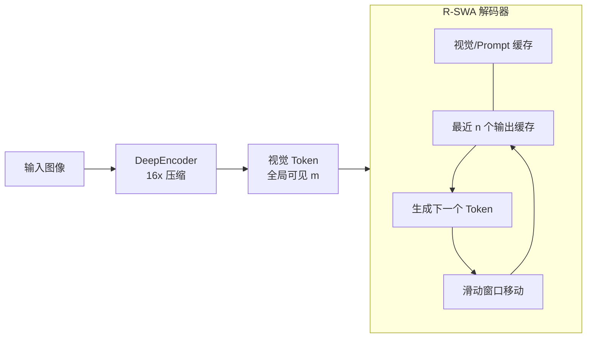

# 文档解析与视觉 OCR 前沿论文调研（2025—2026）

> **调研范围**：2025—2026 年发布的 11 篇文档解析 / 视觉 OCR 领域重要论文
> **调研目的**：为 `perception-agent` 视觉感知模块的架构选型与技术路线提供参考
> **关注维度**：模型架构、数据引擎、后处理、Agentic 化、长文档解码、性能与效率

---

## 目录

- [一、调研概览](#一调研概览)
  - [1.1 领域核心问题](#11-领域核心问题)
  - [1.2 论文分类总览](#12-论文分类总览)
- [二、论文详细解读](#二论文详细解读)
  - [A 类：端到端 VLM 文档解析主流方案](#a-类端到端-vlm-文档解析主流方案)
  - [B 类：文档级后处理与结构化](#b-类文档级后处理与结构化)
  - [C 类：Agentic OCR 与多智能体推理](#c-类agentic-ocr-与多智能体推理)
  - [D 类：长文档解码与视觉推理架构创新](#d-类长文档解码与视觉推理架构创新)
- [三、横向对比与关键指标](#三横向对比与关键指标)
- [四、关键技术趋势](#四关键技术趋势)
- [五、对 perception-agent 的启示](#五对-perception-agent-的启示)

---

## 一、调研概览

### 1.1 领域核心问题

近一年（2025—2026）文档解析领域正在从「大而全的通用 VLM」向「专用、轻量、可组合」的范式演进。所有被调研论文都在尝试回答以下四个核心问题：

1. **精度 vs. 效率的平衡**：如何在 1—3B 参数的紧凑模型上实现超越 72B 通用 VLM 的解析精度？
2. **数据驱动 vs. 架构驱动**：性能瓶颈究竟在模型架构还是训练数据？
3. **静态解析 vs. 按需解析**：OCR 是否必须一次性处理整页？能否按下游需求动态取用？
4. **单页解析 vs. 文档级理解**：如何从「页级碎片」跨越到「文档级结构」（跨页合并、层级重建、图文关联）？

### 1.2 论文分类总览

| 编号 | 论文 | 类别 | 核心贡献 | 参数量 |
|:---:|---|:---:|---|:---:|
| 1 | **MinerU2.5** | A | 解耦式二阶段（布局 → 局部识别）+ ADR / OTSL | 1.2B |
| 2 | **MinerU2.5-Pro** | A | 数据引擎（DDAS+CMCV+Judge-and-Refine）+ GRPO | 1.2B |
| 3 | **dots.ocr** | A | 单模型联合布局/识别/阅读顺序，126 语种 XDocParse | 1.7B |
| 4 | **MonkeyOCR** | A | SRR 三元组范式 + MonkeyDoc 4.5M + CPD 剪枝 | 3B / 1.2B |
| 5 | **MinerU-Popo** | B | 通用后处理：跨页合并 / 标题层级 / 图文关联 | 4B |
| 6 | **Dolphin-v2** | A | 混合解析（数字文档并行 + 拍摄文档整体）+ 绝对坐标 | 3B |
| 7 | **PaddleOCR-VL-1.6** | A | UOR 待优化区域挖掘 + CPT-SFT-RL 渐进后训练 | 0.9B |
| 8 | **AgenticOCR** | C | Zoom-and-OCR 工具 + GRPO 对齐的按需解析 | 4B / 8B |
| 9 | **MACT** | C | 四智能体协作（Plan/Exe/Judge/Answer）+ 自适应缩放 | ~28B |
| 10 | **Unlimited OCR** | D | R-SWA：恒定 KV Cache 的长文档解码 | 3B (MoE) |
| 11 | **DeepSeek-OCR 2** | D | DeepEncoder V2 视觉因果流：语义驱动的视觉重排 | 3B |

> 类别说明：**A** = 端到端 VLM 主流方案；**B** = 后处理层；**C** = Agentic / 多智能体；**D** = 架构级效率创新。

---

## 二、论文详细解读

### A 类：端到端 VLM 文档解析主流方案

本类是目前文档解析领域的绝对主力，主要围绕「解耦式布局—识别」和「数据引擎驱动」两大范式展开。

#### 1. MinerU2.5: A Decoupled Vision-Language Model for Efficient High-Resolution Document Parsing

这篇论文介绍了 **MinerU2.5**，一个参数量为 **1.2B** 的文档解析视觉语言模型（VLM）。该模型旨在解决高分辨率文档解析中精度与效率之间的矛盾，通过一种解耦的、由粗到精（coarse-to-fine）的推理策略，在维持低计算开销的同时，实现了最先进的解析准确率。

---

## 核心架构与解析策略

MinerU2.5 采用了受 Qwen2-VL 启发的架构，包含 675M 参数的 **NaViT** 视觉编码器和 0.5B 参数的 **Qwen2-Instruct** 解码器。其核心创新在于**解耦的二阶段解析策略**：

*   **第一阶段：全局布局分析（Layout Analysis）**
    将原始图像缩放至 $1036 \times 1036$ 像素的固定尺寸。模型在此阶段执行快速的全局分析，识别文档的结构元素（如文本块、公式、表格、页眉页脚等），并预测其位置、类别、旋转角度和阅读顺序。这避免了处理全分辨率图像带来的 $O(N^2)$ 计算复杂度。
*   **第二阶段：局部内容识别（Content Recognition）**
    根据第一阶段检测到的布局，从原始高分辨率图像中切取局部区域（Crops）。这些局部区域以原生分辨率输入模型，进行精细化的内容识别（文本、公式、表格）。这种方法确保了密集文字和复杂公式的识别精度。

> “这种解耦策略不仅将计算成本降低了一个数量级……还显著增强了解析的可解释性，有效缓解了 VLM 中常见的幻觉问题。” [Introduction](https://www.alphaxiv.org/abs/2509.22186v2?page=5)

---

## 关键技术创新

### 1. 复杂公式解析：ADR 框架
针对长公式或多行推导，论文提出了 **ADR (Atomic Decomposition & Recombination)** 框架。
*   **分解：** 将复杂的复合公式分解为多个独立的原子公式行。
*   **识别：** 分别对每一行进行高精度的 LaTeX 转换。
*   **重组：** 利用布局信息将各行 LaTeX 字符串重新构建为完整的结构（如 `align` 环境），解决了 VLM 在处理长序列公式时容易产生的结构性幻觉。

### 2. 表格解析：OTSL 语言
为了降低表格解析的序列长度和复杂度，MinerU2.5 放弃了冗长的 HTML 格式，转而采用 **OTSL (Optimized Table-Structure Language)**。OTSL 仅使用 5 个结构标记即可描述表格矩阵，将平均序列长度缩短了约 50%，显著提升了模型处理复杂长表格的能力。

### 3. 布局评估指标：PageIoU
传统 object detection 的 mAP 指标在处理边界模糊的文档块时表现不佳。论文引入了 **PageIoU**，这是一种页面级覆盖率指标，通过计算预测区域与真实标注在像素层面的空间一致性，能够更客观地评价布局质量。

---

## 数据引擎与训练策略

MinerU2.5 的高性能得益于其强大的**数据引擎**和**闭环挖掘策略**：

*   **IMIC (Iterative Mining via Inference Consistency)：** 利用模型推理的一致性来自动挖掘“难例”。如果多次推理结果差异很大，说明该样本处于模型的弱点区域，随后由专家进行人工校对。
*   **训练阶段：**
    *   **Stage 0：** 模态对齐（VQA 任务）。
    *   **Stage 1：** 文档解析预训练（6.9M 样本，涵盖布局与内容识别）。
    *   **Stage 2：** 文档解析微调（侧重难例与高质量 SFT 数据）。

---

## 实验结果与性能

MinerU2.5 在多个权威基准测试中均取得了 SOTA 成绩：

*   **OmniDocBench：** 综合得分 **90.67**，超越了 GPT-4o、Gemini-2.5 Pro 和 Qwen2.5-VL-72B 等规模大得多的模型。
*   **推理效率：** 在 A100 GPU 上，端到端吞吐量达到 **2.12 pages/s**，比 MonkeyOCR-pro-3B 快 4 倍，比 dots.ocr 快 7 倍。

| 任务指标 | MinerU2.5 (1.2B) | dots.ocr (3.0B) | Qwen2.5-VL-72B |
| :--- | :--- | :--- | :--- |
| **OmniDocBench Overall** | **90.67** | 88.41 | 87.27 |
| **Text Edit Distance** | **0.047** | 0.048 | 0.051 |
| **Formula (CDM)** | **88.46** | 87.24 | 88.27 |
| **Table (TEDS)** | **88.22** | 85.16 | 84.14 |

---

## 结论

MinerU2.5 证明了通过**解耦架构**和**专用小模型**（1.2B），可以在文档解析任务上实现超越巨型通用模型的性能。它不仅能够提供高质量的结构化数据用于 LLM 预训练，还能作为强大的 RAG 系统前端，精准提取复杂文档中的知识。

#### 2. MinerU2.5-Pro: Pushing the Limits of Data-Centric Document Parsing at Scale

这篇论文介绍了 **MinerU2.5-Pro**，这是由上海人工智能实验室（Shanghai AI Lab）发布的一个以数据为中心的文档解析模型。其核心观点是：当前文档解析的性能瓶颈在于**训练数据的质量和覆盖范围**，而非模型架构。

以下是对该论文的详细总结：

---

## 1. 核心目标与背景
研究人员发现，尽管目前文档解析模型架构各异，但它们在处理相同的“难题”时往往表现出一致的失败模式。这表明性能提升的关键在于系统化的**数据工程**。MinerU2.5-Pro 在保持 MinerU2.5 原有的 **1.2B 参数解耦架构**（Vision Encoder + LLM）不变的前提下，仅通过数据优化和策略调整，刷新了多项 SOTA。

## 2. 核心技术：数据引擎 (Data Engine)
为了提升数据的覆盖率、信息量和标注准确性，论文提出了三个关键组件：

*   **多样性与难度感知采样 (DDAS):** 
    *   通过聚类和难度分层，将训练数据从不足 10M 扩展到 **65.5M** 页。
    *   解决了长尾场景（如复杂嵌套表格、密集公式）样本不足的问题。
*   **跨模型一致性验证 (CMCV):**
    *   利用多个不同架构的模型（如 MinerU2.5, PaddleOCR-VL, Qwen3-VL）对同一样本进行预测。
    *   **Easy:** 模型间高度一致，直接作为标注。
    *   **Medium:** 外部模型一致但目标模型不一致，作为高质量伪标签。
    *   **Hard:** 所有模型均不一致，标记为极难样本，进入下一环节处理。
*   **“判断-精炼”标注管线 (Judge-and-Refine):**
    *   针对极难样本，采用“渲染后再验证”的迭代修正方案。
    *   通过将解析出的 LaTeX 或 HTML 重新渲染为图像，让模型比对原图和渲染图的差异，从而更精准地发现并修正结构性错误。

---

## 3. 三阶段渐进式训练策略
模型训练分为三个阶段，分别对应不同质量层级的数据：

1.  **大规模预训练 (Stage 1):** 使用 65.5M 自动标注数据，构建模型对布局、文本、公式和表格的基础解析能力。
2.  **高质量微调 (Stage 2):** 使用 192K 经过人工校验和“判断-精炼”处理的极难样本进行针对性优化。
3.  **基于 GRPO 的强化学习 (Stage 3):** 采用 **Group Relative Policy Optimization (GRPO)**，将训练目标直接与评估指标（如公式的 CDM、表格的 TEDS）对齐，进一步规范输出格式。

---

## 4. 评估协议升级：OmniDocBench v1.6
论文指出原有基准测试（v1.5）存在匹配逻辑偏差（例如模型将一个公式块切分成两块，即使内容全对也会被判低分）。

*   **多粒度自适应匹配 (MGAM):** 引入了新的匹配算法，对预测结果进行自适应粒度调整，消除了因切分方式不同带来的评分不公。
*   **新增 Hard 子集:** 专门加入了 296 页极具挑战性的真实样本（如嵌套表格、超长公式），显著提升了测试的区分度。

---

## 5. 实验结果
MinerU2.5-Pro 在 1.2B 参数规模下，展现了跨级别的竞争力：

*   **总体性能:** 在 OmniDocBench v1.6 全集上达到 **95.69** 分，超过了参数量大其 200 倍以上的通用模型（如 Qwen3-VL-235B）。
*   **子项表现:** 在公式识别（CDM 97.29）和表格识别（TEDS 93.42）上均处于领先地位。
*   **Hard 子集优势:** 在极难样本子集上，MinerU2.5-Pro 领先基准模型超过 2 个百分点，证明了其强大的鲁棒性。

---

## 6. 扩展能力
除了核心性能提升，该版本还引入了多项实用功能：
*   **图像感知的解析:** 能够识别图表中的结构化数据，并将其转化为 Markdown 或表格。
*   **跨页合并:** 自动检测并合并跨页的表格和被截断的段落。
*   **表内图像处理:** 支持识别表格单元格内的图像并保留其空间对应关系。

## 结论
MinerU2.5-Pro 证明了**数据驱动型策略**在文档解析领域的巨大潜力。通过精密的采样、跨模型校验和强化学习对齐，轻量级模型依然可以在复杂任务中超越超大规模模型。

---
**相关资源:**
*   **代码:** [GitHub - opendatalab/MinerU](https://github.com/opendatalab/MinerU)
*   **模型:** [Hugging Face - MinerU2.5-Pro](https://huggingface.co/opendatalab/MinerU2.5-Pro-2604-1.2B)

#### 3. dots.ocr: Multilingual Document Layout Parsing in a Single Vision-Language Model

这篇论文介绍了 **dots.ocr**，这是一个统一的视觉语言模型（Vision-Language Model, VLM），旨在通过单一的端到端框架解决多语言文档布局解析（Document Layout Parsing）的三大核心任务：**布局检测**、**文本识别**和**关系理解**（即阅读顺序预测）。

以下是该研究的详细总结：

---

## 1. 核心动机与挑战
传统的文档解析通常采用分阶段的流水线（pipeline）方法，例如先检测布局，再进行 OCR 识别，最后预测阅读顺序。这种方法存在两个主要问题：
*   **误差传播**：早期阶段的错误会直接影响后续步骤。
*   **缺乏协同**：各子任务被视为孤立步骤，无法利用联合训练带来的互补优势。
*   **多语言匮乏**：现有的研究和数据集大多以英文为中心，导致模型在处理全球多种语言时表现不佳。

---

## 2. dots.ocr 统一架构
dots.ocr 将多语言文档解析表述为一个单一的、端到端的自回归生成任务。

### 任务形式化
模型输入文档图像 $I$，输出一个结构化序列 $S$：
$$S = [(B_1, c_1, t_1), . . . , (B_K, c_K, t_K)]$$
其中 $B_k$ 是边界框坐标，$c_k$ 是类别（如标题、表格、图表），$t_k$ 是识别出的文本（表格则使用 LaTeX 格式）。

> "This task formulation compels the model to not only parse content but also to comprehend the document's logical flow, thus unifying layout detection, text recognition, and high-level relational understanding in a single pass." [Task Formulation](https://www.alphaxiv.org/abs/2512.02498v4?page=3)

### 模型组件
*   **视觉编码器 (Vision Encoder)**：拥有 1.2B 参数，完全从头训练（scratch），支持最高 1100 万像素的高分辨率输入。
*   **语言模型解码器 (LM Decoder)**：基于 Qwen2.5-1.5B 基础模型，总参数量约为 1.7B。

> "This from-scratch approach allows us to specialize its feature representation for document intelligence from the ground up." [Architecture](https://www.alphaxiv.org/abs/2512.02498v4?page=3)

---

## 3. 高度可扩展的数据引擎
为了克服标注数据稀缺的问题，研究团队设计了一个三阶段数据引擎：
1.  **引导阶段**：利用强大的专有模型（如 Qwen2.5-VL-72B）作为教师，将英语文档重渲染为多语言文档，并蒸馏给较小的学生模型（7B）。
2.  **战略策划阶段**：通过分层采样对海量原始 PDF 进行自动标注，确保语言、布局和领域的平衡。
3.  **针对性修正阶段 (HITL)**：通过“人机协同”修正模型最容易出错的案例（如定位不准或幻觉），构建高质量的校对集。

---

## 4. 新的基准测试：XDocParse
为了推动全球文档智能研究，论文引入了 **XDocParse** 基准，涵盖 **126 种语言**。这是目前最具挑战性的多语言文档解析评估套件之一。

---

## 5. 实验结果与消融实验
### 主要结果
dots.ocr 在多项指标上达到了 SOTA 水平：
*   **OmniDocBench**：在英文和中文测试中均显著超越了现有模型。
*   **XDocParse**：相比 Gemini-2.5-Pro，其整体编辑距离（Overall Edit）降低了 29.5%，文本编辑距离降低了 54%。

### 核心发现：任务协同效应
消融实验证明了布局检测、文本识别和阅读顺序之间的“共生关系”：
*   **检测是几何基础**：去掉检测任务会导致阅读顺序准确度大幅下降。
*   **识别是语义正则化**：识别任务能引导检测器关注更有意义的区域。
*   **阅读顺序是结构桥梁**：正确的顺序有助于模型构建文档布局的内部表征。

> "...layout detection, text recognition, and relational understanding are not independent modules but a symbiotic triad." [Ablation Study](https://www.alphaxiv.org/abs/2512.02498v4?page=7)

---

## 6. 结论与愿景
dots.ocr 不仅是一个高性能的解析器，其更大的意义在于作为一个**数据引擎**，能够高效提取长上下文文本、图像-文本对和细粒度坐标，为下一代更强大的多模态视觉语言模型（VLM）提供训练素材。

#### 4. MonkeyOCR: Document Parsing with a Structure-Recognition-Relation Triplet Paradigm

这篇论文介绍了 **MonkeyOCR**，这是一个由华中科技大学和金山办公联合推出的文档解析（Document Parsing）大模型。该模型通过创新的架构和大规模数据集，刷新了文档解析领域的 SOTA（当前最佳性能）。

以下是对该论文的详细总结：

## 1. 核心挑战与背景
当前的文档解析方法主要分为两类，但各有优缺点：
*   **传统流水线工具（Pipeline-based）**：将任务拆分为布局检测、OCR、公式识别等多个步骤。缺点是**误差累积**（前一步的微小错误会导致后续识别完全失效）。
*   **端到端大模型（End-to-end）**：直接输入整页图像输出 Markdown。缺点是处理长文档时**效率低**，且容易产生**幻觉**（因计算开销限制，序列长度受限）。

## 2. 核心贡献：SRR 三元组范式
MonkeyOCR 提出了一种 **结构（Structure）- 识别（Recognition）- 关系（Relation）** 的三元组范式，将解析任务简化为三个核心问题：
1.  **Structure (Where is it?)**：利用基于 DETR 的检测模型识别文档中的区域（文本块、表格、公式、图像等）。
2.  **Recognition (What is it?)**：采用统一的多模态大模型（LMM）对检测出的各个区域进行**块级并行识别**。这避免了处理全页长序列的压力。
3.  **Relation (How is it organized?)**：通过一个关系预测模型确定块之间的阅读顺序，最后按序整合内容。

---

## 3. 数据集：MonkeyDoc
为了支撑该范式，研究团队构建了 **MonkeyDoc** 数据集：
*   **规模**：包含 450 万个中英双语实例。
*   **覆盖面**：涵盖 10 多种文档类型（财务报告、教科书、论文、笔记等）和 5 种解析任务。
*   **构建方式**：结合了人工标注、程序化数据合成以及利用顶级模型（如 Qwen2.5-VL-72B 和 Gemini 2.5 Pro）进行的自动标注。

---

## 4. 模型优化：连续参数退化 (CPD)
研究者发现 3B 参数的模型存在参数冗余。他们提出了一种**连续参数退化（Contiguous Parameter Degradation, CPD）**技术：
*   **方法**：通过直接剪掉中间的连续层（例如从 36 层减至 12 层或更少）并进行微调。
*   **效果**：构建出 0.6B 到 1.2B 的轻量化模型。实验表明，简单的文本识别任务对参数量不敏感，而复杂的表格识别则更依赖深度。1.2B 模型相比 3B 模型推理速度提升 34%，而性能仅下降 1.5%。

---

## 5. 实验结果与性能
MonkeyOCR 在 **OmniDocBench** 基准测试中表现卓越：
*   **超越强敌**：其 3B 模型性能超越了开源的 Qwen2.5-VL-72B 和闭源的 **Gemini 2.5-Pro**。
*   **推理效率**：相比传统的全页端到端预测方式，MonkeyOCR 的推理速度快了 **2.09 倍**。
*   **显存友好**：该模型可以高效部署在单张 **RTX 3090 GPU** 上。

### 性能对比简表（基于 OmniDocBench）
| 模型 | 整体 Edit (↓) | 公式 Edit (↓) | 表格 TEDS (↑) |
| :--- | :--- | :--- | :--- |
| Gemini 2.5-Pro | 0.148 | 0.356 | 85.8 |
| Qwen2.5-VL-72B | 0.214 | 0.315 | 82.9 |
| **MonkeyOCR-3B** | **0.118** | **0.247** | **84.2** |

---

## 6. 总结
**MonkeyOCR** 的成功在于它找到了一个平衡点：它既不像传统 Pipeline 那样臃肿且易错，也不像巨型端到端模型那样由于序列过长而效率低下。通过 **SRR 范式**、**MonkeyDoc 海量数据** 和 **CPD 剪枝技术**，它提供了一个高性能、高效率且易于部署的工业级文档解析方案。

**代码与模型地址**：[GitHub - Yuliang-Liu/MonkeyOCR](https://github.com/Yuliang-Liu/MonkeyOCR)

---

### B 类：文档级后处理与结构化

本类关注的是「OCR 之后的关键一步」——如何将页级碎片化输出转化为具有全局逻辑一致性的文档级结构表示。

#### 5. MinerU-Popo: Universal Post-Processing Model for Structured Document Parsing

这篇论文介绍了 **MinerU-Popo**，一个专门用于**文档解析后处理**的通用轻量化框架。其核心目标是将 OCR 模型产生的“页面级”碎片化输出转化为具有逻辑一致性的“文档级”结构化表示。

---

## 核心摘要
当前基于视觉语言模型（VLM）的 OCR 模型（如 MinerU、PaddleOCR）在单页解析上表现出色，但在处理跨页内容时存在以下痛点：
- **断裂问题**：段落或表格被分页符截断，无法自动恢复。
- **结构缺失**：缺乏深层标题层级（Hierarchy）和图表-正文的关联。
- **长文档瓶颈**：受限于模型上下文长度，难以处理数百页的文档。

**MinerU-Popo** 通过微调一个 4B 参数量的轻量化模型，并引入动态分块与同步机制，成功解决了上述挑战。

---

## 核心技术方案

### 1. 四大解析子任务
MinerU-Popo 将后处理逻辑分解为四个聚焦的子任务：
- **文本截断恢复**：识别并合并跨页或跨列的段落碎片。
- **表格截断恢复**：判断跨页表格是否属于同一逻辑表，并执行单元格级的合并决策。
- **标题层级重建**：预测标题的开放式嵌套级别（如 Level 1, 2, 3...），构建文档骨架。
- **图文关联分析**：将图片/表格与其对应的说明文字（Caption）以及所属的章节标题进行绑定。

### 2. 任务导向的数据引擎 (Task-Oriented Data Engine)
为了提升效率，研究团队构建了包含 **30K** 实例的微调数据集，并采用了**任务特定的输入过滤策略**：
- **冗余消除**：在处理标题层级时，过滤掉所有正文，只保留标题块；在处理文本截断时，仅保留段落的首尾句。
- **输入精简**：这种方法大幅降低了 Token 消耗，使轻量化模型也能处理复杂逻辑。

### 3. 长文档动态分块与同步
针对超长文档，论文提出了 **Dynamic Chunking with Synchronization**：
- **重叠分块**：采用 3 页重叠的动态分块策略，确保边界信息不丢失。
- **偏差校正**：利用重叠区域作为参考锚点，同步不同分块之间的标题层级预测，保持全局一致性。

### 4. 文档富化 (Enrichment)
在得到精细化元素后，框架会生成两种富化信息：
- **结构富化**：构建树状文档表示（JSON/Markdown）。
- **语义富化**：对长节点进行语义切分（Node Chunking），并利用 LLM 生成节点摘要（Summary），显著提升下游 RAG 的检索效率。

---

## 实验结果与表现

### 性能指标
MinerU-Popo 在多个维度上展现了卓越的性能，尤其是显著超越了更大参数规模的预训练模型。

| 模型 | TEDS (标题层级) ↑ | 处理速度 (Doc/s) ↑ |
| :--- | :--- | :--- |
| **MinerU-Popo (4B)** | **90.6** | **0.37** |
| Qwen3-VL-8B | 65.9 | 0.16 |
| Qwen3-VL-32B | 78.0 | 0.04 |

### 关键发现
1. **结构化增益**：相比原始 OCR 输出，MinerU-Popo 将标题层级 TEDS 评分提升了 **20%** 以上。
2. **RAG 提效**：在检索增强生成任务中，通过使用节点摘要和路径，检索延迟降低了高达 **70%**，同时在多数子集上提升了回答准确率。
3. **格式优势**：实验表明，基于树状结构导出的 **JSON** 和 **Markdown** 格式在端到端问答（MMDA）中优于传统的 SHT 或 XML 格式。

---

## 总结
MinerU-Popo 证明了**后处理**是连接原始 OCR 与高质量下游应用（如 RAG、文档分析）的关键桥梁。它不仅提升了跨页解析的鲁棒性，还通过轻量化设计确保了在生产环境中的可部署性。

> “MinerU-Popo 作为一个轻量且通用的后处理 OCR 输出框架，能够将各异的解析结果转化为连贯的文档级结构。”
[Abstract](https://www.alphaxiv.org/abs/2605.24973v1?page=1)

---

### A 类（续）：拍摄文档与轻量化专用模型

#### 6. Dolphin-v2: Universal Document Parsing via Scalable Anchor Prompting

这篇论文介绍了 **Dolphin-v2**，这是一个通用的文档解析模型，旨在解决现有视觉语言模型（VLM）在处理拍摄文档（photographed documents）、复杂布局以及代码缩进方面的局限性。

---

## 核心贡献与改进

Dolphin-v2 在其前作 Dolphin 的基础上进行了重大升级，主要体现在以下几个方面：

*   **混合解析策略（Hybrid Parsing Strategy）**：针对数字生成（digital-born）文档和拍摄文档采取不同的处理路径。
*   **精细化布局分析**：将元素类别从 14 类扩展至 **21 类**，并支持语义属性提取（如作者、元数据等）。
*   **绝对坐标表示**：放弃了归一化坐标，改用**绝对像素坐标**，显著提升了高分辨率图像中的定位精度。
*   **专用解析模块**：引入了针对**公式（LaTeX）**和**代码块（保留缩进）**的专用解析指令。

---

## 技术架构

Dolphin-v2 采用两阶段解析范式，底座模型为 **Qwen2.5-VL-3B**。

### 第一阶段：联合分类与布局分析
模型首先对输入图像进行分类，判断其为“数字文档”还是“拍摄文档”。
*   **如果是数字文档**：模型会预测 21 类元素的边界框（Bounding Box）、阅读顺序以及语义属性。
*   **如果是拍摄文档**：则直接进入下一阶段的整体解析。

### 第二阶段：混合内容解析
*   **拍摄文档（整体解析）**：由于拍摄文档常存在几何畸变或光照不均，模型将其作为完整页面进行整体解析，以增强鲁棒性。
*   **数字文档（并行解析）**：利用第一阶段预测的布局“锚点”（Anchors），对每个元素进行并行处理。
    *   **公式**：使用专用 Prompt 生成精确的 LaTeX 表达。
    *   **代码**：通过专用 Prompt 保留代码的层级缩进结构。

---

## 实验结果与表现

研究团队在 **OmniDocBench**、**RealDoc-160** 和 **DocPTBench** 三个基准测试上进行了评估。

### 1. 综合性能对比
在最具挑战性的 OmniDocBench 测试中，Dolphin-v2 的表现大幅超过了前代模型及其他主流模型：

| 模型类型 | 模型名称 | 综合得分 (Overall) ↑ | 文本编辑距离 ↓ | 表格 TEDS ↑ |
| :--- | :--- | :--- | :--- | :--- |
| 专业 VLM | **Dolphin-v2 (Ours)** | **89.78** | **0.054** | **87.02** |
| 专业 VLM | MinerU2.5 | 90.67 | 0.047 | 88.22 |
| 专业 VLM | Dolphin (v1) | 74.67 | 0.125 | 68.70 |
| 通用 VLM | Qwen2.5-VL (72B) | 87.02 | 0.094 | 82.15 |

### 2. 拍摄文档的鲁棒性
在处理拍摄文档时，Dolphin-v2 在 RealDoc-160 上的错误率相比前代降低了 **91%**，平均编辑距离仅为 **0.0392**，远优于 GPT-4o (0.1641) 和 MinerU2.5 (0.3500)。

---

## 核心技术亮点总结

> “与原始 Dolphin 相比，Dolphin-v2 引入了几个关键增强功能：(1) 通过整体页面理解实现拍摄文档的鲁棒解析，(2) 包含 21 个类别的更精细元素检测及语义属性提取，(3) 能够保留缩进的代码块识别。” [Abstract](https://www.alphaxiv.org/abs/2602.05384?page=1)

> “Dolphin-v2 采用绝对像素坐标进行边界框预测……通过切换到具有像素级精度的绝对坐标，我们的模型实现了更精确的空间定位。” [Methodology](https://www.alphaxiv.org/abs/2602.05384?page=6)

---

## 结论与局限性
Dolphin-v2 证明了通过**分类感知（Type-aware）**的两阶段框架，可以在保持并行推理效率的同时，解决拍摄文档解析的顽疾。目前其局限性主要在于极端轻微畸变文档的分类错误，以及对化学分子式、乐谱等极专门化元素的覆盖不足。

#### 7. PaddleOCR-VL-1.6: Expanding the Frontier of Document Parsing with Under-Optimized Region Refinement and Progressive Post-Training

这篇文档介绍了由百度 PaddlePaddle 团队开发的 **PaddleOCR-VL-1.6**，这是一个参数量仅为 **0.9B** 的超轻量级文档解析多模态大模型。该版本在 PaddleOCR-VL-1.5 的基础上，通过“待优化区域驱动的数据引擎”和“渐进式后训练策略”，在保持极高推理效率的同时，达到了领域领先的性能水平。

---

## 核心技术架构与升级方向

PaddleOCR-VL-1.6 延续了紧凑型设计，由 **PP-DocLayoutV3**（布局分析）和 **PaddleOCR-VL-1.6-0.9B**（视觉语言理解）组成。其核心改进不在于扩充模型规模，而在于对前代模型在复杂场景下的“不稳定”区域进行针对性优化。

> “PaddleOCR-VL-1.6 引入了一个区域感知的数据优化框架，旨在识别前代模型的薄弱区域，对这些区域应用针对性增强，并提高监督信号的可靠性。” [摘要](https://www.alphaxiv.org/abs/2606.03264v1?page=1)

---

## 待优化区域 (UOR) 驱动的数据引擎

文档指出，当模型达到高性能瓶颈时，简单的增加数据量效率低下。因此，团队提出了针对三类“待优化区域”的挖掘策略：

*   **边界脆弱区域 (Boundary-Fragile Regions)：** 识别在微小视觉扰动或不同训练检查点下预测不稳定的样本。通过计算 8 个后期检查点和 16 种语义不变形变下的 $8 \times 16 = 128$ 次预测的编辑距离，筛选出模型最不稳定的 1% 样本作为检索种子。
*   **覆盖稀疏区域 (Coverage-Sparse Regions)：** 利用特征空间邻域视图发现训练集中的离群点。采用密度导向的聚类策略，挖掘古籍、生僻字、工业表格等长尾分布数据。
*   **不可靠监督区域 (Unreliable-Supervision Regions)：** 引入 Qianfan-OCR、GLM-OCR 等外部专家模型进行共识校验。如果原标签与所有专家均不一致且专家间达成共识，则进行自动纠错。

---

## 渐进式后训练策略 (CPT-SFT-RL)

模型采用了三阶段的渐进式优化路径，以确保对高价值数据的有效吸收：

1.  **持续预训练 (CPT)：** 使用 16.8M 样本，涵盖纠错后的存量数据和检索到的新分布数据，旨在扩展模型的基础覆盖面。
2.  **有监督微调 (SFT)：** 聚焦于 7.3M 难例样本，特别是专家模型无法达成共识、需要通过渲染引导 (Render-Guided) 迭代优化产生的标签。
3.  **强化学习 (RL)：** 采用 **GRPO** 算法。为了解决 0.3B 语言模型组件对 RL 噪声敏感的问题，团队提出了“高潜力样本挖掘”策略。

### 强化学习样本筛选指标
模型根据以下公式计算样本的潜力得分：
$$\text{Score}(x) = (r_{\max}(x) - r_{\text{mean}}(x)) \cdot \exp(\alpha U(x) + \beta V_r(x))$$
其中 $r_{\max} - r_{\text{mean}}$ 代表改进空间，$U(x)$ 代表生成不确定性，$V_r(x)$ 代表奖励多样性。

---

## 性能评估结果

PaddleOCR-VL-1.6 在多个主流基准测试中均取得了 **SOTA (State-of-the-Art)** 的成绩，特别是在处理真实世界复杂环境（如拍摄倾斜、光照变化）方面表现卓越。

### OmniDocBench v1.6 综合性能对比
| 模型 | 类型 | 参数量 | 综合得分 (↑) | 表格 TEDS (↑) | 公式 CDM (↑) |
| :--- | :--- | :--- | :--- | :--- | :--- |
| Gemini 3 Pro | 通用 VLM | - | 92.91% | 89.15% | 95.99% |
| MinerU2.5-Pro | 专业 VLM | 1.2B | 95.75% | 93.42% | 97.45% |
| **PaddleOCR-VL-1.6** | **专业 VLM** | **0.9B** | **96.33%** | **94.76%** | **97.49%** |

> “PaddleOCR-VL-1.6 在 OmniDocBench v1.6 上达到了 96.33% 的新纪录，证明了其相对于顶级 VLMs 的强大竞争力。” [结果](https://www.alphaxiv.org/abs/2606.03264v1?page=1)

---

## 结论与应用价值
该文档证明了对于紧凑型文档解析模型，**高质量的数据工程**（挖掘薄弱环节）和**阶梯式的后训练**比单纯扩大参数规模更为有效。PaddleOCR-VL-1.6 为下游的 RAG（检索增强生成）系统提供了高精度、高效率的非结构化文档转换基础。

---

### C 类：Agentic OCR 与多智能体推理

本类颠覆了「一次性解析全文」的传统假设，转而采用「按需解析 / 智能体协作」范式，通过引入工具调用与自我修正机制来提升复杂文档任务的准确度与 Token 效率。

#### 8. AgenticOCR: Parsing Only What You Need for Efficient Retrieval-Augmented Generation

这篇论文介绍了 **AgenticOCR**，这是一种针对多模态检索增强生成（RAG）设计的动态解析范式。它将传统的光学字符识别（OCR）从静态的全文本处理转变为由查询驱动的、按需提取的智能系统。

以下是对该论文的详细总结：

---

## 1. 核心动机：解决静态解析的局限性
在处理复杂的视觉文档（如财务报表、技术手册）时，传统的视觉 RAG 流程存在两个主要瓶颈：
*   **冗余噪声：** 通常以“页”为单位进行检索，导致生成器接收到大量无关内容（如页眉、页脚、装饰元素），干扰了注意力机制。
*   **信息丢失与幻觉：** 高分辨率页面被压缩进有限的视觉 Token 预算中，导致小字体、复杂公式或表格细节模糊，增加了模型幻觉的风险。

作者认为，OCR 不应再是静态的预处理步骤，而应像人类阅读一样，根据需求“只解析需要的部分”。

## 2. AgenticOCR 系统设计
AgenticOCR 被定位为视觉文档 RAG 堆栈中的“第三块基石”，与传统的**嵌入（Embedding）**和**重排序（Reranking）**模块协同工作。

### 核心工具：`image_zoom_and_ocr_tool`
这是系统中最关键的原子操作，它允许模型自主执行以下动作：
*   **区域定位 (bbox)：** 确定感兴趣区域。
*   **几何校正 (rotation)：** 自动旋转歪斜的文本或表格。
*   **多模式解析 (type)：** 支持 `region`（布局分析+OCR）、`text`（直接识别文本）、`table`（解析表格结构）、`image`（纯视觉提取）和 `equation`（公式识别）。

### 训练流程：从模仿到对齐
为了实现这一目标，作者训练了基于 **Qwen3-VL**（4B 和 8B 版本）的模型，采用了两阶段方案：
1.  **冷启动 SFT：** 使用拒绝采样（Rejection Sampling）从 **Gemini-3-Pro-Preview** 中提取高质量的思维轨迹进行监督微调。数据集涵盖了 **ViDoRe-v3** 和负样本采样，使模型学会识别哪些页面无关。
2.  **强化学习对齐 (GRPO)：** 采用群体相对策略优化（GRPO），设计了专门的奖励函数：
    *   **准确度奖励：** 基于 IoU 评估定位精度。
    *   **行为惩罚：** 惩罚虚假预测（Hallucination）、冗余重叠（Redundancy）以及“偷懒式”的全页解析（Lazy parsing）。

---

## 3. 实验结果与性能分析
研究团队在 **MMLongBench-Doc** 和 **FinRAGBench-V** 等极具挑战性的长文档基准上进行了评估。

### 关键指标表现
*   **达到专家水平：** 在 MMLongBench-Doc 上，AgenticOCR-8B 达到了 **66.4** 的准确率，超过了人类专家的基准（65.8）。
*   **跨模态优势：** 在文本 (TXT)、布局 (LAY) 和图表 (FIG) 子集上表现尤为强劲，证明了按需缩放（Zoom-in）对细节捕获的价值。
*   **Token 效率：** 通过过滤视觉噪声，AgenticOCR 显著提高了“信号-Token 比”。在配合 Qwen3-VL-32B 等生成器时，比全页 OCR 解析节省了大量 Token。

### 性能对比表 (部分数据)
| 方案 | MMLongBench-Doc (ALL) | FinRAGBench-V (ALL) |
| :--- | :---: | :---: |
| Vanilla Gemini-2.5-Pro | 58.1 | 54.9 |
| Gemini-2.5-Pro + OCR | 63.3 | 64.9 |
| **AgenticOCR-8B + Gemini** | **66.4** | **78.6** |

---

## 4. 总结与意义
*   **范式转移：** 将 OCR 从“解析一切”转变为“只解析所需”。
*   **即插即用：** AgenticOCR 可以作为中间件无缝集成到现有的 RAG 流程中，无需修改后端的大型生成模型。
*   **未来潜力：** 除了 RAG，它在关键信息提取 (KIE)、证据引用和交互式助手等领域也有广泛应用前景。

> “通过自主分析文档布局并进行‘结合图像的思考’，AgenticOCR 能够识别并选择性地识别感兴趣的区域……有效地将检索粒度从固定的页级块中解耦出来。”
> [Abstract](https://www.alphaxiv.org/abs/2602.24134v1?page=1)

**开源贡献：** 作者已将代码、模型和构建的数据集开源在 [GitHub (OpenDataLab/AgenticOCR)](https://github.com/OpenDataLab/AgenticOCR)。

#### 9. Visual Document Understanding and Reasoning: A Multi-Agent Collaboration Framework with Agent-Wise Adaptive Test-Time Scaling (MACT)

这篇论文介绍了 **MACT**，这是一个针对视觉文档理解与推理（VDU&R）提出的**多智能体协作框架**。该研究的核心观点是：对于复杂的文档任务，单纯增加模型参数量（单体缩放）的边际效应正在递减，而通过**过程缩放（Procedural Scaling）**——即分解任务并动态分配推理计算资源——能取得更好的效果。

以下是对该论文的详细总结：

---

## 1. 核心挑战与动机
传统的视觉语言模型（VLM）通常采用单次前向传递（One single forward-pass）来解决所有问题。然而，在处理视觉文档（如长报告、复杂表格、多页 PPT）时，这种方式面临以下痛点：
*   **过程推理不足**：文档分析本质上是一个多步工作流（分解、定位、提取、综合），单体模型难以一次性完成稳健的推理路径。
*   **认知过载**：模型需要同时处理全局布局解析、精细文本提取、逻辑推理和数值计算，导致不同功能间的任务干扰。
*   **事实错误敏感性**：文档中的微小错误（如表格行错位）会产生级联效应。单体模型缺乏内部验证或自我修正机制。

---

## 2. MACT 框架设计
MACT 将视觉文档处理流程分解为四个专门的智能体，通过协作解决认知负载并引入自我修正循环：

### 2.1 四大智能体功能
*   **规划智能体 ($A_{plan}$)**：负责问题的分析与分解，生成高层执行计划。它利用**类比提示（Analogical Prompting）**生成相关实例作为参考。
*   **执行智能体 ($A_{exe}$)**：根据规划分步骤执行，利用工具库进行信息提取。它将每个步骤视为一个执行单元。
*   **评判智能体 ($A_{judg}$)**：**这是该框架的关键创新**。它将“评判”与“修正”分离，仅负责检测步骤中的错误（如执行计划或过程中的偏差）。一旦发现错误，它会将问题重定向给规划或执行智能体进行修正。 [Judgment Agent](https://www.alphaxiv.org/abs/2508.03404v2?page=4)
*   **回答智能体 ($A_{ans}$)**：综合正确的推理路径和曾经出错的片段，生成最终答案。

### 2.2 智能体自适应推理缩放 (Agent-Wise Adaptive Test-Time Scaling)
MACT 不进行统一缩放，而是根据各智能体的功能特性分配计算资源：
*   **规划**：生成多个并行路径（$N_p$）。
*   **执行**：在关键推理节点产生多个候选（$N_e$），并由过程奖励模型（PRM）打分，选择最佳节点。
*   **评判**：采用**预算强制（Budget Forcing）**策略，强制模型产生更多“思考” Token 以提高判断准确性。 [Test-Time Scaling](https://www.alphaxiv.org/abs/2508.03404v2?page=5)

---

## 3. 混合奖励建模 (Mixed Reward Modeling)
为了优化这一多智能体协作系统，作者设计了混合奖励机制：
1.  **智能体特定奖励**：对于规划和执行，使用过程奖励模型（VisualPRM）提供即时反馈；对于评判和回答，使用结果奖励模型（Skywork-VL-Reward）。
2.  **全局奖励**：基于最终输出的正确性提供信号，以缓解智能体只顾局部最优的“自私”倾向。
3.  **训练算法**：采用 **GRPO** (Group Relative Policy Optimization) 进行模型优化。

---

## 4. 实验结果
研究者基于 Qwen2.5-VL、MiMo-VL 和 InternVL3 构建了三种 MACT 变体（规模约为 24B-28B），并在 15 个基准测试上进行了评估：

### 4.1 性能对比
MACT 变体在多个任务中不仅大幅超过了其基础模型，甚至击败了参数量大得多的模型（如 72B、78B 模型）以及 GPT-4o 等闭源模型。

| 变体 | 平均性能提升 (vs 基础模型) | 备注 |
| :--- | :--- | :--- |
| **MACT-Qwen2.5-VL-24B** | +10.3% | 在 DocVQA, ChartQA 等任务表现优异 |
| **MACT-MiMo-VL-28B** | +9.9% | 平均得分最高，在数学推理表现突出 |
| **MACT-InternVL3-28B** | +11.5% | 在 TableBench 等任务提升显著 |

[Main Results](https://www.alphaxiv.org/abs/2508.03404v2?page=6)

### 4.2 消融实验结论
*   **多智能体协作**：比单体系统平均提高 8.6%。
*   **评判机制**：相比于让同一个智能体自我修正，使用独立的评判智能体能以更少的修正次数（平均少 0.3 次）达到更高的准确度。
*   **推理缩放**：自适应缩放策略比传统的并行或顺序缩放效果更好。

---

## 5. 结论
MACT 证明了在处理视觉文档时，**“更聪明地分配计算资源”**比单纯**“增加模型参数”**更有效。通过将复杂任务拆解为规划、执行、独立评判和汇总，并结合推理时的计算资源动态扩缩，MACT 在较小参数规模下实现了 SOTA 性能，为视觉文档理解提供了一个全新的过程缩放范式。

---

### D 类：长文档解码与视觉推理架构创新

本类聚焦于「解码器机制」与「视觉编码器结构」的根本性革新，试图从架构层面突破长文档解析的 KV Cache 瓶颈与光栅扫描顺序的僵化。

#### 10. Unlimited OCR Works

这篇由百度（Baidu Inc.）提出的技术报告介绍了一种名为 **Unlimited OCR** 的模型，旨在解决端到端 OCR 模型在处理长文档时由于 KV 缓存（KV Cache）增长导致的内存压力和生成速度变慢的问题。其核心创新是提出了 **参考滑动窗口注意力（Reference Sliding Window Attention, R-SWA）**。

---

## 核心技术与架构

### 1. 参考滑动窗口注意力 (R-SWA)
R-SWA 的设计灵感来源于人类在抄写长文本时的“工作记忆”模式。它将注意力计算分为两个部分：
- **全局引用部分 ($m$)**：模型始终关注所有的参考 Token（即视觉编码后的图像 Token 和 Prompt），这部分是静态且全局可见的。
- **局部滑动窗口部分 ($n$)**：对于已生成的输出文本，模型只关注最近的 $n$ 个 Token（默认 $n=128$）。

> “这使得每位 Token 都能感知完整的图像，并通过因果滑动窗口内的状态转换自主跟踪 OCR 进度。这种设计在推理过程中保持 KV 缓存恒定，缓解了内存压力并降低了计算成本。” [Methodology](https://www.alphaxiv.org/abs/2606.23050v1?page=3)

### 2. 模型架构
Unlimited OCR 以 [DeepSeek OCR](https://www.alphaxiv.org/abs/2510.18234) 为基准模型：
- **DeepEncoder**：采用高压缩率编码器，可将 $1024 \times 1024$ 的图像压缩至仅 256 个 Token。
- **MoE 解码器**：采用混合专家架构（3B 总参数，每次激活仅 500M），将所有注意力层替换为 R-SWA。

---

## 主要实验结果

### 1. 基准测试性能
在 **OmniDocBench** 榜单上，Unlimited OCR 表现出了显著的性能提升，超越了多个参数量更大的模型。

| 模型 | 参数规模 | 综合评分 (Overall) | 文本编辑距离 (Edit ↓) | 表格 TEDS ↑ |
| :--- | :--- | :--- | :--- | :--- |
| [DeepSeek OCR](https://www.alphaxiv.org/abs/2510.18234) | 3B (MoE) | 87.01 | 0.073 | 84.97 |
| **Unlimited OCR** | 3B (MoE) | **93.23** | **0.038** | **90.93** |
| [Qwen2.5-VL](https://www.alphaxiv.org/abs/2502.13923) | 72B | 87.02 | 0.094 | 82.15 |

> “与 DeepSeek OCR 相比，Unlimited OCR 在 OmniDocBench v1.5 上的总分提高了约 6.22%，其中表格识别能力（TEDS）提升了 5.96%。” [Results](https://www.alphaxiv.org/abs/2606.23050v1?page=9)

### 2. 长程解析能力 (Long-horizon Parsing)
该模型能够通过单次前向传播解析数十页的文档。在测试 40 页以上的超长任务时，模型依然保持了较低的编辑距离（0.1069）和高区分度。

---

## 效率分析与优势

- **恒定推理速度**：传统的 Multi-Head Attention (MHA) 随着输出长度增加，每步延迟会线性增长。Unlimited OCR 由于 KV 缓存大小固定为 $m+n$，推理速度（TPS）保持恒定。
- **显存节省**：KV 缓存不再随生成长度无限增长，而是被限制在一个常数上限内。
- **性能优化**：实验显示，在输出达到 6000 个 Token 时，Unlimited OCR 的推理速度比基准模型快约 35%。

<!-- Line Chart: Inference Latency vs Decode Length -->

---

## 结论与未来展望
论文证明了在端到端 OCR 模型的解码器中，将标准全注意力替换为 R-SWA 是**无损且高效**的。这标志着 OCR 进入了“单次解析长程文档”的时代。未来，作者计划将此机制扩展到 ASR（语音识别）和翻译等其他基于参考信息的任务中。

#### 11. DeepSeek-OCR 2: Visual Causal Flow

这篇文章介绍了 **DeepSeek-OCR 2**，这是对前代 DeepSeek-OCR 的重大升级。其核心创新在于提出了 **DeepEncoder V2** 架构，旨在通过“视觉因果流（Visual Causal Flow）”机制，让模型能够像人类一样根据语义逻辑动态地重新排列视觉特征，从而解决传统模型在处理复杂文档布局时顺序僵化的问题。

以下是该论文的详细总结：

---

## 1. 核心研究动机与挑战
传统的视觉语言模型（VLM）通常将图像切分为补丁（Patches）后，按照固定的从左到右、从上到下的“光栅扫描（Raster-scan）”顺序输入到大语言模型（LLM）中。这种做法存在两个主要缺陷：
*   **违背人类认知：** 人眼在阅读复杂文档（如螺旋状排版、多栏表格、公式）时，遵循的是受语义驱动的因果扫描模式，而非机械的坐标顺序。
*   **归纳偏置限制：** 简单的线性展平忽略了图像中固有的 2D 逻辑结构。

---

## 2. DeepEncoder V2：视觉因果流设计
DeepSeek-OCR 2 的关键改进是将原本基于 CLIP 的编码器替换为 **DeepEncoder V2**，其结构包含以下关键组件：

### 架构创新
*   **语言模型作为编码器：** 采用紧凑的 LLM（如 Qwen2-500M）替代 CLIP。作者认为 LLM 架构更擅长处理序列依赖关系。
*   **因果流查询（Causal Flow Tokens）：** 引入一组可学习的查询 Token。视觉 Token 作为前缀输入，查询 Token 作为后缀。
*   **定制化注意力掩码（Attention Mask）：** 
    *   **视觉 Token 部分：** 采用双向注意力（Bidirectional Attention），确保全局感受野。
    *   **查询 Token 部分：** 采用因果注意力（Causal Attention），每个查询只能看到之前的查询和所有视觉 Token。
    > “视觉 Token 保持全局感知能力，而因果流 Token 获得了视觉 Token 重新排序的能力。” [Core Architecture](https://www.alphaxiv.org/abs/2601.20552?page=3)

### 级联因果推理
该设计形成了一种“双 1D 级联因果推理”结构：
1.  **编码器阶段：** 通过查询 Token 对视觉信息进行语义重排（解决“读什么，按什么顺序读”）。
2.  **解码器阶段：** 在重排后的序列上进行自回归生成（解决“理解并输出内容”）。

---

## 3. 训练策略与实验设置
模型采用三阶段训练流水线：
1.  **编码器预训练：** 使视觉分词器（Vision Tokenizer）和 LLM 编码器获得基础的特征提取和重排能力。
2.  **查询增强（Query Enhancement）：** 联合优化编码器和解码器，强化 Token 的语义对齐。
3.  **解码器专项训练：** 冻结编码器，仅更新解码器参数，以提高数据吞吐量并深化对重排 Token 的理解。

---

## 4. 评估结果
在 **OmniDocBench v1.5** 这一综合文档理解基准上，DeepSeek-OCR 2 表现出色：

### 主要性能对比
| 模型 | 最大视觉 Token 数 | Overall 分数 (↑) | 阅读顺序编辑距离 (↓) |
| :--- | :--- | :--- | :--- |
| DeepSeek-OCR | 1156 | 87.36% | 0.085 |
| **DeepSeek-OCR 2** | **1120** | **91.09%** | **0.057** |

*   **高效率与高性能：** DeepSeek-OCR 2 在使用更少的 Token（上限 1120）的情况下，整体性能提升了 **3.73%**。
*   **阅读逻辑显著改善：** 阅读顺序（R-order）的编辑距离显著下降，证明 DeepEncoder V2 有效提升了模型对复杂排版的逻辑理解能力。
*   **超越强力基准：** 在相同 Token 预算下，其文档解析的编辑距离（0.100）优于 Gemini-3 Pro (0.115)。 [Results](https://www.alphaxiv.org/abs/2601.20552?page=10)

---

## 5. 结论与未来展望
该论文通过 DeepSeek-OCR 2 验证了将 **LLM 架构作为视觉编码器** 的可行性，并提出了解决 2D 推理的新范式：
*   **原生多模态潜力：** 未来可能演化为统一的全模态编码器，通过不同的查询 Token 同时处理文本、语音和视觉内容。
*   **2D 推理的突破：** 将复杂的 2D 理解拆解为两个互补的 1D 因果推理子任务，为实现真正的 2D 空间推理开辟了新路径。

> “将 2D 理解分解为两个互补/正交的 1D 因果推理子任务，可能代表了通往真正 2D 推理的突破。” [Discussion](https://www.alphaxiv.org/abs/2601.20552?page=11)

---

## 三、横向对比与关键指标

### 3.1 OmniDocBench 性能汇总（各自报告数据，版本存在差异）

| 模型 | 参数 | Overall ↑ | Text Edit ↓ | Formula CDM ↑ | Table TEDS ↑ | 基准版本 |
|---|:---:|:---:|:---:|:---:|:---:|:---:|
| Qwen2.5-VL | 72B | 87.02 | 0.094 | 88.27 | 82.15 | v1.5 |
| Gemini 2.5-Pro | — | — (Edit 0.148) | — | 35.6 (Edit) | 85.8 | v1.5 |
| Gemini 3 Pro | — | 92.91 | — | 95.99 | 89.15 | v1.6 |
| MonkeyOCR-3B | 3B | — (Edit 0.118) | — | 24.7 (Edit) | 84.2 | v1.5 |
| dots.ocr | 3B | 88.41 | 0.048 | 87.24 | 85.16 | v1.5 |
| Dolphin-v2 | 3B | 89.78 | 0.054 | — | 87.02 | v1.5 |
| DeepSeek-OCR | 3B (MoE) | 87.36 (v1.5) | 0.073 | — | 84.97 | v1.5 |
| **DeepSeek-OCR 2** | 3B | **91.09** | — | — | — | v1.5 |
| **Unlimited OCR** | 3B (MoE) | **93.23** | **0.038** | — | **90.93** | v1.5 |
| **MinerU2.5** | 1.2B | **90.67** | **0.047** | 88.46 | 88.22 | v1.5 |
| **MinerU2.5-Pro** | 1.2B | **95.69** (v1.6) | — | 97.29 | 93.42 | v1.6 |
| **PaddleOCR-VL-1.6** | 0.9B | **96.33** (v1.6) | — | 97.49 | 94.76 | v1.6 |

> 注：以上数据均为各论文自报数据，测试集版本（v1.5 / v1.6）不同，直接排名仅供参考。v1.6 引入了多粒度自适应匹配（MGAM）与 Hard 子集，普遍比 v1.5 更严苛且得分可能更高。

### 3.2 关键设计选择对比

| 维度 | 解耦式两阶段 | 单模型端到端 | Agentic 按需 | 后处理层 |
|---|---|---|---|---|
| **代表论文** | MinerU2.5 / MonkeyOCR | dots.ocr / Dolphin-v2 | AgenticOCR / MACT | MinerU-Popo |
| **优势** | 局部高分辨率、计算量可控 | 任务协同、无误差传播 | Token 效率高、适配 RAG | 解决跨页与层级问题 |
| **劣势** | 依赖第一阶段布局精度 | 长序列下幻觉风险 | 推理链长、延迟高 | 依赖上游 OCR 输出质量 |
| **适用场景** | 高密度专业文档 | 多语种、接口统一 | RAG / KIE / 交互式 | 长文档、知识库 |

### 3.3 训练方法跨论文对比

| 方法 | 采用论文 | 作用 |
|---|---|---|
| 三阶段预训练 (Align → Pretrain → SFT) | MinerU2.5, PaddleOCR-VL-1.6, DeepSeek-OCR 2 | 建立基础能力 + 层级进阶 |
| 难例挖掘 (Iterative Mining) | MinerU2.5 (IMIC), MinerU2.5-Pro (Judge-and-Refine), PaddleOCR-VL-1.6 (UOR) | 定向提升短板 |
| 跨模型一致性验证 | MinerU2.5-Pro (CMCV), PaddleOCR-VL-1.6 | 利用异构专家自动标注 |
| GRPO 强化学习 | MinerU2.5-Pro, PaddleOCR-VL-1.6, AgenticOCR, MACT | 直接与评估指标对齐 |
| Render-and-Verify 渲染回验 | MinerU2.5-Pro (Judge-and-Refine), PaddleOCR-VL-1.6 (Render-Guided) | 修正结构性错误 |
| 参数剪枝 / 轻量化 | MonkeyOCR (CPD), PaddleOCR-VL-1.6 | 推理提速、单卡部署 |

---

## 四、关键技术趋势

### 趋势 1：“小而精”取代「大而全」

2025—2026 年发表的专用文档解析模型（MinerU2.5 1.2B / PaddleOCR-VL-1.6 0.9B）已全面超越 Qwen2.5-VL-72B / Gemini 2.5-Pro 等百 B 级通用 VLM，验证了**任务专业化** > 参数量**直接扩展**。这对底层算力需求与部署成本均是根本性利好。

### 趋势 2：数据引擎成为核心竞争力

从 MinerU2.5-Pro 的 DDAS+CMCV+Judge-and-Refine，到 PaddleOCR-VL-1.6 的 UOR，再到 dots.ocr 的三阶段数据引擎，**智能化数据引擎**已成为领先模型的共同基石。其共性包含：多模型共识校验、渲染回验、不确定性采样、难例人工回回路。

### 趋势 3：Agentic 化与按需解析成为新赛道

AgenticOCR 与 MACT 代表的新范式提示：OCR 正从预处理模块演变为与 LLM 推理时深度耦合的**工具层**。这一方向尤其契合智能体架构——“看什么、如何看、看多细”由下游任务驱动。

### 趋势 4：从页级 → 文档级的跨页理解

MinerU-Popo 揭示了一个长期被忽视的问题：**页级 SOTA 不等于文档级可用**。跨页合并、标题层级、图文关联仍需专门后处理模型，而这直接决定了 RAG 质量。

### 趋势 5：解码器与编码器的架构创新仍未停止

Unlimited OCR 的 R-SWA 和 DeepSeek-OCR 2 的 Visual Causal Flow 表明，**KV Cache 恒定化**与**语义驱动的视觉重排**是两个新兴且高回报的方向——为超长文档 (100+ 页) 的单次前向解析打开了可能。

### 趋势 6：GRPO 成为训练后期对齐的事实标准

**GRPO** 在本次调研的 4 篇论文（MinerU2.5-Pro / PaddleOCR-VL-1.6 / AgenticOCR / MACT）中均有重度使用，已成为将模型输出直接与任务指标（CDM / TEDS / IoU）对齐的默认选项。

### 趋势 7：评估基准升级（v1.5 → v1.6）

OmniDocBench 从v1.5 升级到 v1.6 引入了 MGAM（多粒度自适应匹配）与 Hard 子集，**评估方法本身正在成为新的竞争阵地**。引用旧版本数据时需特别注意。

---

## 五、对 perception-agent 的启示

结合本次调研，对 `perception-agent` 模块后续选型与建设给出以下具体建议：

### 5.1 基础解析层：优先选择 A 类专用模型

- **首选**：**MinerU2.5-Pro (1.2B)** 或 **PaddleOCR-VL-1.6 (0.9B)** —— 已开源、单卡可部署、v1.6 SOTA。
- **拍摄文档场景**：引入 **Dolphin-v2**，其在 RealDoc-160 上相对 MinerU2.5 优势明显（Edit 0.0392 vs 0.3500）。
- **跨语种需求**：考虑 **dots.ocr** 的 XDocParse 126 语种能力。

### 5.2 后处理层：必须引入

建议参考 **MinerU-Popo** 的四子任务拆分：跨页文本/表格合并、标题层级重建、图文关联。这一层直接决定下游 RAG / 知识图谱的质量，且可以采用 4B 轻量模型实现。

### 5.3 Agentic 层：与 JanusAgent 主框架契合

- **AgenticOCR 模式**与 `perception-agent` 定位高度一致：作为可被其他 agent（quant / companion）调用的工具层，提供 `image_zoom_and_ocr_tool` 类似的原子能力。
- 可以与 `agentpool` 集成，不同需求路由到不同能力（快速页级解析 vs. 深度区域分析）。

### 5.4 长文档能力：前瞻性实验

**R-SWA (Unlimited OCR)** 与 **Visual Causal Flow (DeepSeek-OCR 2)** 目前尚新，建议作为中长期跟进对象，评估与自建长文档训练语料结合的可行性。

### 5.5 建设自己的数据引擎

本次调研的 6 篇 A 类论文均强调**数据引擎是领先地位的基础**。建议 `perception-agent` 在初期就建设：
1. 多模型共识标注管线（参考 CMCV）；
2. 难例回流与人工校验机制（参考 IMIC / UOR）；
3. Render-and-Verify 自动校验（参考 Judge-and-Refine）。

### 5.6 训练策略：采用 CPT-SFT-RL 三阶段

若需 fine-tune 自有基础模型，建议采用 **PaddleOCR-VL-1.6** 验证的 CPT → SFT → GRPO 三阶段路径，将评估指标（TEDS / CDM / 构造的业务指标）直接引入 RL 的奖励信号。

---

## 附录：论文链接汇总

| 论文 | arXiv | 代码/模型 |
|---|---|---|
| MinerU2.5 | [2509.22186](https://www.alphaxiv.org/abs/2509.22186) | [opendatalab/MinerU](https://github.com/opendatalab/MinerU) |
| MinerU2.5-Pro | — | [MinerU2.5-Pro-2604-1.2B](https://huggingface.co/opendatalab/MinerU2.5-Pro-2604-1.2B) |
| dots.ocr | [2512.02498](https://www.alphaxiv.org/abs/2512.02498) | — |
| MonkeyOCR | — | [Yuliang-Liu/MonkeyOCR](https://github.com/Yuliang-Liu/MonkeyOCR) |
| MinerU-Popo | [2605.24973](https://www.alphaxiv.org/abs/2605.24973) | — |
| Dolphin-v2 | [2602.05384](https://www.alphaxiv.org/abs/2602.05384) | — |
| PaddleOCR-VL-1.6 | [2606.03264](https://www.alphaxiv.org/abs/2606.03264) | — |
| AgenticOCR | [2602.24134](https://www.alphaxiv.org/abs/2602.24134) | [OpenDataLab/AgenticOCR](https://github.com/OpenDataLab/AgenticOCR) |
| MACT | [2508.03404](https://www.alphaxiv.org/abs/2508.03404) | — |
| Unlimited OCR | [2606.23050](https://www.alphaxiv.org/abs/2606.23050) | — |
| DeepSeek-OCR 2 | [2601.20552](https://www.alphaxiv.org/abs/2601.20552) | — |

## 🗂 论文四大分类

| 类别 | 论文 | 主题 |
|---|---|---|
| **A 端到端 VLM 主流** | MinerU2.5 / MinerU2.5-Pro / dots.ocr / MonkeyOCR / Dolphin-v2 / PaddleOCR-VL-1.6 | 解耦式布局—识别、数据引擎 |
| **B 文档级后处理** | MinerU-Popo | 跨页合并、层级重建、图文关联 |
| **C Agentic 化** | AgenticOCR / MACT | 按需解析、多智能体协作 |
| **D 架构级创新** | Unlimited OCR / DeepSeek-OCR 2 | R-SWA、Visual Causal Flow |

## 💡 核心洞察

- **"小而精" 已胜过 "大而全"**：0.9B / 1.2B 专用模型在 OmniDocBench v1.6 上（96.33% / 95.69%）已超越 Gemini 3 Pro。
- **数据引擎是新护城河**：DDAS / CMCV / UOR / Judge-and-Refine 已成领先模型的标配。
- **GRPO 成为训练后期对齐的事实标准**（4 篇论文均使用）。
- 对 `perception-agent`：建议以 **MinerU2.5-Pro 或 PaddleOCR-VL-1.6** 作为基础解析层，叠加 **MinerU-Popo 式后处理层**，并向 **AgenticOCR 模式** 演进以适配 JanusAgent 主框架。